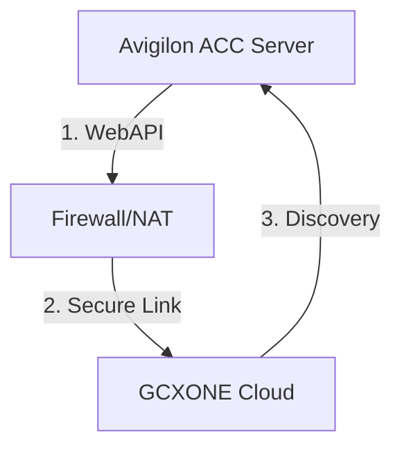

# 📹 Avigilon VMS Integration

Linking **Avigilon Control Center (ACC)** to GCXONE allows you to leverage high-performance server-side analytics with cloud-based operator response. This integration requires the **ACC Web Endpoint Service** to be operational.

import Callout from '@site/src/components/Callout';
import Steps from '@site/src/components/Steps';
import RelatedArticles from '@site/src/components/RelatedArticles';

---

## 📋 Prerequisites

- **ACC 7 Web Endpoint:** Service installed and reachable over the network.
- **Port Forwarding:** External access to the WebAPI port must be configured by your IT team.
- **Admin Access:** You must have permissions to create User Groups within ACC.

---

## 🚦 Integration Workflow

---

## 🛠️ Configuration Steps

<Steps>

### 1. WebAPI Installation
Ensure the **Avigilon WebAPI Endpoint** is installed on your ACC Server. This service translates proprietary camera streams into the standard WebAPI format required by GCXONE.

### 2. Analytics Tuning (Camera Level)
Navigate to **Camera Setup → Analytics**.
- **Motion Detection:** Enable with sensitivity **8-10**.
- **Threshold Time:** Set to **2 seconds** (prevents flickering/false alerts).
- **Object Filtering:** Select Person/Vehicle categories to reduce noise.

### 3. Create NXGEN User Group
Navigate to **Site Setup → Users and Groups**.
1. Create a new group named **"NXGEN-CLOUD"**.
2. **Privileges Needed:**
   - View Live & Recorded Images.
   - Use PTZ Controls.
   - Trigger Digital Outputs.
   - Receive events with identifying features.
3. Assign the specific cameras you wish to monitor to this group.

### 4. Alarm Distribution
Navigate to **Setup → Alarms**.
1. Add a new alarm trigger.
2. Select your analytic cameras as the **Trigger Source**.
3. Under **Recipients**, add the **NXGEN-CLOUD** group created in Step 3.
4. Set the **Pre-alarm recording** to **10 seconds**.

### 5. Final Discovery in GCXONE
1. Log in to **GCXONE** → **Sites** → **Devices**.
2. Click **Add Device** and select **Avigilon**.
3. Enter the Serial Number and the credentials for the **NXGEN-CLOUD** user.
4. Click **Discover**. Review the imported virtual sensors.

</Steps>

---

## 💡 Troubleshooting

- **No Discoverable Sensors:** Ensure the **WebAPI Endpoint** is running. Test this by trying to reach `https://[ServerIP]:[Port]/api/v1/` in a browser.
- **Permission Denied:** Check that the user assigned to GCXONE is a member of the **NXGEN-CLOUD** group and has "View Live Images" toggled on for all relevant cameras.
- **Missed Alarms:** Ensure the analytic rules in ACC are linked to an **Alarm** object. GCXONE listens to ACC *Alarms*, not raw motion events by default.

---

## Related Articles

<RelatedArticles articles={[
  {
    title: "Bandwidth Requirements",
    url: "/docs/getting-started/bandwidth-requirements",
    description: "Calculating upload speed for 4K VMS streams."
  },
  {
    title: "Required Ports",
    description: "Whitelisting the WebAPI for cloud access."
  }
]} />
