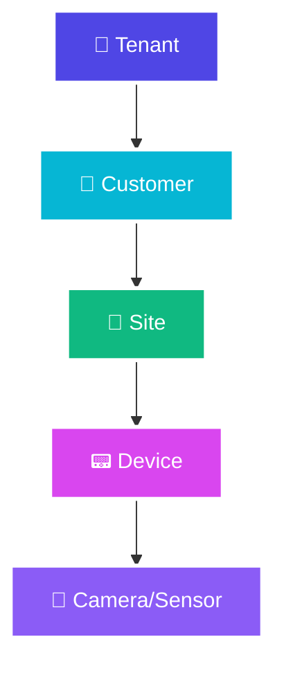
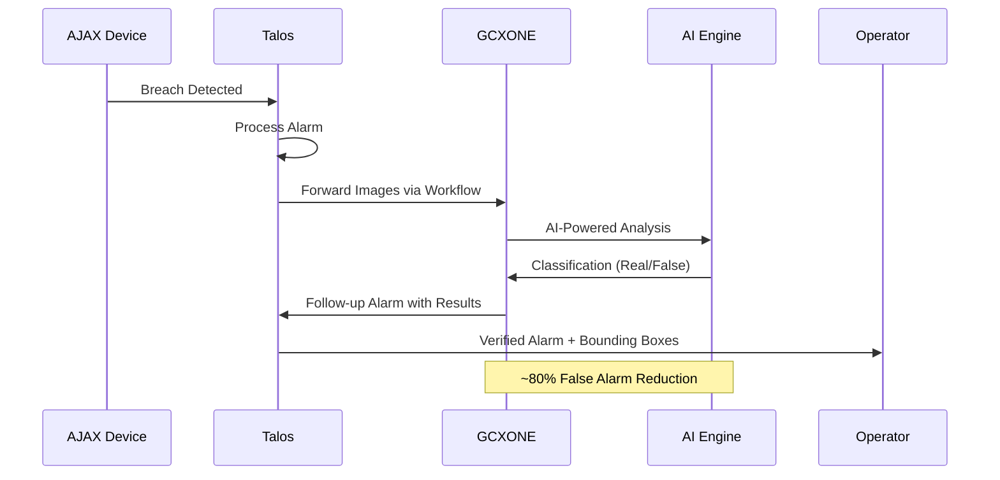
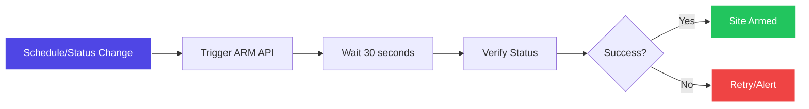
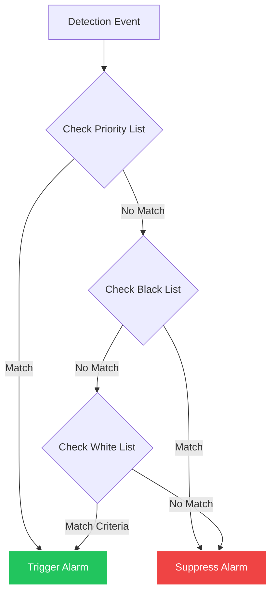
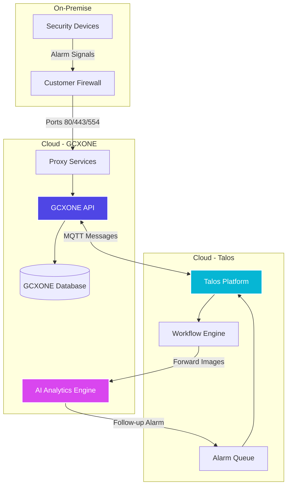

# GCXONE & Talos Interaction

## Overview

**NXGEN GCXONE** is a comprehensive, cloud-based **Unified Security Management Service (USMS)** that centralizes video surveillance, IoT security, and alarm analytics into a single integrated interface. Operating on a **Software as a Service (SaaS)** model, GCXONE eliminates the need for expensive on-premise servers and manual software management by leveraging robust cloud architecture.

The interaction between **GCXONE** and the **Talos** alarm management system is a cornerstone of the platform's efficiency, enabling seamless alarm processing, AI-powered verification, and intelligent workflow automation that reduces false alarms by approximately **80%**.


---

## Platform Architecture and Hierarchy

GCXONE utilizes a multi-tenant, hierarchical model to organize and secure data. This structure follows a logical path from **Tenant → Customer → Site → Device → Camera/Sensor**, allowing primary customers like central monitoring stations to manage multiple independent clients and physical locations with distinct security needs.



### Hierarchy Levels Explained

- **🏢 Tenant:** Top-level organization with isolated data and configuration
- **👤 Customer:** Individual clients or sub-organizations within a tenant
- **📍 Site:** Physical location (building, facility, or geographic area)
- **📟 Device:** Security hardware (NVR, DVR, or alarm panel)
- **🎥 Camera/Sensor:** Individual cameras, sensors, or IoT devices

This hierarchical structure ensures **data isolation**, **granular access control**, and **scalable management** for organizations of any size.

---

## In-Depth Interaction with Talos

### Automatic Data Synchronization

When an administrator creates a site in **GCXONE**, a corresponding site is automatically generated in **Talos**. This bidirectional synchronization ensures both systems remain perfectly aligned without manual intervention.


**Synchronized Data Includes:**
- Site names and identifiers
- Physical addresses
- Contact phone numbers
- Location details and coordinates
- Site-specific configuration parameters

**Technical Implementation:**
- Synchronization is facilitated via **MQTT messaging** from the **GCXONE API**
- Dedicated proxy services handle message routing and translation
- Real-time updates ensure immediate consistency across platforms
- Error handling and retry logic maintain reliability

---

### The Alarm Lifecycle

GCXONE serves as an intelligent processing layer for alarms received in Talos, combining AI-powered analysis with traditional alarm management workflows.




**Step-by-Step Process:**

1. **Device Detection:** An AJAX device (or other security sensor) identifies a potential breach or security event
2. **Signal Transmission:** The device sends an alarm signal to **Talos** via standard alarm protocols
3. **Workflow Trigger:** Talos uses a configured workflow to automatically forward relevant images/video to **GCXONE**
4. **AI Analysis:** GCXONE's analytics engine processes the media using advanced computer vision and machine learning
5. **Classification:** The AI classifies the alarm as "real" (genuine threat) or "false" (non-threatening activity)
6. **Intelligence Feedback:** Verified results are returned to Talos as a "follow-up" alarm with enhanced metadata
7. **Operator Notification:** Operators receive the verified alarm with additional context, including bounding boxes around detected persons or objects

**Key Benefits:**
- **80% Reduction in False Alarms:** AI verification filters out non-threatening events before they reach operators
- **Enhanced Context:** Operators receive detailed information about what triggered the alarm
- **Improved Response Time:** Accurate alarms enable faster, more confident decision-making
- **Resource Optimization:** Operators focus on genuine threats rather than false positives

---

## Technical Onboarding and Configuration

### Device Identification

Onboarding a device into GCXONE requires precise network and software settings to ensure reliable communication.

**Server Unit ID Requirements:**
- A unique **Server Unit ID** is mandatory for devices like **ADPRO** and **Hikvision**
- This ID acts as the system's "address," allowing GCXONE to accurately attribute incoming alarms to the correct source
- Each device must have a distinct ID to prevent conflicts and ensure proper routing

**Configuration Example:**
```
Device Type: Hikvision NVR
Server Unit ID: 12345
Platform: GCXONE
Gateway: 35.156.60.98
```

### Connectivity and Whitelisting

For **non-VPN setups**, devices must be exposed via a public network requiring external IP addresses and specific port configurations.

**Required Ports:**
- **HTTP/HTTPS (80/443):** For web interface and API communication
- **RTSP (554):** For video streaming and media transfer

**Critical IP Whitelisting:**
Devices must whitelist the following GCXONE infrastructure addresses on the customer's firewall:

| Service | IP Address | Purpose |
|---------|------------|---------|
| GCXONE Gateway | `18.185.17.113` | Primary platform communication |
| Alarm Receiver (Hikvision) | `35.156.60.98` | Hikvision alarm reception |
| Alarm Receiver (ADPRO) | Various | Manufacturer-specific gateways |

**Network Configuration Best Practices:**
- Use dedicated firewall rules for GCXONE services
- Enable connection logging for troubleshooting
- Configure appropriate timeout values (recommended: 30-60 seconds)
- Implement redundant connectivity paths where possible

### Time Synchronization

Accurate time is essential for logging, event correlation, and alarm sequencing. All integrated devices should be configured to use a **Network Time Protocol (NTP)** client.

**Recommended NTP Server:**
```
time1.nxgen.cloud
```

**Configuration Steps:**
1. Access device network settings
2. Configure NTP client with `time1.nxgen.cloud`
3. Set timezone to match site location
4. Verify synchronization status in device logs
5. Test time accuracy against GCXONE platform time

**Why Time Sync Matters:**
- Ensures alarm timestamps are accurate
- Enables proper event correlation across devices
- Supports compliance and audit requirements
- Facilitates troubleshooting and log analysis

---

## Workflow Automation

GCXONE automates standard security procedures through predefined sequences of steps, reducing manual intervention and ensuring consistent operations.

### Arm/Disarm Workflows

Arm/disarm workflows are triggered by schedules or status changes, ensuring sites are properly secured based on predefined rules.



**Workflow Steps:**
1. **Trigger:** Schedule reaches arm time, or status change is detected
2. **API Call:** GCXONE calls the ARM API for the target site
3. **Verification Wait:** System waits for a set period (typically 30 seconds)
4. **Status Check:** Parallel status check verifies the operation succeeded
5. **Confirmation:** Site status is updated and logged

**Automation Benefits:**
- **Consistency:** Sites are armed/disarmed automatically based on schedules
- **Reliability:** Verification steps ensure operations complete successfully
- **Auditability:** All operations are logged with timestamps and results
- **Efficiency:** Reduces manual operator workload

### Test Mode Handling

If a site in **Talos** is set to **"Test Mode"** (common during maintenance), GCXONE automatically disarms that site. This intelligent behavior prevents the platform from performing unnecessary AI processing on test signals, thereby conserving processing resources and avoiding false alarms in test scenarios.

**Test Mode Behavior:**
- Site is automatically disarmed in GCXONE
- AI processing is bypassed for test signals
- Processing resources are conserved
- Test alarms do not trigger false alarm counts

### Event Overflow Protection

To maintain system stability, GCXONE includes an **event overflow** mechanism that prevents sensor overload from overwhelming the platform.

**Overflow Threshold:**
- **Trigger:** 25+ alarms from a single sensor in 5 minutes
- **Action:** Further alarms are discarded for a set period
- **Notification:** Operators are notified if overflow persists
- **Recovery:** System automatically resumes processing after cooldown period

**Benefits:**
- Prevents system overload during sensor malfunctions
- Maintains platform stability and performance
- Provides visibility into problematic sensors
- Enables proactive maintenance

---

## Advanced Analytics and Filtering

### AI Filtering Logic System

The platform's filtering logic resides at the **tenant, customer, or site level**, providing granular control over alarm behavior.


**Three-Tier Filtering System:**

#### 1. Priority List
Objects on the **priority list** trigger alarms even if they are static (not moving).

**Example:** 
- If "Person" is on the priority list, a detected person will trigger an alarm regardless of movement
- Useful for identifying unauthorized presence in restricted areas

**Use Cases:**
- High-security areas requiring immediate alerts
- Intrusion detection in sensitive zones
- VIP or restricted access areas

#### 2. White List
Objects on the **white list** trigger alarms only if specific criteria are met.

**Example:**
- "Vehicle" might trigger only if it enters a restricted zone
- "Person" might trigger only during specific hours

**Benefits:**
- Reduces false alarms during normal operations
- Allows flexibility for different time periods
- Supports complex security policies

#### 3. Black List
Objects on the **black list** are always suppressed as false alarms, regardless of context.

**Example:**
- "Bicycle" might be blacklisted to avoid alarms from bike lanes
- "Animal" might be blacklisted in outdoor areas with wildlife

**Benefits:**
- Eliminates known false alarm sources
- Reduces operator workload
- Improves overall system accuracy

### Filtering Configuration



**Configuration Levels:**
- **Tenant Level:** Applies to all customers and sites
- **Customer Level:** Applies to all sites for a specific customer
- **Site Level:** Applies only to a specific site

**Best Practices:**
- Start with tenant-level defaults
- Override at customer or site level for specific needs
- Regularly review and update lists based on false alarm patterns
- Test changes in test mode before applying to production

---

## Health Monitoring

GCXONE performs continuous, automatic health checks on all connected devices, monitoring multiple aspects of system health.

**Monitored Metrics:**
- **Connectivity Status:** Device communication health
- **Battery Levels:** For battery-powered devices
- **Storage Status:** Available storage capacity
- **Signal Strength:** Network connection quality
- **Last Heartbeat:** Device communication timestamp

**Visual Indicators:**
- **🟢 Green Shield Icon:** Device passed health check
- **🔴 Red Shield Icon:** Device failed health check or is offline
- **🟡 Yellow Shield Icon:** Device has warnings or degraded status

**Health Check Benefits:**
- **Proactive Maintenance:** Identify issues before they impact operations
- **Reduced Downtime:** Early detection enables faster resolution
- **Improved Reliability:** Continuous monitoring ensures system integrity
- **Operator Awareness:** Visual indicators provide immediate status visibility

---

## Integration Architecture

### Communication Flow



### MQTT Messaging Architecture

The integration between GCXONE and Talos uses **MQTT (Message Queuing Telemetry Transport)** for reliable, asynchronous messaging.

**MQTT Benefits:**
- **Low Latency:** Near real-time message delivery
- **Reliability:** Guaranteed message delivery with QoS levels
- **Scalability:** Handles high message volumes efficiently
- **Decoupling:** Systems remain independent and resilient

**Message Types:**
- Site creation/updates
- Alarm notifications
- Status changes
- Health check results
- Workflow triggers

---

## Key Benefits of GCXONE-Talos Integration

### 1. Reduced False Alarms
- **80% reduction** in false alarms through AI verification
- Operators focus on genuine threats
- Improved response accuracy

### 2. Automated Workflows
- Automatic site synchronization
- Scheduled arm/disarm operations
- Test mode handling
- Event overflow protection

### 3. Enhanced Intelligence
- AI-powered threat classification
- Bounding box annotations
- Contextual alarm data
- Historical pattern analysis

### 4. Operational Efficiency
- Single interface for multiple systems
- Centralized configuration management
- Automated health monitoring
- Comprehensive audit trails

### 5. Scalability
- Cloud-based architecture scales automatically
- Multi-tenant support for service providers
- Flexible filtering at multiple hierarchy levels
- Support for unlimited sites and devices

---

## Best Practices

### Configuration Recommendations

1. **NTP Configuration:** Always configure NTP synchronization for accurate timestamps
2. **Firewall Whitelisting:** Whitelist all required GCXONE IP addresses and ports
3. **Server Unit IDs:** Use unique, descriptive IDs for easy identification
4. **Filtering Lists:** Start with conservative filtering and refine based on experience
5. **Health Monitoring:** Regularly review health check results and address issues promptly

### Operational Guidelines

1. **Test Mode:** Use test mode during maintenance to prevent false alarms
2. **Alarm Review:** Regularly review filtered alarms to optimize filtering rules
3. **Documentation:** Document site-specific configurations and exceptions
4. **Monitoring:** Monitor event overflow alerts and investigate sensor issues
5. **Updates:** Keep device firmware updated for optimal compatibility

### Troubleshooting Tips

1. **Connection Issues:** Verify firewall whitelisting and port accessibility
2. **Sync Problems:** Check MQTT message logs in both systems
3. **False Alarms:** Review and adjust filtering lists at appropriate hierarchy levels
4. **Health Warnings:** Investigate health check failures promptly
5. **Performance:** Monitor event overflow thresholds and adjust as needed

---

## Related Articles

- [What is NXGEN GCXONE?](/docs/getting-started/what-is-nxgen-gcxone)
- 
- 
- 
- 
- 

---

## Need Help?

If you have questions about GCXONE-Talos integration or need assistance with configuration, check our Troubleshooting Guide or contact support.

For detailed API documentation and technical specifications, refer to the [GCXONE API Documentation](/docs/api).
