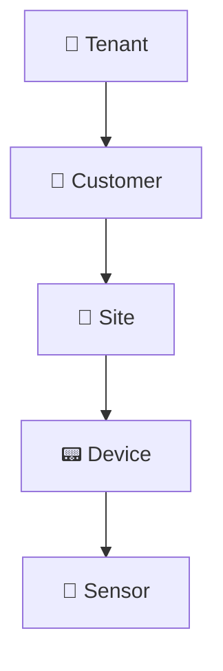
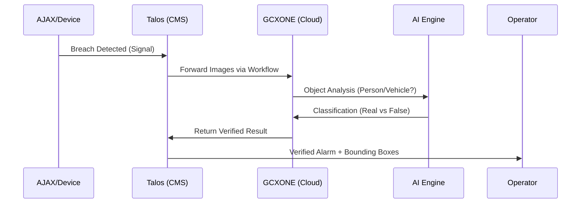

# 🔗 GCXONE & Talos Interaction

The interaction between **GCXONE** and the **Talos** alarm management system is a cornerstone of the platform's efficiency, enabling seamless alarm processing, AI-powered verification, and intelligent workflow automation.

import Callout from '@site/src/components/Callout';
import RelatedArticles from '@site/src/components/RelatedArticles';

## Overview

GCXONE acts as the "Intelligent Processing Layer" for Talos. While Talos handles the core alarm distribution and operator workflows, GCXONE provides the computer vision (AI) needed to verify threats, manage video streams, and synchronize site metadata across the ecosystem.

---

## 🏗️ Platform Hierarchy

GCXONE utilizes a multi-tenant, hierarchical model to organize data. This structure ensures isolation and granular control:

- **Tenant:** The master monitoring station.
- **Customer:** Individual client accounts.
- **Site:** Physical locations (e.g., Office, Warehouse).
- **Device:** Gateways or NVRs.
- **Sensor:** Individual cameras or PIR inputs.

---

## 🔄 Automatic Site Synchronization

When an administrator creates a site in **GCXONE**, the platform automatically generates a corresponding record in **Talos** via MQTT messaging.

- **Bidirectional Sync:** Updates to site names, addresses, or contact details in GCXONE are pushed to Talos in real-time.
- **Test Mode Intelligence:** If a site in Talos is set to "Test Mode" during maintenance, GCXONE automatically disarms that site to prevent unnecessary AI processing.

---

## 🚨 The Alarm Lifecycle

The most critical interaction occurs during a security breach. GCXONE's AI reduces false alarms by approximately **80%**.

### 1. Detection
A hardware device (e.g., AJAX MotionCam) detects a breach and sends a signal to Talos.

### 2. Forwarding
Talos uses a pre-configured workflow to forward images or video clips to the GCXONE AI engine.

### 3. Verification
GCXONE's AI classifies the event based on your **Priority, White, and Black lists**. Non-threatening movements (shadows, animals) are filtered out.

### 4. Response
The operator receives a verified alarm in Talos, complete with **Bounding Boxes** showing exactly where the threat was detected.

---

## ⚙️ Key Automation Workflows

### Arm/Disarm Schedules
GCXONE can automate the arming/disarming of sites based on client business hours.
- **Trigger:** Schedule reaches arming time.
- **Verification:** GCXONE calls the device API and waits 30 seconds for a status confirmation.
- **Failure Handling:** If the device fails to arm, an "Arming Failure" alert is sent to the operator.

### Event Overflow Protection
To prevent system overload from faulty sensors, GCXONE implements "Overflow Protection." 
- **Trigger:** 25+ alarms from one sensor in 5 minutes.
- **Action:** Alarms are temporarily discarded, and a maintenance ticket is generated.

---

## Related Articles

<RelatedArticles articles={[
  {
    title: "Key Benefits",
    description: "The business value of AI verification."
  },
  {
    title: "Cloud Architecture",
    description: "Technical details of the GCXONE infrastructure."
  },
  {
    title: "Quick Start Checklist",
    description: "Setting up your first integrated site."
  }
]} />

---

**Next:** [Advanced AI Filtering & Rules](/docs/admin-guide/ai-filtering)
