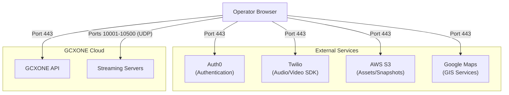

# Required Ports & Endpoints

To ensure the GCXONE web interface and operator services function correctly, the following ports and domains must be whitelisted on your organization's firewall.

import Callout from '@site/src/components/Callout';
import RelatedArticles from '@site/src/components/RelatedArticles';

---

## Connectivity Overview

Modern web applications rely on a variety of cloud services for authentication, video streaming, and maps. The diagram below illustrates the typical flow between an operator's browser and required endpoints.

---

## Required Ports & Protocols

Please ensure the following ports are open for both **TCP** and **UDP** traffic.

| Port | Protocol | Usage |
| :--- | :--- | :--- |
| **80** | HTTP | Initial redirect/load |
| **443** | HTTPS / WSS | Secured API, UI, and WebSockets |
| **10001 - 10500** | UDP / TCP | High-performance WebRTC video |

---

## Domain Whitelisting

The following domains must be allowed to ensure the platform can load all necessary resources.

### Core Platform
- `*.nxgen.cloud` (Primary tenant access)
- `api.nxgen.cloud` (Backend services)
- `monitor.nxgen.cloud` (Health data)
- `streaming.nxgen.cloud` (Video routing)

### Authentication & Security
- `nxgen.eu.auth0.com`
- `cdn.auth0.com`
- `sitasys-prod.eu.auth0.com`

### Media & Maps
- `*.s3-eu-central-1.amazonaws.com` (Snapshots/Icons)
- `maps.googleapis.com` (Site mapping)
- `khms0.googleapis.com` (Satellite views)
- `assets.what3words.com` (Precise location)

### Communication
- `sdk.twilio.com`
- `genesisaudio.sip.twilio.com`
- `eventgw.us1.twilio.com`

---

## Troubleshooting FAQ

**Q: Do I need to whitelist the entire 10001-10500 range?**
**A:** Yes. This range is utilized by WebRTC for dynamic port negotiation to ensure the lowest latency video possible.

**Q: My browser is stuck on "Loading...". What is the likely cause?**
**A:** Check your browser's console. If you see "Access Blocked" errors, ensure the **Auth0** and **AWS S3** domains are whitelisted.

---

## Related Articles

<RelatedArticles articles={[
  {
    title: "IP Whitelisting",
    description: "Cloud endpoints for device connectivity."
  },
  {
    title: "Firewall Configuration",
    description: "Detailed setup for technical installers."
  },
  {
    title: "Bandwidth Requirements",
    url: "/docs/getting-started/bandwidth-requirements",
    description: "Network capacity planning for video."
  }
]} />

---

**Next:** [Bandwidth Requirements & Video Optimization](/docs/getting-started/bandwidth-requirements)
