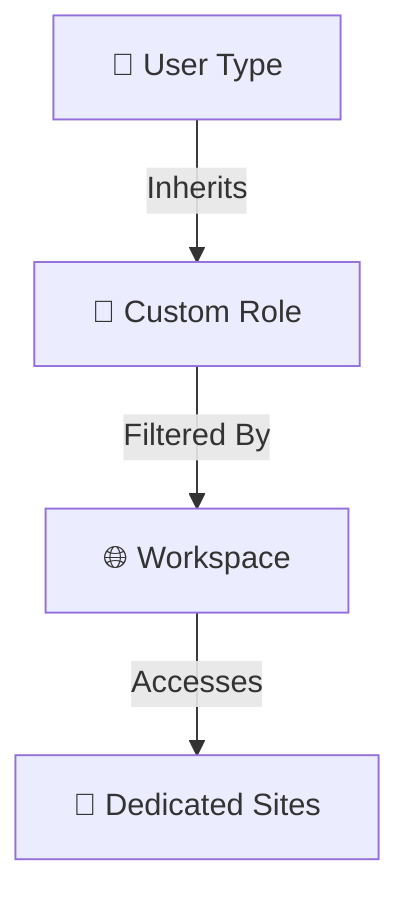

# 👥 Talos Roles & Permissions

Access control in Talos is designed to scale from single-operator stations to multi-national command centers. It is built on three layers: **User Types**, **Custom Roles**, and **Workspaces**.

import Callout from '@site/src/components/Callout';
import Tabs from '@site/src/components/Tabs';
import TabItem from '@site/src/components/Tabs/TabItem';
import RelatedArticles from '@site/src/components/RelatedArticles';

---

## What's New

| Feature | Description | Available Since |
| :--- | :--- | :--- |
| **Time-Based Invitations** | Generate unique access tokens with defined time ranges. Access denied before start and after expiration. | March 2026 |
| **On-Call Shift Protection** | System detects active/upcoming shifts before role edits. Warning prompt lists impacted users with shift status. | March 2026 |
| **Scheduled Role Changes** | Apply role changes immediately or schedule for end of last active shift. Options are mutually exclusive. | March 2026 |
| **Privilege Escalation Prevention** | Backend blocks privilege escalation attempts. Modified requests return 403 Forbidden. | March 2026 |
| **Role Change Audit Logging** | Audit logs capture admin, timestamp, impacted users, before/after states, effective time, and decision type. | March 2026 |

---

## 🏗️ The Access Hierarchy

---

## 1. User Types (The Foundation)
User Types are the primary templates that define a user's general relationship with the platform.

| User Type | Access Level | Primary Audience |
| :--- | :--- | :--- |
| **Company Admin** | Total | IT Directors & Owners |
| **Manager** | Configuration | Team Leads & Supervisors |
| **Operator** | Interactive | Front-line Security Staff |
| **Operator Minimal** | Focused | Trial/Junior Operators |

---

## 2. Custom Roles (The Logic)
While User Types provide the frame, **Roles** provide the specific permissions. You can create a "Super Operator" role that has standard operator access plus the ability to delete false alarms.

- **Granular Control:** Toggle individual permissions like `Alarm:Delete`, `Site:Update`, or `Reports:Export`.
- **Inheritance:** A user can be assigned multiple roles; their effective permissions are the sum of all assigned sets.

---

## 3. Workspaces (The Scope)
Workspaces don't grant new permissions—they **filter** existing ones. Use Workspaces to segregate sites by:
- **Language:** English-only operators for international clients.
- **Region:** Dividing a national portfolio into North/South teams.
- **Client Type:** Dedicated workspaces for sensitive government or VIP accounts.

---

## 🛠️ Step-by-Step: Managing Users

1. Navigate to **Settings** → **Users**.
2. **Invite User:** Enter an email address and select their **User Type**.
3. **Assign Workspace:** Choose which site groups this user is allowed to "see" in their buffer.
4. **Login:** The user receives an automated invitation email to set their password.

---

## 💡 Best Practices

<Callout type="info" title="Least Privilege">
Always start new operators with the **Operator Minimal** user type. Gradually add custom roles as they complete their training modules.
</Callout>

- **Audit Logs:** Use the **Event Log** to see which administrator granted or revoked specific permissions. 
- **Consistency:** Use **Site Templates** to ensure that new sites are automatically assigned to the correct Workspaces.

---

## Related Articles

<RelatedArticles articles={[
  {
    title: "Site Management",
    description: "Organizing sites for Workspaces."
  }
]} />

---

**Next:** 
