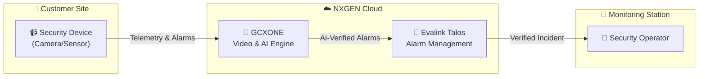

# 🚨 What is Evalink Talos?

**Evalink Talos** is a sophisticated, cloud-based alarm management platform designed specifically for monitoring stations and enterprise security teams.

import Callout from '@site/src/components/Callout';
import Tabs from '@site/src/components/Tabs';
import TabItem from '@site/src/components/Tabs/TabItem';
import RelatedArticles from '@site/src/components/RelatedArticles';

## Overview

In the NXGEN ecosystem, Talos serves as the **Alarm Verification and Dispatch Engine**. While **GCXONE** handles the video analytics, device management, and AI, **Talos** provides the workflows operators use to process alarms, contact customers, and document incidents.

---

## 🏗️ GCXONE + Talos Integration

The two platforms work in perfect harmony to provide a complete "Glass Pane" security solution.

---

## 🔑 Core Capabilities

### 🚨 Intelligent Alarm Processing
Talos handles real-time alarm reception and prioritizes them based on your custom business logic. This ensures that a "Panic Button" always reaches an operator before a "Loitering" alert.

### 👥 Intuitive Operator Interface
The Talos dashboard is optimized for high-stress environments. Operators get:
- **One-Click Actions:** Pre-defined responses for rapid incident closure.
- **Embedded Video:** Review GCXONE video streams directly inside the alarm card.
- **Mobile Access:** Managers can review site status and history from any iOS or Android device.

### 📊 Reporting & Compliance
Every action taken by an operator—from opening an alarm to calling a technician—is logged in an immutable audit trail, ensuring 100% compliance with industry standards.

---

## ⚡ Key Benefits

<Tabs defaultValue="ops">
  <TabItem value="ops" label="Operational Efficiency">
    - **80% False Alarm Reduction:** Integrated AI filters out environmental noise.
    - **Site Auto-Sync:** Sites created in GCXONE appear in Talos automatically.
    - **Centralized Admin:** Manage users and permissions across both sites from one place.
  </TabItem>
  <TabItem value="costs" label="Cost Savings">
    - **Zero Infrastructure:** No on-premise servers or maintenance required.
    - **Scalable Pricing:** Pay only for the sites that are actively being monitored.
    - **Faster Training:** The intuitive UI reduces onboarding time for new operators.
  </TabItem>
</Tabs>

---

## Related Articles

<RelatedArticles articles={[
  {
    title: "GCXONE & Talos Interaction",
    description: "Technical details of the integration."
  },
  {
    title: "Key Benefits",
    description: "ROI and business value of the platform."
  },
  {
    title: "Quick Start Checklist",
    description: "Setting up your first integrated site."
  }
]} />

---

**Next:** 
