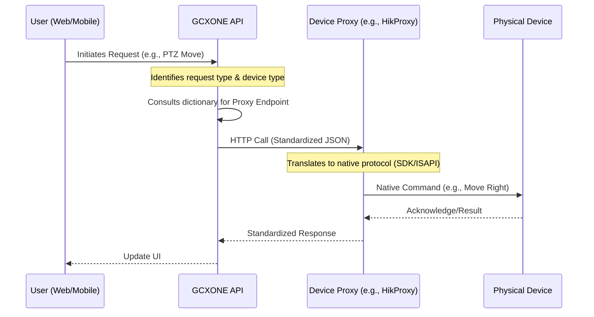

# Microservices & Proxy Architecture

GCXONE employs a proxy architecture utilizing specialized microservices to handle device-specific communications. This design ensures that the core GCXONE system interacts uniformly with devices through standardized **Application Programming Interfaces (APIs)**.

## The "Universal Translator" Concept
The GCXONE platform and its device ecosystem function like a central global switchboard. 
- Each device (Hikvision, Dahua, ADPRO) speaks a different "language" (protocol: REST, SDK, TCP). 
- Instead of requiring the central switchboard (GCXONE) to learn every language, specialized **Proxy microservices** act as universal translators.

## Proxy Function
There is typically a **proxy per device type** (e.g., Dahua proxy, Hikvision proxy, Hanwha proxy, Axxon proxy). 
- The proxy’s functionality is device-specific.
- The input signature (from GCXONE) and output response schema (to GCXONE) remain common across all device types.

## Communication Flow (UI/API to Proxy)

The following diagram illustrates the path of a request (e.g., a PTZ control command) from the user to the device:

1. **User Request**: A user initiates a request (e.g., PTZ control).
2. **API Gateway**: The request goes to the API, which is the only hop for communication for the front end.
3. **Routing**: The API identifies the request type and the device type (e.g., PTZ for a Hikvision device) and consults a dictionary of proxy endpoints (e.g., `hikproxy.nx.cloud`).
4. **Proxy Call**: The API acts as a "middleman" and makes an HTTP call to the respective proxy with a standardized JSON-based signature.
5. **Native Translation**: The proxy handles the actual processing based on the device’s specific protocol (SDK, TCP, REST, etc.).
6. **Response**: The proxy responds back to the API with a common schema, and the API passes it to the user interface.

## Benefits
- **Scalability**: New device drivers can be added as new microservices without touching the core API.
- **Stability**: A crash in the Dahua proxy does not affect the Hikvision proxy or the main API.
- **Maintainability**: Device-specific logic is isolated.
