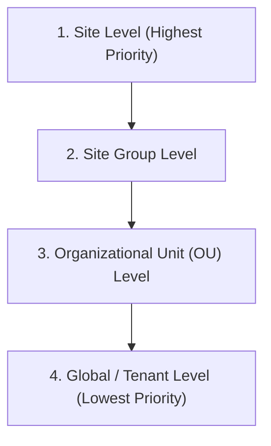

# Custom Property Hierarchy

GCXONE uses a "Cascade & Override" logic to manage settings across complex organizational structures. This ensures that global defaults are maintained while allowing for site-specific customization.

## The Inheritance Chain

When the platform looks for a specific property (e.g., a "Maintenance Contact" or "Alarm Sound"), it queries the database in the following order:

### 1. Site Level
Any property set directly on a **Site** will override all other levels. 
- *Use Case*: A high-security site requiring a unique alarm sound that differs from the rest of the group.

### 2. Site Group Level
Properties set here apply to all sites within the group that do *not* have a site-level override.
- *Use Case*: Setting a regional manager as the primary contact for all "London" sites.

### 3. Organizational Unit (OU) Level
Properties set at the OU level apply to all site groups and sites within that department.
- *Use Case*: Defining a standard "Business Hours" schedule for an entire retail chain.

### 4. Global / Tenant Level
The default fallback for all entities. If no property is defined at any higher level, the platform uses these global values.
- *Use Case*: System-wide Support Email or standard platform branding.

## Best Practices for Hierarchy Management

-   **Start Global**: Define common properties at the Tenant level to minimize repetitive configuration.
-   **Use OUs for Logic**: Apply functional logic (like workflow escalation rules) at the Organizational Unit level.
-   **Minimize Site Overrides**: Only use site-level overrides for genuine exceptions to keep the system maintainable.
-   **Clean Slate**: Before deleting a Site or Group, ensure any critical custom properties have been migrated or are handled by a parent-level default.

> [!NOTE]
> Some technical properties, such as IP addresses and Device IDs, are **Non-Inheritable** and must be defined manually at the Site or Device level.
