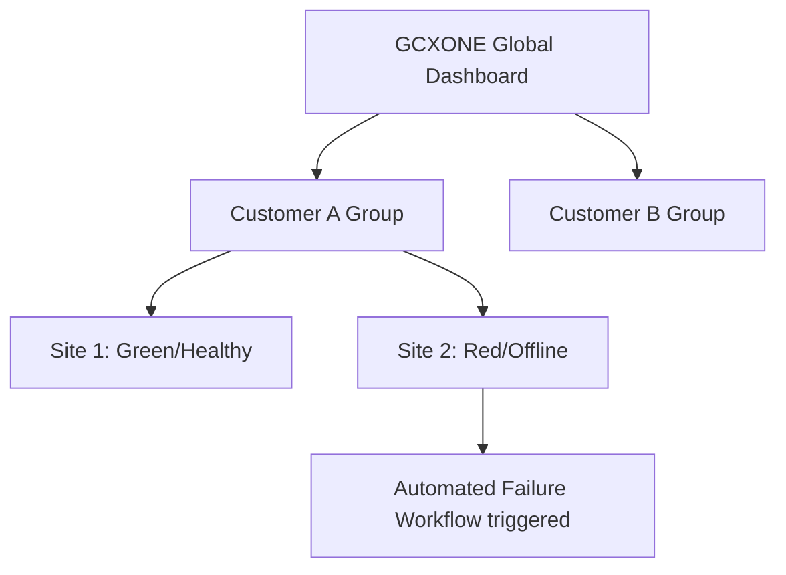

import Tabs from '@theme/Tabs';
import TabItem from '@theme/TabItem';

# Device Health Status Dashboard

  

    

      The <strong>GCXONE</strong> main dashboard provides a real-time, high-level overview of the operational status of all integrated hardware. This unified interface allows administrators to monitor device health, connectivity, and performance across the entire platform.
    

  

  

    

      
📊

      <h3 style={{color: 'white', margin: 0}}>Health Dashboard</h3>
      
Real-Time Monitoring

    

  

## Overview

The Device Health Status Dashboard is the central command center for monitoring all devices in your GCXONE deployment. It provides instant visual feedback on the health and operational status of every integrated component, from IP cameras to IoT sensors.

### Key Features

- **Visual Tile System:** Each device is represented as a tile with color-coded status indicators
- **Real-Time Updates:** Dashboard refreshes automatically to show current device status
- **Aggregated Metrics:** View total customers, sites, devices, and active sensors at a glance
- **Alarm Statistics:** Visualize the ratio between Real Alarms, False Alarms, and Technical Alarms
- **Multi-Site Overview:** Monitor health across multiple sites and customers

## Visual Representation

The system utilizes a "tile" system where each tile represents a hardware component (NVR, camera, or sensor). The dashboard provides multiple views:

### Color Coding System

- **Green:** All systems are normal and functioning correctly
- **Yellow/Orange:** The component requires attention or has a minor issue, such as a rule violation or partial connectivity loss
- **Red:** Critical failure, such as a disconnected device or a major system error

### Status Indicators

Beyond color-coded tiles, **GCXONE** uses specific icons to provide detailed health feedback:

- **Green/Red Shield:** Indicates whether a camera passed or failed its most recent health check
- **Live Viewer Icons:** These include indicators for:
  - **Recording** (red dot)
  - **Audio Status** (speaker icon)
  - **Active Alarms** (bell icon)
- **System Status Overlays:** On the "Video Activity Search" page, icons distinguish between human detection, vehicle detection, or uninteresting motion

## Metric Visibility

The dashboard tracks comprehensive metrics:

### System-Wide Statistics

- **Total Customers:** Number of customer accounts in your tenant
- **Total Sites:** Number of monitored sites
- **Total Devices:** Number of integrated devices (cameras, NVRs, sensors)
- **Active Sensors:** Current count of active sensors (e.g., a sample system showing 715 active sensors)

### Alarm Analytics

The dashboard visualizes alarm data through:

- **Interactive Pie Charts:** Showing customer-level video alarm contributions
- **Trend Graphs:** Tracking real versus false alarms over 24-hour or weekly intervals
- **Alarm Ratios:** Visual representation of Real Alarms vs. False Alarms vs. Technical Alarms

## Multi-Site Health Overview

For service providers, **GCXONE** aggregates health data across the entire hierarchy.

### Tenant-Level Insights

Administrators can see site-level video alarm contributions across all customers in their tenant. This provides:

- **Hierarchical View:** Tenant → Customer → Site → Device structure
- **Aggregated Metrics:** Site-level summaries for quick problem identification
- **Quick Navigation:** Direct links to problem areas for detailed investigation

### Global Schedulers

A dedicated "Analytics Scheduler" tab allows managers to view all active health check schedulers across the Service Provider hierarchy, preventing redundant analytics jobs and optimizing processing loads.

## Health Check Modes

GCXONE supports three distinct health check modes:

### Basic Mode (Reactive)

- **Purpose:** Reactive monitoring of valid images
- **Use Case:** Standard health monitoring for most devices
- **Frequency:** Periodic checks based on device activity
- **Alerts:** Notifies when devices fail basic connectivity tests

### Plus Mode (Proactive)

- **Purpose:** Proactive scheduled checks with snapshots
- **Use Case:** Regular health verification for critical devices
- **Frequency:** Scheduled checks at configurable intervals
- **Alerts:** Includes snapshot verification and connectivity testing

### Advanced Mode (Predictive)

- **Purpose:** Predictive analytics for blur, low light, and angle deviation
- **Use Case:** High-value sites requiring predictive maintenance
- **Frequency:** Continuous monitoring with AI-powered analysis
- **Alerts:** Early warning system for potential issues before they cause failures

## Accessing the Dashboard

### Navigation Path

1. Log in to **GCXONE** platform
2. Navigate to **Configuration App**
3. Select **Dashboard** from the main menu
4. Choose **Device Health** view

### Dashboard Views

- **Overview:** High-level summary of all devices
- **By Site:** Grouped view showing devices per site
- **By Customer:** Customer-level device health summary
- **By Device Type:** Filtered view by device category (NVR, Camera, Sensor)

## Configuring Health Alerts

### Setting Up Alert Rules

1. Navigate to **Configuration App** > **Alarm Rules**
2. Click **Add Rule**
3. Select **Health Check** as rule type
4. Configure thresholds:
   - **Connection Timeout:** Duration before marking device offline
   - **Health Check Interval:** Frequency of health checks
   - **Alert Severity:** Critical, Warning, or Info
5. Select notification channels (Email, SMS, In-App)
6. Save the rule

### Alert Thresholds

Recommended thresholds:

- **Connection Failure:** Alert after 5 minutes of no response
- **Health Check Failure:** Alert after 2 consecutive failed checks
- **Storage Capacity:** Alert when storage exceeds 90%
- **Temperature:** Alert when device temperature exceeds safe limits

## Best Practices

1. **Regular Monitoring:** Check the dashboard at least once per day
2. **Proactive Maintenance:** Use Advanced mode for critical sites
3. **Alert Configuration:** Set appropriate thresholds to avoid alert fatigue
4. **Documentation:** Keep records of device health trends for capacity planning
5. **Automated Responses:** Configure workflows to automatically handle common issues

## Troubleshooting

### Dashboard Not Loading

- **Check Permissions:** Ensure your role has dashboard access
- **Clear Browser Cache:** Refresh the page or clear cache
- **Check Network:** Verify connectivity to GCXONE cloud

### Incorrect Status Indicators

- **Refresh Dashboard:** Click refresh to update status
- **Check Device Logs:** Review device-specific logs for details
- **Verify Connectivity:** Test device connectivity manually

### Missing Devices

- **Check Filters:** Ensure no filters are hiding devices
- **Verify Permissions:** Confirm access to the site/customer
- **Check Device Registration:** Verify devices are properly registered

## Related Articles

- [Connectivity Monitoring](/docs/devices/general/health-monitoring)
- [Heartbeat Detection](/docs/devices/general/health-monitoring)
- [Device Status Indicators](/docs/admin-guide/device-health-status)
- [Multi-Site Health Overview](/docs/admin-guide/device-health-status)
- [Troubleshooting Device Offline](/docs/troubleshooting/device-offline)

## Need Help?

If you're experiencing issues with the Device Health Status Dashboard, check our [Troubleshooting Guide](/docs/troubleshooting) or [contact support](/docs/support/contact-support).
