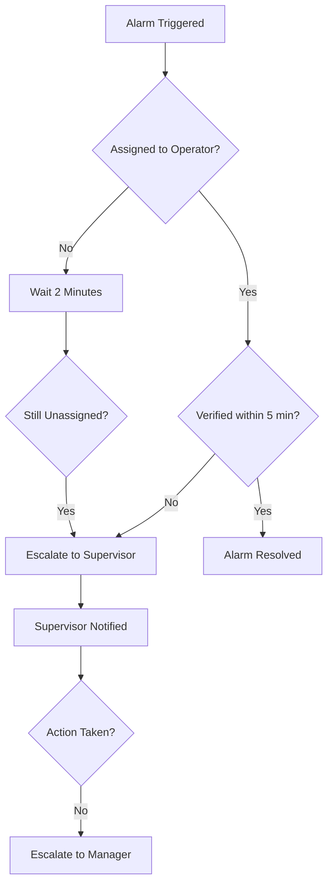

# Alarm Escalation Rules

Automated escalation workflows that trigger supervisor notifications and actions when alarms remain unaddressed beyond defined timeframes.

## Overview

**Escalation Rules** define the transition from automated handling to human intervention. GCXONE utilizes customizable **Workflows** to define exactly how an alarm travels through the system, including when and how it escalates to supervisors, managers, or specialist teams.

Escalation rules ensure that critical alarms never go unnoticed and that response times meet Service Level Agreements (SLAs). When an alarm remains unaddressed beyond a configured threshold, the system automatically escalates it to the appropriate level.

## Escalation Triggers

### 1. Response Time (SLA) Escalation

**Trigger:** Alarm is not claimed or acknowledged within the defined SLA timeframe.

**Typical SLAs:**
- **Critical Alarms:** 60-90 seconds
- **High Priority:** 2-5 minutes
- **Medium Priority:** 5-10 minutes
- **Low Priority:** 10-15 minutes

**Configuration:**
- Set SLA thresholds per alarm priority level
- Configure automatic escalation when SLA is breached
- Send notifications to supervisors when escalation occurs

### 2. Stale Alarm Escalation

**Trigger:** Alarm remains in the queue for too long without operator action.

**Default Threshold:** 5 minutes (configurable)

**Actions:**
- Automatically notify managers via Email or SMS
- Escalate to supervisor queue
- Log escalation event in audit trail
- Update alarm priority if configured

### 3. Priority-Based Escalation

**Trigger:** Specific high-value zones or alarm types bypass standard queues.

**Examples:**
- Fire/Panic alarms escalate immediately to emergency response team
- Burglary alarms in armed zones escalate to security manager
- Technical alarms escalate to technical support team

### 4. Customer/Operator Escalation

**Trigger:** L1 support cannot resolve an issue due to:
- Lack of customer cooperation
- Insufficient operator authority
- Complex technical issues requiring specialist knowledge

## Configuration In Talos

Escalation is configured within the **Workflow** module. Each workflow step can be configured to:

### Step 1: Wait Duration

Set a wait period before checking escalation conditions:

1. Navigate to **Workflow Configuration**
2. Select the workflow step
3. Set **"Wait Duration"** (e.g., 5 minutes)
4. Configure what happens after the wait period

### Step 2: Check Status

Define conditions that trigger escalation:

- **Has the alarm been verified?** - Check if operator has reviewed the alarm
- **Has the alarm been acknowledged?** - Check if operator has taken ownership
- **Has the alarm been closed?** - Check if alarm has been resolved
- **Is the alarm still in queue?** - Check if alarm remains unassigned

### Step 3: Escalate Action

Configure the escalation target and method:

1. **Select Escalation Target:**
   - Specific User Group (Supervisors, Managers, Specialists)
   - Individual User
   - External Contact (Email, SMS)
   - Another Workflow

2. **Choose Notification Method:**
   - Email notification
   - SMS alert
   - Push notification
   - In-app notification
   - Audio alert

3. **Set Escalation Priority:**
   - Maintain original priority
   - Elevate priority level
   - Assign to critical queue

## Escalation Workflow Example

## Multi-Level Escalation

Configure cascading escalation levels:

### Level 1: Operator Queue
- **Duration:** 0-5 minutes
- **Action:** Assign to available operator
- **Escalation:** If unassigned, escalate to Level 2

### Level 2: Supervisor Queue
- **Duration:** 5-10 minutes
- **Action:** Supervisor review and assignment
- **Escalation:** If unresolved, escalate to Level 3

### Level 3: Manager/On-Call
- **Duration:** 10+ minutes
- **Action:** Manager intervention required
- **Escalation:** External notification (SMS, phone call)

## Autofeed Integration

The **Autofeed** feature automatically assigns matching alarms to available operators based on:
- Operator expertise
- Current workload
- Operator availability
- Alarm type specialization

This prevents bottlenecks and reduces the need for escalation by ensuring alarms are quickly assigned to capable operators.

## Best Practices

### Early Escalation for Criticals
- **Panic and Fire alarms** should have a **0-minute escalation rule** to ensure immediate visibility
- Critical alarms should bypass standard queues and go directly to emergency response teams
- Configure immediate SMS/phone notifications for life-safety events

### Documented SOPs
- Ensure the "Instructions" section of the workflow clearly explains *why* the escalation is happening
- Document what the next tier should do when they receive an escalated alarm
- Include escalation procedures in operator training materials

### SLA Alignment
- Configure escalation thresholds to align with contractual SLAs
- Set escalation times slightly before SLA breach to allow time for response
- Monitor escalation rates to identify workflow bottlenecks

### Escalation Monitoring
- Track escalation frequency by alarm type, site, and operator
- Identify patterns that indicate workflow or training issues
- Review escalated alarms to improve initial handling procedures

## Escalation Notifications

### Email Notifications
- Include alarm details, current status, and time in queue
- Provide direct links to view alarm in GCXONE
- Include operator notes and action history

### SMS Alerts
- Brief summary of alarm type and site
- Priority level and time in queue
- Direct link to alarm (if supported)

### In-App Notifications
- Real-time alerts in GCXONE dashboard
- Visual indicators in supervisor queue
- Sound alerts for critical escalations

## Troubleshooting

### Common Issues

**Issue:** Escalations not triggering
- **Solution:** Verify workflow configuration and wait durations
- **Solution:** Check that escalation targets are properly configured
- **Solution:** Ensure operators are not bypassing workflow steps

**Issue:** Too many escalations
- **Solution:** Review operator workload and staffing levels
- **Solution:** Adjust SLA thresholds to be more realistic
- **Solution:** Improve initial alarm assignment with Autofeed

**Issue:** Escalations going to wrong recipients
- **Solution:** Verify user group assignments and permissions
- **Solution:** Check workflow routing logic
- **Solution:** Review escalation target configuration

## Related Articles

- [Alarm Routing Rules](/docs/alarm-management/alarm-routing)
- [Alarm Prioritization](/docs/alarm-management/alarm-prioritization)
- [SLA Monitoring](/docs/alarm-management/alarm-sla)
- [Multi-Site Alarm Management](/docs/alarm-management/multi-site-alarms)
- [Operator Training Guide](/docs/alarm-management/operator-training)

## Need Help?

If you need assistance configuring escalation rules, check our [Troubleshooting Guide](/docs/troubleshooting) or [contact support](/docs/support/contact-support).

## Need Help?

If you're experiencing issues, check our [Troubleshooting Guide](/docs/troubleshooting) or [contact support](/docs/support).
