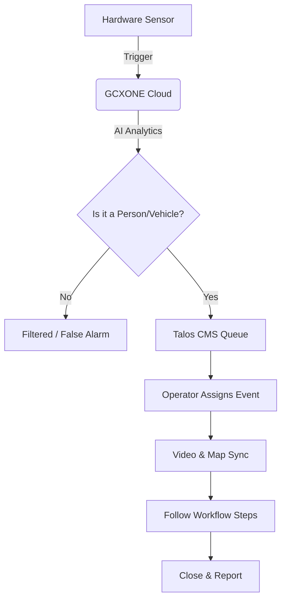

import Tabs from '@theme/Tabs';
import TabItem from '@theme/TabItem';

# Operator Training Guide

  

    

      This training guide is designed to provide operators with a comprehensive understanding of the <strong>GCXONE</strong> (formerly Genesis) ecosystem, specifically focusing on the integration with the <strong>Talos CMS</strong> for professional security monitoring.
    

  

  

    

      
🎓

      <h3 style={{color: 'white', margin: 0}}>Operator Training</h3>
      
Master Guide

    

  

## Introduction: The Operator's Mission

An operator in the **GCXONE** environment is the frontline defense for monitored sites. The goal is to provide **real-time situational awareness**, verify the authenticity of alarms using AI-powered analytics, and initiate appropriate interventions. **GCXONE** streamlines this process by reducing false alarms by approximately **80% to 95%**, allowing you to focus on genuine threats.

## The Operator Interface: The "Three-Screen" Philosophy

To maximize efficiency, a standard **GCXONE** workstation should ideally utilize three screens:

1. **Talos CMS (Alarm Receiving Screen):** This is your main hub where incoming alarms land in a central buffer. Here, you assign, manage, and close events.

2. **Video Viewer (Salvo View):** The control center for live streaming and recorded playback. It automatically syncs with the alarm you are currently handling.

3. **Map Screen:** Provides a geographical representation of monitored sites. It highlights the exact camera that triggered the alarm to give you immediate context of the site layout.

## Understanding Alarms vs. Events

In **GCXONE**, precision in terminology is vital for accurate reporting:

- **Alarm:** A single notification from a specific device (e.g., a "Line Crossing" detection from Camera 1).

- **Event:** A logical grouping of related alarms. For example, if a motion sensor triggers at the same time a door contact is breached, **GCXONE** groups them into one **Event** to provide you with the full context of the incident.

### Prioritization and Severity

Alarms are sorted in the queue by **priority** (e.g., Burglary alarms appear above Motion alerts) or by **timestamp**. High-severity alarms are color-coded to ensure they are addressed immediately.

## The Operator Journey: Step-by-Step Handling

### Step 1: Assignment

Alarms land in the "Unassigned" buffer. You can manually take an alarm by clicking **"Assign to Me"** or dragging it into your column. In busy environments, the **"Auto-feed"** feature may be enabled to automatically push high-priority alarms directly to your screen based on your availability.

### Step 2: Verification (The Power of "Quad View")

Once an event is assigned, the **Video Viewer** will automatically open the relevant feed.

- **The Quad View:** For video events, the system displays three critical images: **Pre-Alarm**, **Current-Alarm**, and **Post-Alarm**.
- **AI Bounding Boxes:** If the AI has classified the object, you will see a blue (tracked) or red (alarm) bounding box around the person or vehicle, confirming why the system flagged the event.
- **Live & Archive:** You can toggle to **Live View** to see what is happening now or use the **Timeline** to scrub through the archive for further evidence.

### Step 3: Following the Workflow

Every alarm triggers a **Workflow**—a predefined sequence of steps that guides your response.

1. **Initial Assessment:** Is the alarm real or false?
2. **Audio Deterrence:** If the site has IP speakers, use the **GCXONE Audio (SIP)** tool to make a live announcement (e.g., "You are being monitored. Leave the premises immediately.").
3. **Intervention:** If the intruder persists, the workflow will prompt you to call a **Keyholder**, **Guard Service**, or the **Police**.
4. **Parallel Actions:** Some workflows run automated actions in the background, such as sending an SMS to the site owner or triggering a digital output to turn on site lights.

### Step 4: Closure and Documentation

After the threat is resolved, you must close the workflow.

- **Classification:** Mark the alarm as **Real**, **False**, or **Technical**.
- **Reporting:** Write a concise log of your actions. This data is stored in the **Audit Logs** and is vital for client billing and legal evidence.

## Advanced Operational Tools

### Isolation vs. Disarming

- **Disarming:** A permanent state until manually changed. Used for sites following a strict arming schedule.
- **Isolation:** A temporary suspension of monitoring for a specific duration (e.g., 30 minutes to 8 hours). Use this when a technician is on-site or during a planned delivery. **GCXONE** will automatically "re-arm" the sensor once the timer expires.

### Test Mode

When a site is undergoing maintenance, put it in **Test Mode** within Talos. This ensures alarms are logged but do not pop up in your active queue, preventing unnecessary distraction.

### Parking Alarms

If you are waiting for a callback from the police or a site owner, you can **"Park"** the alarm. It will disappear from your active window and return automatically after a set time (e.g., 15 minutes).

## Shift Responsibilities

### Night Shift

Primary focus is on **critical alarms** that threaten life or property (Burglary, Fire, Panic). Technical issues are typically parked for the day shift unless they compromise the security of the entire site.

### Day Shift

Primary focus is on **technical health**, performing maintenance, adjusting schedules, and onboarding new sites.

## Best Practices for High Performance

- **SLA Compliance:** **GCXONE** aims to process every alarm within **60 to 90 seconds**. Speed and accuracy are the primary metrics of your success.
- **Visual Verification First:** Always verify via video before dispatching expensive emergency services to avoid "false alarm" fines for your clients.
- **Check the Heartbeat:** If you see a **Ping Timeout** or **Connection Failure** alarm, it means the device cannot reach the cloud. Report this to the IT Admin immediately.

## System Architecture Overview (Operator Perspective)

## Analogy

Being a **GCXONE** Operator is like being an **Air Traffic Controller** for a city's security. The radar (the Alarm Queue) shows you everything, but the AI acts as your co-pilot, filtering out the "birds" (false alarms) so you can focus on the "planes" (real threats). You use your tools (Video, Maps, Audio) to guide each incident to a safe landing (resolution).

## Training Modules

### Module 1: Basic Operations
- Understanding the interface
- Basic alarm handling
- Simple verification procedures

### Module 2: Advanced Features
- Workflow management
- Multi-site monitoring
- Advanced verification techniques

### Module 3: Specialized Scenarios
- Emergency response procedures
- Multi-alarm incidents
- Technical troubleshooting

## Related Articles

- [Real-Time Alarm Queue](/docs/alarm-management/alarm-queue)
- [Alarm Verification](/docs/alarm-management/alarm-verification)
- [Alarm Best Practices](/docs/alarm-management/alarm-best-practices)
- [Operator Dashboard Guide](/docs/operator-guide-operator-dashboard)
- [Handling Alarms Guide](/docs/operator-guide-handling-alarms)

## Need Help?

If you need additional training or have questions, check our [Training Resources](/docs/support/training-resources) or [contact support](/docs/support/contact-support).
