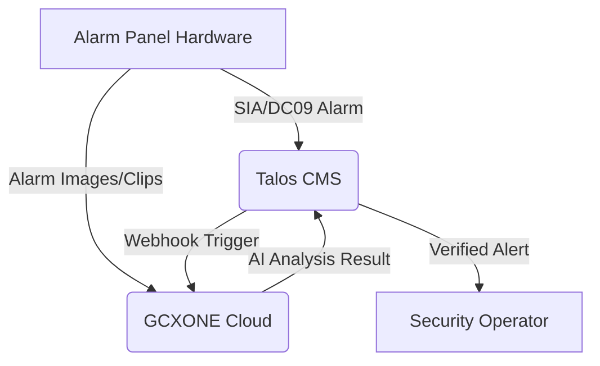

import Tabs from '@theme/Tabs';
import TabItem from '@theme/TabItem';

# Alarm Panels Integration Guide

  

    

      <strong>Alarm Panels</strong> (also known as intrusion panels) are the central hubs of security systems that monitor sensors like door contacts, motion detectors, and glass-break sensors. By integrating these panels with <strong>GCXONE</strong>, you transform standard security alerts into <strong>AI-verified events</strong>, reducing false positives by approximately <strong>80% to 95%</strong> and ensuring a streamlined response through a single cloud interface.
    

    

      <strong>GCXONE</strong> supports a wide range of panels, including modern cloud-based systems like <strong>AJAX</strong> and specialized wireless systems like <strong>Reconeyez</strong>, as well as legacy panels using the <strong>DC09 (SIA)</strong> protocol.
    

  

  

    

      
🚨

      <h3 style={{color: 'white', margin: 0}}>Alarm Panels</h3>
      
Intrusion Detection Systems

    

  

## Overview

Alarm panels serve as the nervous system of a building's security infrastructure. The sensors are the fingertips that feel a touch (motion), and the panel is the spinal cord that sends the signal. **GCXONE** acts as the brain; it looks at the signal, opens its "eyes" (cameras), and decides if the touch was a friendly tap or a dangerous strike before telling the "muscles" (operators) to react.

### Key Benefits

- **AI-Powered Verification:** Automatically classify alarms as real threats or false positives
- **80-95% False Alarm Reduction:** Significantly reduce operator workload and improve response efficiency
- **Unified Interface:** Manage all alarm panels through a single cloud dashboard
- **Multi-Protocol Support:** Compatible with SIA DC-09, cloud-based systems, and proprietary protocols
- **Visual Context:** Combine alarm data with camera images for comprehensive threat assessment

## System Architecture

The integration usually follows a dual-path communication flow. The raw alarm data is sent to the monitoring station via the **DC09/SIA** interface, while visual data (if the panel has camera capabilities) is pushed to **GCXONE** for AI analysis.

*Note: GCXONE acts as the intelligence layer, analyzing images and returning "Real" or "False" classifications to the operator.*

*Figure 1: Alarm panel integration architecture showing dual-path communication flow.*

## Prerequisites for Integration

Before beginning the onboarding process, ensure you have the following critical information from your service provider:

1. **Receiver IP Address:** The endpoint where the panel will send signals
2. **Listening Port:** Usually port **10000** for DC09 or specific vendor ports
3. **Account ID:** A unique 8-digit identifier for each site
4. **Encryption Key:** If the panel supports encrypted transmission (highly recommended)
5. **Administrative Access:** Access to the panel's native mobile app or desktop software

## Integration Guide: AJAX Systems

**AJAX** integration involves an approval process and a cloud-to-cloud connection.

*Figure 2: AJAX Systems integration configuration interface.*

### 1. Granting Access to GCXONE

1. Login to the **AJAX Pro Desktop** application
2. Navigate to your company settings and send an invitation to the **GCXONE** authorized account (`ajax@nxtn.io`)
3. Notify the **GCXONE** support team to approve the request for your specific **Hub ID**

### 2. Configuring the Hub

*Figure 3: AJAX Hub monitoring station configuration.*

1. In the **AJAX** application, go to **Hub Settings** > **Monitoring Station**
2. Select **SIA (DC-09)** as the protocol
3. Enter the **Primary IP Address** and **Port** provided by the **GCXONE** team
4. Enable **"Connect on demand"** and **"Transfer group name"** to ensure individual sensors are identified correctly in the **GCXONE** dashboard

## Integration Guide: Reconeyez PIR Cams

**Reconeyez** panels are battery-operated systems that prioritize power conservation and event-driven capture.

### 1. Enable Image Transmission

1. Configure the panel within the **Reconeyez portal**
2. Contact **Reconeyez support** to request an image push to the **GCXONE FTP server**

### 2. Configure SIA Alarms

1. Add the **Reconeyez** device in the **GCXONE Configuration App** using the device's **Serial Number**
2. Set the **SIA DC-09** receiver details in the **Reconeyez** portal to point to the **GCXONE Alarm Receiver Gateway**

## AI Verification Workflow

When an alarm is triggered (e.g., an AJAX PIR Cam takes 3-5 quick photos), the following occurs:

*Figure 4: AI-powered alarm verification workflow showing the analysis process.*

1. **Reception:** The raw event lands in the **Talos CMS**
2. **AI Analysis:** A workflow automatically sends the associated images to the **GCXONE AI Engine**
3. **Classification:** The AI scans for human or vehicle activity. If it identifies a person, it marks a **bounding box** on the image
4. **Reporting:** If classified as **"False"** (e.g., caused by a tree leaf or animal), the alarm can be automatically closed without distracting the operator

### AI Verification Results

*Figure 5: AI verification results showing bounding boxes and classification status.*

The AI engine provides detailed analysis including:
- **Object Detection:** Identifies humans, vehicles, or other objects
- **Bounding Box Visualization:** Highlights detected objects in the image
- **Confidence Scores:** Provides probability ratings for classifications
- **False Alarm Filtering:** Automatically filters out non-threatening events

## Optimization and Troubleshooting

| Issue | Possible Cause | Resolution |
| ----- | ----- | ----- |
| **No Alarms in GCXONE** | Missing "Notify Surveillance Center" | Ensure this checkbox is enabled for every rule on the panel |
| **Images Not Matching Alarms** | Incorrect Alarm ID mapping | Verify the **Alarm Shot ID** is being passed correctly in the webhook payload |
| **All Alarms on One Camera** | "Transfer Group Name" disabled | Enable this setting in the AJAX Hub to see individual sensor channels |
| **Duplicate Alerts** | Redundancy Timer too low | Adjust the **Redundancy Timer** (default 30s) in **GCXONE** custom settings |

### Best Practices

- **Photo Settings:** For battery-operated panels like **Reconeyez**, configure the device to take **three photos** with a 500ms interval at **medium quality** to optimize both battery life and AI accuracy
- **Site-to-Site VPN:** For maximum security, use a **VPN tunnel** (OpenVPN or IPsec) to connect the panel network to the **GCXONE** cloud, eliminating the need for public IP exposure
- **Continuous Monitoring:** Ensure panels are configured for continuous monitoring during armed periods
- **Sensor Testing:** Regularly test all sensors to verify proper communication with the panel

## Supported Panel Types

GCXONE supports various alarm panel types:

### Cloud-Based Systems
- **AJAX Systems** - Modern wireless security systems with cloud connectivity
- **Reconeyez** - Battery-powered PIR cameras with alarm capabilities

### Legacy Systems
- **SIA DC-09 Protocol** - Standard protocol for traditional alarm panels
- **Proprietary Protocols** - Various manufacturer-specific protocols

## Configuration Checklist

Before deploying an alarm panel integration, ensure:

- [ ] Panel firmware is up to date
- [ ] All sensors are properly enrolled and tested
- [ ] Monitoring station credentials are configured
- [ ] Network connectivity is verified
- [ ] Firewall rules allow communication to GCXONE gateways
- [ ] Image transmission is enabled (if supported)
- [ ] Alarm forwarding rules are configured
- [ ] Test alarms are sent and received successfully

## Related Articles

- [IP Cameras Integration Guide](/docs/device-integration/ip-cameras)
- [IoT Sensors Integration Guide](/docs/device-integration/iot-sensors)
- [Alarm Management Overview](/docs/alarm-management/alarm-queue)
- [AI-Powered Alarm Verification](/docs/alarm-management/alarm-verification)
- [Troubleshooting Alarm Issues](/docs/troubleshooting/alarm-not-received)

## Need Help?

If you're experiencing issues with alarm panel integration, check our [Troubleshooting Guide](/docs/troubleshooting) or [contact support](/docs/support/contact-support).

