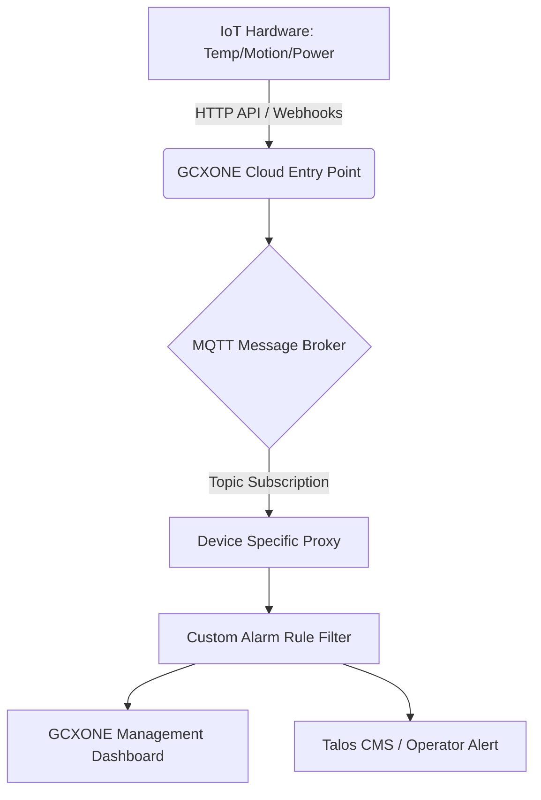

import Tabs from '@theme/Tabs';
import TabItem from '@theme/TabItem';

# IoT Sensors Integration Guide

  

    

      <strong>GCXONE</strong> has evolved from a cloud-based video surveillance solution into a comprehensive <strong>Unified Security Management Service (USMS)</strong> that fully integrates <strong>IoT (Internet of Things) functionality</strong>. IoT sensors within the GCXONE ecosystem include a wide array of devices such as <strong>temperature probes, motion detectors, and environmental sensors</strong> (e.g., door contacts or humidity monitors).
    

    

      Unlike high-bandwidth video devices, these sensors are primarily used for <strong>dashboard data visualization and event polling</strong> rather than continuous streaming. They provide critical real-time insights into the health of a site, from monitoring industrial battery voltages to tracking the physical movement of assets.
    

  

  

    

      
📡

      <h3 style={{color: 'white', margin: 0}}>IoT Sensors</h3>
      
Environmental & Motion Sensors

    

  

## Overview

An IoT sensor is like a **security guard's walkie-talkie** compared to the high-definition video of a camera. It doesn't show you the full "movie" of what is happening, but it provides instant, low-cost "status reports" (like "the door is open" or "the power is out") that tell the rest of the system when it's time to pay attention.

### Key Characteristics

- **Low Bandwidth:** Unlike video streams, IoT sensors transmit minimal data
- **Event-Driven:** Sensors typically send data only when thresholds are breached or events occur
- **Battery-Powered:** Many IoT sensors operate on battery power for extended periods
- **Wireless Connectivity:** Most sensors connect via Wi-Fi, cellular, or proprietary wireless protocols
- **Cost-Effective:** IoT sensors provide monitoring capabilities at a fraction of the cost of video systems

## Core Functional Capabilities

Integrated IoT sensors provide three primary layers of security and data management:

### 1. Real-time Monitoring

Data points (such as voltage or temperature) are displayed on custom, interactive dashboards that refresh periodically. This allows operators to:

- Monitor environmental conditions in real-time
- Track asset locations and movements
- View system health metrics
- Observe power and battery levels

### 2. Asynchronous Event Handling

Using lightweight protocols like **MQTT**, sensors publish status changes to a central broker, which GCXONE then processes into actionable alerts. This enables:

- Instant notification of threshold breaches
- Automated workflow triggers
- Integration with alarm management systems
- Multi-sensor event correlation

### 3. Intelligent Data Filtering

Because many IoT devices (like solar chargers) send data fluctuations every second, GCXONE uses **Custom Alarm Rules** to filter "noise" and only notify operators when thresholds are breached. This prevents:

- Alarm flooding from minor fluctuations
- Unnecessary operator notifications
- System overload from high-frequency data
- Battery drain from excessive communication

## System Architecture

The following diagram illustrates how IoT data flows from the physical hardware to the GCXONE dashboard:

*Note: This architecture allows the system to handle devices without static public IPs through reverse communication to the cloud DNS.*

*Figure 1: IoT sensor integration architecture showing data flow from hardware to dashboard.*

## Supported IoT Solutions

GCXONE currently supports several major categories of IoT hardware:

### 1. Environmental and Motion Sensors

- **Door & Window Contacts:** Used to detect unauthorized entry via digital inputs
- **Passive Infrared (PIR):** Battery-powered sensors that track thermal signatures to detect human or vehicle movement
- **Temperature Sensors:** Used for monitoring sensitive environments like server rooms or refrigerated storage
- **Humidity Sensors:** Monitor moisture levels in critical areas
- **Vibration Sensors:** Detect movement or tampering of equipment

### 2. Specialized IoT Systems

- **Victron Energy Systems:** Monitored for **battery voltage, PV charger state, and daily solar yield**
- **Teltonika Routers & Trackers:** Provide network connectivity data and environmental monitoring, including **unplug detection, towing detection, crash detection, and geofencing**
- **I/O Modules:** Standalone units (like Advantech ADAM or Phoenix Contact) that provide extra inputs/outputs for lights, sirens, or barriers
- **Rosenberger Battery Management:** Monitor battery health and charging systems
- **Autoaid IoT:** Vehicle tracking and monitoring systems

### 3. Security-Focused Sensors

- **AJAX PIR Cameras:** Motion detection with image capture
- **Essence My Shield:** Wireless security sensors
- **Reconeyez PIR Cam:** Battery-powered motion detection
- **Innovi AI Cloud:** AI-powered sensor systems

## Onboarding and Configuration

### 1. Basic Device Addition

*Figure 2: IoT sensor device registration interface in GCXONE.*

1. Navigate to the **Configuration App** in GCXONE
2. Select the **Site** and click the **Devices** tab
3. Click **Add** and select the appropriate device type (e.g., **Teltonika-IOT** or **Victron**)
4. Enter the **Serial Number, Username, and Password** for the device
5. Click **Discover** to automatically detect device capabilities
6. Click **Save** to register the device

### 2. Setting Custom Alarm Rules

For IoT devices that generate high-frequency data, you must configure a filter rule in the **Additional Property** section. This prevents the system from triggering an alarm for every minor decimal change.

*Figure 3: Custom alarm rules configuration for IoT sensors.*

**Example Configuration:**
- **Rule Type:** Threshold-based
- **Trigger Condition:** Battery voltage drops below **12.7V**
- **Restore Condition:** Voltage rises above **12.8V**
- **Redundancy Timer:** 30 seconds (prevents duplicate alarms)

### 3. Webhook Integration

For devices like Teltonika, you must manually feed the **GCXONE Custom Receiver URL** into the hardware's local interface. This ensures the hardware knows exactly where to "push" its data messages.

*Figure 4: Webhook configuration for IoT sensor data transmission.*

**Configuration Steps:**
1. Obtain the **GCXONE Receiver URL** from device settings
2. Log into the device's web interface
3. Navigate to **Webhook/API Configuration**
4. Enter the receiver URL
5. Configure authentication credentials
6. Test the connection

## Best Practices for Optimization

### Event Polling Interval

Set a customizable time interval (e.g., every 10 seconds for map updates) to balance real-time awareness with network load. Consider:

- **Critical Sensors:** More frequent polling (5-10 seconds)
- **Environmental Sensors:** Moderate polling (30-60 seconds)
- **Battery-Powered Sensors:** Less frequent polling (1-5 minutes) to preserve battery

### Unique Server Unit IDs

Ensure every IoT device within a tenant has a **unique identifier** to prevent alarm misattribution. This is critical for:

- Accurate alarm routing
- Proper device identification
- Correct data association
- Troubleshooting and diagnostics

### Unified Hierarchies

Organize sensors within the **Tenant → Customer → Site → Device** structure to allow for:

- Bulk management operations
- Inherited settings and configurations
- Efficient monitoring and reporting
- Simplified access control

## Dashboard Configuration

### Creating Custom Dashboards

*Figure 5: Custom IoT sensor dashboard configuration interface.*

1. Navigate to **Dashboard** in GCXONE
2. Click **Add Widget**
3. Select **IoT Sensor Data** widget type
4. Choose the sensor(s) to display
5. Configure refresh interval
6. Set visualization type (gauge, graph, numeric)

### Threshold Visualization

*Figure 6: Threshold visualization showing color-coded zones for sensor data.*

Configure visual indicators for sensor thresholds:

- **Green Zone:** Normal operating range
- **Yellow Zone:** Warning threshold approaching
- **Red Zone:** Critical threshold breached

### Real-Time Monitoring

*Figure 7: Real-time IoT sensor monitoring dashboard showing live data feeds.*

## Troubleshooting Common Issues

| Issue | Possible Cause | Resolution |
| :--- | :--- | :--- |
| **No Data Received** | Webhook not configured | Verify webhook URL is correctly entered in device settings |
| **Intermittent Data** | Network connectivity issues | Check device network connection and firewall rules |
| **Alarm Flooding** | Threshold too sensitive | Adjust alarm rules to filter minor fluctuations |
| **Battery Drain** | Polling too frequent | Reduce polling interval for battery-powered devices |
| **Device Offline** | Power or network failure | Check physical connections and power supply |

## Integration Examples

### Temperature Monitoring

**Use Case:** Monitor server room temperature

1. Install temperature sensor in server room
2. Configure threshold: Alert if temperature exceeds 25°C
3. Set up automated workflow: Send email to IT team
4. Configure restore: Clear alert when temperature drops below 24°C

### Battery Voltage Monitoring

**Use Case:** Monitor solar-powered system battery

1. Connect Victron energy system
2. Configure threshold: Alert if voltage drops below 12.7V
3. Set up escalation: If voltage drops below 12.0V, dispatch technician
4. Monitor daily solar yield for system health

### Motion Detection

**Use Case:** Perimeter security with PIR sensors

1. Install AJAX PIR sensors around perimeter
2. Configure motion detection zones
3. Link to camera system for visual verification
4. Set up alarm routing to security operators

## Related Articles

- [IP Cameras Integration Guide](/docs/device-integration/ip-cameras)
- [Alarm Panels Integration Guide](/docs/device-integration/alarm-panels)
- [Device Health Monitoring](/docs/devices/general/health-monitoring)
- [Custom Alarm Rules](/docs/admin-guide/custom-alarm-rules)
- [Dashboard Configuration](/docs/operator-guide/operator-dashboard)

## Need Help?

If you're experiencing issues with IoT sensor integration, check our [Troubleshooting Guide](/docs/troubleshooting) or [contact support](/docs/support/contact-support).

