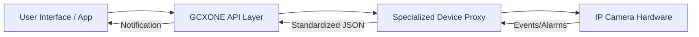

import Tabs from '@theme/Tabs';
import TabItem from '@theme/TabItem';

# IP Cameras Integration Guide

  

    

      <strong>IP Cameras</strong> are independent surveillance devices designed for high-performance security by transmitting high-definition (HD) video over the internet. Within the <strong>GCXONE</strong> ecosystem, these cameras serve as a cornerstone for real-time monitoring and intelligent alarm management.
    

    

      Unlike traditional closed-circuit systems, <strong>GCXONE</strong> integrates with a vast array of IP camera manufacturers (including Axis, Hanwha, and NetVue) to provide a unified, cloud-based security management service (USMS). This integration allows for centralized oversight, reducing the need for on-premise hardware while leveraging AI-powered analytics to filter false alarms.
    

  

  

    

      
📹

      <h3 style={{color: 'white', margin: 0}}>IP Cameras</h3>
      
HD Surveillance Cameras

    

  

## Overview

IP cameras are the primary visual sensors in modern security systems. When integrated with GCXONE, they provide:

- **Real-time HD video streaming** directly through web browsers or mobile apps
- **AI-powered false alarm reduction** (80-95% reduction in false positives)
- **Centralized cloud management** eliminating the need for on-premise NVRs
- **Intelligent event detection** with motion, intrusion, and line crossing capabilities
- **Remote PTZ control** and preset management
- **Two-way audio communication** via GCXONE Audio (SIP)

## System Architecture

The following diagram illustrates the communication flow between the user and IP camera hardware:

*The Proxy Architecture handles device-specific protocols (RTSP, HTTP, SDK) to ensure the core system interacts uniformly with all hardware.*

*Figure 1: GCXONE Platform Architecture showing the integration layer between devices and the cloud platform.*

## Key Functionalities

When integrated with **GCXONE**, IP cameras support a comprehensive suite of features across different modes:

### Cloud Mode Features

- **Discovery:** Automatic detection and addition of cameras and associated sensors once connected
- **Live Video:** Real-time monitoring of high-definition camera feeds directly through your web browser or mobile app
- **Playback & Timeline:** Access to archived footage and a chronological view of all recorded data for evidence collection
- **Advanced Alarm Management:** Notification and handling of security events (e.g., motion or intrusion) with AI-driven classification to distinguish between real threats and false triggers
- **PTZ & Presets:** Remote control of Pan-Tilt-Zoom functions and the ability to recall predefined camera positions
- **GCXONE Audio (SIP):** Two-way communication through integrated IP speakers for remote announcements

### Health Monitoring

- **Cloud Polling:** **GCXONE** performs automatic health checks to monitor connectivity, storage, and battery levels
- **Automated Alerts:** Receive immediate notifications for critical issues like "Black Screen Cameras," "Connection Failures," or "Obstructed Cameras"

## Prerequisites for Integration

Before beginning the onboarding process, ensure the following requirements are met:

1. **Network Connectivity:** The camera must be reachable from the **GCXONE** cloud. For non-VPN setups, an external IP and open ports are required
2. **Required Ports:**
   - **HTTP/HTTPS (80/443):** For web access and secure communication
   - **RTSP (554):** Mandatory for real-time video streaming
3. **User Credentials:** An administrative user account must be configured on the camera for **GCXONE** to perform discovery and configuration tasks
4. **Time Synchronization:** The camera must be synchronized with an NTP server (e.g., `time1.nxgen.cloud`) to ensure accurate event timestamps
5. **IP Whitelisting:** Whitelist **GCXONE** Primary Gateway (`18.185.17.113`) and Secondary Gateway (`3.124.50.242`) on your firewall

## Step-by-Step Onboarding Process

### 1. Register the Device in GCXONE

*Figure 2: Device registration interface in GCXONE Configuration App.*

1. Log in to the **GCXONE** platform and navigate to the **Configuration App**
2. Select the appropriate **Site** and click the **Devices** tab
3. Click the **Add** button and select the correct camera type (e.g., Axis, Hanwha, or generic IP Camera)
4. Enter the **Mandatory Details:**
   - **Name:** A custom name (e.g., "Main Entrance")
   - **IP Address / Host:** The reachable network address
   - **Username & Password:** Administrative credentials
   - **Ports:** Verify Control and RTSP ports match your hardware settings
5. Click **Discover**. **GCXONE** will automatically identify and add associated sensors
6. Click **Save**

### 2. Configure Event Forwarding

To receive alarms, you must configure the camera to "Notify Surveillance Center". Many modern IP cameras use a **Webhook Callback** mechanism:

*Figure 3: Event forwarding configuration for alarm transmission.*

1. Obtain the unique **Device ID** from the **GCXONE** device settings
2. In the camera's web interface, add a new **Recipient** or Webhook
3. Enter the URL provided in the device documentation (e.g., `https://[proxy].nxgen.cloud/eventIngest/`)
4. Set the authentication to **Basic** using the **Device ID** as both username and password

## Device Optimization Techniques

*Figure 4: Device optimization and configuration settings.*

- **Continuous Recording:** It is highly recommended to set cameras to continuous recording to ensure a complete dataset is available for analysis
- **Smart Events:** Prioritize "Smart Events" (e.g., Intrusion Detection or Line Crossing) over basic motion detection to reduce system overload and false alerts
- **Quad Alarm View:** For video events, select the "Quad Alarm" view style. This enables the camera to send three critical images (pre-alarm, current, and post-alarm) for more accurate AI processing

### Advanced Configuration Options

*Figure 5: Advanced device configuration options for optimal performance.*

- **Stream Profiles:** Configure main and sub-stream profiles to optimize bandwidth usage
- **Recording Schedule:** Set up time-based recording schedules to match site operating hours
- **Motion Zones:** Define specific areas for motion detection to reduce false alarms
- **PTZ Presets:** Configure preset positions for quick camera positioning during incidents

## Troubleshooting Common Issues

*Figure 6: Troubleshooting workflow for common IP camera issues.*

| Issue | Possible Cause | Resolution |
| :--- | :--- | :--- |
| **No Alarm Transmission** | Missing "Notify Surveillance Center" check | Ensure the camera is configured to push events to the registered center |
| **No Video Stream** | Blocked RTSP port | Verify Port 554 is open and forwarded correctly in the router |
| **Incorrect Timestamps** | Time Zone Mismatch | Sync the camera to an NTP server and ensure the zone matches the **GCXONE** site settings |
| **Device Offline** | Network Disruption | Check physical connections and power supply (UPS recommended) |
| **Poor Video Quality** | Insufficient bandwidth or incorrect stream settings | Adjust stream resolution and bitrate, or use sub-stream for live viewing |
| **AI Verification Failing** | Insufficient image quality or lighting | Ensure adequate lighting, clean lens, and proper camera positioning |

### Diagnostic Tools

GCXONE provides comprehensive diagnostic tools to help troubleshoot issues:

- **Connection Test:** Verify network connectivity and port accessibility
- **Stream Test:** Test video stream quality and latency
- **Event Log:** Review all events received from the device
- **Health Check:** Automated system health monitoring and reporting

## Supported Manufacturers

GCXONE supports IP cameras from a wide range of manufacturers including:

- **Axis** - Enterprise-grade IP cameras with ONVIF support
- **Hikvision** - Professional surveillance cameras with ISAPI protocol
- **Hanwha** - High-resolution cameras with advanced analytics
- **NetVue** - Cloud-connected cameras with P2P technology
- **Mobotix** - German-engineered cameras with edge analytics
- **ONVIF Compatible** - Any camera supporting ONVIF standard

## Best Practices

1. **Network Configuration:**
   - Use static IP addresses for cameras when possible
   - Implement VLAN segmentation for security
   - Configure Quality of Service (QoS) for video traffic

2. **Security:**
   - Change default passwords immediately
   - Enable HTTPS for web interface access
   - Regularly update camera firmware

3. **Performance:**
   - Configure appropriate resolution and frame rates based on bandwidth
   - Use sub-streams for live viewing to reduce bandwidth
   - Enable motion-based recording to save storage

4. **Monitoring:**
   - Set up health check schedules in GCXONE
   - Configure alert thresholds for storage capacity
   - Monitor bandwidth usage per camera

## Related Articles

- [Standard Device Onboarding Process](/docs/device-integration/standard-device-onboarding-process)
- [Alarm Panels Integration Guide](/docs/device-integration/alarm-panels)
- [IoT Sensors Integration Guide](/docs/device-integration/iot-sensors)
- [Device Health Monitoring](/docs/devices/general/health-monitoring)
- [Troubleshooting Device Offline](/docs/troubleshooting/device-offline)

## Need Help?

If you're experiencing issues with IP camera integration, check our [Troubleshooting Guide](/docs/troubleshooting) or [contact support](/docs/support/contact-support).

