# AxisCameraStation VMS Configuration

## Overview

This guide covers the complete configuration of Axis Camera Station VMS integration with GCXONE, including both device-side and platform-side setup.

**What you'll accomplish:**
- Configure Axis Camera Station VMS for communication with GCXONE
- Enable SDK access and configure required services
- Set up network connectivity and user credentials
- Add and register Camera Station in GCXONE platform
- Configure camera mappings and event rules
- Verify successful integration and test key features

**Estimated time**: 45-60 minutes

## Prerequisites

Ensure you have completed the prerequisites listed in the [Overview](./overview.md):

- [ ] Axis Camera Station Pro 5.x or higher installed
- [ ] Network connectivity established between Camera Station server and GCXONE
- [ ] Administrative credentials for Camera Station available
- [ ] GCXONE account with device configuration permissions
- [ ] Camera Station license valid and active

---

## Configuration Workflow

The configuration process consists of 4 main parts:

1. **Initial Setup** - Access Camera Station and verify system status
2. **Camera Station Configuration** - Configure network, users, SDK access, and recording settings
3. **GCXONE Platform Setup** - Add Camera Station in GCXONE and configure integration
4. **Verification** - Test live streaming, playback, events, and advanced features

---

## Part 1: Initial Setup

### Step 1: Access Camera Station Interface

**UI Path**: Camera Station Management Client

**Objective**: Access the Axis Camera Station management interface to begin configuration.

**Configuration Steps:**

1. Launch the Axis Camera Station management client on the Windows server
2. Log in with administrative credentials
3. Verify that Camera Station is running and all licensed cameras are detected
4. Check system status and confirm no critical errors

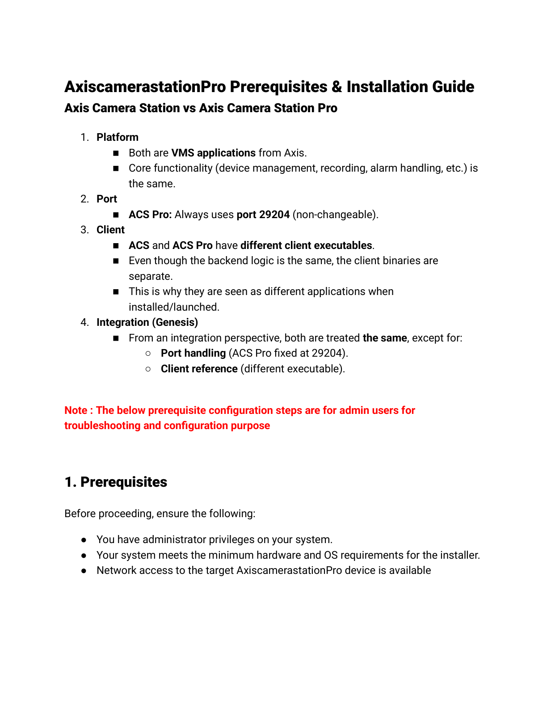

**Expected Result**: Successfully logged into Camera Station with admin privileges, system status shows green/healthy.

---

### Step 2: Verify Network Configuration

**UI Path**: Camera Station → Configuration → Network Settings

**Objective**: Ensure the Camera Station server has proper network connectivity.

**Configuration Steps:**

1. Navigate to **Configuration** → **Network Settings**
2. Verify the following network parameters:
   - **Server IP Address**: Note the static IP (required for GCXONE integration)
   - **Subnet and Gateway**: Confirm proper network configuration
   - **DNS Servers**: Ensure DNS resolution is working
   - **Internet Connectivity**: Verify server can reach external services
3. Test connectivity to GCXONE cloud endpoints (port 443)

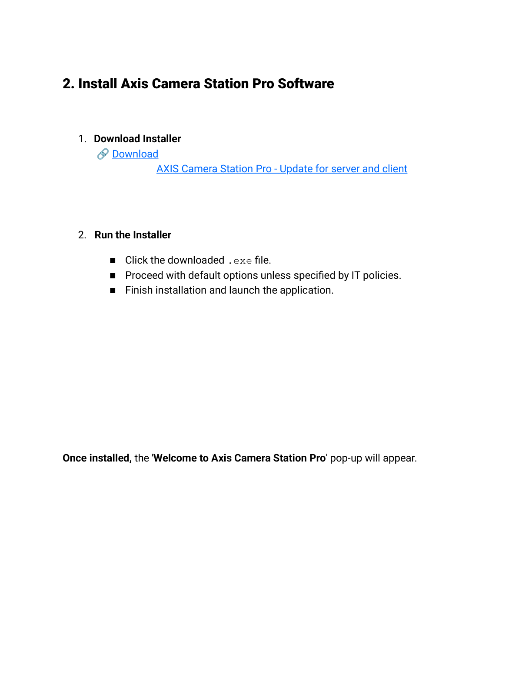

**Expected Result**: Server has valid IP configuration and can reach GCXONE cloud platform.

---

## Part 2: Camera Station Configuration

### Step 3: Configure User Accounts and Permissions

**UI Path**: Camera Station → Configuration → Users & Permissions

**Objective**: Create a dedicated user account for GCXONE integration with appropriate permissions.

**Configuration Steps:**

1. Navigate to **Configuration** → **Users & Permissions**
2. Click **Add New User**
3. Configure the integration user:
   - **Username**: `gcxone_integration` (or preferred name)
   - **Password**: Create a strong password (save for GCXONE configuration)
   - **User Role**: Administrator (or custom role with full SDK access)
   - **Permissions**: Enable all required permissions:
     - View live video
     - View recordings
     - PTZ control
     - Event management
     - SDK/API access
4. Click **Save** to create the user

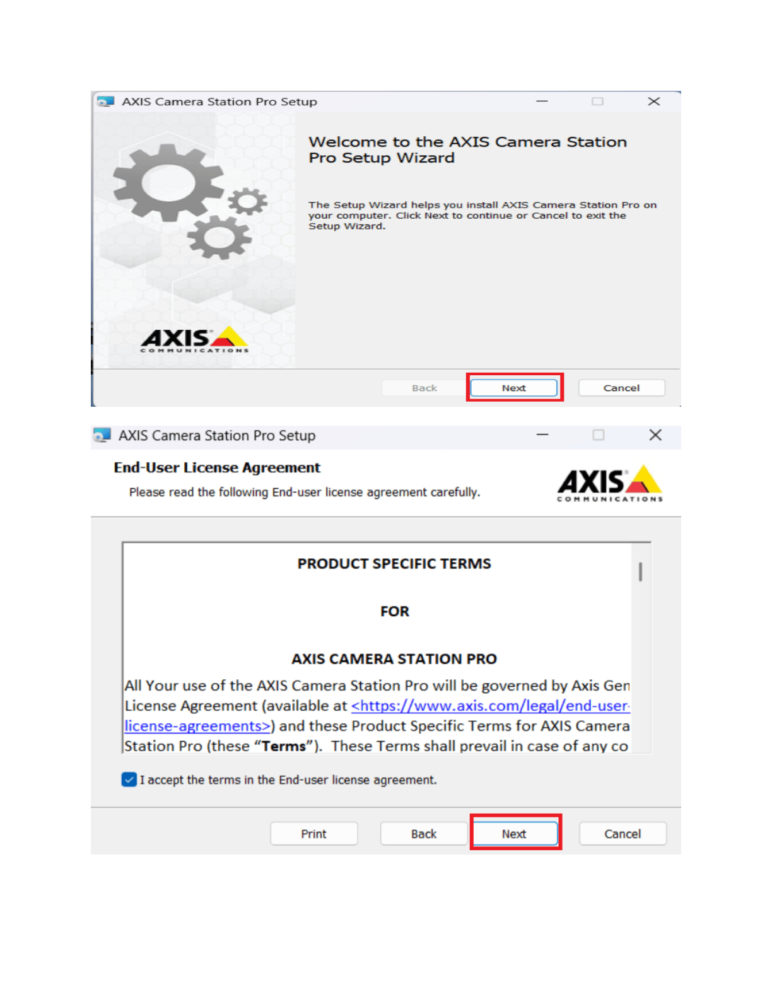

**Expected Result**: Integration user created with full access permissions for GCXONE.

---

### Step 4: Enable SDK Access

**UI Path**: Camera Station → Configuration → Services → SDK Settings

**Objective**: Enable SDK access to allow GCXONE to communicate with Camera Station.

**Configuration Steps:**

1. Navigate to **Configuration** → **Services** → **SDK Settings**
2. Enable **SDK Service**
3. Configure SDK settings:
   - **Enable SDK API**: ✓ Checked
   - **SDK Port**: 80 (HTTP) or 443 (HTTPS recommended)
   - **Enable Authentication**: ✓ Checked
   - **Allowed IP Addresses**: Configure firewall rules or allow GCXONE IP ranges
4. Click **Apply** to save changes
5. Restart SDK service if prompted

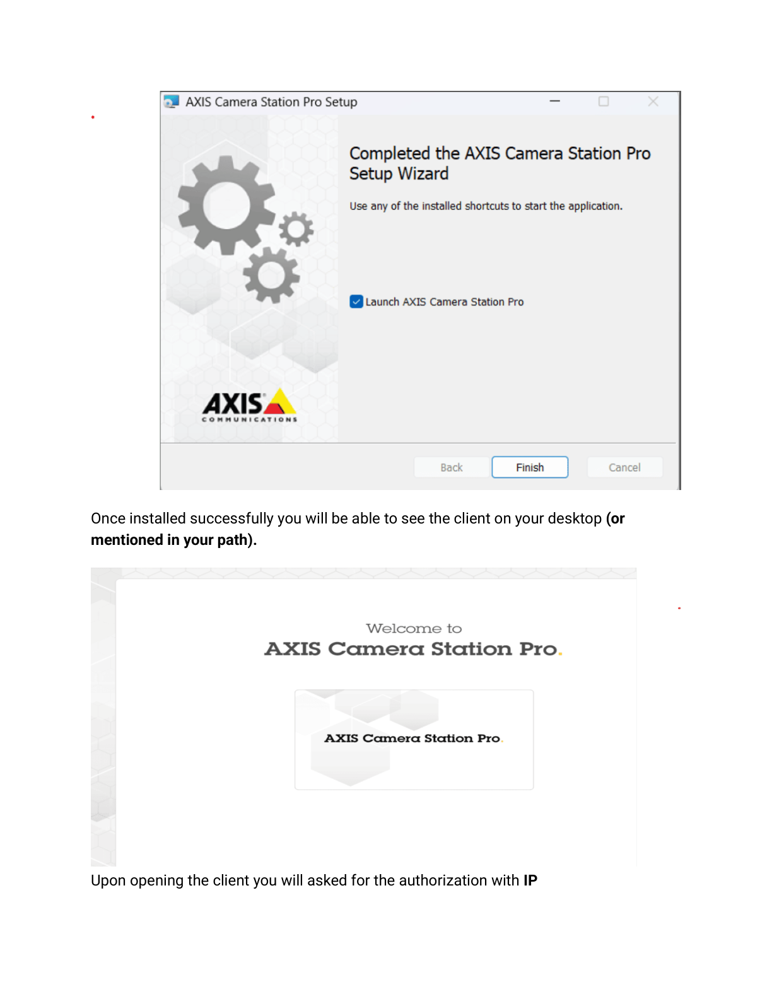

**Expected Result**: SDK service is running and accessible for GCXONE integration.

---

### Step 5: Configure Camera Settings

**UI Path**: Camera Station → Cameras → Configuration

**Objective**: Verify all cameras are configured correctly and enable required features.

**Configuration Steps:**

1. Navigate to **Cameras** → **Configuration**
2. For each camera to be integrated:
   - Verify camera is online and streaming
   - Enable **Motion Detection** if required
   - Configure **Recording Settings** (continuous or event-based)
   - Set **Stream Profiles** (main stream, sub-stream)
   - Enable **Audio** if camera supports it
3. Configure **Event Actions** for cameras:
   - Motion detection triggers
   - Analytics events
   - I/O triggers (if applicable)
4. Click **Save** for each camera

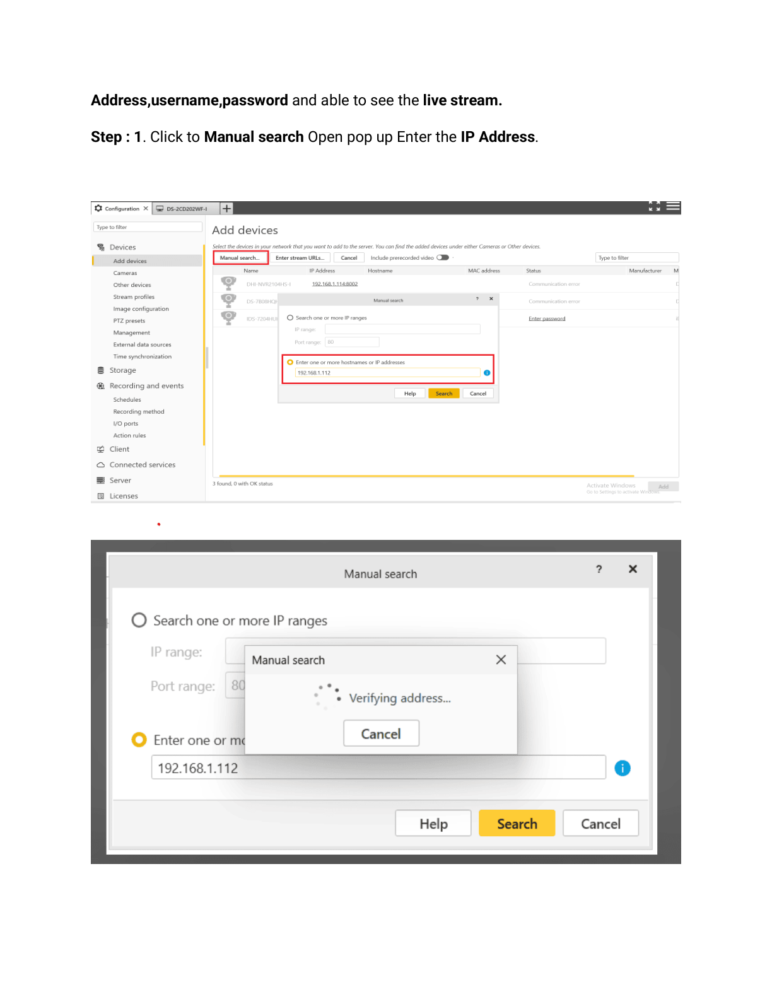

**Expected Result**: All cameras are configured and streaming properly with events enabled.

---

### Step 6: Configure Recording and Storage

**UI Path**: Camera Station → Configuration → Recording & Storage

**Objective**: Ensure recording settings are configured for event-based and continuous recording.

**Configuration Steps:**

1. Navigate to **Configuration** → **Recording & Storage**
2. Configure **Recording Rules**:
   - **Continuous Recording**: Enable for 24/7 recording (optional)
   - **Event-Based Recording**: Enable for motion/analytics events
   - **Pre-Recording**: 5-10 seconds recommended
   - **Post-Recording**: 15-30 seconds recommended
3. Configure **Storage Settings**:
   - Verify storage location and available space
   - Set retention period (7-30 days typical)
   - Enable **Automatic Deletion** when storage is full
4. Click **Apply** to save settings

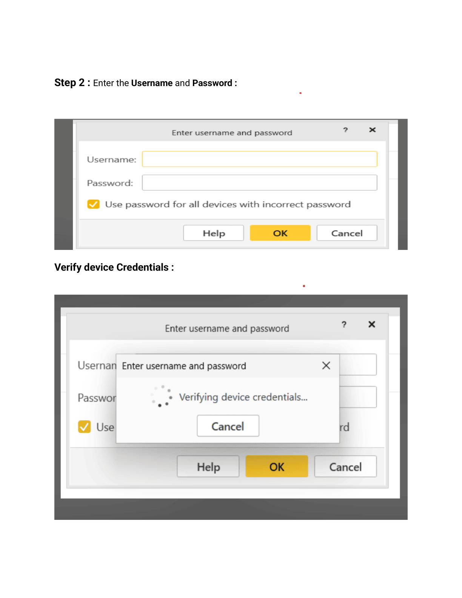

**Expected Result**: Recording settings configured to capture events with appropriate retention.

---

## Part 3: GCXONE Platform Setup

### Step 7: Add Camera Station in GCXONE

**UI Path**: GCXONE Web Portal → Devices → Add Device

**Objective**: Register the Axis Camera Station server in the GCXONE platform.

**Configuration Steps:**

1. Log into the GCXONE web portal with admin credentials
2. Navigate to **Devices** → **Add Device**
3. Select **Axis Camera Station VMS** from device types
4. Enter Camera Station details:
   - **Device Name**: Descriptive name (e.g., "Site A - Camera Station")
   - **IP Address/Hostname**: Camera Station server IP (from Step 2)
   - **Port**: 80 or 443 (match SDK configuration)
   - **Username**: Integration user created in Step 3
   - **Password**: Password for integration user
   - **Protocol**: HTTP or HTTPS (HTTPS recommended)
5. Click **Test Connection** to verify connectivity
6. Click **Add Device** to register in GCXONE

**Expected Result**: Camera Station successfully added and shows "Online" status in GCXONE.

---

### Step 8: Configure Camera Mappings

**UI Path**: GCXONE → Devices → Camera Station → Cameras

**Objective**: Map Camera Station cameras to GCXONE for monitoring and management.

**Configuration Steps:**

1. In GCXONE, navigate to the newly added Camera Station device
2. Click **Configure Cameras** or **Camera Management**
3. GCXONE will discover all cameras from Camera Station
4. For each camera:
   - Verify camera name and location
   - Enable **Cloud Streaming** if desired
   - Enable **Event Forwarding** to forward events to GCXONE
   - Configure **Stream Quality** (high, medium, low)
   - Assign cameras to **Sites/Locations** in GCXONE hierarchy
5. Click **Save Configuration**

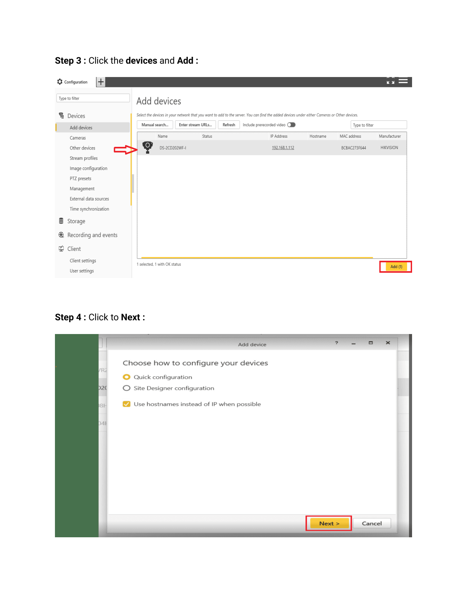

**Expected Result**: All cameras mapped and accessible in GCXONE with proper site assignments.

---

### Step 9: Configure Event Rules and Notifications

**UI Path**: GCXONE → Camera Station → Event Configuration

**Objective**: Set up event forwarding and notification rules.

**Configuration Steps:**

1. Navigate to **Event Configuration** for the Camera Station device
2. Enable **Event Forwarding**:
   - ✓ Motion Detection Events
   - ✓ Video Analytics Events
   - ✓ System Events (camera offline, disk full)
   - ✓ I/O Trigger Events
3. Configure **Notification Rules**:
   - Select events to trigger notifications
   - Configure notification channels (email, push, SMS)
   - Set notification recipients
4. Configure **Event Actions**:
   - Auto-record on event
   - Send to monitoring dashboard
   - Trigger integrations (alarms, access control, etc.)
5. Click **Save** to apply event rules

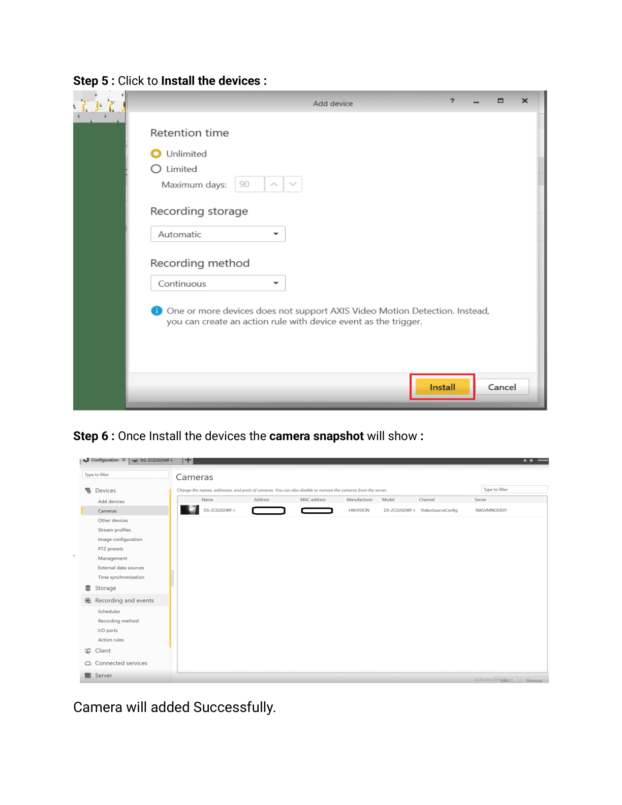

**Expected Result**: Events from Camera Station are forwarded to GCXONE and trigger configured actions.

---

## Part 4: Verification and Testing

### Step 10: Verify Live Streaming

**UI Path**: GCXONE → Cameras → Live View

**Objective**: Confirm live video streaming works from Camera Station through GCXONE.

**Configuration Steps:**

1. In GCXONE, navigate to **Cameras** → **Live View**
2. Select a camera from the Camera Station device
3. Verify live video stream loads successfully
4. Test stream quality and latency
5. Test **PTZ Controls** (if camera supports PTZ):
   - Pan left/right
   - Tilt up/down
   - Zoom in/out
   - Preset positions
6. Test **Audio** (if enabled):
   - Listen to camera audio
   - Test two-way audio if supported

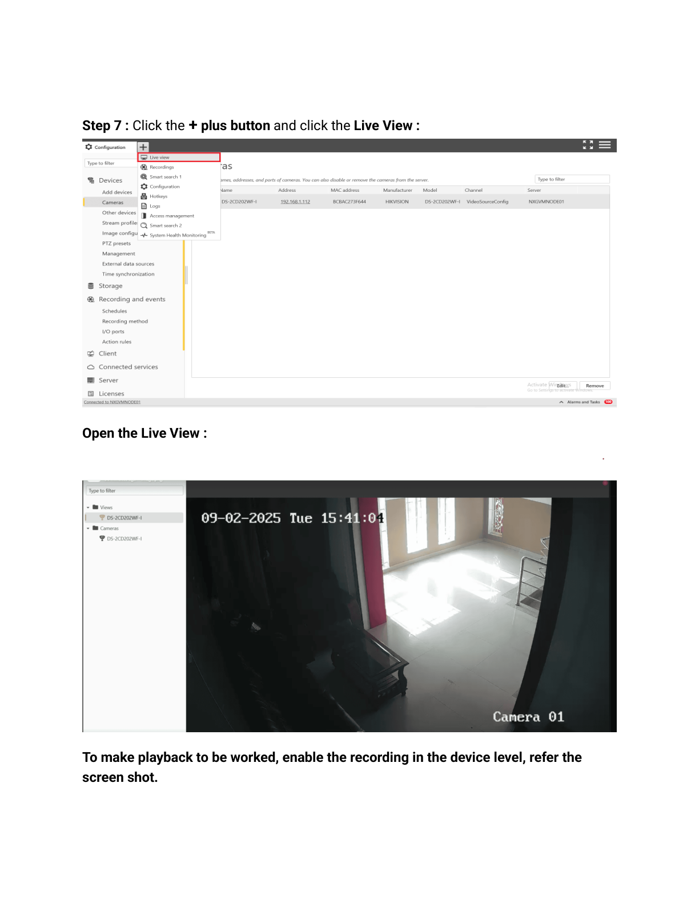

**Expected Result**: Live video streams successfully with acceptable latency, PTZ and audio work correctly.

---

### Step 11: Verify Playback and Timeline

**UI Path**: GCXONE → Cameras → Playback

**Objective**: Confirm video playback and timeline features work correctly.

**Configuration Steps:**

1. Navigate to **Cameras** → **Playback** in GCXONE
2. Select a camera and choose a time range
3. Verify recorded video plays back smoothly
4. Test **Timeline Navigation**:
   - Scroll through timeline
   - Click on event markers
   - Verify event types are displayed
5. Test **Playback Controls**:
   - Play/Pause
   - Fast forward/rewind
   - Speed adjustment (1x, 2x, 4x)
   - Snapshot capture
6. Verify **Video Export** functionality

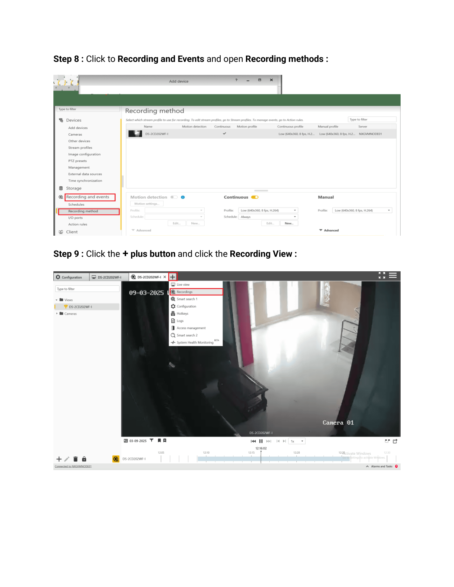

**Expected Result**: Playback works smoothly with timeline showing events, export functions properly.

---

### Step 12: Test Event Detection and Forwarding

**UI Path**: GCXONE → Events Dashboard

**Objective**: Verify events are being detected and forwarded correctly.

**Configuration Steps:**

1. Trigger a test event at a camera:
   - Walk in front of camera to trigger motion detection
   - Or manually trigger an I/O input if available
2. Navigate to **Events Dashboard** in GCXONE
3. Verify the event appears in real-time:
   - Event type displayed correctly
   - Timestamp accurate
   - Camera source identified
   - Event thumbnail/snapshot present
4. Click on event to view details:
   - Event video clip
   - Event metadata
   - Associated actions
5. Verify notifications were sent (if configured)

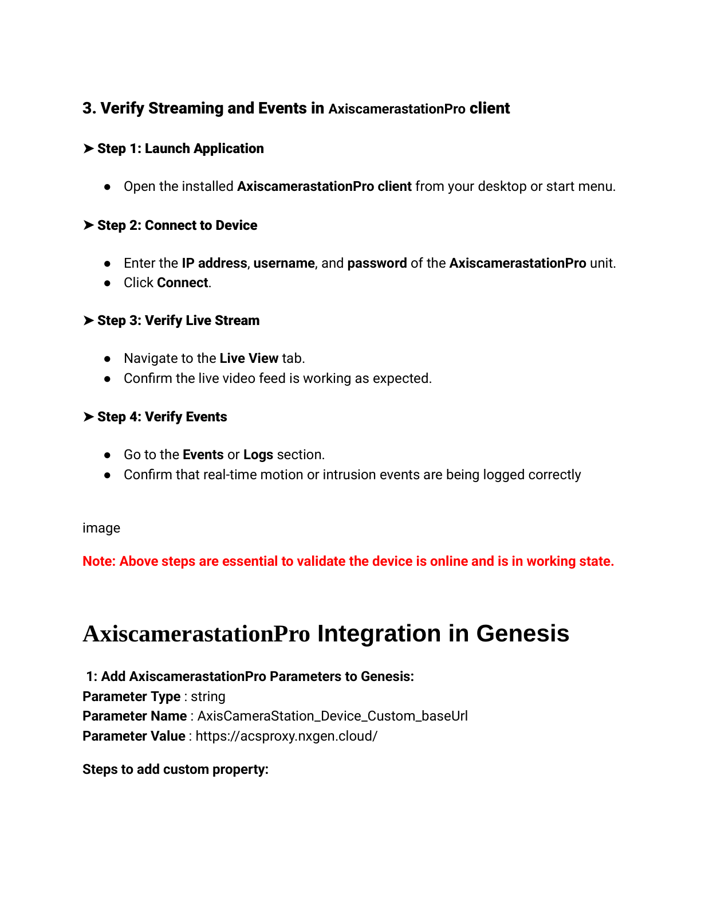

**Expected Result**: Events are detected, forwarded to GCXONE immediately, and notifications sent as configured.

---

## Advanced Configuration

### PTZ Preset Configuration

If using PTZ cameras, you can configure preset positions:

1. In GCXONE, navigate to camera PTZ settings
2. Use PTZ controls to position camera at desired location
3. Click **Save Preset** and name it (e.g., "Main Entrance", "Parking Lot")
4. Repeat for additional preset positions
5. Test presets by selecting them from the dropdown

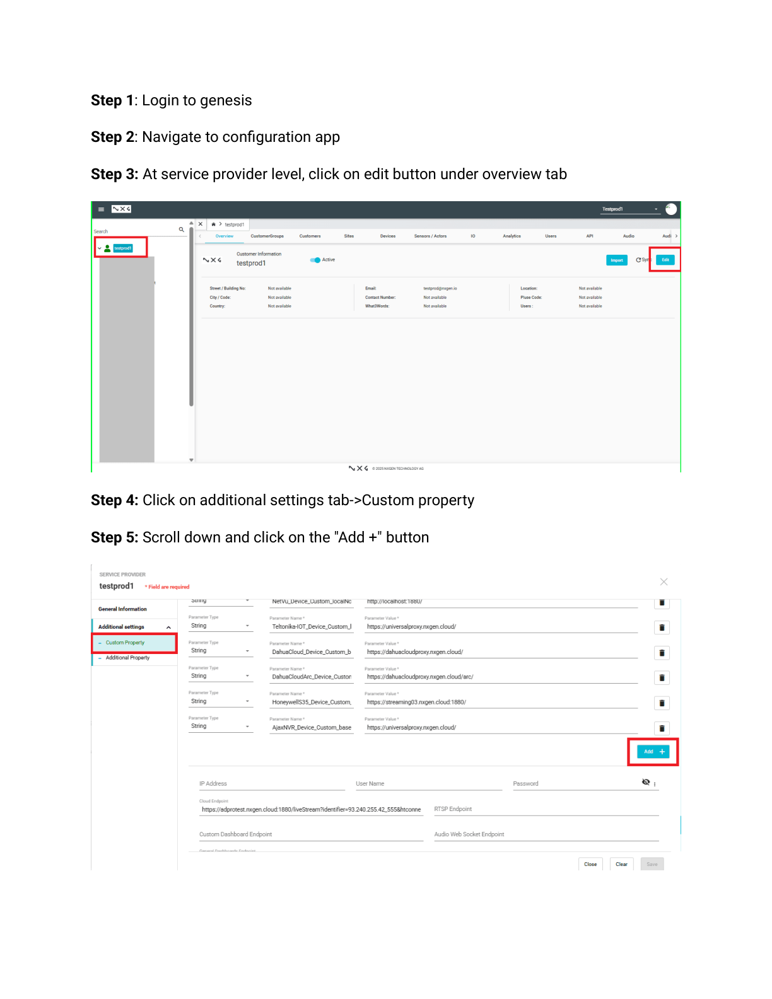

---

### I/O Configuration

For cameras with digital I/O ports:

1. In Camera Station, navigate to **Configuration** → **I/O Settings**
2. Configure **Input Ports**:
   - Name each input (e.g., "Door Contact", "PIR Sensor")
   - Set trigger type (normal open/closed)
   - Configure recording and event actions
3. Configure **Output Ports**:
   - Name each output (e.g., "Alarm Siren", "Door Strike")
   - Set default state
4. In GCXONE, map I/O ports to automation rules

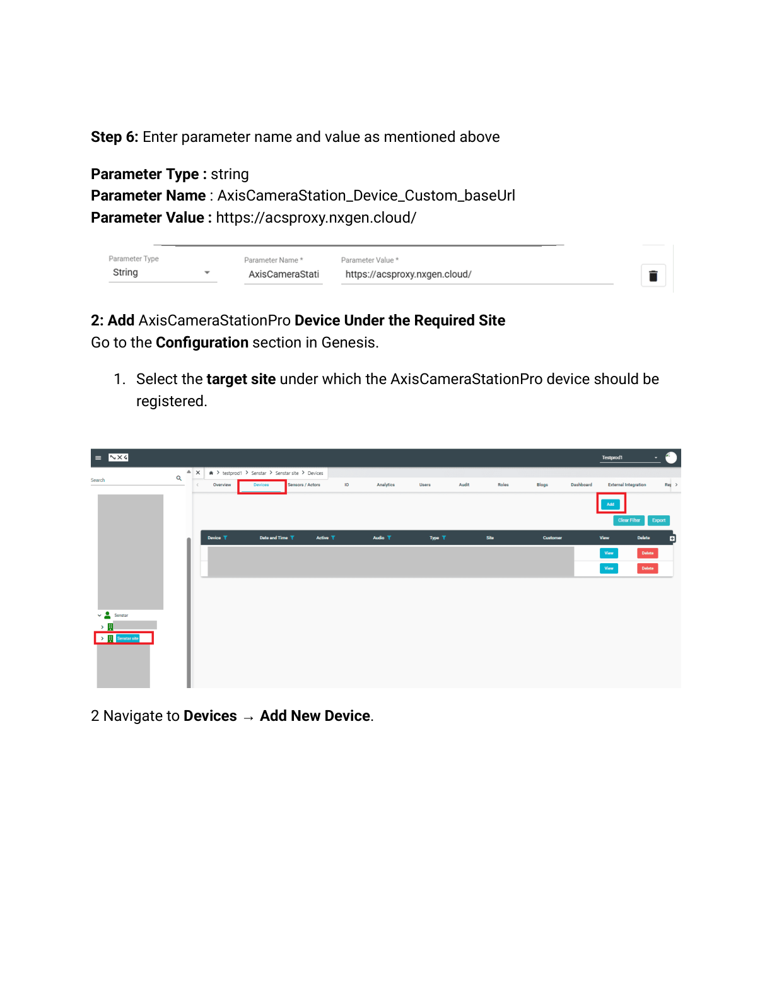

---

### Genesis Audio (SIP) Configuration

To enable two-way audio via Genesis Audio:

1. In Camera Station, enable **SIP Audio Service**
2. Configure SIP server settings provided by GCXONE
3. Register Camera Station as a SIP endpoint
4. In GCXONE, configure audio routing rules
5. Test two-way communication

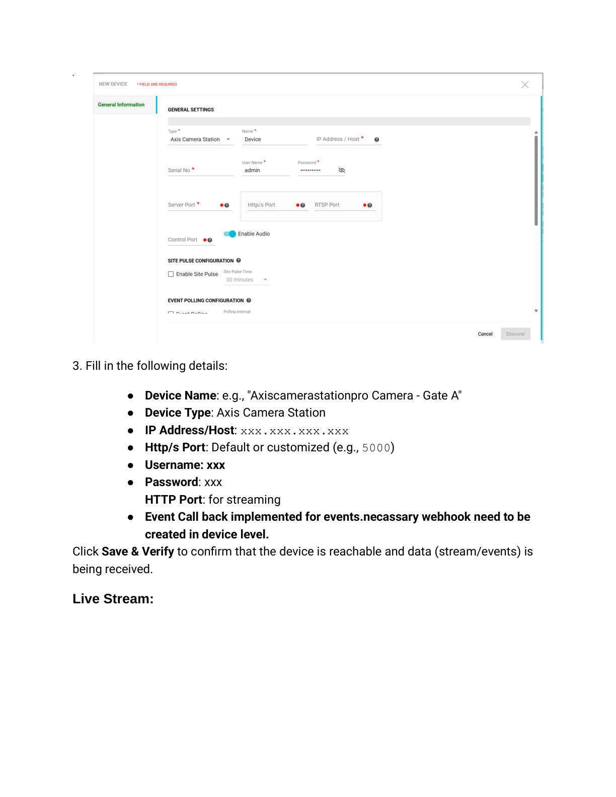

---

## Verification Checklist

Before completing configuration, verify all core functions:

- [ ] Live streaming works for all cameras (cloud and local)
- [ ] Playback and timeline navigation functional
- [ ] Events are detected and forwarded to GCXONE
- [ ] PTZ control works (if applicable)
- [ ] Audio streaming works (if enabled)
- [ ] I/O triggers work correctly (if configured)
- [ ] Notifications are sent as configured
- [ ] Mobile app access functional
- [ ] Integration status shows "Online" in GCXONE
- [ ] No error messages in Camera Station or GCXONE logs

---

## Troubleshooting

If you encounter issues during configuration, see the [Troubleshooting Guide](./troubleshooting.md) for common problems and solutions.

---

## Related Articles

- [Axis Camera Station Overview](./overview.md)
- [Axis Camera Station Troubleshooting](./troubleshooting.md)
- [Firewall Configuration](/docs/getting-started/firewall-configuration)
- [Required Ports](/docs/getting-started/required-ports)

---

**Need Help?**

If you need assistance with Axis Camera Station configuration, [contact support](/docs/troubleshooting-support/how-to-submit-a-support-ticket).
