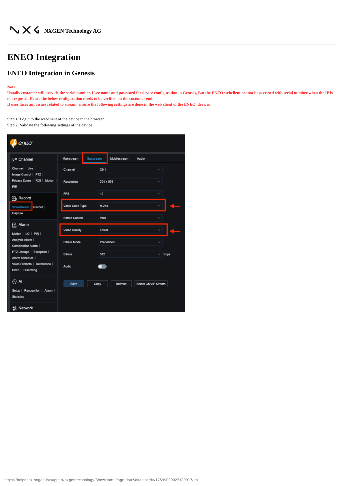
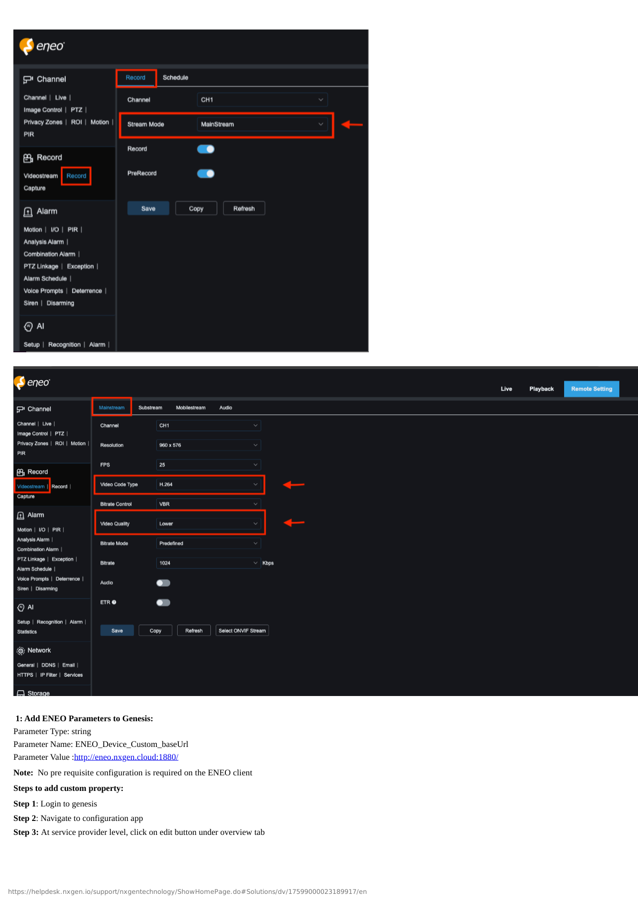
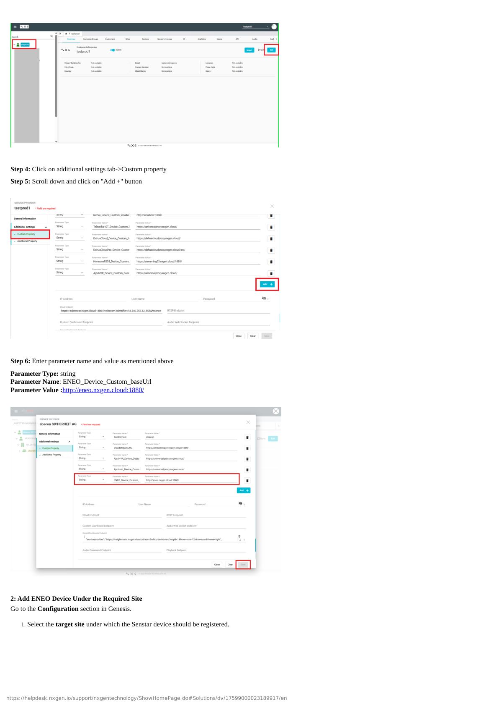
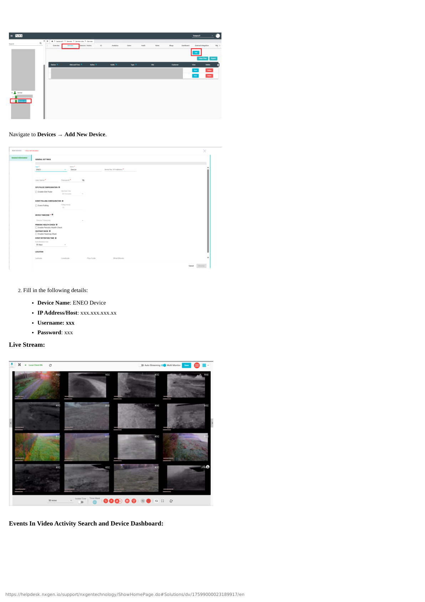
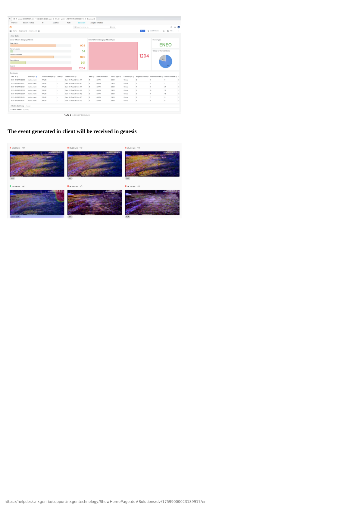

# ENEO NVR Configuration

## Overview

This guide covers the complete configuration of ENEO NVR integration with GCXONE, including both device-side and platform-side setup.

**What you'll accomplish:**
- Configure ENEO NVR for communication with GCXONE
- Enable SDK access and configure required services
- Set up network connectivity and user credentials
- Add and register NVR in GCXONE platform
- Configure camera mappings and event rules
- Verify successful integration and test key features

**Estimated time**: 30-45 minutes

## Prerequisites

Ensure you have completed the prerequisites listed in the [Overview](./overview.md):

- [ ] ENEO NVR with firmware 3.0 or higher
- [ ] Network connectivity established between NVR and GCXONE
- [ ] Administrative credentials for NVR available
- [ ] GCXONE account with device configuration permissions
- [ ] Static IP or DDNS configured for NVR

---

## Configuration Workflow

The configuration process consists of 3 main parts:

1. **NVR Configuration** - Configure network, enable SDK access, and create integration user
2. **GCXONE Platform Setup** - Add NVR in GCXONE and configure integration
3. **Verification** - Test live streaming, playback, timeline, events, and PTZ features

---

## Part 1: ENEO NVR Configuration

### Step 1: Access NVR Web Interface

**UI Path**: Web Browser → http://[NVR-IP]

**Objective**: Access the ENEO NVR web interface to begin configuration.

**Configuration Steps:**

1. Open a web browser and navigate to the NVR's IP address
2. Log in with administrative credentials
3. Verify NVR firmware version is 3.0 or higher
4. Check that all cameras are online and recording

**Expected Result**: Successfully logged into NVR web interface with admin privileges.

---

### Step 2: Configure Network Settings

**UI Path**: Configuration → Network → TCP/IP

**Objective**: Ensure the NVR has proper network connectivity for GCXONE integration.

**Configuration Steps:**

1. Navigate to **Configuration** → **Network** → **TCP/IP**
2. Verify or configure network parameters:
   - **IP Address**: Static IP recommended (note this for GCXONE setup)
   - **Subnet Mask**: Match your network configuration
   - **Gateway**: Default gateway IP
   - **Preferred DNS**: 8.8.8.8 or your network DNS
   - **Alternate DNS**: 8.8.4.4 (optional)
3. Test internet connectivity
4. Click **Save** to apply settings

**Expected Result**: NVR has valid IP configuration and internet connectivity.

---

### Step 3: Configure User Accounts and Enable SDK

**UI Path**: Configuration → System → User Management / SDK Settings

**Objective**: Create integration user and enable SDK access for GCXONE.

**Configuration Steps:**

1. Navigate to **Configuration** → **System** → **User Management**
2. Create a new user for GCXONE integration:
   - **Username**: `gcxone_integration` (or preferred name)
   - **Password**: Create strong password (save for GCXONE setup)
   - **User Level**: Administrator
   - **Permissions**: Enable all (Live View, Playback, PTZ, Configuration)
3. Navigate to **Configuration** → **Network** → **Advanced Settings** → **Platform Access**
4. Enable **SDK Service** or **Platform Integration**:
   - Enable SDK/API access
   - Note the SDK port (usually 8000 or default)
5. Click **Save** and restart if prompted

**Expected Result**: Integration user created with full permissions, SDK service enabled.

---

### Step 4: Configure Camera and Recording Settings

**UI Path**: Configuration → Camera / Recording

**Objective**: Verify cameras are configured correctly for integration.

**Configuration Steps:**

1. Navigate to **Configuration** → **Camera**
2. For each camera:
   - Verify camera is online and streaming
   - Enable **Motion Detection** if required
   - Configure **Main Stream** quality (1080p recommended)
   - Configure **Sub Stream** for remote viewing (lower resolution)
3. Navigate to **Configuration** → **Recording**
4. Configure recording schedule:
   - **Continuous Recording**: 24/7 or scheduled
   - **Event Recording**: Motion detection, I/O triggers
   - **Pre-Record**: 5-10 seconds
   - **Post-Record**: 30 seconds
5. Click **Save** to apply settings

**Expected Result**: All cameras configured with proper streaming and recording settings.

---

## Part 2: GCXONE Platform Setup

### Step 5: Add ENEO NVR in GCXONE

**UI Path**: GCXONE Web Portal → Devices → Add Device

**Objective**: Register the ENEO NVR in the GCXONE platform.

**Configuration Steps:**

1. Log into the GCXONE web portal with admin credentials
2. Navigate to **Devices** → **Add Device**
3. Select **ENEO NVR** from device types
4. Enter NVR details:
   - **Device Name**: Descriptive name (e.g., "Site A - ENEO NVR")
   - **IP Address/Hostname**: NVR IP address (from Step 2)
   - **Port**: 8000 (or SDK port configured in Step 3)
   - **Username**: Integration user from Step 3
   - **Password**: Password for integration user
   - **Protocol**: TCP/IP
5. Click **Test Connection** to verify connectivity
6. If successful, click **Add Device** to register in GCXONE
7. GCXONE will discover all cameras from the NVR

**Expected Result**: ENEO NVR successfully added and shows "Online" status in GCXONE.

---

### Step 6: Configure Cameras and Events

**UI Path**: GCXONE → Devices → ENEO NVR → Configuration

**Objective**: Map cameras, configure event rules, and enable features.

**Configuration Steps:**

1. In GCXONE, navigate to the newly added ENEO NVR device
2. Click **Configure Cameras** or **Camera Management**
3. For each camera:
   - Verify camera name and assign to site/location
   - Enable **Cloud Streaming** for remote access
   - Enable **Event Forwarding** to forward events to GCXONE
   - Configure **Stream Quality** (auto, high, medium, low)
   - Enable **Timeline** for event navigation
4. Configure **Event Rules**:
   - Enable Motion Detection events
   - Enable System events (camera offline, disk full)
   - Configure notification rules (email, push, SMS)
   - Set event recording actions
5. Click **Save Configuration**

**Expected Result**: All cameras mapped, events forwarded, and notifications configured.

---

## Part 3: Verification and Testing

### Verification Checklist

Test all core functions before completing configuration:

**Live Streaming:**
- [ ] Cloud live streaming works for all cameras
- [ ] Local live streaming works (if on same network)
- [ ] Stream quality is acceptable with minimal latency
- [ ] Audio works (if cameras support audio)

**Playback and Timeline:**
- [ ] Cloud playback works with timeline navigation
- [ ] Local playback works (if on same network)
- [ ] Timeline shows event markers correctly
- [ ] Video export works

**Events:**
- [ ] Motion detection events are forwarded to GCXONE
- [ ] Event notifications are sent correctly
- [ ] Event video clips are recorded
- [ ] Arm/Disarm functions work

**PTZ Control (if applicable):**
- [ ] PTZ controls work (pan, tilt, zoom)
- [ ] PTZ presets can be saved and recalled
- [ ] Local PTZ control works

**General:**
- [ ] Device status shows "Online" in GCXONE
- [ ] Mobile app access works
- [ ] No error messages in logs

---

## Advanced Configuration

### PTZ Preset Configuration

For cameras with PTZ capabilities:

1. In GCXONE, navigate to camera PTZ settings
2. Use PTZ controls to position camera
3. Click **Save Preset** and name it
4. Repeat for additional presets
5. Test presets by selecting from dropdown

### Timeline Configuration

Optimize timeline performance:

1. In ENEO NVR, ensure event recording is enabled
2. Configure motion detection sensitivity
3. In GCXONE, enable timeline for cameras
4. Adjust timeline display density (events per hour)

### Multi-Site Management

For managing multiple ENEO NVRs:

1. Add each NVR as separate device in GCXONE
2. Organize cameras by site/location hierarchy
3. Create site-specific event rules
4. Configure role-based access per site

---

## Troubleshooting

If you encounter issues during configuration, see the [Troubleshooting Guide](./troubleshooting.md) for common problems and solutions.

**Quick troubleshooting:**
- **NVR not discovered**: Verify IP address, port, and credentials
- **Connection fails**: Check firewall rules allow port 8000 and 443
- **No video**: Verify cameras are online in NVR interface
- **No events**: Check event detection is enabled on NVR and GCXONE
- **PTZ not working**: Verify PTZ cameras are properly configured in NVR

---

## Related Articles

- [ENEO NVR Overview](./overview.md)
- [ENEO NVR Troubleshooting](./troubleshooting.md)
- [Firewall Configuration](/docs/getting-started/firewall-configuration)
- [Required Ports](/docs/getting-started/required-ports)

---

**Need Help?**

If you need assistance with ENEO NVR configuration, [contact support](/docs/troubleshooting-support/how-to-submit-a-support-ticket).
