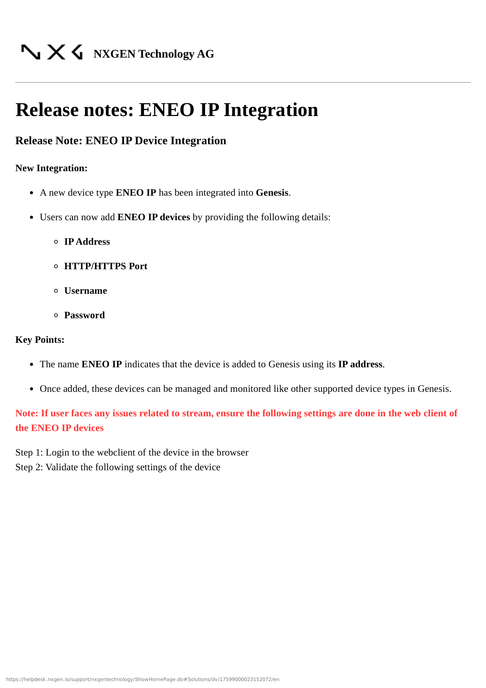
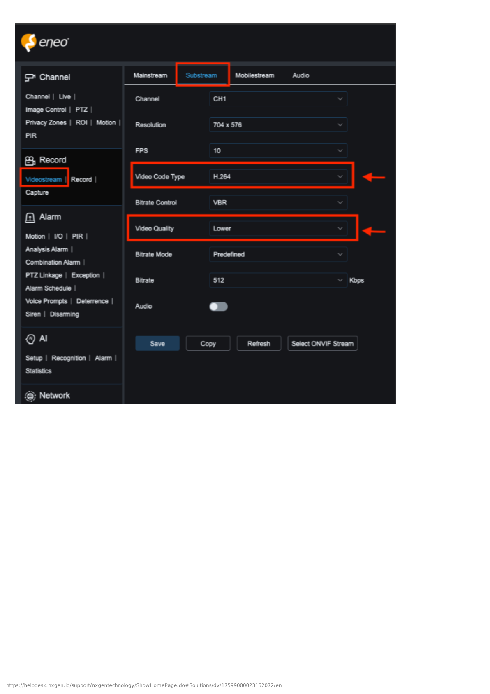
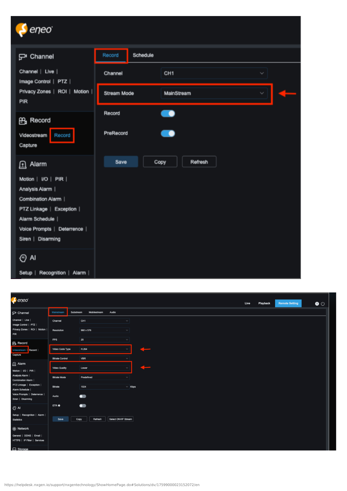
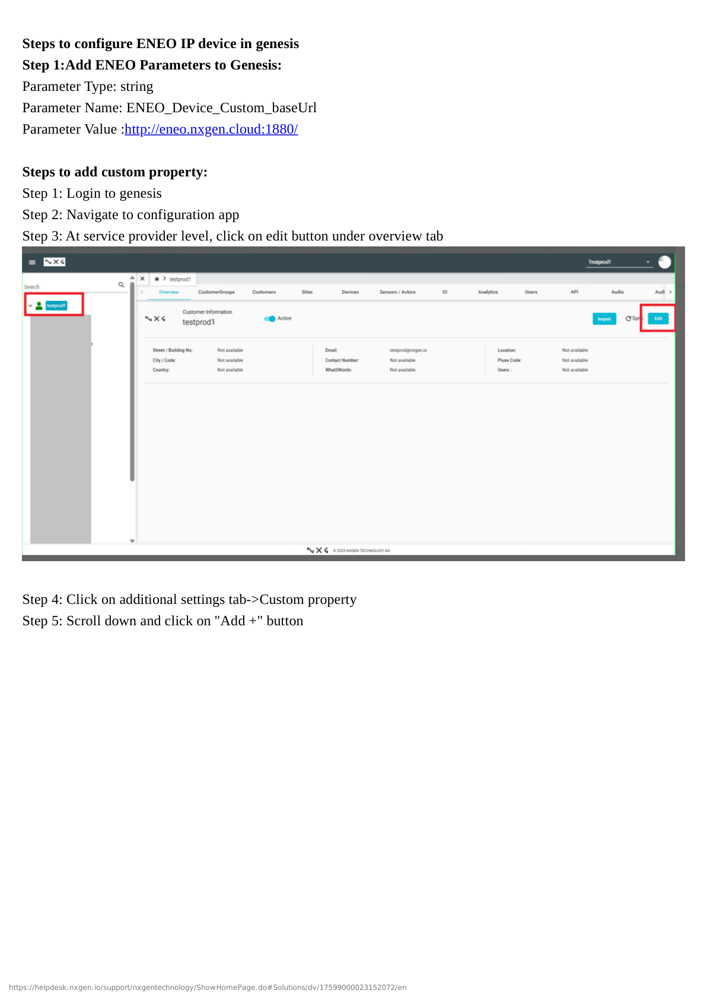
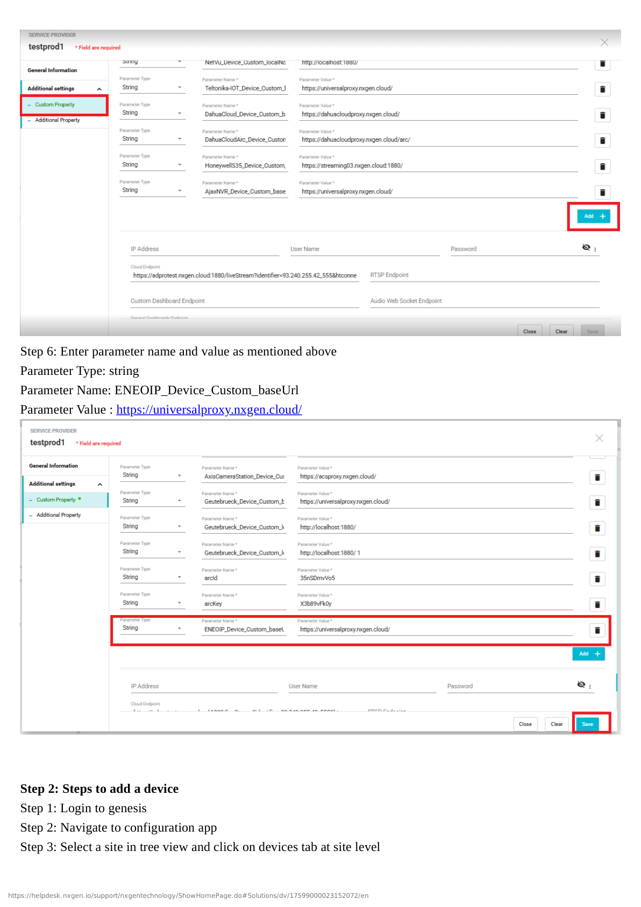
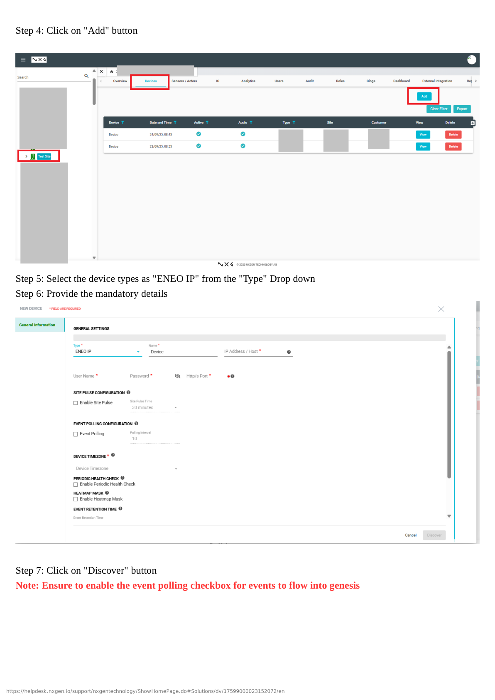
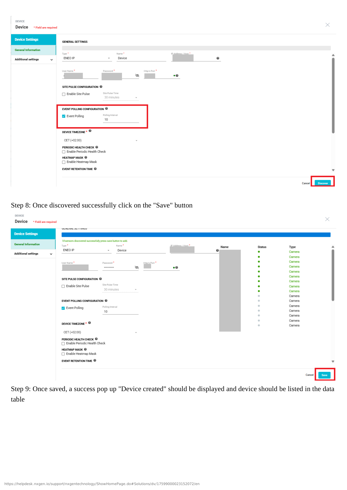
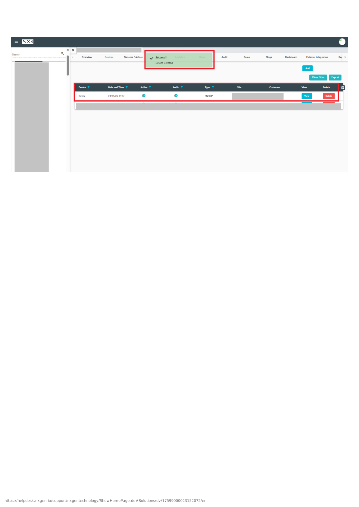

# ENEOIP NVR Configuration

## Overview

This guide covers the complete configuration of ENEOIP NVR integration with GCXONE, including both device-side and platform-side setup with optimized IP network configuration.

**What you'll accomplish:**
- Configure ENEOIP NVR for communication with GCXONE
- Optimize IP network settings for best performance
- Enable SDK access and configure required services
- Set up network connectivity and user credentials
- Add and register NVR in GCXONE platform
- Configure IP camera mappings and event rules
- Verify successful integration and test key features

**Estimated time**: 30-45 minutes

## Prerequisites

Ensure you have completed the prerequisites listed in the [Overview](./overview.md):

- [ ] ENEOIP NVR with firmware 3.0 or higher
- [ ] Network connectivity established between NVR and GCXONE
- [ ] Administrative credentials for NVR available
- [ ] GCXONE account with device configuration permissions
- [ ] Static IP or DDNS configured for NVR
- [ ] IP cameras configured and accessible on network

---

## Configuration Workflow

The configuration process consists of 3 main parts:

1. **ENEOIP NVR Configuration** - Configure network, IP settings, enable SDK access, and create integration user
2. **GCXONE Platform Setup** - Add NVR in GCXONE and configure integration
3. **Verification** - Test live streaming, playback, timeline, events, and PTZ features

---

## Part 1: ENEOIP NVR Configuration

### Step 1: Access NVR Web Interface and Verify System Status

**UI Path**: Web Browser → http://[NVR-IP]

**Objective**: Access the ENEOIP NVR web interface and verify system readiness.

**Configuration Steps:**

1. Open a web browser and navigate to the NVR's IP address
2. Log in with administrative credentials
3. Verify NVR firmware version is 3.0 or higher
4. Check system status dashboard for any errors
5. Verify all IP cameras are discovered and online

**Expected Result**: Successfully logged into NVR web interface, system healthy, all cameras detected.

---

### Step 2: Configure IP Network Settings

**UI Path**: Configuration → Network → TCP/IP

**Objective**: Configure optimal IP network settings for GCXONE integration.

**Configuration Steps:**

1. Navigate to **Configuration** → **Network** → **TCP/IP**
2. Configure network parameters:
   - **IP Address**: Static IP recommended (note this for GCXONE setup)
   - **Subnet Mask**: Match your network configuration
   - **Gateway**: Default gateway IP
   - **Preferred DNS**: 8.8.8.8 or your network DNS
   - **Alternate DNS**: 8.8.4.4 (optional)
   - **MTU**: 1500 (default) or adjust for your network
3. Enable **IPv4** and configure as needed
4. Test internet connectivity
5. Click **Save** to apply settings

**Expected Result**: NVR has valid IP configuration and internet connectivity with optimal network performance.

---

### Step 3: Configure Advanced Network and Port Settings

**UI Path**: Configuration → Network → Advanced Settings

**Objective**: Configure advanced network settings and ports for SDK access.

**Configuration Steps:**

1. Navigate to **Configuration** → **Network** → **Advanced Settings**
2. Configure **SDK Port Settings**:
   - **SDK Service Port**: 8000 (default) or custom port
   - **Enable SDK Service**: ✓ Checked
3. Configure **Additional Ports** if needed:
   - **HTTP Port**: 80 (default)
   - **HTTPS Port**: 443 (recommended)
   - **RTSP Port**: 554 (for streaming)
4. Enable **UPnP** if using dynamic port forwarding (optional)
5. Click **Save** and restart services if prompted

**Expected Result**: SDK service enabled with proper port configuration.

---

### Step 4: Create Integration User Account

**UI Path**: Configuration → System → User Management

**Objective**: Create a dedicated user account for GCXONE integration with appropriate permissions.

**Configuration Steps:**

1. Navigate to **Configuration** → **System** → **User Management**
2. Click **Add New User**
3. Configure the integration user:
   - **Username**: `gcxone_integration` (or preferred name)
   - **Password**: Create strong password (save for GCXONE setup)
   - **User Level**: Administrator or Operator with full permissions
   - **Permissions**: Enable all required permissions:
     - ✓ Live View
     - ✓ Playback
     - ✓ PTZ Control
     - ✓ Event Management
     - ✓ Configuration Access (for SDK)
     - ✓ Remote Access
4. Click **Save** to create the user

**Expected Result**: Integration user created with full permissions for GCXONE access.

---

### Step 5: Configure IP Camera Settings

**UI Path**: Configuration → Camera → IP Camera Management

**Objective**: Configure IP cameras for optimal integration with GCXONE.

**Configuration Steps:**

1. Navigate to **Configuration** → **Camera** → **IP Camera Management**
2. Verify all IP cameras are discovered and added
3. For each camera:
   - Verify camera is online and streaming
   - Configure **Main Stream**:
     - Resolution: 1080p or higher
     - Framerate: 15-30 fps
     - Bitrate: 2048-4096 Kbps
   - Configure **Sub Stream**:
     - Resolution: 720p or D1
     - Framerate: 10-15 fps
     - Bitrate: 512-1024 Kbps (for remote viewing)
   - Enable **Motion Detection** if required
   - Enable **Audio** if camera supports it
4. Click **Save** for each camera

**Expected Result**: All IP cameras configured with optimal streaming settings.

---

### Step 6: Configure Recording and Storage Settings

**UI Path**: Configuration → Recording → Schedule / Storage

**Objective**: Configure recording rules and storage management.

**Configuration Steps:**

1. Navigate to **Configuration** → **Recording** → **Schedule**
2. Configure **Recording Schedule** for each camera:
   - **Continuous Recording**: 24/7 or scheduled hours
   - **Event Recording**: Motion detection, I/O triggers, analytics
   - **Pre-Record**: 5-10 seconds
   - **Post-Record**: 30-60 seconds
3. Navigate to **Storage** settings:
   - Verify storage location and available space
   - Set **Retention Period**: 7-30 days (or as required)
   - Enable **Automatic Deletion** when storage is full
   - Configure **Recording Priority**: Event > Continuous
4. Click **Save** to apply settings

**Expected Result**: Recording configured for all cameras with appropriate retention settings.

---

### Step 7: Configure Event and Alarm Settings

**UI Path**: Configuration → Event → Event Management

**Objective**: Configure event detection and alarm settings for integration.

**Configuration Steps:**

1. Navigate to **Configuration** → **Event** → **Event Management**
2. Configure **Motion Detection**:
   - Enable for required cameras
   - Adjust sensitivity (1-100)
   - Configure detection areas
3. Configure **Event Actions**:
   - ✓ Record Video
   - ✓ Send Notification
   - ✓ Trigger Output (if I/O configured)
4. Configure **System Events**:
   - ✓ Camera Offline
   - ✓ Disk Full
   - ✓ Network Error
   - ✓ Video Loss
5. Click **Save** to apply event settings

**Expected Result**: Events configured to trigger recording and notifications.

---

## Part 2: GCXONE Platform Setup

### Step 8: Add ENEOIP NVR in GCXONE

**UI Path**: GCXONE Web Portal → Devices → Add Device

**Objective**: Register the ENEOIP NVR in the GCXONE platform.

**Configuration Steps:**

1. Log into the GCXONE web portal with admin credentials
2. Navigate to **Devices** → **Add Device**
3. Select **ENEOIP NVR** from device types
4. Enter NVR details:
   - **Device Name**: Descriptive name (e.g., "Site A - ENEOIP NVR")
   - **IP Address/Hostname**: NVR IP address (from Step 2)
   - **Port**: 8000 (or SDK port configured in Step 3)
   - **Username**: Integration user from Step 4
   - **Password**: Password for integration user
   - **Protocol**: TCP/IP
5. Click **Test Connection** to verify connectivity
6. If successful, click **Add Device** to register in GCXONE
7. GCXONE will discover all IP cameras from the NVR

**Expected Result**: ENEOIP NVR successfully added and shows "Online" status in GCXONE.

---

### Step 9: Configure Cameras, Events, and Timeline

**UI Path**: GCXONE → Devices → ENEOIP NVR → Configuration

**Objective**: Map cameras, configure event rules, enable timeline, and finalize integration.

**Configuration Steps:**

1. In GCXONE, navigate to the newly added ENEOIP NVR device
2. Click **Configure Cameras** or **Camera Management**
3. For each camera:
   - Verify camera name and assign to site/location
   - Enable **Cloud Streaming** for remote access
   - Enable **Local Streaming** for on-site access
   - Enable **Event Forwarding** to forward events to GCXONE
   - Configure **Stream Quality** (auto, high, medium, low)
   - Enable **Timeline** for event navigation
   - Configure **PTZ Settings** (if applicable)
4. Configure **Event Rules** in GCXONE:
   - Enable Motion Detection events
   - Enable System events (camera offline, disk full)
   - Configure notification rules (email, push, SMS)
   - Set event recording actions
   - Configure automation rules (if needed)
5. Enable **Genesis Audio (SIP)** if required for two-way communication
6. Click **Save Configuration**

**Expected Result**: All cameras mapped, events forwarded, timeline enabled, and notifications configured.

---

## Part 3: Verification and Testing

### Verification Checklist

Test all core functions before completing configuration:

**Live Streaming:**
- [ ] Cloud live streaming works for all cameras
- [ ] Local live streaming works (if on same network)
- [ ] Stream quality is acceptable with minimal latency
- [ ] Audio works (if cameras support audio)
- [ ] Multiple concurrent streams work

**Playback and Timeline:**
- [ ] Cloud playback works with timeline navigation
- [ ] Local playback works (if on same network)
- [ ] Timeline shows event markers correctly
- [ ] Video export works
- [ ] Playback speed controls work (1x, 2x, 4x)

**Events:**
- [ ] Motion detection events are forwarded to GCXONE
- [ ] Event notifications are sent correctly
- [ ] Event video clips are recorded
- [ ] Arm/Disarm functions work
- [ ] System events are properly reported

**PTZ Control (if applicable):**
- [ ] Cloud PTZ controls work (pan, tilt, zoom)
- [ ] Local PTZ control works
- [ ] PTZ presets can be saved and recalled
- [ ] PTZ tours work (if configured)

**General:**
- [ ] Device status shows "Online" in GCXONE
- [ ] Mobile app access works
- [ ] No error messages in logs
- [ ] Integration performance is optimal

---

## Advanced Configuration

### IP Camera Network Optimization

For optimal performance with IP cameras:

1. Use **Gigabit Ethernet** switches for camera connections
2. Implement **VLANs** to separate camera traffic
3. Configure **QoS** (Quality of Service) for video priority
4. Use **PoE switches** for streamlined camera power
5. Monitor network bandwidth usage

### PTZ Preset and Tour Configuration

For cameras with PTZ capabilities:

1. In GCXONE, navigate to camera PTZ settings
2. Use PTZ controls to position camera at key locations
3. Save presets with descriptive names
4. Create PTZ tours (automatic preset sequences)
5. Configure tour schedules if needed

### Multi-Site ENEOIP Management

For managing multiple ENEOIP NVRs:

1. Add each NVR as separate device in GCXONE
2. Organize cameras by site/location hierarchy
3. Create site-specific event rules
4. Configure role-based access per site
5. Set up site-to-site comparisons and reporting

---

## Troubleshooting

If you encounter issues during configuration, see the [Troubleshooting Guide](./troubleshooting.md) for common problems and solutions.

**Quick troubleshooting:**
- **NVR not discovered**: Verify IP address, port 8000, and credentials
- **Connection fails**: Check firewall rules allow ports 8000 and 443
- **No video**: Verify IP cameras are online in NVR interface
- **Poor video quality**: Check network bandwidth and camera bitrate settings
- **No events**: Check event detection is enabled on NVR and GCXONE
- **PTZ not working**: Verify PTZ cameras are properly configured in NVR
- **Timeline not showing events**: Verify event recording is enabled

---

## Related Articles

- [ENEOIP NVR Overview](./overview.md)
- [ENEOIP NVR Troubleshooting](./troubleshooting.md)
- [Firewall Configuration](/docs/getting-started/firewall-configuration)
- [Required Ports](/docs/getting-started/required-ports)

---

**Need Help?**

If you need assistance with ENEOIP NVR configuration, [contact support](/docs/troubleshooting-support/how-to-submit-a-support-ticket).
