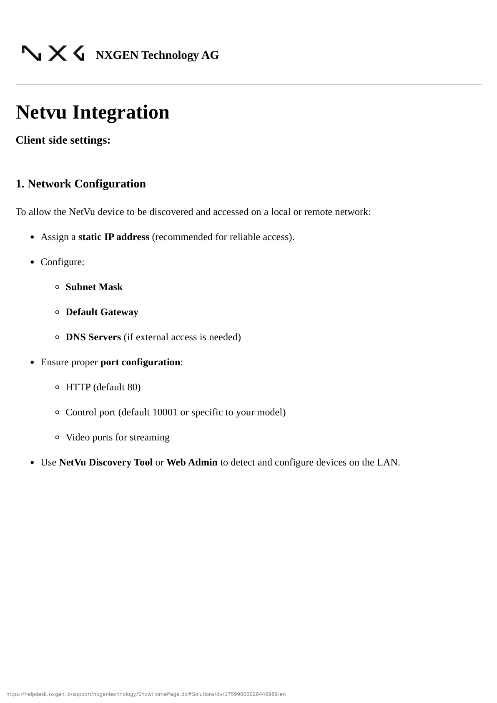
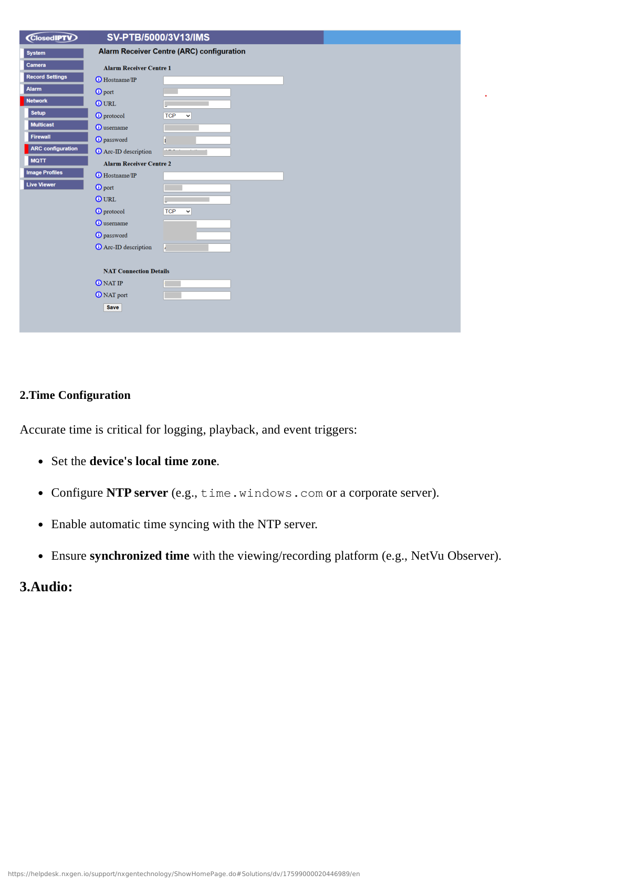
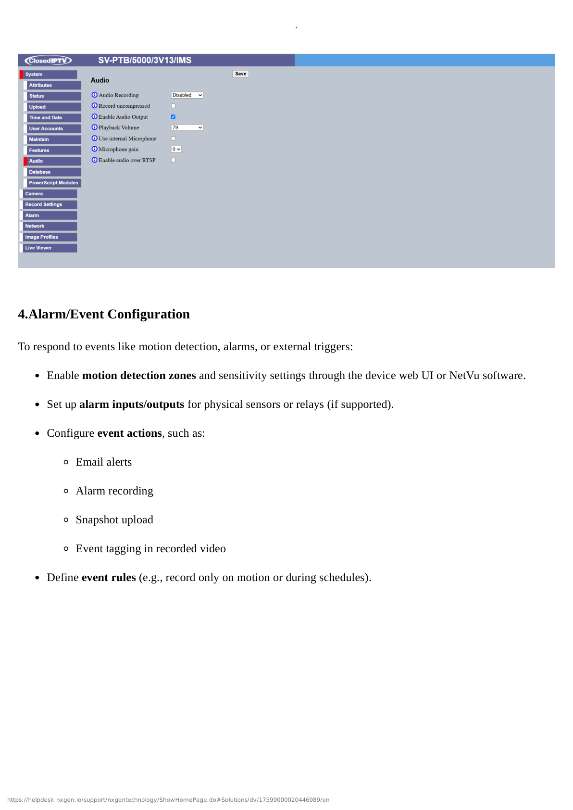
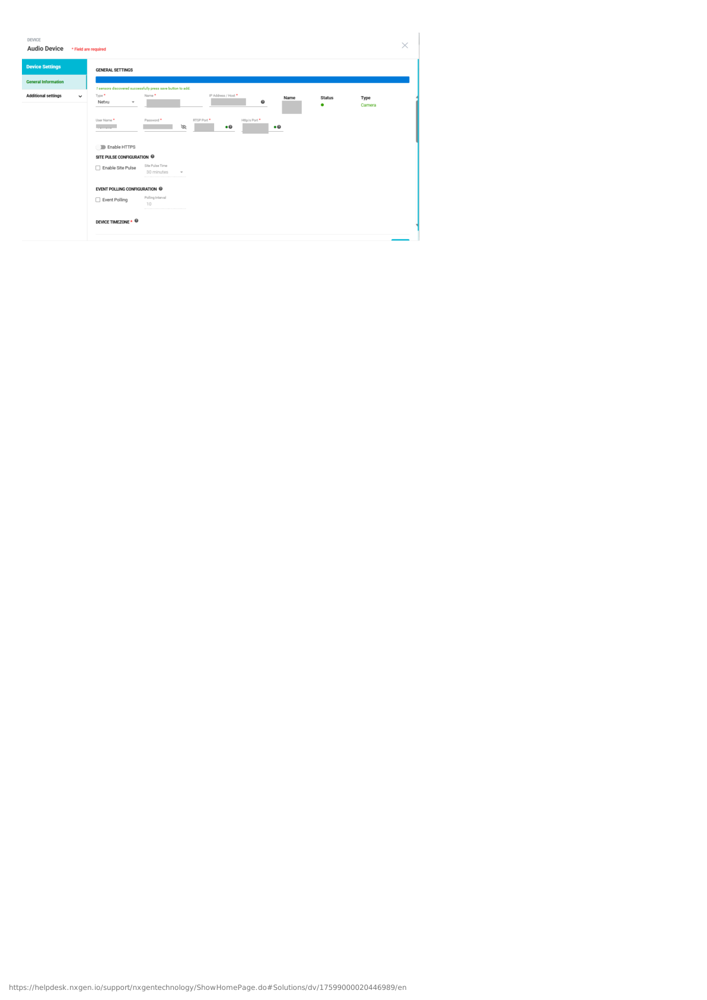

# NetVue IP Camera Configuration

## Overview

This guide covers the complete configuration of NetVue IP Camera integration with GCXONE, including camera setup, GCXONE platform integration, and audio configuration.

**What you'll accomplish:**
- Configure NetVue IP Camera in NetVue mobile app
- Gather camera credentials and connection information
- Add and register camera in GCXONE platform
- Configure dual audio capabilities (Genesis Audio SIP + Local SDK Audio)
- Set up event detection and notifications
- Verify successful integration and test all features

**Estimated time**: 20-30 minutes

## Prerequisites

Ensure you have completed the prerequisites listed in the [Overview](./overview.md):

- [ ] NetVue IP camera with active cloud subscription
- [ ] NetVue mobile app installed on smartphone
- [ ] Camera connected to network with internet access
- [ ] GCXONE account with device configuration permissions
- [ ] Camera credentials (username/password)
- [ ] Network connectivity between camera and GCXONE platform

---

## Configuration Workflow

The configuration process consists of 3 main parts:

1. **NetVue Camera Setup** - Configure camera in NetVue mobile app and gather credentials
2. **GCXONE Platform Setup** - Add camera in GCXONE and configure integration
3. **Verification** - Test live streaming, playback, timeline, audio, and events

---

## Part 1: NetVue Camera Setup

### Step 1: Install NetVue Mobile App and Add Camera

**UI Path**: Mobile Device → App Store/Play Store → NetVue App

**Objective**: Pre-configure the NetVue camera in the manufacturer's mobile app and verify cloud connectivity.

**Configuration Steps:**

1. Download and install **NetVue** mobile app from App Store (iOS) or Google Play (Android)
2. Launch the NetVue app and create an account (if new user)
3. Log in to your NetVue account
4. Tap **Add Device** or **+** icon
5. Follow on-screen instructions to add your camera:
   - Scan QR code on camera (or enter serial number manually)
   - Connect camera to Wi-Fi network
   - Wait for camera to come online in the app
6. Verify camera appears in device list and shows live video
7. Test basic functionality:
   - Live streaming works
   - Audio works (listen and speak)
   - Motion detection enabled
8. Note the camera **Serial Number** and **Device Name**

**Expected Result**: Camera successfully added to NetVue mobile app, showing live video and online status.

---

### Step 2: Configure Camera Network Settings

**UI Path**: NetVue App → Camera → Settings → Network

**Objective**: Verify camera network configuration and ensure stable internet connectivity.

**Configuration Steps:**

1. In NetVue mobile app, tap on your camera
2. Tap **Settings** icon (gear icon)
3. Navigate to **Network** settings
4. Verify network configuration:
   - **Connection Type**: Wi-Fi or Ethernet
   - **IP Address**: Note the camera's local IP address
   - **Signal Strength**: Should be Good or Excellent for Wi-Fi
   - **Internet Status**: Connected
5. Configure **Network Settings** if needed:
   - For Wi-Fi: Ensure camera is on stable 2.4GHz or 5GHz network
   - For Ethernet: Verify wired connection is active
6. Test internet connectivity by viewing live stream

**Expected Result**: Camera has stable network connectivity with good signal strength and active internet connection.

---

### Step 3: Gather Camera Credentials and Information

**UI Path**: NetVue App → Camera → Settings → Device Information

**Objective**: Collect all necessary credentials and information for GCXONE integration.

**Configuration Steps:**

1. In NetVue app, access camera **Settings** → **Device Information**
2. Record the following information (you'll need this for GCXONE):
   - **Device Name**: Camera identifier
   - **Serial Number**: Unique device ID (usually starts with "NV")
   - **Model**: Camera model number
   - **Firmware Version**: Current firmware version
3. Note camera credentials:
   - **Username**: Default is usually `admin` (check camera documentation)
   - **Password**: Device password (set during initial setup)
   - **Verification Code**: May be required for cloud access (found on camera label)
4. Verify camera is using latest firmware (update if needed)
5. Take a screenshot or write down all information for reference

**Expected Result**: All camera credentials and information documented for GCXONE integration.

---

## Part 2: GCXONE Platform Setup

### Step 4: Add NetVue Camera in GCXONE

**UI Path**: GCXONE Web Portal → Devices → Add Device

**Objective**: Register the NetVue IP Camera in the GCXONE platform.

**Configuration Steps:**

1. Log into the **GCXONE** web portal with admin credentials
2. Navigate to **Devices** → **Add Device**
3. Select device type:
   - **Type**: **IP Camera**
   - **Manufacturer**: **NetVue**
4. Enter camera information:
   - **Device Name**: Descriptive name (e.g., "Front Entrance - NetVue")
   - **Serial Number**: Camera serial number from Step 3
   - **IP Address/Hostname**: Camera IP address (from Step 2) or cloud hostname
   - **Port**: 443 (HTTPS) or default NetVue cloud port
   - **Username**: Camera username (usually `admin`)
   - **Password**: Camera password from Step 3
   - **Verification Code**: If required, enter code from camera label
   - **Time Zone**: Select appropriate time zone for camera location
5. Configure **Connection Settings**:
   - **Connection Method**: Cloud Integration (recommended)
   - **Protocol**: HTTPS
   - **Enable Cloud Streaming**: ✓ Checked
6. Click **Test Connection** to verify connectivity
7. If successful, click **Save** or **Add Device**
8. GCXONE will register the camera and establish cloud connection

**Expected Result**: NetVue camera successfully added to GCXONE and shows "Online" status.

---

### Step 5: Configure Audio Settings (Genesis Audio SIP + Local SDK Audio)

**UI Path**: GCXONE → Devices → NetVue Camera → Audio Configuration

**Objective**: Configure dual audio capabilities for two-way communication.

**Configuration Steps:**

1. In GCXONE, navigate to your newly added NetVue camera
2. Click **Audio Settings** or **Advanced Configuration**
3. Configure **Genesis Audio (SIP)**:
   - **Enable Genesis Audio**: ✓ Checked
   - **SIP Protocol**: Enabled
   - **Audio Codec**: G.711 (default) or preferred codec
   - **SIP Port**: 5060 (default)
   - **Audio Quality**: High (recommended for clear communication)
4. Configure **Local SDK Audio**:
   - **Enable Local SDK Audio**: ✓ Checked
   - **Audio Direction**: Two-way (bidirectional)
   - **Microphone Sensitivity**: Medium (adjust as needed)
   - **Speaker Volume**: 80% (adjust as needed)
5. Test audio configuration:
   - Click **Test Audio** button
   - Speak into microphone and verify audio transmission
   - Play test sound and verify speaker output
6. Click **Save Audio Configuration**

**Expected Result**: Both Genesis Audio (SIP) and Local SDK Audio configured and tested successfully.

---

### Step 6: Configure Events, Notifications, and Timeline

**UI Path**: GCXONE → Devices → NetVue Camera → Event Configuration

**Objective**: Set up event detection, notifications, and timeline features.

**Configuration Steps:**

1. Navigate to camera **Event Configuration** in GCXONE
2. Configure **Motion Detection Events**:
   - **Enable Motion Detection**: ✓ Checked
   - **Sensitivity**: Medium (adjust based on camera location)
   - **Detection Zones**: Configure specific areas (if supported)
   - **Event Recording**: ✓ Enable recording on motion
   - **Pre-Record**: 5 seconds
   - **Post-Record**: 30 seconds
3. Configure **Additional Events**:
   - **Audio Detection**: ✓ Enable if camera supports audio analytics
   - **PIR Sensor**: ✓ Enable if camera has PIR sensor
   - **Tampering Alert**: ✓ Enable for security
4. Configure **Event Notifications**:
   - **Push Notifications**: ✓ Enable for mobile app alerts
   - **Email Notifications**: ✓ Enable (enter email addresses)
   - **SMS Notifications**: ✓ Enable if required (enter phone numbers)
   - **Notification Schedule**: 24/7 or custom schedule
5. Configure **Timeline Features**:
   - **Enable Cloud Timeline**: ✓ Checked
   - **Enable Local Timeline**: ✓ Checked (with limitations)
   - **Timeline Density**: Medium (events per hour)
   - **Event Markers**: Motion, Audio, PIR
6. Configure **Timelapse** (optional):
   - **Enable Timelapse**: ✓ Checked
   - **Timelapse Interval**: 1 frame per minute (adjust as needed)
   - **Storage Location**: Cloud or Local
7. Click **Save Event Configuration**

**Expected Result**: Events configured, notifications enabled, and timeline features activated.

---

## Part 3: Verification and Testing

### Verification Checklist

After completing the configuration, verify the following:

**Live Streaming:**
- [ ] Cloud live streaming works from GCXONE web portal
- [ ] Cloud live streaming works from GCXONE mobile app
- [ ] Video quality is acceptable with minimal latency (less than 2s)
- [ ] Stream is stable without frequent disconnections

**Playback:**
- [ ] Cloud playback works with timeline navigation
- [ ] Can select specific time ranges for playback
- [ ] Video export works (download recorded clips)
- [ ] Playback speed controls work (1x, 2x, 4x)

**Audio:**
- [ ] Genesis Audio (SIP) works for two-way communication
- [ ] Local SDK Audio works as alternative audio method
- [ ] Audio quality is clear in both directions
- [ ] Can switch between Genesis Audio and Local SDK Audio

**Events:**
- [ ] Motion detection events trigger correctly
- [ ] Event notifications are received (push, email, SMS)
- [ ] Event video clips are recorded with pre/post record
- [ ] Timeline shows event markers accurately

**Timeline & Timelapse:**
- [ ] Cloud timeline displays events correctly
- [ ] Local timeline works (with noted limitations)
- [ ] Can navigate timeline by dragging or clicking events
- [ ] Timelapse creation works (if enabled)

**General:**
- [ ] Camera status shows "Online" in GCXONE
- [ ] Mobile app access works seamlessly
- [ ] No error messages in device logs
- [ ] Camera responds to configuration changes promptly

### Test Procedures

**Test 1: Live Streaming Test**

1. Open GCXONE web portal or mobile app
2. Navigate to NetVue camera
3. Click **Live View** to start streaming
4. Observe video stream and check latency
5. **Expected Result**: Live video appears within 2 seconds with good quality

**Test 2: Two-Way Audio Test**

1. While viewing live stream, click **Audio** icon
2. Select **Genesis Audio (SIP)** or **Local SDK Audio**
3. Speak into microphone and listen through camera speaker
4. Click **Listen** to hear audio from camera microphone
5. **Expected Result**: Clear two-way audio communication established

**Test 3: Motion Detection and Event Test**

1. Trigger motion in front of camera (wave hand or walk by)
2. Check GCXONE for event notification
3. Verify event appears in timeline with video clip
4. Check that notification was sent (push/email/SMS)
5. **Expected Result**: Event captured within 5 seconds with recording and notification

**Test 4: Playback and Timeline Test**

1. Navigate to camera timeline in GCXONE
2. Select a time range with recorded events
3. Click on event marker to jump to that moment
4. Test playback controls (play, pause, speed)
5. Export a video clip
6. **Expected Result**: Timeline displays events, playback works smoothly, export successful

---

## Advanced Configuration (Optional)

### Multi-Camera Management

**When to use**: Managing multiple NetVue cameras at the same site

**Configuration**:
1. Add each NetVue camera using Steps 4-6
2. Organize cameras by location using GCXONE site hierarchy
3. Create camera groups for batch configuration
4. Set up coordinated event rules (e.g., motion on Camera 1 triggers recording on Camera 2)
5. Configure unified notifications for all cameras

### Custom Event Rules

**When to use**: Creating advanced automation based on camera events

**Configuration**:
1. Navigate to **GCXONE** → **Automation** → **Rules**
2. Click **Create New Rule**
3. Configure trigger:
   - **Trigger**: NetVue motion detection event
   - **Condition**: Optional conditions (time of day, weekday/weekend)
4. Configure actions:
   - **Action 1**: Start recording on all cameras
   - **Action 2**: Send notification to security team
   - **Action 3**: Activate siren or output device
5. Save and enable rule

### Timelapse Optimization

**When to use**: Creating time-lapse videos for long-term monitoring

**Configuration**:
1. Navigate to camera **Timelapse Settings**
2. Configure optimal settings:
   - **Interval**: 1 frame per 30 seconds (for 24-hour into 2-minute video)
   - **Resolution**: 1080p (balance quality vs storage)
   - **Storage**: Cloud (for accessibility) or Local (for capacity)
   - **Schedule**: 24/7 or business hours only
3. Set retention policy (7-30 days)
4. Enable automatic timelapse generation

---

## Troubleshooting

If you encounter issues during configuration, see the [Troubleshooting Guide](./troubleshooting.md) for common problems and solutions.

**Quick troubleshooting:**
- **Camera not discovered**: Verify camera is online in NetVue app, check serial number and credentials
- **Connection fails**: Check internet connectivity, verify cloud subscription is active
- **No video**: Verify camera is online in NetVue app, check bandwidth and network quality
- **Audio not working**: Verify audio is enabled in NetVue app, test both Genesis Audio (SIP) and Local SDK Audio
- **No events**: Check motion detection is enabled in NetVue app and GCXONE, adjust sensitivity
- **Timeline not showing events**: Verify event recording is enabled, check storage availability

---

## Related Articles

- [NetVue IP Camera Overview](./overview.md)
- [NetVue IP Camera Troubleshooting](./troubleshooting.md)
- [Firewall Configuration](/docs/getting-started/firewall-configuration)
- [Required Ports](/docs/getting-started/required-ports)

---

**Need Help?**

If you need assistance with NetVue IP Camera configuration, [contact support](/docs/troubleshooting-support/how-to-submit-a-support-ticket).
