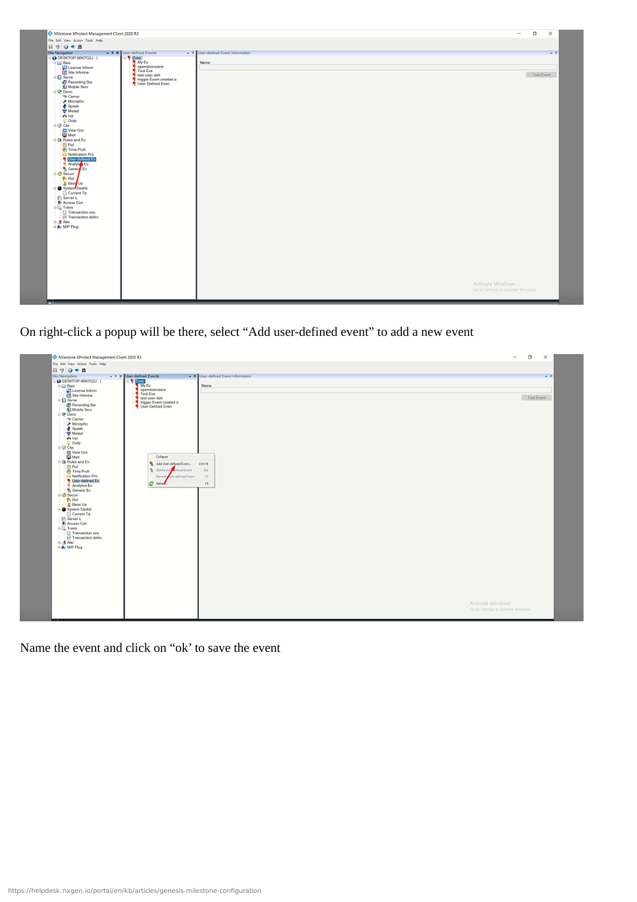

# NXG Cloud Vision Edge Configuration

## Overview

This simplified guide covers NXG Cloud Vision Edge setup with GCXONE using cloud-native zero-touch provisioning. As a pure cloud VMS, there is no on-premise server to install—simply create a cloud account, add cameras, and activate the integration.

**What you'll accomplish:**
- Create NXG Cloud Vision Edge cloud account
- Add IP cameras to cloud VMS
- Install optional edge devices for local processing
- Verify automatic cloud registration and discovery
- Activate integration profile with one click
- Test all pre-configured features

**Estimated time**: 10-15 minutes (cloud VMS, no hardware installation)

## Prerequisites

Ensure you have completed the prerequisites listed in the [Overview](./overview.md):

- [ ] NXG Cloud Vision Edge account (or ready to create subscription)
- [ ] IP cameras (ONVIF or manufacturer-specific protocol)
- [ ] Network connectivity with internet access for cameras
- [ ] GCXONE account with device configuration permissions
- [ ] Edge devices (optional, for local AI processing and storage)

---

## Configuration Workflow

The configuration process consists of 2 simplified parts (cloud-native zero-touch):

1. **Cloud VMS Setup** - Create account, add cameras, install edge devices (Steps 1-3)
2. **Automatic Cloud Integration** - VMS auto-registers, activate profile, verify (Steps 4-6)

---

## Part 1: Cloud VMS Setup

### Step 1: Create NXG Cloud Vision Edge Account

**UI Path**: Web Browser → https://cloudvision.nxgen.com (example)

**Objective**: Create cloud VMS account and access management dashboard.

**Configuration Steps:**

1. **Open web browser** and navigate to NXG Cloud Vision Edge portal
2. **Create Account** (or log in with existing credentials):
   - Enter email address
   - Create password (strong password required)
   - Select subscription plan (Basic, Professional, Enterprise)
   - Accept terms and conditions
3. **Verify Email**: Check email for verification link
4. **Complete Setup**: Log in to cloud dashboard
5. **Configure Account Settings**:
   - Organization name
   - Time zone
   - Language preference
   - Notification settings

**Expected Result**: Cloud VMS account created, dashboard accessible.

---

### Step 2: Add IP Cameras to Cloud VMS

**UI Path**: Cloud Dashboard → Cameras → Add Camera

**Objective**: Add IP cameras to cloud VMS for monitoring and recording.

**Configuration Steps:**

1. In cloud dashboard, navigate to **Cameras** → **Add Camera**
2. **Auto-Discovery Method** (Recommended):
   - Click **Auto-Discover Cameras**
   - Cloud VMS scans network for ONVIF-compatible cameras
   - Select cameras from discovered list
   - Enter camera credentials (username/password)
   - Click **Add Selected Cameras**
3. **Manual Method** (Alternative):
   - Click **Add Manually**
   - Enter camera details:
     - **Camera Name**: Descriptive name (e.g., "Front Entrance")
     - **IP Address**: Camera IP address
     - **Port**: RTSP port (default 554)
     - **Protocol**: ONVIF, RTSP, or manufacturer-specific
     - **Username**: Camera admin username
     - **Password**: Camera admin password
   - Click **Test Connection**
   - Click **Add Camera**
4. **Repeat for all cameras** at the site
5. **Verify Camera Status**: All cameras show "Online" in dashboard

**Expected Result**: All cameras added to cloud VMS and showing "Online" status.

---

### Step 3: Install Edge Devices (Optional)

**UI Path**: Physical Installation + Cloud Dashboard → Edge Devices

**Objective**: Install edge devices at site for local AI processing and storage (optional but recommended).

**Installation Steps:**

1. **Physical Installation**:
   - Unbox NXG Edge Device
   - Connect edge device to network via Ethernet
   - Connect power adapter
   - Wait 2-3 minutes for device to boot
2. **Register Edge Device in Cloud**:
   - In cloud dashboard, navigate to **Edge Devices** → **Add Edge Device**
   - Enter **Device Serial Number** (found on device label)
   - Enter **Activation Code** (included with device)
   - Click **Activate**
3. **Assign Cameras to Edge Device**:
   - Select edge device from list
   - Click **Assign Cameras**
   - Select cameras to process locally
   - Configure **Edge Features**:
     - ✓ Local AI analytics
     - ✓ Local recording (backup)
     - ✓ Bandwidth optimization
   - Click **Save**
4. **Verify Edge Device Status**: Shows "Online" and processing cameras

**Expected Result**: Edge device online, cameras assigned, local processing active.

**Note**: Edge devices are optional. Cameras can operate purely cloud-based without edge devices.

---

## Part 2: Automatic Cloud Integration

### Step 4: Verify Automatic Discovery in GCXONE

**UI Path**: GCXONE Web Portal → Devices → Discovered Devices

**Objective**: Verify NXG Cloud Vision Edge appears automatically in GCXONE.

**Verification Steps:**

1. Log into **GCXONE** web portal with admin credentials
2. Navigate to **Devices** → **Discovered Devices** or **Dashboard**
3. Wait 30-60 seconds for cloud VMS to appear in discovered devices list
4. Locate your NXG Cloud Vision Edge in the list:
   - **Device Name**: NXG Cloud Vision Edge + account name (auto-detected)
   - **Status**: "Pending Activation" or "Ready"
   - **Cameras**: Number of cameras detected
5. Click on the VMS entry to view details

**Expected Result**: NXG Cloud Vision Edge appears automatically in GCXONE with all cameras detected.

**Troubleshooting**: If VMS doesn't appear after 2 minutes:
- Verify GCXONE integration enabled in cloud VMS settings
- Verify cloud VMS account linked to GCXONE organization
- Refresh GCXONE page
- Check cloud VMS dashboard for connection status

---

### Step 5: Activate Integration Profile (One-Click Setup)

**UI Path**: GCXONE → Devices → NXG Cloud Vision Edge → Activate

**Objective**: Activate integration profile to enable all features automatically.

**Activation Steps:**

1. Click on your NXG Cloud Vision Edge in GCXONE device list
2. Click **Activate** or **Configure Integration**
3. Select **Integration Profile**:
   - **Basic Profile**: Essential features (live streaming, playback, events) - Good for basic deployments
   - **Basic+ Profile**: Enhanced features (event management, notifications, arm/disarm) - Recommended for most deployments
   - **Advanced Profile**: Full features (edge AI analytics, advanced automation, timelapse) - Best for comprehensive security
4. Click **Activate Profile**
5. Wait 10-30 seconds for activation to complete
6. All features are automatically configured based on selected profile:
   - ✓ Cloud streaming enabled
   - ✓ Local streaming enabled (via edge devices)
   - ✓ Event forwarding enabled
   - ✓ Notifications configured
   - ✓ Genesis Audio (SIP) enabled
   - ✓ PTZ control enabled (if PTZ cameras present)
   - ✓ Cloud polling enabled
   - ✓ Timeline enabled
   - ✓ Edge AI analytics enabled (Advanced profile)

**Expected Result**: Integration profile activated, all features auto-configured, VMS status shows "Online".

---

### Step 6: Verify Camera and Feature Configuration

**UI Path**: GCXONE → Devices → NXG Cloud Vision Edge → Cameras / Settings

**Objective**: Verify all cameras and features are auto-configured correctly.

**Verification Steps:**

1. Navigate to **Cameras** tab in NXG Cloud Vision Edge device page
2. Verify all cameras are listed:
   - Camera name (auto-generated from cloud VMS)
   - Status: "Online"
   - Cloud streaming: ✓ Enabled
   - Local streaming: ✓ Enabled (if edge device present)
   - Timeline: ✓ Enabled
3. **Optional**: Customize camera settings:
   - Rename cameras to descriptive names
   - Assign cameras to site/location hierarchy
   - Adjust stream quality (Auto recommended)
   - Configure privacy masks if needed
4. Verify **Event Configuration** (auto-configured):
   - Motion detection: ✓ Enabled
   - Event notifications: ✓ Enabled (push, email)
   - Event recording: ✓ Enabled
   - Edge AI analytics: ✓ Enabled (Advanced profile)
5. Verify **Advanced Features** (based on profile):
   - Genesis Audio (SIP): ✓ Enabled
   - PTZ control: ✓ Enabled (if PTZ cameras)
   - Edge AI analytics: ✓ Enabled (Advanced profile)
   - Timelapse: ○ Enable if required
6. Click **Save** if any customizations made

**Expected Result**: All cameras online, features auto-configured per selected profile.

---

## Verification and Testing

### Quick Verification Checklist

**Immediate Tests (Less than 2 minutes):**
- [ ] All cameras show "Online" status in GCXONE
- [ ] Live streaming works (click any camera to view)
- [ ] Cloud VMS status shows "Online" in GCXONE
- [ ] Timeline appears with event markers

**Comprehensive Tests (5-10 minutes):**
- [ ] **Live Streaming**: Cloud live streaming works for all cameras
- [ ] **Playback**: Cloud playback works with timeline navigation
- [ ] **Events**: Motion detection events appear in timeline
- [ ] **Notifications**: Push notifications received on mobile app (trigger motion)
- [ ] **Audio**: Genesis Audio (SIP) two-way communication works (if configured)
- [ ] **PTZ**: PTZ controls work for PTZ cameras (if present)
- [ ] **Local Streaming**: Edge-local streaming works when on same network (if edge device present)
- [ ] **Edge AI**: AI analytics events appear in timeline (Advanced profile)
- [ ] **Mobile App**: Access cloud VMS and cameras via GCXONE mobile app

---

## Advanced Configuration (Optional)

### Customizing Auto-Configured Settings

While NXG Cloud Vision Edge auto-configures all settings, you can optionally customize:

**Camera Organization:**
1. Navigate to **Cameras** tab
2. Click camera to rename
3. Assign to site/location hierarchy
4. Group cameras by zone/area

**Event Notification Rules:**
1. Navigate to **Event Configuration**
2. Customize notification schedule (24/7 or custom hours)
3. Add additional notification recipients
4. Configure event-specific actions

**Edge AI Analytics (Advanced Profile):**
1. Navigate to cloud VMS dashboard (not GCXONE)
2. Select **Analytics** settings
3. Enable specific analytics per camera:
   - Person detection
   - Vehicle detection
   - Line crossing
   - Loitering detection
   - Crowd detection
4. Configure analytics zones for each camera
5. Set analytics sensitivity
6. Verify analytics events forward to GCXONE

**Multi-Site Management:**
1. Create additional cloud VMS accounts for other sites
2. Each site auto-registers with GCXONE
3. Organize by site hierarchy in GCXONE
4. Configure site-specific integration profiles

---

## Troubleshooting

See the [Troubleshooting Guide](./troubleshooting.md) for common problems and solutions.

**Quick troubleshooting:**
- **VMS not discovered**: Verify GCXONE integration enabled in cloud VMS settings
- **Cameras not detected**: Verify cameras added and online in cloud VMS dashboard
- **No video**: Verify cameras are powered on and connected to network
- **Activation fails**: Refresh GCXONE page, verify GCXONE account permissions
- **Events not appearing**: Wait 5 minutes for initial event sync, trigger motion to test
- **Edge device offline**: Check network connectivity, verify device powered on

---

## Why NXG Cloud Vision Edge is Different

Traditional VMS setup vs. NXG Cloud Vision Edge:

| Task | Traditional VMS | NXG Cloud Vision Edge |
|------|----------------|------------------------|
| **Server Installation** | Install Windows/Linux server, VMS software | No server required (cloud-native) |
| **Network Configuration** | Manual IP, port forwarding, DDNS | Automatic (cloud-based) |
| **Camera Setup** | Manual IP entry, firewall rules | Auto-discovery or simple manual entry |
| **GCXONE Integration** | Manual device addition, credentials | Automatic discovery |
| **Feature Configuration** | Step-by-step manual configuration | One-click profile activation |
| **Edge Processing** | Not available (centralized only) | Optional edge devices for distributed AI |
| **Scalability** | Limited by server hardware | Unlimited (cloud infrastructure) |
| **Firmware Updates** | Manual download and installation | Automatic cloud updates |
| **Total Setup Time** | 60-120 minutes | 10-15 minutes |

---

## Related Articles

- [NXG Cloud Vision Edge Overview](./overview.md)
- [NXG Cloud Vision Edge Troubleshooting](./troubleshooting.md)
- [Firewall Configuration](/docs/getting-started/firewall-configuration)
- [Required Ports](/docs/getting-started/required-ports)

---

**Need Help?**

If you need assistance with NXG Cloud Vision Edge, [contact support](/docs/troubleshooting-support/how-to-submit-a-support-ticket). Most issues resolve automatically within 5 minutes of setup.
