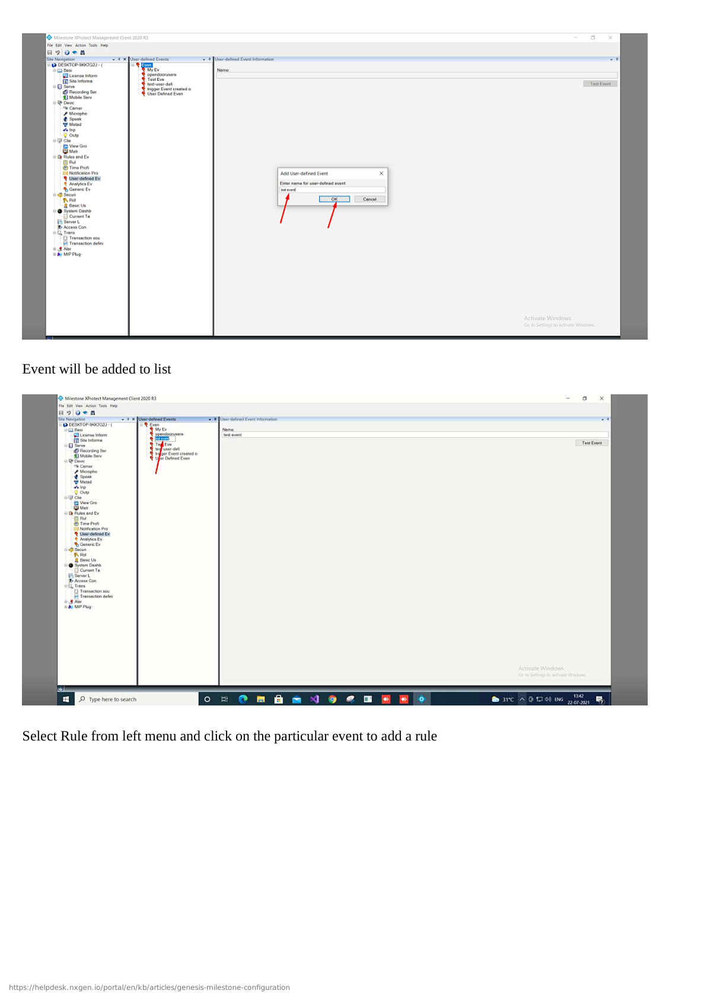
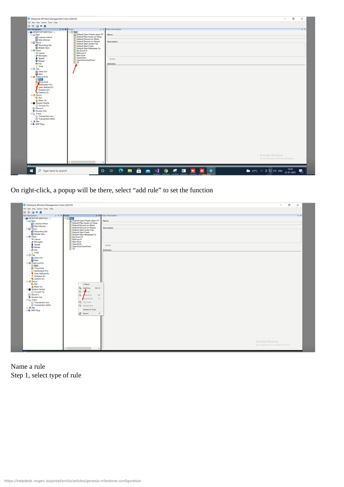

# NXWitness VMS Configuration

## Overview

This guide covers the complete configuration of Nx Witness VMS integration with GCXONE, including server setup, cloud service configuration, and GCXONE platform integration.

**What you'll accomplish:**
- Configure Nx Witness Server network and cloud settings
- Enable Nx Cloud service for GCXONE integration
- Create integration user with appropriate permissions
- Add Nx Witness server to GCXONE platform
- Configure cameras, events, and advanced features
- Verify successful integration and test all features

**Estimated time**: 45-60 minutes

## Prerequisites

Ensure you have completed the prerequisites listed in the [Overview](./overview.md):

- [ ] Nx Witness VMS 5.0 or higher installed on server
- [ ] Administrative access to Nx Witness Desktop Client
- [ ] Network connectivity established between server and GCXONE
- [ ] GCXONE account with device configuration permissions
- [ ] Static IP or DDNS configured for Nx Witness server
- [ ] Cameras configured and recording in Nx Witness

---

## Configuration Workflow

The configuration process consists of 3 main parts:

1. **Nx Witness Server Configuration** - Configure network, cloud service, users, and cameras (Steps 1-5)
2. **GCXONE Platform Setup** - Add Nx Witness to GCXONE and configure integration (Steps 6-8)
3. **Verification** - Test live streaming, playback, timeline, events, and PTZ features

---

## Part 1: Nx Witness Server Configuration

### Step 1: Access Nx Witness Desktop Client

**UI Path**: Desktop → Nx Witness Desktop Client

**Objective**: Access Nx Witness Desktop Client to begin server configuration.

**Configuration Steps:**

1. Launch **Nx Witness Desktop Client** on Windows, macOS, or Linux
2. Connect to your Nx Witness server:
   - Enter **Server Address** (IP or hostname)
   - Enter **Username** (administrator credentials)
   - Enter **Password**
   - Click **Connect**
3. Verify server version is 5.0 or higher (check in System Administration)
4. Check that cameras are discovered and recording

**Expected Result**: Successfully connected to Nx Witness server with admin access.

---

### Step 2: Configure Server Network Settings

**UI Path**: Desktop Client → System Administration → General

**Objective**: Configure server network settings for GCXONE integration.

**Configuration Steps:**

1. In Desktop Client, right-click on **System Administration** in the left panel
2. Select **General** settings
3. Configure **Server Settings**:
   - **Server Name**: Descriptive name (e.g., "Site A Nx Witness")
   - **Server URL**: Verify external IP or DDNS hostname
   - **Port**: 7001 (default HTTPS) - note for GCXONE setup
4. Configure **Network** settings:
   - Verify server has stable network connectivity
   - Note server IP address for GCXONE integration
5. Click **Apply** to save settings

**Expected Result**: Server network configured with accessible IP/hostname.

---

### Step 3: Enable and Configure Nx Cloud Service

**UI Path**: System Administration → Cloud → Settings

**Objective**: Enable Nx Cloud service for GCXONE cloud integration.

**Configuration Steps:**

1. Navigate to **System Administration** → **Cloud**
2. Click **Connect to Cloud** or **Enable Cloud Service**
3. Configure **Cloud Settings**:
   - **Cloud Account**: Sign in with Nx Cloud account (or create new)
   - **System Name**: Descriptive name for cloud access
   - **Cloud Relay**: ✓ Enable for cloud streaming
4. Configure **Cloud Permissions**:
   - **Allow Cloud Access**: ✓ Enabled
   - **Cloud Streaming**: ✓ Enabled
   - **Cloud Playback**: ✓ Enabled
5. Click **Save** and verify cloud connection status shows "Connected"

**Expected Result**: Nx Cloud service enabled and connected successfully.

---

### Step 4: Create Integration User Account

**UI Path**: System Administration → Users

**Objective**: Create dedicated user account for GCXONE integration with full permissions.

**Configuration Steps:**

1. Navigate to **System Administration** → **Users**
2. Click **Add User** or **+** icon
3. Configure the integration user:
   - **Username**: `gcxone_integration` (or preferred name)
   - **Password**: Create strong password (save for GCXONE setup)
   - **User Type**: **Administrator** or **Power User**
   - **Email**: Optional notification email
4. Configure **Permissions** (ensure all are enabled):
   - ✓ Live View
   - ✓ Playback
   - ✓ Export Video
   - ✓ PTZ Control
   - ✓ Event Management
   - ✓ Edit Cameras
   - ✓ System Administration (for SDK access)
5. Click **OK** to create the user

**Expected Result**: Integration user created with full administrative permissions.

---

### Step 5: Configure Cameras and Recording Settings

**UI Path**: Desktop Client → Cameras / Recording Schedule

**Objective**: Verify cameras are configured correctly for GCXONE integration.

**Configuration Steps:**

1. In Desktop Client, view **Cameras** list in left panel
2. For each camera, verify:
   - Camera is **Online** and streaming
   - **Recording Schedule** is configured (continuous or motion-based)
   - **Motion Detection** is enabled if required
   - **Stream Quality** is appropriate (primary and secondary streams)
3. Configure **Recording Settings**:
   - Navigate to **System Administration** → **Recording**
   - Set **Retention Period**: 7-30 days (or as required)
   - Enable **Pre-Recording**: 5-10 seconds
   - Configure **Storage** location and available space
4. Verify **PTZ Cameras** (if applicable):
   - Test PTZ controls (pan, tilt, zoom)
   - Configure PTZ presets if needed
5. Click **Apply** to save all settings

**Expected Result**: All cameras online, recording, and properly configured.

---

## Part 2: GCXONE Platform Setup

### Step 6: Add Nx Witness Server in GCXONE

**UI Path**: GCXONE Web Portal → Devices → Add Device

**Objective**: Register the Nx Witness server in the GCXONE platform.

**Configuration Steps:**

1. Log into the **GCXONE** web portal with admin credentials
2. Navigate to **Devices** → **Add Device**
3. Select device type:
   - **Type**: **VMS**
   - **Manufacturer**: **Network Optix / Nx Witness**
4. Enter server details:
   - **Device Name**: Descriptive name (e.g., "Site A - Nx Witness VMS")
   - **IP Address/Hostname**: Server IP or DDNS hostname (from Step 2)
   - **Port**: 7001 (default) or custom port
   - **Username**: Integration user from Step 4 (`gcxone_integration`)
   - **Password**: Password for integration user
   - **Protocol**: HTTPS
   - **Time Zone**: Select appropriate time zone
5. Configure **Integration Profile**:
   - **Basic Profile**: Essential features only
   - **Basic+ Profile**: Enhanced with event management
   - **Advanced Profile**: Full feature set (recommended)
6. Click **Test Connection** to verify connectivity
7. If successful, click **Add Device** to register in GCXONE
8. GCXONE will discover all cameras from Nx Witness server

**Expected Result**: Nx Witness server successfully added and shows "Online" status in GCXONE.

---

### Step 7: Configure Camera Mappings and Streaming

**UI Path**: GCXONE → Devices → Nx Witness → Camera Configuration

**Objective**: Map cameras, configure streaming modes, and enable timeline features.

**Configuration Steps:**

1. In GCXONE, navigate to the newly added Nx Witness server
2. Click **Configure Cameras** or **Camera Management**
3. For each camera:
   - Verify camera name and assign to site/location
   - Enable **Cloud Streaming**: ✓ Checked (for remote access)
   - Enable **Local Streaming**: ✓ Checked (for on-site access)
   - Enable **Event Forwarding**: ✓ Checked (to forward events to GCXONE)
   - Configure **Stream Quality**: Auto, High, Medium, or Low
   - Enable **Timeline**: ✓ Checked (for event navigation)
4. Configure **Advanced Camera Settings**:
   - **Audio**: Enable if cameras support audio
   - **PTZ Settings**: Configure PTZ presets (if applicable)
   - **Privacy Masks**: Configure if required
5. Click **Save Configuration**

**Expected Result**: All cameras mapped with cloud and local streaming enabled.

---

### Step 8: Configure Events, Notifications, and Integration Profiles

**UI Path**: GCXONE → Devices → Nx Witness → Event Configuration

**Objective**: Set up event forwarding, notifications, and configure integration profile features.

**Configuration Steps:**

1. Navigate to Nx Witness **Event Configuration** in GCXONE
2. Configure **Event Forwarding**:
   - **Motion Detection**: ✓ Enable forwarding
   - **Analytics Events**: ✓ Enable (if using Nx Analytics)
   - **Camera Disconnection**: ✓ Enable
   - **System Events**: ✓ Enable (storage full, errors)
   - **I/O Triggers**: ✓ Enable (if using I/O devices)
3. Configure **Event Notifications**:
   - **Push Notifications**: ✓ Enable for mobile app alerts
   - **Email Notifications**: ✓ Enable (enter email addresses)
   - **SMS Notifications**: ✓ Enable if required
   - **Notification Schedule**: 24/7 or custom schedule
4. Configure **Integration Profile Features**:
   - **Cloud Polling**: ✓ Enable (for status monitoring)
   - **Genesis Audio (SIP)**: ✓ Enable (for two-way communication)
   - **Clip Export**: ✓ Enable (for manual video export)
   - **Timelapse**: ✓ Enable if required (partial support)
5. Configure **Event Actions**:
   - Set recording triggers
   - Configure automation rules
   - Set event retention period
6. Click **Save Event Configuration**

**Expected Result**: Events forwarded, notifications configured, and integration profile features enabled.

---

## Part 3: Verification and Testing

### Verification Checklist

Test all core functions before completing configuration:

**Live Streaming:**
- [ ] Cloud live streaming works for all cameras
- [ ] Local live streaming works (when on same network)
- [ ] Stream quality is acceptable with minimal latency
- [ ] Multiple concurrent streams work
- [ ] Audio works (if cameras support audio)

**Playback and Timeline:**
- [ ] Cloud playback works with timeline navigation
- [ ] Local playback works (when on same network)
- [ ] Timeline shows event markers correctly
- [ ] Can jump to specific events on timeline
- [ ] Playback speed controls work (1x, 2x, 4x, etc.)
- [ ] Video export/clip download works

**Events:**
- [ ] Motion detection events are forwarded to GCXONE
- [ ] Event notifications are sent correctly (push, email, SMS)
- [ ] Event video clips are recorded
- [ ] Arm/Disarm functions work
- [ ] System events are properly reported

**PTZ Control (if applicable):**
- [ ] Cloud PTZ controls work (pan, tilt, zoom)
- [ ] Local PTZ control works
- [ ] PTZ presets can be saved and recalled
- [ ] PTZ tours work (if configured)

**General:**
- [ ] Device status shows "Online" in GCXONE
- [ ] Mobile app access works
- [ ] No error messages in device logs
- [ ] Cloud polling status is active

---

## Advanced Configuration

### Multi-Server Federation

For deploying multiple Nx Witness servers:

1. Configure each server independently in Nx Witness
2. Add each server as separate device in GCXONE
3. Organize cameras by site hierarchy in GCXONE
4. Configure cross-server event rules if needed
5. Set up role-based access per server/site

### Nx Analytics Integration

To integrate Nx Analytics or third-party plugins:

1. Install analytics plugins in Nx Witness Desktop Client
2. Configure analytics rules in Nx Witness (motion, line crossing, loitering, etc.)
3. Enable analytics event forwarding in GCXONE
4. Configure GCXONE automation rules based on analytics events
5. Test analytics detection and event flow

### PTZ Preset and Tour Configuration

For cameras with PTZ capabilities:

1. In Nx Witness Desktop Client, navigate to PTZ camera
2. Use PTZ controls to position camera at key locations
3. Click **Set Preset** and name it (e.g., "Entrance", "Parking Lot")
4. Create PTZ tours (automatic preset sequences):
   - Configure tour dwell time at each preset
   - Set tour schedule (continuous or time-based)
5. Verify presets are accessible in GCXONE interface

---

## Troubleshooting

If you encounter issues during configuration, see the [Troubleshooting Guide](./troubleshooting.md) for common problems and solutions.

**Quick troubleshooting:**
- **Server not discovered**: Verify IP address, port 7001, and credentials
- **Connection fails**: Check firewall rules allow port 7001 and 443
- **No video**: Verify cameras are online in Nx Witness Desktop Client
- **Poor video quality**: Check network bandwidth and camera bitrate settings
- **No events**: Verify event detection enabled in Nx Witness and GCXONE
- **Cloud connection fails**: Check Nx Cloud service is enabled and connected
- **PTZ not working**: Verify PTZ cameras are properly configured in Nx Witness
- **Timeline not showing events**: Verify event recording is enabled

---

## Related Articles

- [NXWitness VMS Overview](./overview.md)
- [NXWitness VMS Troubleshooting](./troubleshooting.md)
- 
- 

---

**Need Help?**

If you need assistance with Nx Witness VMS configuration, [contact support](/docs/support/contact).
