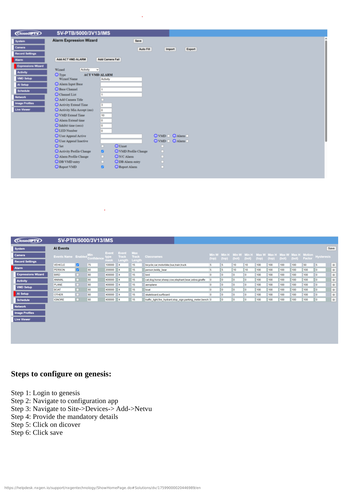

# SPYKEBOX NVR Configuration

## Overview

This guide covers the configuration of SPYKEBOX NVR integration with GCXONE, including network setup, device configuration, and GCXONE platform integration leveraging Hikvision SDK compatibility.

**What you'll accomplish:**
- Configure SPYKEBOX NVR network and system settings
- Create integration user with appropriate permissions
- Add SPYKEBOX NVR to GCXONE platform
- Configure cameras, events, and streaming settings
- Verify successful integration and test all features

**Estimated time**: 30-40 minutes

## Prerequisites

Ensure you have completed the prerequisites listed in the [Overview](./overview.md):

- [ ] SPYKEBOX NVR with latest firmware
- [ ] Admin access to SPYKEBOX NVR web interface
- [ ] Network connectivity between NVR and GCXONE
- [ ] GCXONE account with device configuration permissions
- [ ] Static IP or DDNS configured for NVR
- [ ] Cameras configured and recording in SPYKEBOX NVR

---

## Configuration Workflow

The configuration process consists of 3 main parts:

1. **NVR System Configuration** - Configure network, users, cameras, and recording (Steps 1-4)
2. **GCXONE Platform Setup** - Add NVR to GCXONE, configure integration (Steps 5-7)
3. **Verification** - Test live streaming, playback, timeline, events, PTZ features

---

## Part 1: SPYKEBOX NVR System Configuration

### Step 1: Access SPYKEBOX NVR Web Interface

**UI Path**: Web Browser → http://[NVR-IP] or https://[NVR-IP]

**Objective**: Access NVR web interface to begin configuration.

**Configuration Steps:**

1. **Open web browser** and navigate to NVR IP address:
   - HTTP: `http://192.168.1.64` (example)
   - HTTPS: `https://192.168.1.64` (preferred)
2. **Log in** with admin credentials:
   - Default username: `admin`
   - Password: Set during initial setup
   - (Change default password if not already done)
3. **Accept security certificate** (if using HTTPS)
4. Verify firmware version is up to date
5. Check camera list to ensure all cameras are online

**Expected Result**: Successfully logged into SPYKEBOX NVR web interface with admin access.

---

### Step 2: Configure Network Settings

**UI Path**: Configuration → Network → Basic Settings

**Objective**: Configure network settings for GCXONE integration.

**Configuration Steps:**

1. Navigate to **Configuration** → **Network** → **Basic Settings**
2. Configure **NVR Network Settings**:
   - **NIC Type**: Static IP (recommended) or DHCP
   - **IPv4 Address**: 192.168.1.64 (example - use static IP)
   - **Subnet Mask**: 255.255.255.0
   - **Default Gateway**: 192.168.1.1
   - **Preferred DNS Server**: 8.8.8.8 or local DNS
   - **Alternate DNS Server**: 8.8.4.4
3. Configure **Platform Access** (if available):
   - **Enable Platform Access**: ✓ Checked (for cloud integration)
   - **Server Address**: Auto or GCXONE server
4. Verify **HTTP Port** and **HTTPS Port**:
   - HTTP Port: 80 (default)
   - HTTPS Port: 443 (default)
   - SDK Port: 8000 (default)
5. Click **Save** to apply settings
6. Test connectivity by pinging NVR from another device

**Expected Result**: NVR has static IP, accessible via HTTP/HTTPS, and has internet connectivity.

:::info Hikvision SDK Compatibility
**SPYKEBOX uses Hikvision's SDK** for device communication, providing:
- **Proven reliability**: Hikvision SDK is battle-tested across millions of deployments
- **Feature compatibility**: Most Hikvision features work seamlessly with SPYKEBOX
- **Configuration similarity**: SPYKEBOX interface closely resembles Hikvision NVRs

**Integration Notes:**
- Use **Hikvision** protocol when adding to GCXONE (not generic ONVIF)
- Hikvision SDK port 8000 must be accessible
- Refer to [Hikvision documentation](/docs/devices/hikvision) for advanced feature configuration

**Compatibility**: If you've configured Hikvision NVRs before, SPYKEBOX configuration will be very familiar.
:::

---

### Step 3: Create Integration User Account

**UI Path**: Configuration → System → User Management

**Objective**: Create dedicated user for GCXONE integration with full permissions.

**Configuration Steps:**

1. Navigate to **Configuration** → **System** → **User Management**
2. Click **Add** to create new user
3. Configure the integration user:
   - **User Name**: `gcxone_integration`
   - **Password**: Create strong password (save for GCXONE setup)
   - **Confirm Password**: Re-enter password
   - **Level**: **Administrator** or **Operator** (Administrator recommended)
   - **User Type**: Normal User
4. Configure **Permissions** (ensure all are enabled):
   - ✓ Local Configuration
   - ✓ Remote Configuration
   - ✓ Remote Playback
   - ✓ Remote Live View
   - ✓ Remote PTZ Control
   - ✓ Two-Way Audio
   - ✓ Remote Alarm Control
   - ✓ Remote Parameters Inquiry
5. Configure **Camera Permissions**:
   - Select **All Cameras** or specific cameras
   - Enable all permissions for selected cameras
6. Click **OK** to create the user

**Expected Result**: Integration user created with full administrative permissions for all cameras.

---

### Step 4: Configure Cameras and Recording Settings

**UI Path**: Configuration → Camera / Storage → Schedule

**Objective**: Verify cameras and recording are configured correctly for GCXONE integration.

**Configuration Steps:**

1. Navigate to **Configuration** → **Camera**
2. For each camera, verify:
   - **Camera Name**: Descriptive name (e.g., "Front Entrance")
   - **Status**: Online
   - **Main Stream**: H.265 or H.264, 1080p or higher
   - **Sub Stream**: H.264, lower resolution for mobile
3. Navigate to **Configuration** → **Storage** → **Recording Schedule**
4. Configure **Recording Schedule** for all cameras:
   - **Enable Schedule**: ✓ Checked
   - **Recording Type**: Continuous + Motion (recommended)
   - **All Day Recording**: ✓ Checked (or configure custom schedule)
5. Configure **Motion Detection** (if not already enabled):
   - Navigate to **Configuration** → **Event** → **Motion Detection**
   - **Enable Motion Detection**: ✓ Checked
   - Configure detection areas and sensitivity
6. Verify **Storage** status:
   - Navigate to **Configuration** → **Storage** → **Storage Management**
   - Check disk status and available space
7. Click **Save** to apply settings

**Expected Result**: All cameras online, recording continuously or on motion, motion detection enabled.

---

## Part 2: GCXONE Platform Setup

### Step 5: Add SPYKEBOX NVR in GCXONE

**UI Path**: GCXONE Web Portal → Devices → Add Device

**Objective**: Register SPYKEBOX NVR in GCXONE platform.

**Configuration Steps:**

1. Log into **GCXONE** web portal with admin credentials
2. Navigate to **Devices** → **Add Device**
3. Select device type:
   - **Type**: **NVR**
   - **Manufacturer**: **SPYKEBOX** or **Hikvision** (SDK-compatible)
4. Enter NVR details:
   - **Device Name**: Descriptive name (e.g., "Site A - SPYKEBOX NVR")
   - **IP Address/Hostname**: NVR IP from Step 2 (e.g., 192.168.1.64)
   - **Port**: 8000 (SDK port) or 80/443 for HTTP/HTTPS
   - **Username**: Integration user from Step 3 (`gcxone_integration`)
   - **Password**: Password for integration user
   - **Protocol**: SDK/ISAPI (default for Hikvision-based)
   - **Time Zone**: Select appropriate time zone
5. Configure **Integration Profile**:
   - **Basic Profile**: Essential features only
   - **Basic+ Profile**: Enhanced with event management
   - **Advanced Profile**: Full feature set with analytics (recommended)
6. Click **Test Connection** to verify connectivity
7. If successful, click **Add Device** to register in GCXONE
8. GCXONE will discover all cameras from SPYKEBOX NVR (may take 30-60 seconds)

**Expected Result**: SPYKEBOX NVR successfully added and shows "Online" status in GCXONE with all cameras discovered.

---

### Step 6: Configure Camera Mappings and Streaming

**UI Path**: GCXONE → Devices → SPYKEBOX NVR → Camera Configuration

**Objective**: Map cameras, configure streaming modes, enable timeline features.

**Configuration Steps:**

1. In GCXONE, navigate to newly added SPYKEBOX NVR device
2. Click **Configure Cameras** or **Camera Management**
3. For each camera:
   - Verify camera name matches NVR configuration
   - Assign to site/location in hierarchy
   - Enable **Cloud Streaming**: ✓ Checked (for remote access)
   - Enable **Local Streaming**: ✓ Checked (for on-site access)
   - Enable **Event Forwarding**: ✓ Checked
   - Configure **Stream Quality**: Auto, High, Medium, or Low
   - Enable **Timeline**: ✓ Checked (for event navigation)
4. Configure **Advanced Camera Settings**:
   - **Audio**: Enable if cameras support audio
   - **PTZ Settings**: Configure PTZ presets (if applicable)
   - **Privacy Masks**: Configure if required
   - **Recording Mode**: Cloud, Local, or Both
5. Click **Save Configuration**

**Expected Result**: All cameras mapped with cloud and local streaming enabled, timeline active.

---

### Step 7: Configure Events, Notifications, and Integration Features

**UI Path**: GCXONE → Devices → SPYKEBOX NVR → Event Configuration

**Objective**: Set up event forwarding, notifications, configure integration profile features.

**Configuration Steps:**

1. Navigate to SPYKEBOX NVR **Event Configuration** in GCXONE
2. Configure **Event Forwarding**:
   - **Motion Detection**: ✓ Enable forwarding
   - **Video Analytics**: ✓ Enable (if using analytics)
   - **Camera Disconnection**: ✓ Enable
   - **System Events**: ✓ Enable (storage full, errors)
   - **Alarm Inputs**: ✓ Enable (if using physical alarms)
3. Configure **Event Notifications**:
   - **Push Notifications**: ✓ Enable for mobile app alerts
   - **Email Notifications**: ✓ Enable (enter email addresses)
   - **SMS Notifications**: ✓ Enable if required
   - **Notification Schedule**: 24/7 or custom schedule
4. Configure **Integration Profile Features**:
   - **Cloud Polling**: ✓ Enable (for status monitoring)
   - **Genesis Audio (SIP)**: ✓ Enable (for two-way communication)
   - **Clip Export**: ✓ Enable (for manual video export)
   - **Timelapse**: ✓ Enable if required (partial support)
5. Configure **Event Actions** (automation):
   - Set recording triggers
   - Configure notification rules
   - Set event retention period
6. Click **Save Event Configuration**

**Expected Result**: Events forwarded, notifications configured, integration profile features enabled.

---

## Part 3: Verification and Testing

### Verification Checklist

**Live Streaming:**
- [ ] Cloud live streaming works for all cameras
- [ ] Local live streaming works (when on same network)
- [ ] Stream quality acceptable with minimal latency
- [ ] Multiple concurrent streams work
- [ ] Audio works (if cameras support audio)

**Playback and Timeline:**
- [ ] Cloud playback works with timeline navigation
- [ ] Local playback works (when on same network)
- [ ] Timeline shows event markers correctly
- [ ] Can jump to specific motion events on timeline
- [ ] Playback speed controls work
- [ ] Video export/clip download works

**Events:**
- [ ] Motion detection events forwarded to GCXONE
- [ ] Event notifications sent correctly (push, email, SMS)
- [ ] Event video clips recorded
- [ ] Arm/Disarm functions work
- [ ] System events properly reported

**PTZ Control (if applicable):**
- [ ] Cloud PTZ controls work (pan, tilt, zoom)
- [ ] Local PTZ control works
- [ ] PTZ presets can be saved and recalled
- [ ] PTZ tours work (if configured)

**General:**
- [ ] Device status shows "Online" in GCXONE
- [ ] Mobile app access works
- [ ] No error messages in device logs
- [ ] Cloud polling status active

---

## Advanced Configuration

### Video Analytics Configuration

If using video analytics (Advanced Profile):

1. Navigate to **Configuration** → **Event** → **Smart Event** in SPYKEBOX NVR
2. Enable analytics features:
   - **Line Crossing Detection**: ✓ Enable
   - **Intrusion Detection**: ✓ Enable
   - **Region Entrance/Exit**: ✓ Enable if available
3. Configure detection areas for each camera
4. Set sensitivity levels
5. Enable analytics event forwarding in GCXONE
6. Test analytics detection and verify events appear in GCXONE

### Alarm Input/Output Configuration

For NVRs with physical alarm inputs/outputs:

1. Navigate to **Configuration** → **Event** → **Alarm Input**
2. Configure alarm input triggers
3. Link alarm inputs to camera recording
4. Configure alarm output actions
5. Test alarm triggers and verify events in GCXONE

---

## Troubleshooting

See the [Troubleshooting Guide](./troubleshooting.md) for common problems and solutions.

**Quick troubleshooting:**
- **NVR not discovered**: Verify IP address, port 8000, and credentials
- **Connection fails**: Check firewall rules allow ports 80, 443, 554, 8000
- **No video**: Verify cameras online in SPYKEBOX NVR web interface
- **Poor video quality**: Check network bandwidth and camera bitrate settings
- **No events**: Verify motion detection enabled in NVR and GCXONE
- **PTZ not working**: Verify PTZ cameras properly configured in NVR
- **Cloud streaming fails**: Check NVR has internet connectivity and platform access enabled

---

## Related Articles

- [SPYKEBOX NVR Overview](./overview.md)
- [SPYKEBOX NVR Troubleshooting](./troubleshooting.md)
-  - SDK compatibility reference
- 
- 

---

**Need Help?**

If you need assistance with SPYKEBOX NVR configuration, [contact support](/docs/troubleshooting-support/how-to-submit-a-support-ticket).
