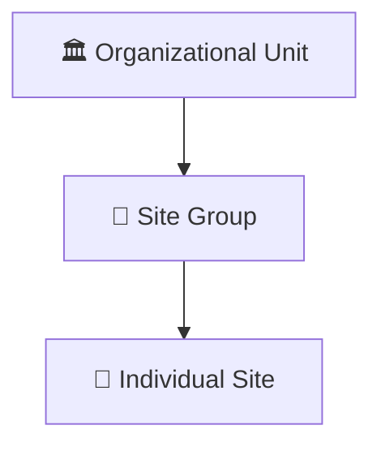

# 🏢 Talos Site Management

In Talos, a **Site** represents any entity that generates an alarm signal—whether it's a physical building, a specific floor, or a mobile security tower.

import Callout from '@site/src/components/Callout';
import Tabs from '@site/src/components/Tabs';
import TabItem from '@site/src/components/Tabs/TabItem';
import RelatedArticles from '@site/src/components/RelatedArticles';

---

## 🚦 Understanding Site Status

How you set a site's status directly impacts its billing and operator visibility.

<Tabs defaultValue="active">
  <TabItem value="active" label="✅ Active">
    **Billing Status:** Billable.  
    **Behavior:** Alarms are processed and routed to operators in real-time. Full health monitoring is active.
  </TabItem>
  <TabItem value="inactive" label="❌ Inactive">
    **Billing Status:** Non-billable.  
    **Behavior:** The cloud rejects all incoming signals. Use this mode for "Golden Image" sites or during the early migration of customer data.
  </TabItem>
  <TabItem value="test" label="🧪 Test Mode">
    **Billing Status:** Billable.  
    **Behavior:** Filters non-critical signals (like motion) while keeping urgent life-safety signals (like fire) active. Perfect for weekend maintenance.
  </TabItem>
</Tabs>

---

## 🏗️ Creation Methods

### 1. From Scratch
Ideal for unique sites that require bespoke workflow logic. Navigate to **Sites** → **Create Site** and enter a unique **Site ID**.

### 2. From Template
Recommended for scaling. Templates pre-configure working hours, default workflows, and service company links. 
- **Auto-Sequence:** Templates can automatically assign the next numeric ID (e.g., `VDS-51500001`) from a pre-defined sequence.

---

## 📟 Virtual Devices
Every site is linked to one or more **Virtual Devices**—these are the cloud-based connection points that receive your alarm data.

- 🟢 **Connected:** Primary and/or secondary paths are heartbeat-active.
- 🔴 **Disconnected:** Both communication paths have dropped. 
- **Dual Path (DP):** Displays status for both Ethernet and Cellular links separately for maximum redundancy.

---

## 📂 Organizational Hierarchy

Talos uses a three-tier grouping structure to help with bulk management and reporting:

- **Use Grouping For:** Applying a single holiday schedule to all stores in a specific region or filtering reports for a specific VIP customer.

---

## 🔗 Service Company Links
You can link a site to a **Service Company** (e.g., "Main Street Electricians"). When a technical fault (like a low battery) is detected, workflows can automatically trigger an SMS to the linked service provider.

---

## Related Articles

<RelatedArticles articles={[
  {
    title: "User Management",
    description: "Who can see these sites."
  }
]} />

---

**Next:** [Troubleshooting Talos Sync Errors](/docs/getting-started/troubleshooting/time-sync-errors)
