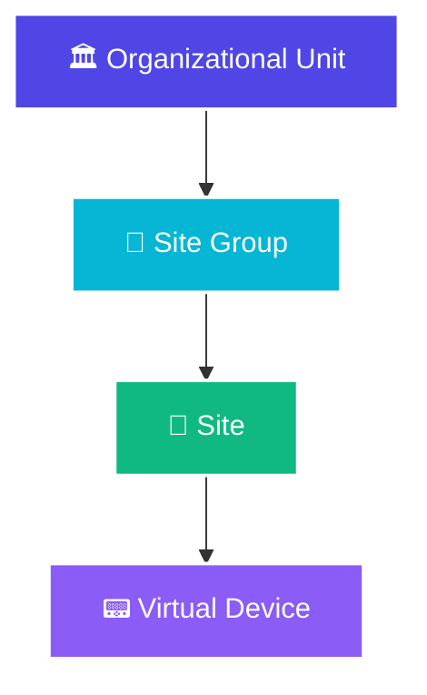

import Tabs from '@theme/Tabs';
import TabItem from '@theme/TabItem';

# Talos Site Management

<div className="row margin-bottom--lg">
  <div className="col col--8">
    <p className="text--lg">
      Sites are the foundation of your Talos alarm management system. This guide covers everything you need to know about creating, organizing, and managing sites, virtual devices, and connections in Evalink Talos.
    </p>
  </div>
  <div className="col col--4">
    <div className="card shadow--md" style={{background: 'linear-gradient(135deg, #10B981 0%, #059669 100%)', color: 'white', padding: '1.5rem', textAlign: 'center'}}>
      <div style={{fontSize: '2.5rem', marginBottom: '0.5rem'}}>🏢</div>
      <h3 style={{color: 'white', margin: 0}}>Site Management</h3>
      <p style={{color: 'rgba(255,255,255,0.9)', margin: 0, fontSize: '0.9rem'}}>Organize & Configure</p>
    </div>
  </div>
</div>

## Understanding Sites in Talos

In Talos, a **"site"** is anything that can create an alarm that you need to monitor. It's a flexible term that can represent:

- A physical building (office, factory, store)
- A specific area within a building (one floor)
- A personal panic button that someone carries
- Any alarm-generating entity

If it can send an alarm signal and you need to keep track of it, Talos calls it a site.

## Site Status Management

Sites in Talos can have different statuses, which affect how they work and how they are billed.

<Tabs>
  <TabItem value="active" label="✅ Active Sites" default>
    <div className="card shadow--md" style={{borderLeft: '6px solid #10B981', marginTop: '1rem'}}>
      <div className="card__header">
        <h3>Active Site Configuration</h3>
      </div>
      <div className="card__body">
        <p>An <strong>"active"</strong> site is fully operational:</p>
        <ul>
          <li>✅ Can send alarms</li>
          <li>✅ Alarms will be processed</li>
          <li>✅ Site counts towards your billing</li>
          <li>✅ Appears in operator queues</li>
          <li>✅ Health monitoring is active</li>
        </ul>
        
        <div className="alert alert--success" style={{marginTop: '1rem'}}>
          <strong>Best Practice:</strong> Only activate sites when they are ready for production use and properly configured.
        </div>
      </div>
    </div>
  </TabItem>

  <TabItem value="inactive" label="❌ Inactive Sites">
    <div className="card shadow--md" style={{borderLeft: '6px solid #EF4444', marginTop: '1rem'}}>
      <div className="card__header">
        <h3>Inactive Site Configuration</h3>
      </div>
      <div className="card__body">
        <p>An <strong>"inactive"</strong> site has specific characteristics:</p>
        <ul>
          <li>❌ Talos will <strong>not accept any new alarms</strong> from it</li>
          <li>❌ You won't see any new alarms for this site</li>
          <li>💰 You are usually <strong>not charged</strong> for sites that are marked as inactive</li>
          <li>📝 Configuration can still be edited</li>
          <li>📊 Historical data remains accessible</li>
        </ul>
        
        <div className="alert alert--info" style={{marginTop: '1rem'}}>
          <strong>Pro Tip:</strong> Create sites as "inactive" during setup to avoid billing charges until they're ready for production. This is especially useful when preparing multiple sites for migration.
        </div>
      </div>
    </div>
  </TabItem>

  <TabItem value="test" label="🧪 Test Mode">
    <div className="card shadow--md" style={{borderLeft: '6px solid #F59E0B', marginTop: '1rem'}}>
      <div className="card__header">
        <h3>Test Mode Configuration</h3>
      </div>
      <div className="card__body">
        <p>Test mode is useful during maintenance, testing, or when you expect non-real activity:</p>
        <ul>
          <li>🧪 Certain alarm types can be treated as "test alarms"</li>
          <li>🚫 Test alarms are often ignored for normal operator queues</li>
          <li>✅ Critical alarm types can still come through as real, actionable alarms</li>
          <li>📝 Test alarms are logged differently for review</li>
        </ul>
        
        <h4>Example Use Case:</h4>
        <p>Imagine a factory is replacing all its motion sensors over a weekend. You expect many motion detection alarms during this work, and they aren't real intrusions. However, the factory's fire alarm system must remain fully operational.</p>
        <p>You can put the factory site into a specific test mode where Talos is told: "For this weekend, ignore all motion detection alarms from the factory because of the sensor upgrade. But, if any fire alarms come in, treat those as urgent and real."</p>
        
        <div className="alert alert--warning" style={{marginTop: '1rem'}}>
          <strong>Important:</strong> Always remember to disable test mode after maintenance is complete to ensure normal alarm processing resumes.
        </div>
      </div>
    </div>
  </TabItem>
</Tabs>

## Site Creation Methods

There are two ways to create a site in Evalink Talos:

<div className="row margin-bottom--lg">
  <div className="col col--6">
    <div className="card shadow--md" style={{borderTop: '4px solid #8B5CF6', height: '100%'}}>
      <div className="card__header">
        <h3>📝 From Scratch</h3>
      </div>
      <div className="card__body">
        <p>Create a site manually with full control over all settings:</p>
        <ul style={{fontSize: '0.9rem'}}>
          <li>Complete customization</li>
          <li>Step-by-step configuration</li>
          <li>Best for unique sites</li>
          <li>Full control over Site ID</li>
        </ul>
      </div>
    </div>
  </div>
  <div className="col col--6">
    <div className="card shadow--md" style={{borderTop: '4px solid #06B6D4', height: '100%'}}>
      <div className="card__header">
        <h3>📋 From Template</h3>
      </div>
      <div className="card__body">
        <p>Create a site using a predefined template:</p>
        <ul style={{fontSize: '0.9rem'}}>
          <li>Faster setup for similar sites</li>
          <li>Consistent configuration</li>
          <li>Best for multiple similar sites</li>
          <li>Settings applied automatically</li>
        </ul>
      </div>
    </div>
  </div>
</div>

### Creating a Site from Scratch

To create a site from scratch:

1. Navigate to the **Sites** page
2. Click the **Create Site** button
3. In the dialog that opens:
   - Select the **Basic** option (default if no templates are configured)
   - In the **Site ID** field, type the site ID (the name of the site)
     - The site name must be unique within the Company
     - Can contain letters, digits, special symbols and emoji
     - To generate a Site ID automatically, click the **Sequence** button and select the desired sequence
   - If you want the site to be in **Active** status after creation, leave the **Activate Site** checkbox selected
   - Click **Create**

### Creating a Site from Template

Creating a site from a template is useful when you need to create multiple sites that share common parameters:

- Same types of integrations
- Same working hours
- Same set of site statuses
- Forward alarms to a common monitoring station

All these settings can be applied automatically during site creation, with the possibility to edit them afterwards.

:::info Site Templates
Site Templates are configured on a global level under **Company > Settings > Sites**. Only Administrator and Manager have the permissions to create and manage Site Templates.
:::

:::tip Auto-Generated Site IDs
If the Site Template includes Site ID auto-generation, the auto-generated Site ID takes precedence over the manually entered one. You can edit the Site ID on the site Settings page afterwards.
:::

## Site ID Configuration

When creating a site, you have options for specifying the Site ID:

### Manual Entry

- Always available when creating a site from scratch
- Available when creating from a template if the template provides the Site ID input field
- Site name must be unique within the Company
- Can contain letters, digits, special symbols and emoji

### Auto-Generated Site IDs

You can have Evalink Talos generate the Site ID as a numeric value based on a **sequence**:

- **Sequence** is a user-defined configuration
- Specifies the start value (e.g., 51500000)
- Optional constant prefix and suffix (e.g., VdS- or -ArmStatus)
- Each new site increments the last assigned value by 1
- Example: 51500000 → 51500001 → 51500002

:::info Site ID Sequences
Site ID sequences are configured on a global level under **Company > Settings > Sites**. Only Administrator and Manager can create and manage sequences.
:::

## Virtual Devices and Connections

### Understanding Virtual Devices

Within the "Sites" page, there's a section called **"Virtual Devices."**

This area lists all the "receivers" or connections for all your customers. These aren't physical hardware boxes in your office; they are virtual connection points in the Talos cloud.

<div className="card shadow--md" style={{background: 'var(--ifm-color-emphasis-50)', border: '2px solid var(--ifm-color-primary)', marginBottom: '2rem', padding: '1.5rem'}}>
  <h3 style={{marginTop: 0}}>Virtual Device Features</h3>
  <div className="row">
    <div className="col col--6">
      <h4>Status Indicators</h4>
      <ul>
        <li>🟢 <strong>Green</strong> - Connected and healthy</li>
        <li>🔴 <strong>Red</strong> - Disconnected device</li>
        <li>🟡 <strong>Yellow</strong> - Warning or degraded status</li>
      </ul>
    </div>
    <div className="col col--6">
      <h4>Device Information</h4>
      <ul>
        <li>Receiver account number</li>
        <li>Connection type (Single/Dual Path)</li>
        <li>Last heartbeat timestamp</li>
        <li>Link to associated site</li>
      </ul>
    </div>
  </div>
</div>

### Connection Paths

When looking at a virtual device's details, you'll see information about its connection paths:

**Single Path (SP):**
- Device communicates through one channel only (e.g., only Ethernet)
- If that channel is connected, the device is considered connected
- Simpler configuration
- Lower redundancy

**Dual Path (DP):**
- Device has two communication channels (e.g., Ethernet and mobile/cellular backup)
- For the device to be considered fully connected, both paths might need to be active
- Shows the status of each path individually
- Higher reliability and redundancy

**Example Status Display:**
```
Ethernet:  🟢 Connected
Mobile:    🟢 Connected
Overall:   🟢 Connected
```

If one path drops (e.g., Ethernet goes down, but Mobile is still up), the status would change, alerting you to a potential issue while the backup path keeps it online.

## Site Organization Hierarchy

Talos allows you to organize sites in a hierarchical structure for better management:



### Hierarchy Levels

<div className="row margin-bottom--lg">
  <div className="col col--3">
    <div className="card shadow--md" style={{borderTop: '4px solid #4F46E5', height: '100%'}}>
      <div className="card__header">
        <h4>🏛️ Organizational Unit</h4>
      </div>
      <div className="card__body">
        <p style={{fontSize: '0.85rem'}}>Highest level - represents major customers or divisions</p>
      </div>
    </div>
  </div>
  <div className="col col--3">
    <div className="card shadow--md" style={{borderTop: '4px solid #06B6D4', height: '100%'}}>
      <div className="card__header">
        <h4>🏢 Site Group</h4>
      </div>
      <div className="card__body">
        <p style={{fontSize: '0.85rem'}}>Regional or functional groupings of sites</p>
      </div>
    </div>
  </div>
  <div className="col col--3">
    <div className="card shadow--md" style={{borderTop: '4px solid #10B981', height: '100%'}}>
      <div className="card__header">
        <h4>📍 Site</h4>
      </div>
      <div className="card__body">
        <p style={{fontSize: '0.85rem'}}>Individual customer locations</p>
      </div>
    </div>
  </div>
  <div className="col col--3">
    <div className="card shadow--md" style={{borderTop: '4px solid #8B5CF6', height: '100%'}}>
      <div className="card__header">
        <h4>📟 Virtual Device</h4>
      </div>
      <div className="card__body">
        <p style={{fontSize: '0.85rem'}}>Connection points for alarm reception</p>
      </div>
    </div>
  </div>
</div>

### Benefits of Site Organization

This grouping is flexible and not mandatory. However, it helps a lot when you need to:

- Get an overview of all connections in a specific region
- Generate reports for a particular customer or group of sites
- Apply certain scenarios or workflows to all sites within a group (e.g., a holiday schedule for all stores in a particular city)
- Manage permissions and access control
- Organize billing and reporting

## Service Companies

**Service Companies** are a special type of group that can be linked to multiple sites.

### What is a Service Company?

A **Service Company** is an independent group you can define, such as:
- A specific electrician
- A guard service
- A maintenance company
- Any third-party service provider

### Linking Service Companies

You can link a Service Company to multiple different sites, even if those sites belong to different customers.

**Example:** The same electrician might be responsible for five different customer sites in a particular area. You can create a "Service Company" entry for this electrician and link them to all five sites.

### Benefits

If Talos detects a technical issue (like a power outage reported by a site's alarm panel), a workflow could be set up to automatically send a notification (like an SMS or email) to the linked Service Company (the electrician) to go and check on that site.

## Editing Site Settings

To edit the site settings:

1. Go to the **Sites** page, select the site from the list
2. On the **Overview** page that opens, scroll down to the middle of the page and click **Settings**
3. On the **Settings** subpage that opens, enter or edit the following information:
   - **Site pane**: Specify the **Site ID** and select a **Site Group** for the site
   - **Address pane**: Specify the company details for the site
   - **Time Zone pane**: Select the **Time Zone** for the site
   - **Custom Fields pane**: Specify the values for custom fields, or click **Configure** to setup a new custom field

## Custom Fields

A custom field is a variable that stores information related to a site and used in workflows. Custom fields can also be created for site groups.

**Example:** For a company that monitors vehicles, you can create a **License plate** custom field. Then, you can specify a License plate number for each monitored vehicle and use it in your workflows.

### Configuring Custom Fields

Custom Fields are created on a global level. After a custom field is created, it appears on the **Settings** page of all sites (or site groups) created under the Company account.

To configure a custom field:

1. Go to **Company > Settings > Sites**
   - You can go to this page directly from the **Settings** page of a particular site (or site group) by clicking on the **Configure** shortcut in the **Custom Fields** area of the page
2. On the **Company > Settings > Sites** page, click **Add Custom Field**
3. In the dialog that opens, specify:
   - **Name** – the custom field ID (lowerCamelCase recommended: testRecord, invoiceNumber)
   - **Type** – Text, Number, Select One, or Select Multiple
   - **Display** – the custom field name to be displayed in UI
   - **Scope** – Sites only or Site Groups only
   - **Validation pattern** (optional) – regular expression for input validation
   - **Public checkbox** (optional) – include in PDF and email reports
   - **Operator checkbox** (optional) – display to operators
   - **Hidden checkbox** (optional) – hide from Overview pages
4. Click **Submit**

:::warning Custom Field Management
Name and Type of an existing custom field cannot be edited. To delete a custom field, first erase all the custom field values specified for all sites / site groups.
:::

## Deleting a Site

Before attempting to delete a site, make sure that none of enabled site receivers are in **Connected** status through ethernet or mobile.

To delete a site:

1. On the **Sites** page, click on the site record in the list
2. On the **Overview** page of the site that opens, scroll to the middle of the page and click the **Settings** button
3. Scroll to the bottom of the **Settings** subpage and click the **Delete** button
4. Enter the confirmation code and click **Delete**

:::danger Site Deletion Warning
After a site is deleted, the contacts, workflows, and schedules configured for it are also deleted permanently. The records originating from the site disappear from the Events and Event Log pages. This action cannot be undone.
:::

## Best Practices

<div className="card shadow--md" style={{background: 'var(--ifm-color-emphasis-50)', border: '2px solid var(--ifm-color-primary)', marginBottom: '2rem', padding: '1.5rem'}}>
  <h3 style={{marginTop: 0}}>✅ Site Management Best Practices</h3>
  <ul>
    <li><strong>Create sites as inactive</strong> during setup to avoid billing charges until ready for production</li>
    <li><strong>Use site templates</strong> for multiple similar sites to ensure consistency</li>
    <li><strong>Organize sites hierarchically</strong> using Site Groups and Organizational Units for better management</li>
    <li><strong>Configure dual-path connections</strong> for critical sites to ensure redundancy</li>
    <li><strong>Use custom fields</strong> to store site-specific information that can be used in workflows</li>
    <li><strong>Link service companies</strong> to sites for automated maintenance notifications</li>
    <li><strong>Regularly review site status</strong> to ensure all active sites are properly configured</li>
    <li><strong>Document site-specific configurations</strong> for future reference and troubleshooting</li>
  </ul>
</div>

## Related Articles

- [Getting to Know Evalink Talos - Complete Guide](/docs/getting-started/Talos/getting-to-know-evalink-talos-complete)
- [Talos Workflows and Alarms](/docs/getting-started/Talos/talos-workflows-and-alarms)
- [Talos Roles and Permissions](/docs/getting-started/Talos/talos-roles-and-permissions)
- [What is Evalink Talos?](/docs/getting-started/what-is-evalink-talos)

## Need Help?

For comprehensive Evalink Talos documentation, visit the [official Evalink Talos documentation](https://documentation.evalink.io/) or contact [GCXONE Support](/docs/support).

