# Tower Monitoring Alarm Configuration Guide

This comprehensive guide covers the complete configuration of tower monitoring alarms in Genesis, including integration with Teltonika-IOT devices, EFOY Fuel Cells, and Victron Energy monitoring systems.

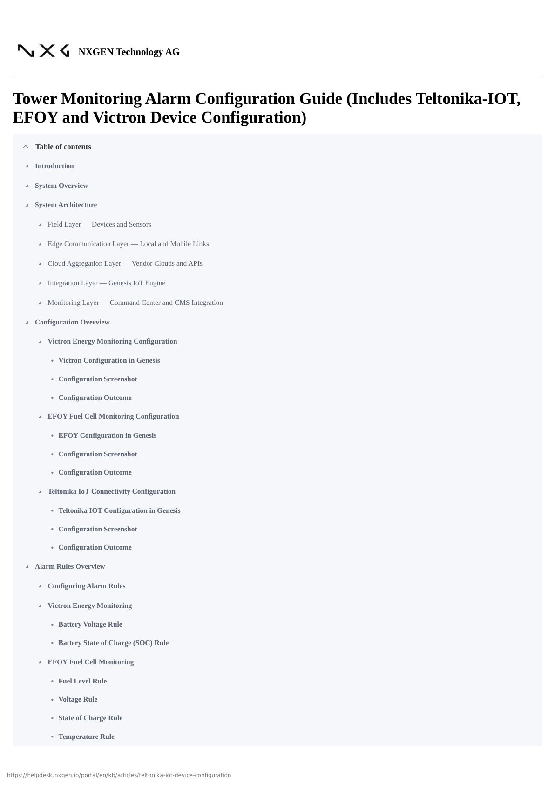

## Table of Contents

- [Introduction](#introduction)
- [System Overview](#system-overview)
- [System Architecture](#system-architecture)
  - [Field Layer — Devices and Sensors](#field-layer--devices-and-sensors)
  - [Edge Communication Layer — Local and Mobile Links](#edge-communication-layer--local-and-mobile-links)
  - [Cloud Aggregation Layer — Vendor Clouds and APIs](#cloud-aggregation-layer--vendor-clouds-and-apis)
  - [Integration Layer — Genesis IoT Engine](#integration-layer--genesis-iot-engine)
  - [Monitoring Layer — Command Center and CMS Integration](#monitoring-layer--command-center-and-cms-integration)
- [Configuration Overview](#configuration-overview)
  - [Victron Energy Monitoring Configuration](#victron-energy-monitoring-configuration)
  - [EFOY Fuel Cell Monitoring Configuration](#efoy-fuel-cell-monitoring-configuration)
  - [Teltonika IoT Connectivity Configuration](#teltonika-iot-connectivity-configuration)
- [Alarm Rules Overview](#alarm-rules-overview)
  - [Victron Energy Monitoring](#victron-energy-monitoring)
  - [EFOY Fuel Cell Monitoring](#efoy-fuel-cell-monitoring)
  - [Teltonika IoT Connectivity](#teltonika-iot-connectivity)
- [Configuration Notes](#configuration-notes)

## Introduction

When we refer to **Tower Monitoring** in Genesis, we are describing an integrated ecosystem of multiple IoT subsystems working together to ensure the tower's operational continuity, energy efficiency, and communication reliability.

Each subsystem plays a distinct but interconnected role, contributing to the tower's overall intelligence and autonomy:

- **Victron Energy** oversees Power and Energy Monitoring, tracking parameters such as battery voltage, charging current, solar input, and load consumption. This ensures that the energy system operates within safe thresholds and provides early warning of battery or solar irregularities.

- **EFOY Fuel Cells** enable Fuel Cell Backup Monitoring, safeguarding critical uptime by reporting fuel levels, voltage output, state of charge, and internal temperature — essential for remote sites relying on autonomous energy sources.

- **Teltonika IoT Devices** manage Network Connectivity and Device Health Monitoring, including mobile network quality, SIM data usage, geofencing, input/output state changes, and advanced jamming detection for communication assurance.

Together, these intelligent systems form a unified monitoring architecture within Genesis. They continuously stream telemetry data from distributed towers into the Genesis IoT cloud, where it is analyzed, stored, and correlated with configurable alarm rules.

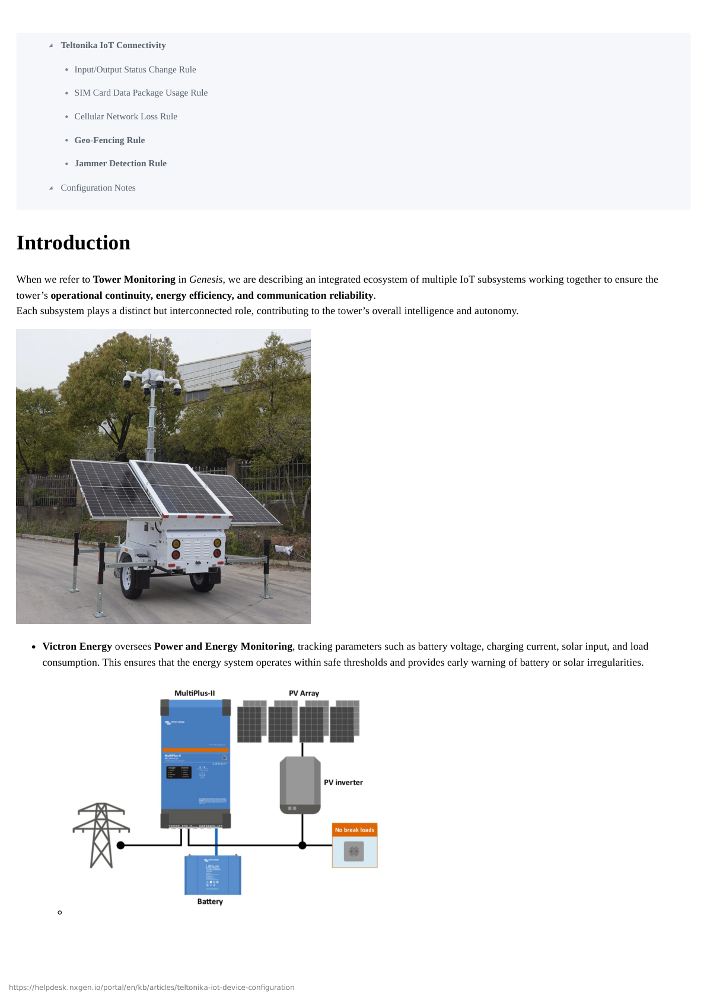

## System Overview

Each device — whether it's a Victron solar/battery controller, EFOY fuel cell, or Teltonika router — periodically reports status and sensor values to Genesis using secure communication channels.

These data points are evaluated in real time against pre-defined alarm thresholds and logic rules. When a condition breaches the configured limits, Genesis automatically:

1. **Generates event alerts** (using the assigned event codes and group codes).
2. **Notifies the appropriate operator or system**, through respective CMS channels (Evalink, AmWin, Lisa, IMMIX, etc...)
3. **Tracks the event lifecycle**, ensuring alerts are automatically cleared/restored when the parameters return to their normal range.

This end-to-end monitoring pipeline transforms raw device data into actionable intelligence, allowing operators to detect risks early, respond faster, and maintain consistent tower uptime across all remote locations.

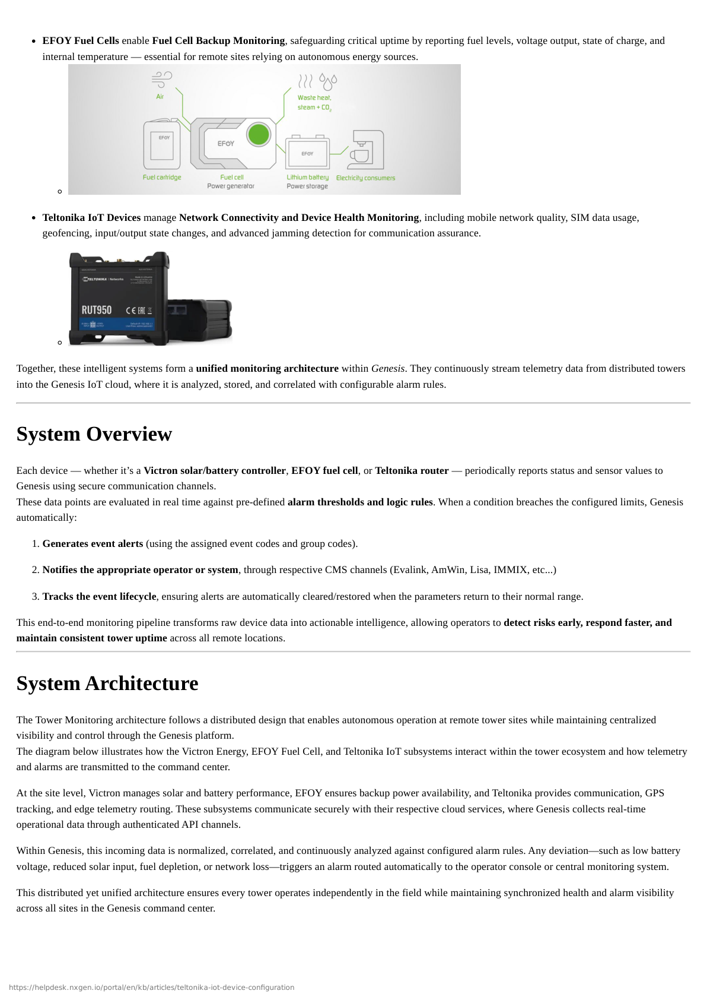

## System Architecture

The Tower Monitoring architecture follows a distributed design that enables autonomous operation at remote tower sites while maintaining centralized visibility and control through the Genesis platform.

The diagram below illustrates how the Victron Energy, EFOY Fuel Cell, and Teltonika IoT subsystems interact within the tower ecosystem and how telemetry and alarms are transmitted to the command center.


At the site level, Victron manages solar and battery performance, EFOY ensures backup power availability, and Teltonika provides communication, GPS tracking, and edge telemetry routing. These subsystems communicate securely with their respective cloud services, where Genesis collects real-time operational data through authenticated API channels.

Within Genesis, this incoming data is normalized, correlated, and continuously analyzed against configured alarm rules. Any deviation—such as low battery voltage, reduced solar input, fuel depletion, or network loss—triggers an alarm routed automatically to the operator console or central monitoring system.

This distributed yet unified architecture ensures every tower operates independently in the field while maintaining synchronized health and alarm visibility across all sites in the Genesis command center.

### Field Layer — Devices and Sensors

This layer contains the hardware installed at each tower site and the telemetry each device provides.

- **Victron Energy devices** (MPPTs, Battery Monitors, Inverters) supply power metrics such as battery voltage, charging current, state of charge, solar input, and system alarms. These devices are typically published to the Victron VRM cloud for remote access.

- **EFOY Fuel Cells** report fuel cartridge level, runtime estimates, output voltage, and internal temperature. They usually push data to the EFOY Cloud.

- **Teltonika-IOT routers** handle network connectivity, GPS position, SIM data usage, input/output status, and jamming detection. They provide both status telemetry and remote I/O for site control.

Each device continuously collects sensor data and health indicators that are required for both routine monitoring and alarm detection.

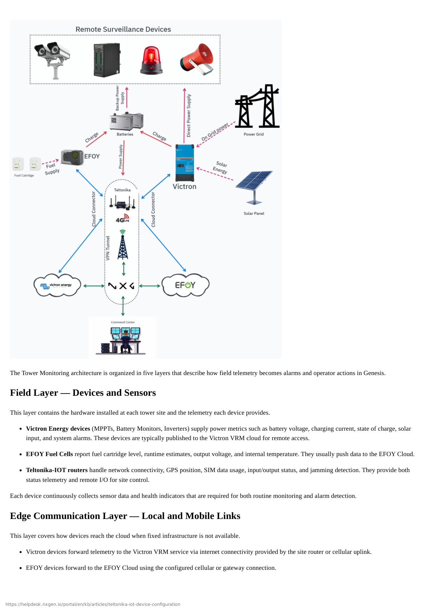

### Edge Communication Layer — Local and Mobile Links

This layer covers how devices reach the cloud when fixed infrastructure is not available.

- **Victron devices** forward telemetry to the Victron VRM service via internet connectivity provided by the site router or cellular uplink.

- **EFOY devices** forward to the EFOY Cloud using the configured cellular or gateway connection.

- **Teltonika routers** provide the primary WAN link for the tower, and may also expose local device endpoints (SNMP, HTTP, or vendor APIs) used by on-site systems.

The router also supplies remote access and optional VPN channels. Local I/O states and short term buffering occur here when connectivity is intermittent.

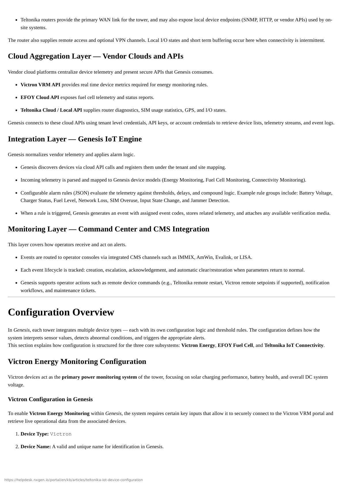

### Cloud Aggregation Layer — Vendor Clouds and APIs

Vendor cloud platforms centralize device telemetry and present secure APIs that Genesis consumes.

- **Victron VRM API** provides real time device metrics required for energy monitoring rules.
- **EFOY Cloud API** exposes fuel cell telemetry and status reports.
- **Teltonika Cloud / Local API** supplies router diagnostics, SIM usage statistics, GPS, and I/O states.

Genesis connects to these cloud APIs using tenant level credentials, API keys, or account credentials to retrieve device lists, telemetry streams, and event logs.

### Integration Layer — Genesis IoT Engine

Genesis normalizes vendor telemetry and applies alarm logic.

- Genesis discovers devices via cloud API calls and registers them under the tenant and site mapping.
- Incoming telemetry is parsed and mapped to Genesis device models (Energy Monitoring, Fuel Cell Monitoring, Connectivity Monitoring).
- Configurable alarm rules (JSON) evaluate the telemetry against thresholds, delays, and compound logic. Example rule groups include: Battery Voltage, Charger Status, Fuel Level, Network Loss, SIM Overuse, Input State Change, and Jammer Detection.
- When a rule is triggered, Genesis generates an event with assigned event codes, stores related telemetry, and attaches any available verification media.

### Monitoring Layer — Command Center and CMS Integration

This layer covers how operators receive and act on alerts.

- Events are routed to operator consoles via integrated CMS channels such as IMMIX, AmWin, Evalink, or LISA.
- Each event lifecycle is tracked: creation, escalation, acknowledgement, and automatic clear/restoration when parameters return to normal.
- Genesis supports operator actions such as remote device commands (e.g., Teltonika remote restart, Victron remote setpoints if supported), notification workflows, and maintenance tickets.

## Configuration Overview

In Genesis, each tower integrates multiple device types — each with its own configuration logic and threshold rules. The configuration defines how the system interprets sensor values, detects abnormal conditions, and triggers the appropriate alerts.

This section explains how configuration is structured for the three core subsystems: Victron Energy, EFOY Fuel Cell, and Teltonika IoT Connectivity.

## Victron Energy Monitoring Configuration

Victron devices act as the primary power monitoring system of the tower, focusing on solar charging performance, battery health, and overall DC system voltage.

### Victron Configuration in Genesis

To enable Victron Energy Monitoring within Genesis, the system requires certain key inputs that allow it to securely connect to the Victron VRM portal and retrieve live operational data from the associated devices.

**Required Configuration Parameters:**

1. **Device Type:** Victron
2. **Device Name:** A valid and unique name for identification in Genesis.
3. **Serial Number:** The serial number of the device, obtainable from the Victron VRM Portal.
4. **Username and Password:** Credentials with administrative privileges to access or read the configured device in the VRM Portal.

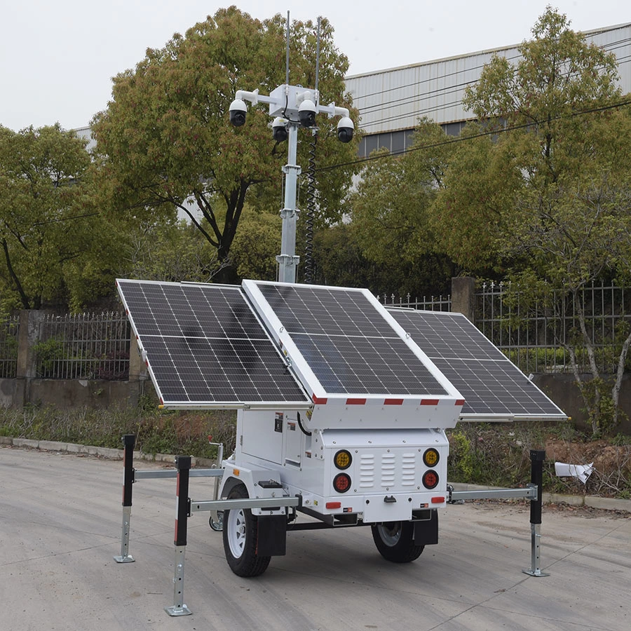

### Configuration Outcome

Once configured, Genesis automatically detects the available PV Controller and Battery Manager, initiating continuous polling of the Victron API. This process enables real-time retrieval of metrics such as battery voltage, charging current, solar power generation, and overall system status. These values are then continuously evaluated against the thresholds defined under the Energy Monitoring section of your alarm rules.

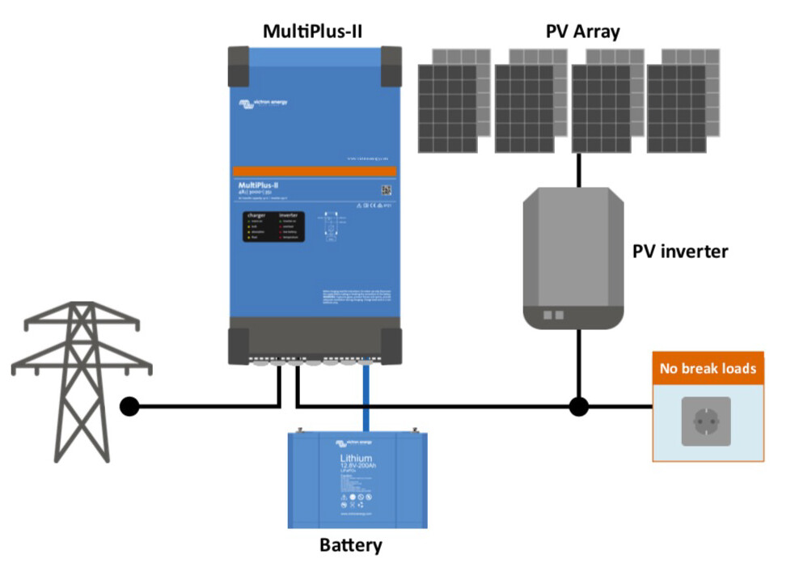

## EFOY Fuel Cell Monitoring Configuration

EFOY devices provide backup power generation for sites where continuous power is critical. Their configuration ensures the fuel cell remains in optimal operating condition.

### EFOY Configuration in Genesis

To enable EFOY Fuel Cell within Genesis, the system requires certain key inputs that allow it to securely connect to the EFOY Cloud portal and retrieve live operational data from the associated devices.

**Required Configuration Parameters:**

1. **Device Type:** EFOY Cloud
2. **Device Name:** A valid and unique name for identification in Genesis.
3. **Serial Number:** The unique serial number of the fuel cell, as listed in the EFOY Cloud Portal.
4. **EFOY API Key:** A valid API key with sufficient privileges to access all Solar and Power Controller parameters. It must be configured at Tenant level custom settings.

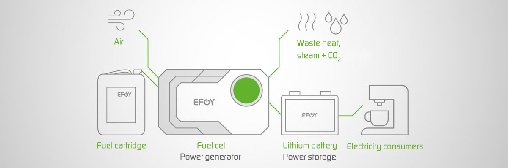

#### Configuring EFOY API Key at Tenant Level

To configure the EFOY API Key:

1. Select the tenant
2. Click **Edit**
3. Go to **Custom Property**
4. Click **Add**
5. Name the property as `EFOYAPIKey` and provide the original API key as value.
6. Click **Save**.

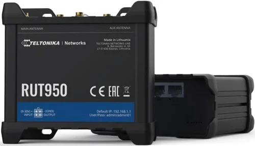

In the IP Address field, you may optionally specify the EFOY Cloud API endpoint instead of a local device address. The Username and Password fields are optional. However, you can provide valid EFOY Cloud credentials as a backup to the API key.

### Configuration Outcome

Once configured, Genesis connects securely to the EFOY Cloud API and begins fetching live operational data. This includes parameters such as fuel cell voltage, output power, cartridge level, energy generation rate, and system health—providing complete visibility into fuel cell performance and runtime efficiency.

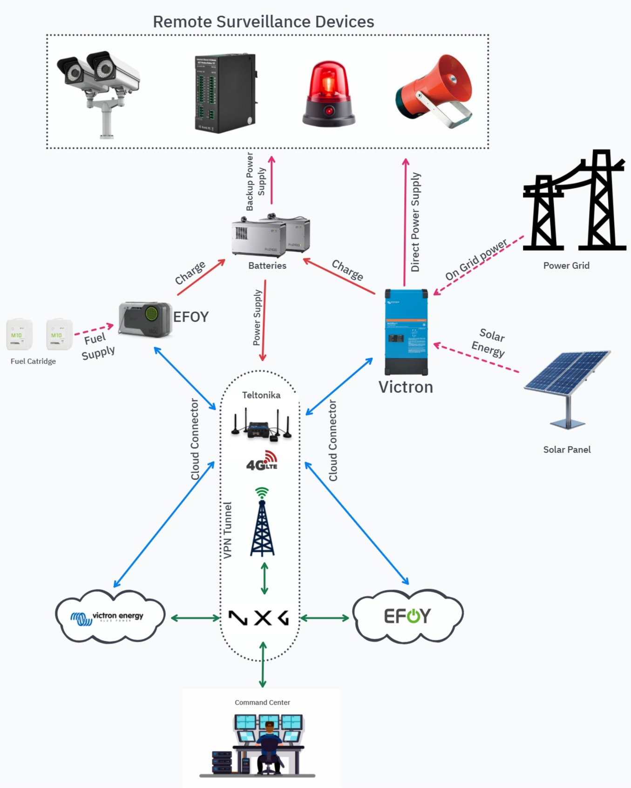

## Teltonika IoT Connectivity Configuration

Teltonika devices manage connectivity, communication, and environmental interaction for each tower. They report detailed I/O status, network health, SIM usage, GPS, and signal jamming conditions.

### Teltonika IOT Configuration in Genesis

To enable Teltonika IOT Router within Genesis, the system requires certain key inputs that allow it to securely connect to the router and retrieve live operational data from the associated devices.

**Required Configuration Parameters:**

1. **Device Type:** Teltonika-IOT
2. **Device Name:** A valid and unique name for identification in Genesis.
3. **IP Address:** The public or VPN-accessible IP address of the Teltonika device.
4. **Serial Number:** The unique serial number of the router.
5. **Control Port:** The valid HTTP port used for device communication.
6. **Username and Password:** Administrative credentials that allow full access to all device parameters and subcomponents.

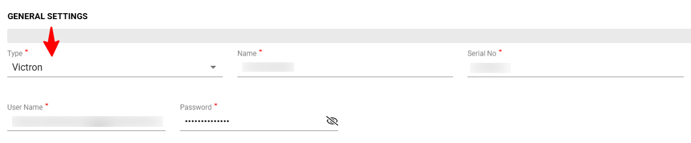

### Configuration Outcome

Once connected, Genesis establishes a secure communication channel with the Teltonika Router, enabling continuous monitoring of key metrics such as signal strength, network uptime, connected I/O states, and environmental sensor data. Any deviations—such as loss of connectivity, abnormal input voltage, or I/O threshold breach—are automatically logged and can trigger real-time alerts to CMS.

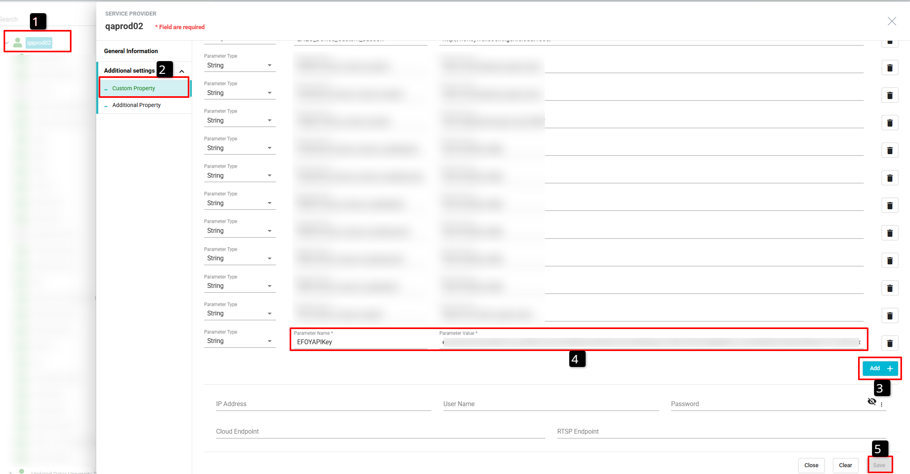

## Alarm Rules Overview

This section outlines the structure, purpose, and usage of the alarm rules configuration used for remote tower monitoring within Genesis.

Each part of the configuration defines a monitored category, its key parameters, and the conditions under which alerts are raised.

### Configuring Alarm Rules

The Alarm Rules in Genesis are defined in JSON format, allowing precise and flexible configuration of alerting behavior.

Rules can be configured at either the Site level or Device level, depending on the monitoring scope.

**To configure alarm rules:**

1. Navigate to the desired Site or Device in Genesis.
2. Click **Edit** and go to the **Additional Properties** section.
3. Locate the property named **Custom Alarm Rules**.
4. Open the property's hamburger menu and select **Apply Default** to load the preconfigured default rule set.

   > **Note:** By default, all rules are inactive.

5. Modify the JSON configuration to enable specific rules by setting the `"active"` parameter to `true` for the relevant parameters.
6. Once saved, Genesis automatically applies the configured thresholds, continuously evaluates incoming telemetry, and triggers alerts when any parameter exceeds or falls below its defined range.

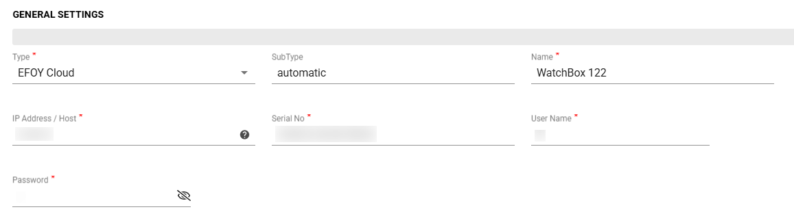

The Custom Alarm Rules configuration JSON in Genesis is structured into three main sections:

- **Energy Monitoring** — Contains alert configurations specific to Victron devices, covering parameters such as battery voltage, and state of charge.
- **Fuel Cell Monitoring** — Defines alert rules for EFOY systems, including fuel level, voltage, temperature, and state of charge thresholds.
- **Connectivity Monitoring** — Manages alerts for Teltonika IoT devices, covering aspects such as network signal quality, SIM data usage, input/output status changes, and jammer detection.

This modular structure allows each device type to be independently configured while maintaining a unified monitoring and alerting framework across the entire tower system.

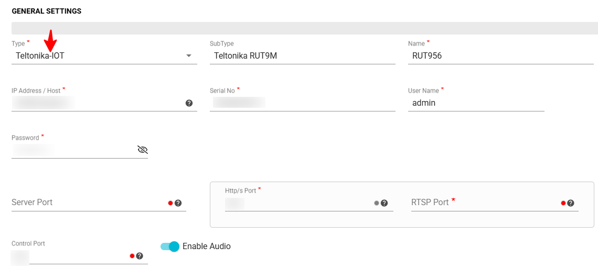

## Victron Energy Monitoring

### Battery Voltage Rule

Monitors the solar or battery voltage levels.

#### Default JSON Configuration

```json
"voltage": {
  "active": false,
  "low": 12,
  "high": 14,
  "eventCode": "battery.voltage.warning",
  "groupCode": "tower.solar.voltage.alert"
}
```

#### Configuration Parameters

| Parameter Name | Description | Example Value |
|---------------|-------------|---------------|
| `active` | Enables or disables this specific alarm rule. Set to `true` to activate. | `true` |
| `low` | The lower voltage threshold. An alert triggers if the voltage falls below this value. | `12` |
| `high` | The upper voltage threshold. An alert triggers if the voltage exceeds this value. | `14` |
| `eventCode` | Internal event identifier used for integration with CMS or external notification systems. | `battery.voltage.warning` |
| `groupCode` | Group identifier used by Genesis Tower Alarm Manager to categorize alerts. | `tower.solar.voltage.alert` |

#### Example Behavior

- When voltage falls **below 12V**, an alert with event code `battery.voltage.warning` is raised.
- When voltage returns **within range (12V–14V)**, Genesis automatically logs the recovery event and clears the alert.
- When voltage **exceeds 14V**, a high-voltage warning is generated.

### Battery State of Charge (SOC) Rule

Monitors the remaining charge percentage in the battery bank.

#### Default JSON Configuration

```json
"stateOfCharge": {
  "active": false,
  "low": 15,
  "eventCode": "battery.soc.warning",
  "groupCode": "tower.battery.soc.alert"
}
```

#### Configuration Parameters

| Parameter Name | Description | Example Value |
|---------------|-------------|---------------|
| `low` | Minimum acceptable SOC percentage | `15` |

#### Example Behavior

- SOC **below 15%** triggers low battery alert.
- Restores to normal when SOC rises above the threshold.

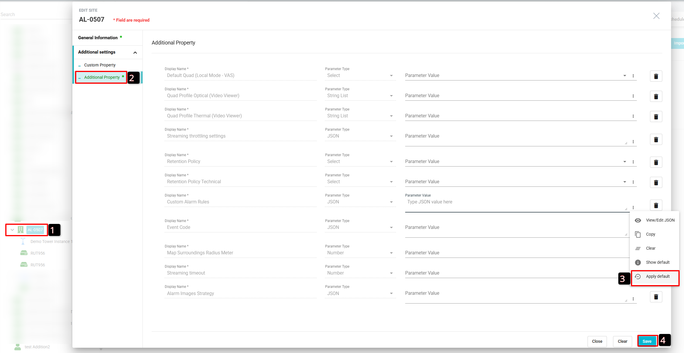

## EFOY Fuel Cell Monitoring

### Fuel Level Rule

Monitors the available fuel percentage in the EFOY fuel cartridge.

#### Default JSON Configuration

```json
"fuelLevel": {
  "active": false,
  "low": 15,
  "eventCode": "fuel.low.warning",
  "groupCode": "tower.fuel.level.alert"
}
```

#### Configuration Parameters

| Parameter Name | Description | Example Value |
|---------------|-------------|---------------|
| `low` | Minimum acceptable Fuel level | `15` |

#### Example Behavior

- Triggers a warning when fuel drops below 15%.

### Voltage Rule

Monitors the EFOY power output voltage.

#### Default JSON Configuration

```json
"voltage": {
  "active": false,
  "low": 12,
  "high": 15,
  "eventCode": "fuel.voltage.critical",
  "groupCode": "tower.fuel.voltage.alert"
}
```

#### Example Behavior

- When voltage falls **below 12V**, an alert with event code `fuel.voltage.warning` is raised.
- When voltage returns **within range (12V–14V)**, Genesis automatically logs the recovery event and clears the alert.
- When voltage **exceeds 14V**, a `fuel.voltage.warning` warning is generated.

### State of Charge Rule

Tracks the internal battery's charge status in EFOY.

#### Default JSON Configuration

```json
"stateOfCharge": {
  "active": false,
  "low": 15,
  "eventCode": "fuel.soc.warning",
  "groupCode": "tower.fuel.soc.alert"
}
```

#### Example Behavior

- Triggers an alert when SOC drops below **15%**.

### Temperature Rule

Monitors EFOY system temperature.

#### Default JSON Configuration

```json
"temperature": {
  "active": false,
  "low": 10,
  "high": 35,
  "eventCode": "fuel.temperature.warning",
  "groupCode": "tower.fuel.temperature.alert"
}
```

#### Example Behavior

- **Below 10°C** or **above 35°C** → Thermal warning.

## Teltonika IoT Connectivity

### Input/Output Status Change Rule

Monitors physical input/output state changes in Teltonika I/O ports.

#### Default JSON Configuration

```json
"IOStatusChange": {
  "input": {
    "AnalogCurrentLoop": {"active": false, "low": 4, "high": 20},
    "AnalogInput": {"active": false, "low": 11, "high": 14},
    "DigitalInput": {"active": false, "ranges": ["Low level", "High level"], "alertOn": "High Level"},
    "IsolatedInput": {"active": false, "ranges": ["Low level", "High level"], "alertOn": "High Level"},
    "PowerSocketInput": {"active": false, "ranges": ["Low level", "High level"], "alertOn": "High Level"},
    "eventCode": "input.statechange",
    "groupCode": "tower.input.statechange"
  },
  "output": {
    "IsolatedOutput": { "active": false, "ranges": ["Low level", "High level"], "alertOn": "High Level" },
    "Relay": { "active": false, "ranges": ["open", "closed"], "alertOn": "open" },
    "PowerSocketOutput": { "active": false, "ranges": ["Low level", "High level"], "alertOn": "High Level" },
    "eventCode": "output.statechange",
    "groupCode": "tower.output.statechange"
  }
}
```

#### Analog Current Loop

| Field | Description |
|-------|-------------|
| `active` | Enables 4–20 mA loop monitoring (true/false) |
| `low` / `high` | Defines acceptable current range. |
| `eventCode` | `input.statechange` |
| `groupCode` | `tower.input.statechange` |

#### Analog Input

| Field | Description |
|-------|-------------|
| `active` | Enables analog voltage input monitoring (true/false) |
| `low` / `high` | Acceptable range (e.g., 11–14 V). |
| `eventCode` | `input.statechange` |
| `groupCode` | `tower.input.statechange` |

#### Digital / Isolated / Power Socket Inputs

| Field | Description |
|-------|-------------|
| `active` | Enables input monitoring (true/false) |
| `ranges` | Possible states, e.g., `["Low level", "High level"]`. |
| `alertOn` | State that should trigger an alarm (e.g., "High Level"). |
| `eventCode` | `input.statechange` |
| `groupCode` | `tower.input.statechange` |

#### Isolated / Power Socket Outputs

| Field | Description |
|-------|-------------|
| `active` | Enables Output monitoring (true/false) |
| `ranges` | Possible states, e.g., `["Low level", "High level"]`. |
| `alertOn` | State that should trigger an alarm (e.g., "High Level"). |
| `eventCode` | `output.statechange` |
| `groupCode` | `tower.output.statechange` |

#### Relay Output

| Field | Description |
|-------|-------------|
| `active` | Enables relay trigger monitoring (true/false) |
| `ranges` | Possible states, e.g., `["open", "closed"]`. |
| `alertOn` | Tracks relay states (e.g., "open"). |
| `eventCode` | `output.statechange` |
| `groupCode` | `tower.output.statechange` |

### SIM Card Data Package Usage Rule

Tracks mobile data consumption for Teltonika routers.

#### Default JSON Configuration

```json
"simCardDataPackage": {
  "active": false,
  "simBillingStartDate": 1,
  "simDataPackageGB": 10,
  "usageWarningPercent": 80,
  "eventCode": "sim.data.usage.warning",
  "groupCode": "tower.connectivity.simdata.alert"
}
```

#### Configuration Parameters

| Parameter Name | Description | Example Value |
|---------------|-------------|---------------|
| `simBillingStartDate` | Billing cycle start date of the SIM plan (currently inactive) | `1` |
| `simDataPackageGB` | Total mobile data allocated per month (in GB) | `10` |
| `usageWarningPercent` | Warning threshold as a percentage of total data usage | `80` |

#### Example Behavior

- Triggers an alert when data usage exceeds **80% of 10GB**.

### Cellular Network Loss Rule

Detects loss of mobile network connectivity.

#### Default JSON Configuration

```json
"cellNetworkLoss": {
  "active": false,
  "eventCode": "modem.signal.warning",
  "groupCode": "tower.connectivity.signal.alert"
}
```

#### Example Behavior

- An alert is triggered when the network signal drops very low. Genesis automatically clears the alert when the signal returns to acceptable range.

### Geo-Fencing Rule

Monitors device location relative to its assigned site.

#### Default JSON Configuration

```json
"geoFencing": {
  "active": false,
  "radiusMetersWarning": 500,
  "eventCode": "geo.fence.breach",
  "groupCode": "tower.connectivity.geofence.alert"
}
```

#### Configuration Parameters

| Parameter Name | Description | Example Value |
|---------------|-------------|---------------|
| `radiusMetersWarning` | Radius (in meters) from the defined geo-fence center (typically, the site's geo location) within which the tower must remain | `500` |

#### Example Behavior

- This rule continuously monitors the **GPS coordinates** reported by the Teltonika router or GPS module.
- If the device moves **outside the configured radius**, Genesis generates an alert indicating a potential tower displacement or unauthorized movement.
- The **location boundary** is defined by the configured coordinates of the parent Site, ensuring that alerts are triggered only when the tower moves beyond its designated operational area.
- The alert is automatically cleared when the tower returns within the defined site boundary.

### Jammer Detection Rule

#### Default JSON Configuration

```json
"jammerDetection": {
  "active": false,
  "criteria": {
    "signalDropThreshold": 25,
    "minSignalLevel": -113,
    "rsrqThreshold": -20
  },
  "eventCode": "modem.jammer.detected",
  "groupCode": "tower.connectivity.jamming.alert"
}
```

#### Configuration Parameters

| Parameter Name | Description | Example Value |
|---------------|-------------|---------------|
| `signalDropThreshold` | Percentage drop in signal strength considered as a potential jamming event | `25` |
| `minSignalLevel` | Minimum acceptable signal level (in dBm); if signal goes below this, jamming is suspected | `-113` |
| `rsrqThreshold` | Minimum acceptable RSRQ (Reference Signal Received Quality); poor RSRQ may indicate interference | `-20` |

#### Example Behavior

- This rule detects **potential network jamming attempts** based on sudden signal degradation and poor RSRQ quality.
- If the signal drop percentage exceeds the configured threshold or the RSRQ value falls below the acceptable range, Genesis triggers a jamming alert.
- The alert clears automatically once normal signal stability is restored.

## Configuration Notes

- Each rule has an `active` flag. When `false`, the system skips that rule.
- Thresholds can be adjusted per site depending on environmental conditions.
- **Event Codes** are unique identifiers used internally within Genesis for system integrations — particularly for notifying external Central Monitoring Systems (CMS) or third-party applications. They ensure consistent and standardized communication of alarm events across different platforms.
- **Group Codes**, while similar in structure to Event Codes, are specifically utilized within the Tower Monitoring Environment. They serve as logical identifiers for grouping related alarms, enabling efficient organization, filtering, and management of events within Genesis and its tower-level alerting workflows.

For additional information about Teltonika IoT device configuration, visit: [https://helpdesk.nxgen.io/portal/en/kb/articles/teltonika-iot-device-configuration](https://helpdesk.nxgen.io/portal/en/kb/articles/teltonika-iot-device-configuration)
