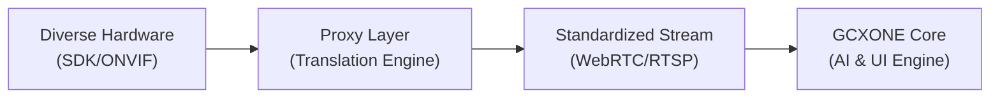

# ☁️ Cloud Architecture Overview

GCXONE is built on modern cloud-native principles to provide a unified Video Surveillance as a Service (VSaaS) and IoT security management ecosystem.

import Callout from '@site/src/components/Callout';
import Tabs from '@site/src/components/Tabs';
import TabItem from '@site/src/components/Tabs/TabItem';
import RelatedArticles from '@site/src/components/RelatedArticles';

## 1. The Core VSaaS Model

GCXONE operates entirely in the cloud, eliminating the complexity of traditional on-premise systems. By shifting to a SaaS model, organizations gain agility, scalability, and freedom from hardware maintenance.

- **No Local Servers:** Elimination of dedicated local NVR/DVR maintenance.
- **Infinite Scalability:** Add sites and cameras instantly without hitting physical hardware limits.
- **Centralized Management:** Deploy security patches and features globally in seconds.

---

## 2. Infrastructure Stack (AWS)

The platform is hosted on **Amazon Web Services (AWS)** using a containerized microservices architecture managed by **Kubernetes (EKS)**.

### Compute & Orchestration
- **Private EKS Clusters:** Core application logic runs on secure, private worker nodes.
- **Auto-Scaling:** Node groups adjust resources in real-time based on traffic and processing load.
- **Messaging:** Uses **Amazon MQ** for asynchronous event synchronization across the global platform.

### Storage & Data
- **Asset Storage:** Snapshots and icons are stored in encrypted **S3 Buckets**.
- **Metadata Management:** Uses scalable NoSQL databases for lightning-fast camera metadata retrieval.

---

## 3. The Universal Translator (Proxy Layer)

The "Proxy Architecture" is GCXONE's core innovation. It allows the platform to communicate with diverse hardware manufacturers (Hikvision, Dahua, Axis, etc.) by translating their proprietary protocols into a standardized unified command set.

<Callout type="tip" title="Technical Advantage">
The Proxy Layer removes the need for expensive hardware "bridges." Your cameras talk directly to the cloud via the GCXONE gateway.
</Callout>

---

## 4. Multi-Tenant Logical Hierarchy

Data isolation is enforced through a strict multi-tenant model. Each organization lives in a dedicated "Tenant" space, ensuring data privacy and granular access control.

1. 🏢 **Tenant:** The monitoring station or master org.
2. 👤 **Customer:** Individual client organizations.
3. 📍 **Site:** Physical facilities (e.g., Office, Warehouse).
4. 📟 **Device:** NVRs or Gateways at the site.
5. 🎥 **Sensor:** Individual camera channels or PIR sensors.

---

## 5. Security & Compliance

Security is integrated at the architectural level, not added as a bolt-on feature.

| Layer | Implementation |
| :--- | :--- |
| **Encryption** | Data at rest and in transit secured with **AES-256**. |
| **Access Gating** | **Jump Servers** and private VPCs isolate infrastructure from the public web. |
| **Authentication** | Integrated with **Auth0** for enterprise-grade MFA and SSO. |
| **Continuous Audit** | Every system call and operator action is logged in an immutable audit trail. |

---

## Related Articles

<RelatedArticles articles={[
  {
    title: "Platform Fundamentals",
    url: "/docs/platform-fundamentals/hierarchy-model",
    description: "Deep dive into the data model."
  },
  {
    title: "Required Ports",
    description: "Network requirements for cloud access."
  },
  {
    title: "Security Best Practices",
    url: "/docs/getting-started/cloud-architecture",
    description: "Securing your GCXONE instance."
  }
]} />

---

**Next:** [Developer Tools & API Integration](/docs/getting-started/first-time-login)
