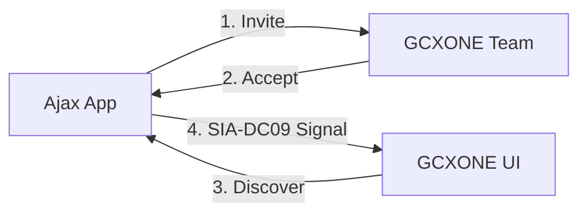

# 🛡️ Ajax Integration

Integrating **Ajax Systems** with GCXONE combines sleek, user-friendly security hardware with enterprise-grade cloud monitoring. This guide covers the invitation process, SIA-DC09 configuration, and account mapping.

import Callout from '@site/src/components/Callout';
import Steps from '@site/src/components/Steps';
import RelatedArticles from '@site/src/components/RelatedArticles';

---

## 📋 Prerequisites

Before starting, ensure you have:
- **Ajax PRO Desktop:** application installed on your PC or Mac.
- **Active Ajax Space:** with at least one Hub or NVR configured.
- **NXGEN Monitoring Access:** You will need to invite our technical account to your space.

---

## 🚦 Integration Workflow

---

## 🛠️ Step-by-Step Configuration

<Steps>

### 1. Invite NXGEN Technologies
Open **Ajax PRO Desktop** and navigate to:
**Space Settings** → **Security Companies** → **Invite via Email**.
- Enter: `ajax@nxgen.io`
- This allows our platform to "see" your devices for the discovery process.

### 2. Add Device in GCXONE
1. Log in to **GCXONE** → **Devices** → **Add Device**.
2. Select **Ajax Hub** or **Ajax NVR**.
3. Enter your **Hub ID** (found on the physical sticker or in the Ajax app).
4. Click **Discover**. GCXONE will automatically fetch all PIRs, door contacts, and cameras linked to that Hub.

### 3. Retrieve SIA-DC09 Details
Once the device is added in GCXONE, click **View** on the device entry. Note down:
- **Account Number**
- **Encryption Key** (if using encrypted transmission)
- **Receiver IP & Port**

### 4. Configure CMS Connection
Back in **Ajax PRO Desktop**, navigate to:
**Company** → **CMS connection** → **Add Receiver**.
- Enter the IP, Port, and Key retrieved in Step 3.
- <Callout type="important">Enable "Transfer device or group name to CMS events" to ensure alerts are human-readable in the operator buffer.</Callout>

### 5. Account Mapping
Navigate to: **Objects** → **[Select Your Site]** → **Maintenance**.
- Enter the **Account Number** exactly as displayed in GCXONE.
- This links the physical hardware signals to your digital site profile.

</Steps>

---

## 💡 Troubleshooting

- **Discovery Fails:** Ensure the `ajax@nxgen.io` invitation has been accepted. This usually takes less than 1 hour during business operations.
- **Signals Not Arriving:** Double-check the **Account Number**. If it mismatches by even one digit, the signals will be rejected by the cloud firewall.
- **No Video Verification:** Ensure you are using an **Ajax NVR** or **MotionCam (PhOD)** for visual alarm confirmation.

---

## Related Articles

<RelatedArticles articles={[
  {
    title: "Device Management",
    ,
    description: "Who can manage these integrations."
  },
  {
    title: "SIA DC-09 Standard",
    url: "/docs/platform-fundamentals/protocols/sia-dc09",
    description: "Technical details of the transmission protocol."
  }
]} />
