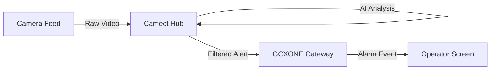

# 🤖 Camect AI Integration

**Camect** uses local AI to detect specific objects (people, cars, bikes) and filter out false alarms. This guide explains how to forward these "Smart Alerts" from your Camect Hub to the GCXONE Video Activity buffer.

import Callout from '@site/src/components/Callout';
import Steps from '@site/src/components/Steps';
import RelatedArticles from '@site/src/components/RelatedArticles';

---

## 📋 Prerequisites

- **Camect Hub:** Powered on and connected to your local network.
- **Admin Access:** You must have the admin password for the Camect Hub web interface.
- **NXGEN TCP Bridge:** `3.122.169.231:10520` (Our dedicated monitoring gateway).

---

## 🚦 Integration Workflow

---

## 🛠️ Configuration Steps

<Steps>

### 1. Dedicated Service User
Log in to your Camect Hub and navigate to **Users**.
- Create a user named **"NXGEN"**.
- **Grant Permissions:** Live View, Query Cameras, View Alerts, and View Footage.
- This account is used by GCXONE to pull the video stream during an alarm.

### 2. Configure Monitoring Gateway
Navigate to **Hub Settings** → **Alert**.
1. Click **Add Monitoring** and select **NXGEN**.
2. **Site ID:** Set to the ID provided in your GCXONE Site profile.
3. **TCP Address:** `3.122.169.231:10520`.
4. **Camera Selection:** Add each camera you want to forward to GCXONE.

### 3. Object Detection Selection
Ensure **Detect Alerts** is toggled **ON**. 
- Select the objects you want to trigger an alarm (e.g., Person, Vehicle, Bear).
- <Callout type="tip">Only select objects relevant to your security protocol to maintain a quiet, efficient alarm queue.</Callout>

### 4. Enable Substreams (Recommended)
High-resolution 4K streams can stutter over cloud connections. 
1. Navigate to **Camera Settings** → **Information**.
2. Set **Substream** to `1`.
3. This ensures smooth live playback for operators even on limited bandwidth.

### 5. Final Discovery in GCXONE
1. Log in to **GCXONE** → **Sites** → **Devices**.
2. Click **Add Device** and select **Camect**.
3. Enter the Hub Serial and the **NXGEN** user credentials.
4. Click **Discover**. GCXONE will sync all active cameras from the Hub.

</Steps>

---

## 💡 Troubleshooting

- **Buffer is Empty:** Verify that **Detect Alerts** is enabled and that you have clicked "Add Camera" in the Monitoring/NXGEN section.
- **Discovery Fails:** Ensure your local firewall allows outbound traffic on TCP Port **10520** to the NXGEN gateway.
- **No PTZ Control:** Ensure the **NXGEN** user in Camect has "Pan/Tilt Cameras" permission enabled.

---

## Related Articles

<RelatedArticles articles={[
  {
    title: "AI False Alarm Filtering",
    url: "/docs/platform-fundamentals/alarm-flow",
    description: "Best practices for object-based detection."
  },
  {
    title: "Bandwidth Requirements",
    url: "/docs/getting-started/bandwidth-requirements",
    description: "Sizing your upload for cloud VMS."
  }
]} />
