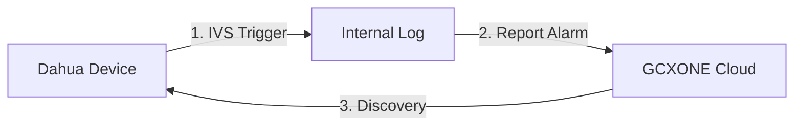

# 🎥 Dahua Integration

**Dahua Technology** devices provide robust edge analytics (IVS) that can be seamlessly integrated into the GCXONE Video Activity buffer. This guide focuses on setting up least-privilege users, IVS rules, and the critical reporting flag needed for signal transmission.

import Callout from '@site/src/components/Callout';
import Steps from '@site/src/components/Steps';
import RelatedArticles from '@site/src/components/RelatedArticles';

---

## 📋 Prerequisites

- **Dahua Camera/NVR:** Accessible via its web interface.
- **Admin Credentials:** Initial access to the Dahua system for user creation.
- **NTP Sync:** Device time must match GCXONE (use `time1.nxgen.cloud`).

---

## 🚦 Integration Workflow

---

## 🛠️ Configuration Steps

<Steps>

### 1. Dedicated Cloud User
Log in to the Dahua web interface and navigate to **Home** → **Accounts**.
- Create a user named **"NXGEN-SRV"**.
- **Grant Permissions:** Manual Control, System, Camera, System Info, and Event.
- This account ensures GCXONE has enough access to pull video without requiring full system admin rights.

### 2. Configure IVS (Intelligent Video System)
Navigate to **AI** → **Parameters** → **IVS**.
1. Select the target camera.
2. Click **+** to add a rule (e.g., **Tripwire** or **Intrusion**).
3. Draw your detection zone.
4. Set the **Target Filter** to **Human** and **Motor Vehicle** to minimize false alarms from animals or debris.

### 3. Enable Alarm Reporting
**CRITICAL STEP:** By default, Dahua devices do not "push" their local alarms to external receivers. 
1. Navigate to **More** → **Log** → **Report Alarm**.
2. Toggle this setting to **Enabled**.
3. Click **Save**.

### 4. Final Discovery in GCXONE
1. Log in to **GCXONE** → **Sites** → **Devices**.
2. Click **Add Device** and select **Dahua**.
3. Enter the Serial Number (P2P ID) and the **NXGEN-SRV** credentials.
4. **For NVRs:** select the specific **Channel** you wish to register.
5. Click **Discover**.

</Steps>

---

## 💡 Troubleshooting

- **Live View Stutters:** Decrease the substream bitrate in Dahua's **Video** settings. GCXONE defaults to the substream for efficient mobile and web viewing.
- **No Events in Video Activity:** Re-verify that **Report Alarm** is checked in the "Log" menu. Without this, no signals will reach our cloud.
- **Incorrect Timestamps:** Ensure the Dahua device is synced to an NTP server. Even a 60-second discrepancy can cause alarms to be "discarded" as stale data.

---

## Related Articles

<RelatedArticles articles={[
  {
    title: "IVS Best Practices",
    url: "/docs/platform-fundamentals/ai/ivs-tuning",
    description: "Optimizing Dahua tripwires for busy perimeters."
  },
  {
    title: "NTP Configuration",
    url: "/docs/getting-started/ntp-configuration",
    description: "Aligning device clocks with the cloud."
  }
]} />
