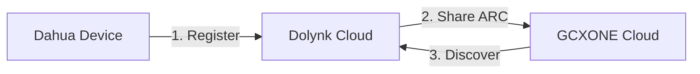

# ☁️ Dahua Dolynk Integration

**Dahua Dolynk** provides a cloud-to-cloud security bridge, allowing for easy integration without complex port forwarding. This guide walks you through setting up a **Dolynk Care** account and sharing your devices with the GCXONE Alarm Receiving Center (ARC).

import Callout from '@site/src/components/Callout';
import Steps from '@site/src/components/Steps';
import RelatedArticles from '@site/src/components/RelatedArticles';

---

## 📋 Prerequisites

- **Dolynk Care Account:** Registered at [care.dolynkcloud.com](https://care.dolynkcloud.com/).
- **Live Device:** Your Dahua hardware must be online and connected to the internet.
- **NXGEN Sharing Email:** `dev@nxgen.info` (Our ARC identifier).

---

## 🚦 Integration Workflow

---

## 🛠️ Configuration Steps

<Steps>

### 1. Site Creation in Dolynk
Log in to the **Dolynk Care** portal.
1. Navigate to **Site** and click **Add**.
2. Enter the Site Name and the correct **Timezone** (CRITICAL for log accuracy).

### 2. Device Registration
Within your new site, click **Add Device**.
- Choose **Serial Number (SN)** as the addition method.
- Enter the SN and verify that the device status turns **🟢 Online**.

### 3. ARC Sharing (Security Service)
To allow GCXONE to receive your alarms, you must designate us as your Security Service provider.
1. Click **Security Service** from the main menu.
2. Select your device and click **Next**.
3. In the "Company Name/Email" field, search for: `dev@nxgen.info`.
4. Select **NXGEN Technology AG** and click the **Shield Icon**.
5. Click **Apply**.

### 4. Final Discovery in GCXONE
1. Log in to **GCXONE** → **Sites** → **Devices**.
2. Click **Add Device** and select **Dahua Cloud**.
3. Enter the Serial Number (passed during ARC sharing) and credentials.
4. Click **Discover**. Virtual sensors will appear for all shared I/O and cameras.

</Steps>

---

## 💡 Troubleshooting

- **Company Not Found:** Ensure you are searching for `dev@nxgen.info` and NOT `ajax@nxgen.io`. They are separate service gateways.
- **Discovery Empty:** Verify the device is not "bound" to another Dolynk account. A Dahua device can only be owned by one primary Dolynk Care account.
- **Offline Status:** If the device shows offline in Dolynk, check your local ISP's P2P/Cloud connectivity settings.

---

## Related Articles

<RelatedArticles articles={[
  {
    title: "GCXONE & Talos Interaction",
    ,
    description: "How cloud signals are routed to operators."
  },
  {
    title: "Troubleshooting Time Sync",
    url: "/docs/getting-started/talos/time-sync-errors",
    description: "Aligning cloud and device clocks."
  }
]} />
