# First-Time Login & Setup

Welcome to NXGEN GCXONE. This comprehensive tutorial guides you through the complete process of setting up your account, configuring your organization, and establishing your first monitoring site. Whether you're new to cloud-based security platforms or migrating from traditional systems, this guide ensures you have a solid foundation for your security infrastructure.

import Callout from '@site/src/components/Callout';
import Steps from '@site/src/components/Steps';
import RelatedArticles from '@site/src/components/RelatedArticles';

<Callout type="info">
**Estimated Time:** 30-45 minutes  
**Prerequisites:** Valid business email, administrative access, and network connectivity  
**What You'll Learn:** Complete account setup, organization configuration, and initial device integration
</Callout>

---

## Overview

The first-time setup process involves five key phases that systematically build your security infrastructure:

1. **Account Activation** - Register and verify your account credentials
2. **Organization Setup** - Configure your company structure and hierarchy
3. **User Management** - Set up roles and permissions for team members
4. **Site Configuration** - Create your first monitoring location
5. **Device Integration** - Connect your security hardware to the platform

Each phase builds upon the previous one, ensuring a logical progression from basic account setup to full system operation.

---

## Prerequisites & Preparation

Before beginning the setup process, ensure you have the following ready:

### Network Requirements
- **Internet Connection:** Minimum 10 Mbps stable broadband connection
- **IP Whitelisting:** Administrative access to configure firewall rules
- **Port Availability:** Ensure ports 80, 443, 554, and 123 are open on your firewall
- **DNS Resolution:** Confirm your network can reach `nxgen.cloud` domain

### Account Requirements
- **Business Email:** Valid corporate email address for registration
- **Administrative Access:** Permission to configure network and security systems
- **Contact Information:** Primary and secondary contact details for account recovery

### Hardware Preparation
- **Workstation:** Modern web browser (Chrome, Edge, or Firefox) with JavaScript enabled
- **Device Credentials:** Administrator access credentials for your security devices
- **Documentation:** IP addresses, port numbers, and login credentials for all equipment
- **Network Information:** Subnet information and gateway addresses for device discovery

### System Requirements
- **Operating System:** Windows 10/11, macOS 10.15+, or Linux (Ubuntu 18.04+)
- **RAM:** Minimum 8GB (16GB recommended for optimal performance)
- **Storage:** 50GB available disk space for logs and temporary files
- **Display:** 1920x1080 minimum resolution for dashboard visibility

---

## Video Tutorial

  <video controls width="100%" style={{maxWidth: '800px'}}>
    <source src="/videos/first-time-login-setup.mp4" type="video/mp4" />
    Your browser does not support the video tag.
  </video>
  
<em>Complete First-Time Login & Setup Tutorial (15 minutes)</em>

---

## Phase 1: Account Registration & Activation

<Steps>

### Step 1: Access the Registration Portal
Navigate to the [GCXONE Portal](https://nxgen.cloud) using your preferred web browser.

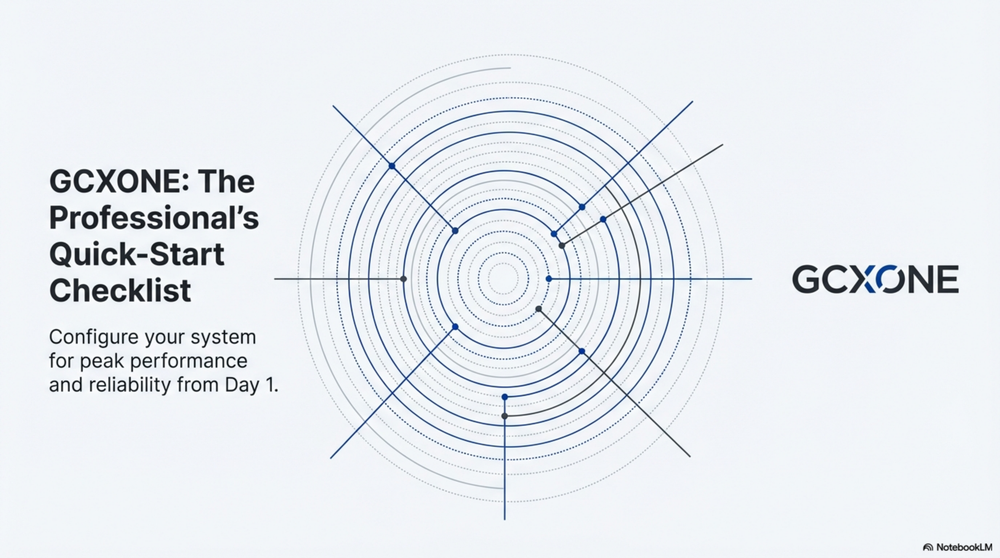

**What you'll see:**
- Clean, professional login interface
- Prominent "Register" button for new users
- Links to documentation and support resources
- Security badges and compliance indicators

### Step 2: Enter Registration Details
Click the **Register** button and complete the registration form with your organization information.

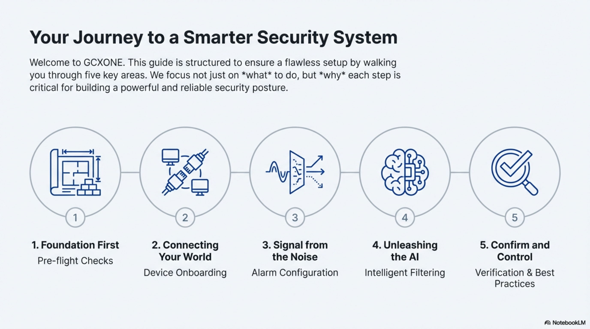

**Required Information:**
- **Full Name:** Your complete professional name as it appears on business documents
- **Business Email:** Corporate email address (personal emails not accepted)
- **Phone Number:** Direct contact number for account verification
- **Company Name:** Official legal business entity name
- **Industry:** Select from predefined security, retail, healthcare, education, and other sectors
- **Company Size:** Number of employees for appropriate service tier assignment

### Step 3: Choose Setup Path
Select your preferred configuration approach based on your current infrastructure.

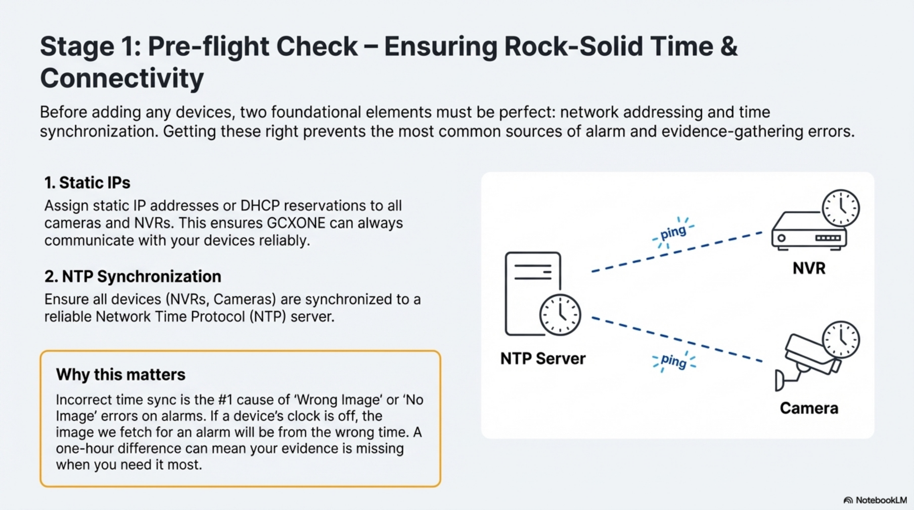

**Available Options:**
- **Existing Infrastructure:** For companies with current IP camera systems requiring migration
- **New Installation:** For greenfield security deployments with new equipment
- **Demo Environment:** For evaluation, training, and proof-of-concept purposes
- **Managed Service:** For organizations preferring vendor-managed setup

**Recommendation:** Choose "Existing Infrastructure" if you have cameras already installed, or "Demo Environment" to explore features before committing to hardware purchases.

</Steps>

---

## Phase 2: Account Verification & Password Setup

<Steps>

### Step 4: Email Verification
Check your email inbox (including spam/junk folders) for the verification message from `no-reply@nxgen.cloud`.

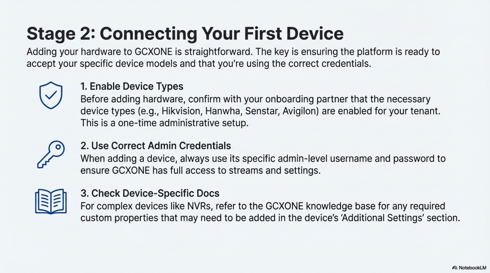

**Important Notes:**
- The verification link expires in 24 hours for security purposes
- If expired, use the "Resend Verification" link on the login page
- Verification is required before account activation
- Keep this email for your records as it contains important account information

**Troubleshooting Email Delivery:**
- Check spam/junk folders first
- Add `nxgen.cloud` to your email whitelist
- Corporate firewalls may block automated emails
- Contact IT department if emails are being filtered

### Step 5: Password Creation
Click the verification link to access the secure password setup page.

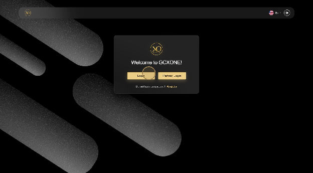

**Password Requirements:**
- Minimum 12 characters in length (longer passwords are more secure)
- At least one uppercase letter (A-Z)
- At least one lowercase letter (a-z)
- At least one number (0-9)
- At least one special character (!@#$%^&*)
- Cannot contain your email address or company name
- Cannot be a common dictionary word

**Password Best Practices:**
- Use a passphrase combining multiple words
- Consider using a password manager for secure storage
- Avoid reusing passwords from other systems
- Change password immediately if you suspect compromise

### Step 6: Initial Login
Return to the portal and log in using your newly created credentials.

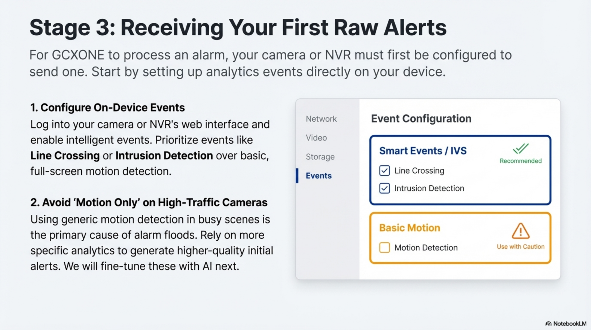

**First Login Experience:**
- Personalized welcome dashboard
- Interactive setup wizard with progress tracking
- Quick access tiles to key configuration areas
- Real-time notifications and system status indicators
- Guided tour options for new users

**Security Features:**
- Multi-factor authentication prompt (recommended)
- Session timeout warnings
- Secure cookie management
- Audit logging of login attempts

</Steps>

---

## Phase 3: Organization & Hierarchy Setup

<Steps>

### Step 7: Organization Configuration
Access the organization settings to establish your company structure and operational parameters.

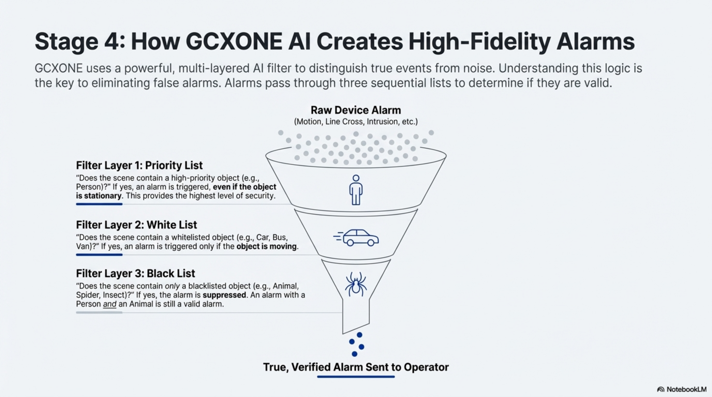

**Configuration Options:**
- **Company Details:** Legal name, address, tax information, and registration numbers
- **Billing Information:** Payment methods, billing contacts, and invoice preferences
- **Support Preferences:** Preferred communication channels and escalation procedures
- **Compliance Settings:** Industry-specific requirements and regulatory compliance options
- **Branding:** Company logo, colors, and custom messaging for user interfaces

**Organization Structure Considerations:**
- Define business units or divisions if applicable
- Set up cost centers for billing allocation
- Configure multi-tenant settings for managed service providers
- Establish data retention policies and backup procedures

### Step 8: Create Your First Customer
Set up your primary customer entity within the platform hierarchy.

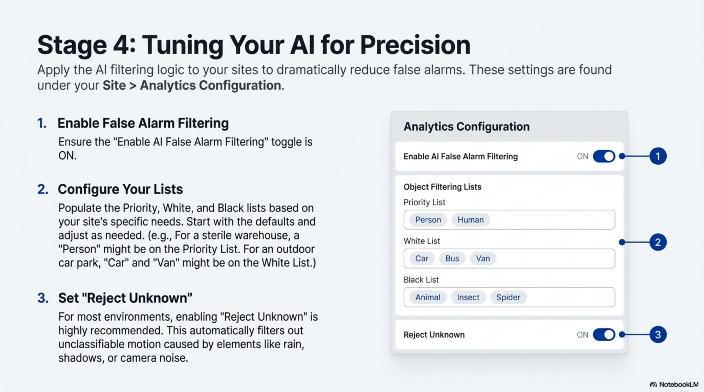

**Customer Information:**
- **Customer Name:** Official business entity name as registered
- **Contact Details:** Primary and secondary contacts with emergency numbers
- **Service Level:** Standard, Premium, or Enterprise based on requirements
- **Time Zone:** Local operating timezone for scheduling and reporting
- **Industry Classification:** For specialized feature sets and compliance requirements
- **Contract Details:** Service agreement references and support level agreements

**Customer Setup Best Practices:**
- Use consistent naming conventions across all customer records
- Include emergency contact information for critical situations
- Set appropriate service levels based on operational requirements
- Consider geographic distribution for efficient support routing

### Step 9: Site Establishment
Create your first physical monitoring location with detailed configuration.

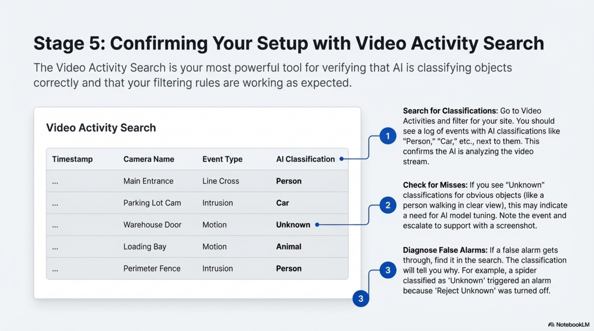

**Site Details:**
- **Site Name:** Descriptive location identifier (e.g., "Main Campus - Building A")
- **Physical Address:** Complete street address with postal code
- **Geographic Coordinates:** GPS coordinates for mapping and analytics
- **Operating Hours:** Business hours and holiday schedules
- **Site Type:** Campus, warehouse, retail, office, or specialized facility
- **Security Level:** Normal, high-security, or critical infrastructure designation

**Site Configuration Considerations:**
- Include detailed address information for emergency services
- Set appropriate operating hours for automated scheduling
- Consider geographic location for weather-related monitoring
- Plan for future expansion when naming sites

</Steps>

---

## Phase 4: User Management & Permissions

<Steps>

### Step 10: Role Definition
Configure user roles and access permissions before inviting team members to ensure proper security controls.

**Predefined Roles:**
- **System Administrator:** Full platform access with configuration and user management capabilities
- **Site Manager:** Location-specific administration with device management and reporting access
- **Security Operator:** Real-time monitoring and incident response capabilities
- **Viewer:** Read-only access for reports, analytics, and historical data review
- **Auditor:** Compliance and audit-focused access with limited operational controls

**Role-Based Access Control (RBAC) Principles:**
- Assign minimum necessary permissions for each role
- Regularly review and update role permissions
- Use role inheritance for hierarchical permission structures
- Implement approval workflows for sensitive operations

### Step 11: Custom Role Creation
Create specialized roles tailored to your organization's specific operational requirements.

**Role Customization Options:**
- **Permission Matrix:** Granular control over specific features and functions
- **Time Restrictions:** Business hours limitations and shift-based access
- **Geographic Limits:** Location-based access control for regional operations
- **Approval Workflows:** Multi-level authorization requirements for critical actions
- **Device Access:** Specific camera or sensor permissions by location or type
- **Reporting Access:** Customized dashboard and report visibility

**Advanced Role Features:**
- Conditional permissions based on time or location
- Temporary role elevation for specific tasks
- Audit logging of all permission changes
- Integration with external identity providers

### Step 12: User Invitations
Invite team members and assign appropriate roles with proper onboarding procedures.

**Invitation Methods:**
- **Bulk Import:** CSV upload for multiple users with role pre-assignment
- **Individual Invites:** Personal invitations with custom welcome messages
- **Role Assignment:** Immediate activation or pending approval workflow
- **Welcome Package:** Automatic access to training materials and documentation
- **Integration Options:** SSO integration with Active Directory or LDAP

**User Onboarding Process:**
- Automated welcome emails with login instructions
- Required training module completion
- Supervisor approval for role activation
- Temporary password generation with forced reset
- Progress tracking for new user setup completion

**Security Considerations:**
- Email verification required before account activation
- Password complexity enforcement
- Multi-factor authentication recommendations
- Account lockout policies for failed login attempts

</Steps>

---

## Phase 5: Device Integration & Testing

<Steps>

### Step 13: Device Discovery Setup
Begin connecting your security hardware to the platform using automated discovery tools.

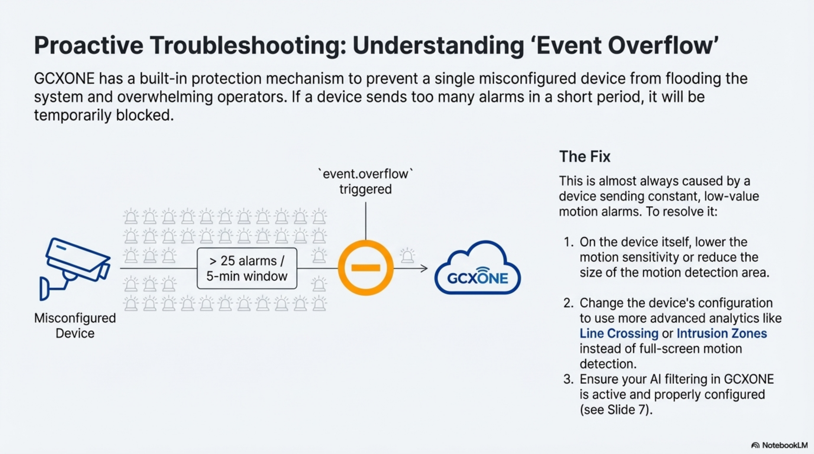

**Supported Manufacturers:**
- **Hikvision:** IP Cameras, NVRs, Thermal Cameras, Access Control
- **Dahua:** Full product line compatibility with AI analytics
- **Axis Communications:** PTZ and fixed cameras with audio support
- **Uniview:** Enterprise security solutions and large-scale deployments
- **Hanwha Techwin:** Wisenet series with advanced video analytics
- **Bosch:** Professional security systems integration
- **Pelco:** Sarix series cameras and management systems
- **Avigilon:** High-definition surveillance solutions

**Device Compatibility Considerations:**
- ONVIF Profile S and Profile T support required
- RTSP streaming capability for video access
- HTTP/HTTPS API access for configuration
- NTP support for time synchronization

### Step 14: Manual Device Addition
Add devices individually with detailed configuration when automatic discovery is not suitable.

**Device Parameters:**
- **IP Address:** Static IP assignment or DHCP reservation with fixed lease
- **Port Configuration:** RTSP (554), HTTP (80), HTTPS (443) port specifications
- **Authentication:** Secure username and password credentials
- **ONVIF Settings:** Protocol version, authentication method, and capabilities
- **Network Settings:** Gateway, subnet mask, DNS servers
- **Time Configuration:** NTP server settings for synchronization

**Manual Configuration Benefits:**
- Precise control over device settings
- Troubleshooting capability for discovery issues
- Support for devices behind complex network architectures
- Detailed logging of configuration changes

### Step 15: Auto-Discovery Process
Use intelligent discovery to automatically map your network and identify compatible devices.

**Discovery Features:**
- **Network Scanning:** Comprehensive subnet scanning with configurable ranges
- **Capability Mapping:** Automatic feature identification and configuration
- **Health Assessment:** Initial connectivity and performance testing
- **Batch Configuration:** Apply standardized settings to multiple similar devices
- **Progress Tracking:** Real-time status updates during discovery process
- **Error Handling:** Detailed logging of discovery failures and resolutions

**Discovery Best Practices:**
- Run discovery during low-traffic periods
- Segment large networks to avoid timeouts
- Verify firewall rules allow discovery traffic
- Test with a single device before full network scan
- Save discovery results for documentation and auditing

### Step 16: Validation & Testing
Perform comprehensive validation to ensure all systems are functioning correctly.

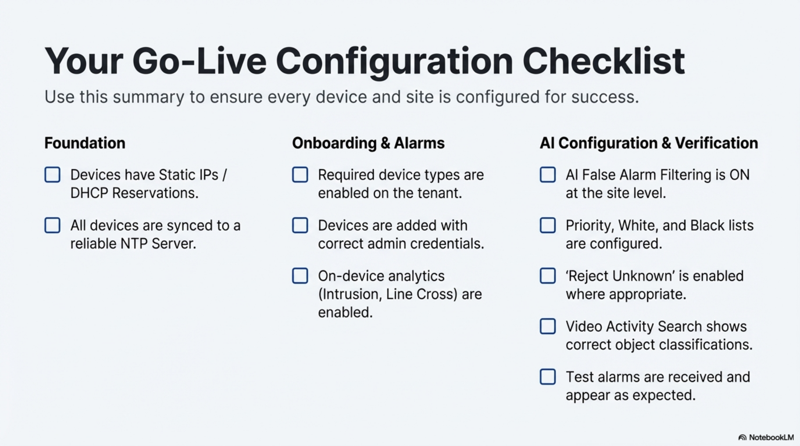

**Testing Checklist:**
- **Video Streams:** Real-time video verification at multiple resolutions
- **Audio Channels:** Two-way audio functionality and quality testing
- **Alarm Integration:** Event triggering and notification delivery verification
- **Recording:** Continuous recording and event-based capture validation
- **PTZ Controls:** Pan, tilt, zoom functionality for applicable cameras
- **Analytics:** Motion detection and video analytics performance
- **Network Performance:** Bandwidth utilization and latency measurements

**Validation Procedures:**
- Test from multiple client locations
- Verify during different times of day
- Document baseline performance metrics
- Establish monitoring thresholds for alerts

</Steps>

---

## Post-Setup Validation Checklist

Use this comprehensive checklist to ensure your setup is complete, functional, and ready for production use:

### Account & Access
- [ ] Email verification completed and confirmed
- [ ] Strong password configured meeting all requirements
- [ ] Multi-factor authentication enabled and tested
- [ ] Account recovery options configured with backup contact methods
- [ ] Login session tested from multiple devices and locations
- [ ] Password reset process verified

### Organization Structure
- [ ] Organization details fully configured with accurate information
- [ ] Primary customer created with complete contact information
- [ ] First site established with verified geographic coordinates
- [ ] Geographic information accurate and mapping functional
- [ ] Business hierarchy properly established
- [ ] Billing and contact information verified

### User Management
- [ ] Administrative roles properly defined with appropriate permissions
- [ ] Team members invited and accounts activated
- [ ] Permission levels appropriate for each user's responsibilities
- [ ] Role-based access control tested and validated
- [ ] User training materials distributed and acknowledged
- [ ] User onboarding process completed for all team members

### Device Integration
- [ ] Hardware credentials verified and securely stored
- [ ] Network connectivity confirmed from platform to all devices
- [ ] Video streams functional at required resolutions
- [ ] Audio channels operational (if applicable)
- [ ] Alarm events processing correctly
- [ ] Device health monitoring active
- [ ] Time synchronization verified across all devices

### System Configuration
- [ ] NTP configuration applied to all devices
- [ ] Firewall rules validated and documented
- [ ] Network bandwidth requirements verified
- [ ] Backup procedures established
- [ ] Monitoring thresholds configured
- [ ] Alert notifications tested

### Security Validation
- [ ] Access controls implemented according to security policy
- [ ] Audit logging enabled and functional
- [ ] Data encryption verified in transit and at rest
- [ ] Compliance requirements met for your industry
- [ ] Incident response procedures documented

---

## Best Practices & Optimization Tips

### Security First Approach
- **Password Management:** Implement enterprise-grade password policies with regular rotation
- **Access Reviews:** Conduct quarterly audits of user permissions and access patterns
- **Network Segmentation:** Maintain separate VLANs for security systems and general business traffic
- **Multi-Factor Authentication:** Require MFA for all administrative accounts
- **Least Privilege Principle:** Grant minimum necessary permissions for each role

### Performance Optimization
- **Bandwidth Planning:** Calculate requirements based on camera resolution, frame rates, and concurrent users
- **Storage Management:** Implement tiered retention policies for different content types
- **Load Balancing:** Distribute monitoring workloads across multiple operators and locations
- **Quality of Service:** Prioritize security traffic on network infrastructure
- **Caching Strategies:** Implement edge caching for frequently accessed content

### Operational Excellence
- **Standardized Naming:** Establish and enforce consistent naming conventions across all assets
- **Documentation:** Maintain detailed configuration records and change management procedures
- **Backup Procedures:** Implement regular automated backups with offsite replication
- **Monitoring:** Establish comprehensive system health monitoring and alerting
- **Training:** Provide ongoing training and certification for security operators

### Scalability Planning
- **Capacity Planning:** Monitor resource utilization trends and plan for growth
- **Modular Architecture:** Design systems to accommodate future expansion
- **Vendor Management:** Maintain relationships with multiple equipment suppliers
- **Technology Roadmap:** Stay informed about emerging security technologies

### Compliance & Audit
- **Regulatory Compliance:** Ensure systems meet industry-specific requirements
- **Audit Trails:** Maintain comprehensive logging of all system activities
- **Data Retention:** Implement appropriate data lifecycle management policies
- **Privacy Protection:** Safeguard personally identifiable information

---

## Troubleshooting Common Issues

### Account Activation Problems

**Issue:** Verification email not received
**Solutions:**
- Check spam/junk folders
- Add `no-reply@nxgen.cloud` to safe senders
- Request new verification email
- Verify email address accuracy

**Issue:** Password requirements not met
**Solutions:**
- Use password generator for complexity
- Avoid common words or personal information
- Ensure minimum 12-character length
- Include all required character types

### Login Difficulties

**Issue:** Cannot access login page
**Solutions:**
- Verify internet connectivity
- Check firewall settings for `nxgen.cloud`
- Clear browser cache and cookies
- Try alternative browsers
- Disable VPN if applicable

**Issue:** Session timeout issues
**Solutions:**
- Enable "Remember Me" for extended sessions
- Configure longer session timeouts in settings
- Check network stability
- Verify account status with support

### Organization Setup Challenges

**Issue:** Cannot create customer/site
**Solutions:**
- Verify administrative permissions
- Check organization limits
- Ensure required fields completed
- Contact support for account verification

### Device Integration Issues

**Issue:** Device discovery fails
**Solutions:**
- Verify network connectivity to device
- Check firewall rules for device ports
- Confirm correct credentials
- Test with direct IP access
- Verify ONVIF compatibility

**Issue:** Video stream not working
**Solutions:**
- Check RTSP port accessibility (554)
- Verify codec compatibility
- Test with different browsers
- Check bandwidth limitations
- Review camera configuration

---

## Quick Reference Tables

### Essential URLs & Ports

| Service | URL/Address | Purpose | Port | Protocol | Notes |
|---------|-------------|---------|------|----------|-------|
| **Main Portal** | `https://nxgen.cloud` | Primary login and dashboard | 443 | HTTPS | Main user interface |
| **Video Streaming** | Device-specific | Real-time video access | 554 | RTSP | Camera-specific endpoints |
| **API Gateway** | `api.nxgen.cloud` | REST API access | 443 | HTTPS | Programmatic access |
| **NTP Server** | `time1.nxgen.cloud` | Time synchronization | 123 | UDP | Global time sync |
| **WebSocket** | `ws.nxgen.cloud` | Real-time events | 443 | WSS | Live notifications |
| **SMTP Relay** | `smtp.nxgen.cloud` | Email notifications | 587 | SMTP | Alert delivery |

### Supported Device Manufacturers

| Manufacturer | Camera Types | Special Features | Integration Level | Notes |
|--------------|--------------|------------------|-------------------|-------|
| **Hikvision** | IP, PTZ, Thermal, ANPR | Deep analytics, thermal imaging | Full | Most popular choice |
| **Dahua** | Full range, AI cameras | AI analytics, facial recognition | Full | Comprehensive feature set |
| **Axis** | Professional series, PTZ | Audio integration,Zipstream | Full | High-quality audio |
| **Uniview** | Enterprise, large systems | Centralized management, AI | Full | Scalable deployments |
| **Hanwha** | Wisenet series, multi-sensor | Multi-sensor support, AI | Full | Advanced analytics |
| **Bosch** | Professional, AUTODOME | Intelligent tracking, audio | Full | Premium professional |
| **Pelco** | Sarix series, PTZ | SureVision, analytics | Full | Enterprise focus |
| **Avigilon** | HD surveillance | High-definition, analytics | Full | Performance optimized |

### User Role Permissions Matrix

| Feature | System Admin | Site Manager | Security Operator | Viewer | Auditor |
|---------|--------------|--------------|-------------------|--------|---------|
| User Management | ✅ Full | ❌ | ❌ | ❌ | ❌ |
| Device Configuration | ✅ Full | ✅ Site-level | ❌ | ❌ | ❌ |
| Organization Setup | ✅ Full | ❌ | ❌ | ❌ | ❌ |
| Live Video Access | ✅ All sites | ✅ Assigned sites | ✅ Assigned sites | ✅ Assigned sites | ✅ Assigned sites |
| Alarm Management | ✅ Full | ✅ Site alarms | ✅ Active response | ❌ | ✅ Read-only |
| Event Playback | ✅ All | ✅ Site events | ✅ Assigned events | ✅ Assigned events | ✅ All events |
| Reporting | ✅ Full | ✅ Site reports | ✅ Operational | ✅ Basic | ✅ Compliance |
| Configuration | ✅ System | ✅ Site settings | ❌ | ❌ | ❌ |
| Audit Logs | ✅ Full | ✅ Site logs | ❌ | ❌ | ✅ Full |
| API Access | ✅ Full | ✅ Limited | ❌ | ❌ | ✅ Read-only |

---

## 📞 Support & Next Steps

### Getting Help
- **Documentation:** Explore the full [GCXONE Documentation](/docs)
- **Video Tutorials:** Access training videos
- **Community Forum:** Join discussions in the community
- **Technical Support:** Contact support at support@nxgen.cloud

### Related Training
<RelatedArticles articles={[
  {
    title: "Quick Start Checklist",
    description: "Comprehensive checklist for complete platform setup."
  },
  {
    title: "IP Whitelisting Guide",
    description: "Configure your network for secure GCXONE access."
  },
  {
    title: "Firewall Configuration",
    description: "Complete network security setup for GCXONE."
  },
  {
    title: "Device Integration Overview",
    url: "/docs/device-integration/overview",
    description: "Connect and configure your security hardware."
  },
]} />

---

## What's Next?

Congratulations on completing your first-time setup! Here are your immediate next steps:

1. **Connect Your First Device** - Follow the [Device Integration Guide](/docs/device-integration/overview)
2. **Configure Alarm Rules** - Set up intelligent [Alarm Management](/docs/alarm-management/overview)
3. **Configure Alarm Rules** - Set up intelligent [Alarm Management](/docs/alarm-management/overview)

**Need immediate assistance?** Our support team is available 24/7 at support@nxgen.cloud or through the in-platform help system.
