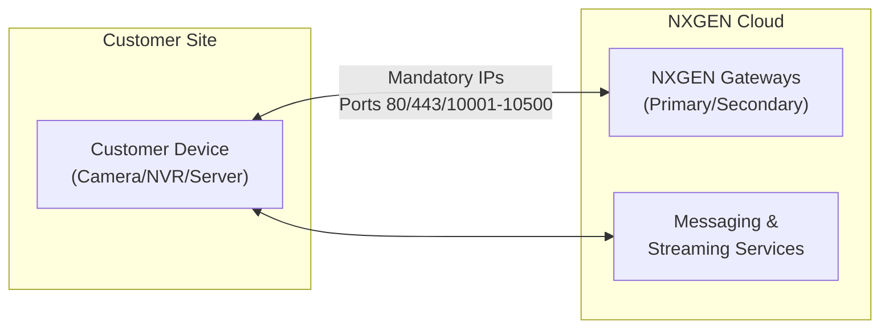

# IP Whitelisting Guide

To ensure seamless connectivity and secure communication between your devices and the NXGEN GCXONE platform, it is essential to whitelist specific IP addresses on your network's firewall.

## Overview

This guide provides a comprehensive list of mandatory and device-specific IP addresses that must be permitted to enable direct access and full functionality of the Genesis service.

---

## Mandatory IP Addresses

The following IP addresses are essential for the core platform functionality and **must** be whitelisted for all installations.

| Service                | IP Address      | Description       |
| :--------------------- | :-------------- | :---------------- |
| **Genesis Gateway**    | `18.185.17.113` | Primary Gateway   |
| **Genesis Gateway**    | `3.124.50.242`  | Secondary Gateway |
| **Streaming Gateway**  | `3.126.237.150` | Primary Gateway   |
| **Streaming Gateway**  | `3.75.73.51`    | Secondary Gateway |
| **Streaming Gateway**  | `18.156.39.63`  | Secondary Gateway |
| **Messaging Services** | `3.127.50.212`  | Core Messaging    |

---

## Device-Specific Gateways

Depending on the hardware you are using, please whitelist the corresponding IP addresses:

| Manufacturer        | IP Address      | Role                         |
| :------------------ | :-------------- | :--------------------------- |
| **Camect**          | `3.122.169.231` | Camect Alarm Receiver        |
| **Dahua**           | `52.59.60.20`   | Dahua Alarm Receiver         |
| **Hikvision**       | `35.156.60.98`  | Hikvision Alarm Receiver     |
| **Hanwha**          | `18.184.110.24` | Hanwha Alarm Receiver        |
| **Milestone**       | `3.66.98.181`   | Milestone Alarm Receiver     |
| **Uniview**         | `18.158.140.99` | Uniview Alarm Receiver       |
| **Heitel (Live)**   | `3.123.206.197` | Heitel Gateway 1             |
| **Heitel (Events)** | `3.124.38.48`   | Heitel Gateway 2             |
| **ADPRO**           | *On Request*    | Contact support for ADPRO IP |

---

## Talos Integration

For customers using Talos services, the following connections must be permitted:

### Inbound Connections
- `195.8.103.10`
- `195.8.103.11`
- `195.8.103.12`
- `193.151.94.10`
- `193.151.94.11`
- `193.151.94.12`

### Outbound Connections
- `91.240.18.20`
- `91.240.19.20`

### Wildcard Allow-List
Whitelist the following domains to support Talos application services:
- `*.evalink.io`
- `*.talos-app.io`
- `*.eu.auth0.com`

---

## Port Enabling Guidelines

While IP whitelisting handles the "who", you must also ensure the "how" by enabling the correct ports based on your device setup:

- **Web Console Ports**: Standard HTTP/HTTPS access.
- **Server Ports**: For backend synchronization.
- **RTSP Ports**: Essential for video streaming.

:::tip Need More Help?
If you have custom port-forwarding requirements or need further clarification, visit our [HelpDesk](https://helpdesk.nxgen.io/portal/en/kb/articles/ipwhitelist).
:::
