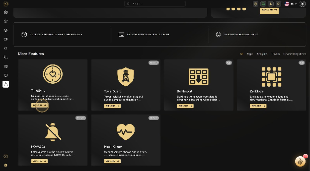
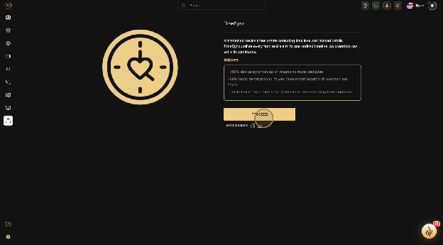
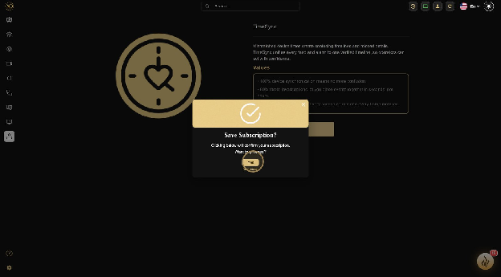
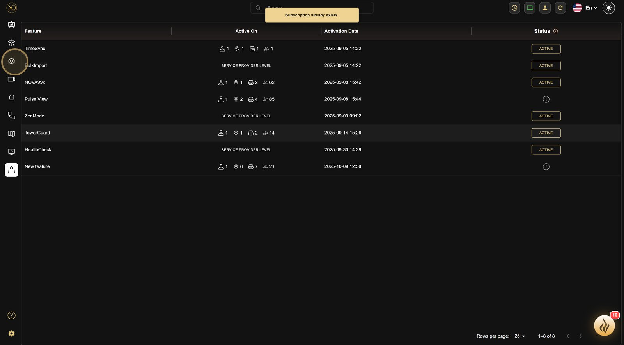
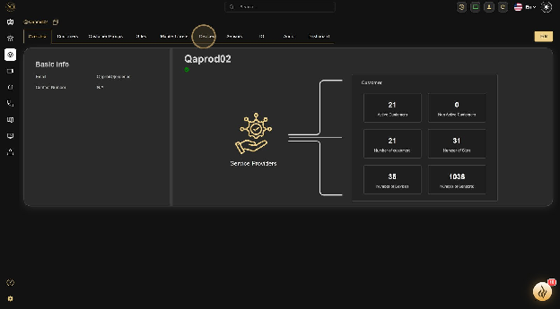
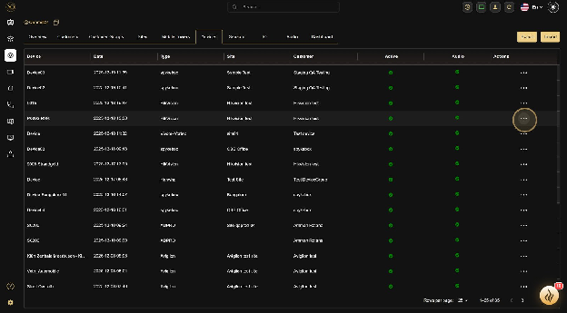
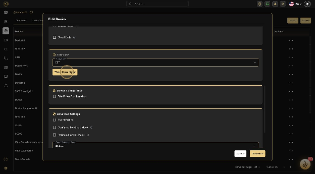
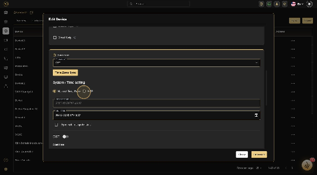
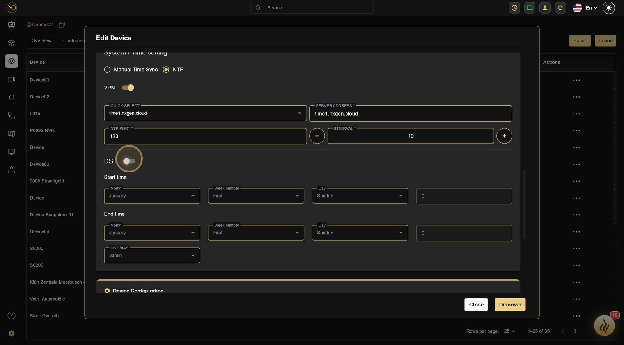
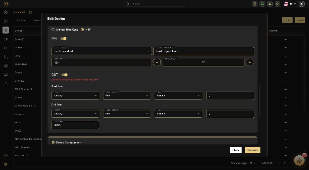

# NTP Server Configuration for GCXONE

Network Time Protocol (NTP) configuration is a **critical step** in setting up your security infrastructure within the **GCXONE** ecosystem. **Accurate time synchronization** ensures that event logs, video playback, and alarm triggers are perfectly aligned across all devices and the cloud platform. Discrepancies in time can lead to misaligned event sequences, playback errors, or difficulties in forensic investigations.

## Overview

NTP (Network Time Protocol) is a networking protocol used to synchronize clocks across computer networks. In the context of GCXONE, proper NTP configuration ensures that all devices—cameras, NVRs, routers, and the cloud platform—maintain consistent time, which is essential for:

- **Event Logging**: Accurate timestamps for security events
- **Video Playback**: Synchronized video streams and recordings
- **Alarm Triggers**: Precise timing for alarm events
- **Forensic Analysis**: Reliable timeline reconstruction
- **Compliance**: Meeting regulatory requirements for audit trails

## GCXONE NTP Server Addresses

Depending on your network connection type, use the following server addresses:

| Connection Type | NTP Server Address |
| :-------------- | :----------------- |
| **VPN Customers (Private DNS)** | `time1.nxgen.cloud` or `time2.nxgen.cloud` |
| **Non-VPN/Public Connections** | `timeext1.nxgen.cloud` |

:::tip Server Selection
For VPN customers, you can use either `time1.nxgen.cloud` or `time2.nxgen.cloud`. Both servers provide the same functionality and can be used as primary and secondary servers for redundancy.
:::

## Configuring TimeSync in GCXONE

Follow these step-by-step instructions to configure TimeSync for your devices in the GCXONE platform. Each step includes a screenshot showing the exact interface elements you'll interact with.

### Step 1: Access Marketplace

Start from the **Marketplace** to activate TimeSync.

### Step 2: Continue Setup

Proceed with the TimeSync activation process.

### Step 3: Complete Initial Setup

Finish the initial TimeSync activation steps.

### Step 4: Navigate to Configuration

Move to the **Configuration** section of the platform.

### Step 5: Access Devices Tab

Navigate to the **Devices** tab to view and manage your connected devices.

### Step 6: Edit Device Settings

Click **More** to edit the device settings for the device you want to configure.

### Step 7: Configure Time Zone Sync

Tap **Time Zone Sync** to align your device's clock with the correct location.

### Step 8: Configure NTP Settings

Access **NTP** settings to get the server information and complete the setup. Enter the appropriate NTP server address based on your connection type (see [GCXONE NTP Server Addresses](#gcxone-ntp-server-addresses) above).

### Step 9: Enable Daylight Saving Time

Toggle **Daylight Saving Time** to automatically adjust for seasonal changes. This is critical for maintaining accurate time throughout the year.

### Step 10: Complete Configuration

Finalize your NTP configuration settings.

:::warning Important
Always ensure that **Daylight Saving Time (DST)** is enabled on the device. Without this, your system will be one hour out of sync for half the year, leading to incorrect alarm timestamps.
:::

## Critical Best Practices

### Enable Daylight Saving Time

Always ensure that **Daylight Saving Time (DST)** is enabled on the device. Without this, your system will be one hour out of sync for half the year, leading to incorrect alarm timestamps and event logs.

### Firewall Whitelisting

Ensure your network firewall allows traffic to and from the **GCXONE** NTP servers:

- **Standard NTP**: Port **123 UDP** (most common)
- **Cloud Integration**: Some cloud integrations may use **HTTPS/443** for time sync

:::tip Firewall Configuration
If you're experiencing NTP synchronization issues, verify that your firewall rules allow outbound UDP traffic on port 123 to the NTP server addresses.
:::

### Stop Recording Before Manual Changes

If you must modify the time manually, **stop all recording operations first** to prevent database corruption or errors in the video timeline. Manual time changes can cause:

- Video timeline discontinuities
- Database inconsistencies
- Event log misalignment
- Playback errors

### Synchronization Interval

The recommended synchronization interval is **3600 seconds (60 minutes)**. This provides a good balance between:

- **Accuracy**: Frequent updates maintain precise time
- **Network Efficiency**: Not overloading the network with constant sync requests
- **Server Load**: Reasonable load on NTP servers

### Multiple NTP Servers

When configuring multiple NTP servers (primary and secondary), ensure both servers are reachable and properly configured. This provides redundancy in case one server becomes unavailable.

## Device-Specific NTP Configuration

### Teltonika Router NTP Client Configuration

By default, Teltonika routers block DNS resolution. If you intend to use DNS as the NTP server, you need to allow DNS resolution by disabling "Rebind protection" in the DNS options.

#### Step 1: Access Router Web Interface

1. Open a web browser and enter the router's IP address
2. Log in with your credentials

#### Step 2: Configure DNS Settings

1. Navigate to **Network > DNS**
2. Turn off **"Rebind protection"**
3. Save and apply the changes

#### Step 3: Configure NTP

1. Navigate to **NTP Settings** (usually found in "System" or "Services" section)
2. Enter multiple NTP server addresses:
   - **Primary**: `time1.nxgen.cloud`
   - **Secondary**: `time2.nxgen.cloud`
3. Specify the synchronization interval (recommended: 3600 seconds or 60 minutes for hourly synchronization)
4. Save or Apply changes

:::info DNS Configuration
For VPN customers using Teltonika routers, ensure DNS rebind protection is disabled to allow resolution of `time1.nxgen.cloud` and `time2.nxgen.cloud`.
:::

### Hikvision NVR NTP Client Configuration

#### Step 1: Access NVR Web Interface

1. Launch a web browser and enter the NVR's IP address
2. Log in using your credentials

#### Step 2: Navigate to System Settings

1. Look for the **"Configuration"** or **"System Settings"** option

#### Step 3: Configure NTP Settings

1. Locate the NTP settings in the **"Time Settings"** section
2. Enter the NTP server address: `time1.nxgen.cloud` (or `time2.nxgen.cloud` for redundancy)
3. Specify the synchronization interval if available (recommended: 3600 seconds for hourly synchronization)
4. Save or Apply changes

### Dahua Device NTP Client Configuration

#### Step 1: Access NVR Web Interface

1. Launch a web browser and enter the NVR's IP address
2. Log in using your credentials

#### Step 2: Navigate to System Settings

1. Look for the **"Configuration"** or **"System"** option

#### Step 3: Configure NTP Settings

1. Locate the NTP settings in the **"Date&Time"** section
2. Enter the NTP server address: `time1.nxgen.cloud` (or `time2.nxgen.cloud` for redundancy)
3. Specify the synchronization interval if available (recommended: 3600 seconds for hourly synchronization)
4. Save or Apply changes

## Additional Considerations

### Firewall Settings

Ensure that there are no firewall rules blocking NTP traffic to and from the specified NTP servers:
- `time1.nxgen.cloud`
- `time2.nxgen.cloud`
- `timeext1.nxgen.cloud` (for non-VPN connections)

NTP typically uses **UDP port 123**.

### Time Zone Settings

Verify and configure the correct time zone settings on the devices to ensure accurate time synchronization. This is critical for:
- Accurate event timestamps
- Proper alarm correlation
- Correct video playback timing

## Troubleshooting

### Device Not Synchronizing

If your device is not synchronizing with the NTP server:

1. **Verify Network Connectivity**: Ensure the device can reach the NTP server
2. **Check Firewall Rules**: Confirm that UDP port 123 is not blocked
3. **Verify DNS Resolution**: Test that the device can resolve `time1.nxgen.cloud` or `timeext1.nxgen.cloud`
4. **Check Server Address**: Ensure you're using the correct server address for your connection type
5. **Router DNS Settings**: For Teltonika routers, ensure "Rebind protection" is disabled

### Time Drift Issues

If you notice time drift (device time gradually becoming incorrect):

1. **Reduce Sync Interval**: Consider reducing the interval to 1800 seconds (30 minutes)
2. **Check Device Clock**: Verify the device's internal clock is functioning properly
3. **Verify NTP Status**: Check the device's NTP status page to confirm successful synchronization

### DNS Resolution Problems

For devices that cannot resolve the NTP server domain names:

1. **Use IP Address**: If DNS resolution fails, contact support for the direct IP addresses
2. **Check DNS Settings**: Verify the device's DNS server configuration
3. **Router Configuration**: For routers with strict DNS settings, ensure domain resolution is allowed

## Related Articles

- [Firewall Configuration Guide](/docs/getting-started/firewall-configuration)
- [IP Whitelisting Guide](/docs/getting-started/ip-whitelisting)
- [First-Time Login & Setup](/docs/getting-started/first-time-login)

## Need Help?

If you're experiencing issues with NTP configuration, check our [Troubleshooting Guide](/docs/troubleshooting) or [contact support](/docs/support).
