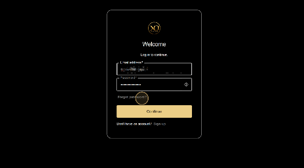
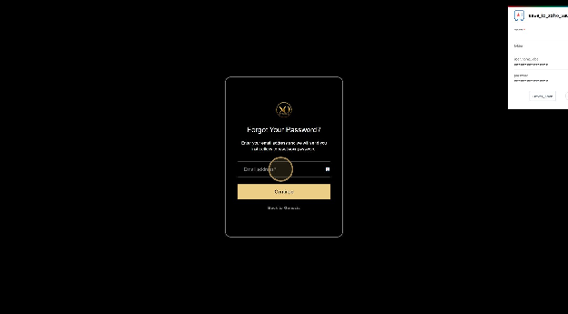
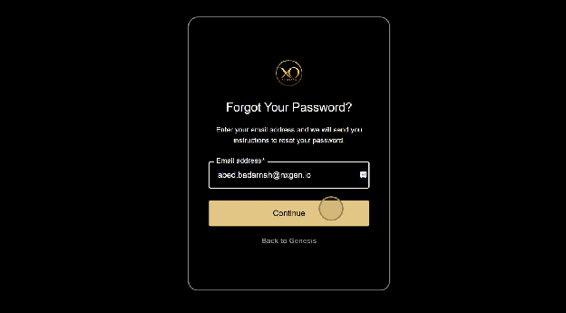
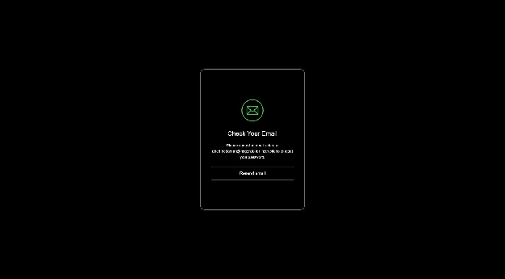

import Tabs from '@theme/Tabs';
import TabItem from '@theme/TabItem';

# Password Management

  

    

      Managing your GCXONE account password is essential for maintaining account security. This guide covers how to reset your password, create a strong password, and manage password settings.
    

  

  

    

      
🔐

      <h3 style={{color: 'white', margin: 0}}>Password</h3>
      
Secure Access

    

  

## Quick Access

  

    

      
🔄

      <h4>Reset Password</h4>
      
Forgot your password? Reset it quickly

    

  

  

    

      
🔒

      <h4>Strong Password</h4>
      
Create a secure password

    

  

  

    

      
⚙️

      <h4>Change Password</h4>
      
Update your existing password

    

  

## Password Reset Process

If you've forgotten your password or need to reset it for security reasons, follow these step-by-step instructions:

<Tabs>
  <TabItem value="step1" label="Step 1: Access Login" default>
    

      

        <h3>Step 1: Access the Login Page</h3>
      

      

        
Start by clicking <strong>Login</strong> on the GCXONE platform homepage.

        
      

    

  </TabItem>

  <TabItem value="step2" label="Step 2: Forgot Password">
    

      

        <h3>Step 2: Select Forgot Password</h3>
      

      

        
On the login page, select <strong>Forgot password?</strong> if you need help resetting your credentials.

        
      

    

  </TabItem>

  <TabItem value="step3" label="Step 3: Enter Email">
    

      

        <h3>Step 3: Enter Your Email Address</h3>
      

      

        
Enter your email address to receive a secure password reset link. Make sure you use the email address associated with your GCXONE account.

        
        

          <strong>Important:</strong> The password reset link will be sent to the email address associated with your account. If you don't receive the email, check your spam folder.
        

      

    

  </TabItem>

  <TabItem value="step4" label="Step 4: Continue">
    

      

        <h3>Step 4: Click Continue</h3>
      

      

        
Click <strong>Continue</strong> to instantly start the password reset process. A password reset link will be sent to your email address.

        
      

    

  </TabItem>

  <TabItem value="step5" label="Step 5: Check Email">
    

      

        <h3>Step 5: Check Your Email</h3>
      

      

        
Check your email inbox for the password reset link. Click the link in the email to proceed with resetting your password.

        
        

          <strong>Security Note:</strong> Password reset links typically expire after 24 hours. If the link has expired, you'll need to request a new password reset.
        

      

    

  </TabItem>
</Tabs>

## Creating a Strong Password

  <h2 className="text--center" style={{marginBottom: '1.5rem'}}>Password Requirements</h2>
  
  

    

      <h3>✅ Must Include</h3>
      <ul>
        <li><strong>At least 8 characters</strong> (12+ recommended)</li>
        <li><strong>Uppercase letters</strong> (A-Z)</li>
        <li><strong>Lowercase letters</strong> (a-z)</li>
        <li><strong>Numbers</strong> (0-9)</li>
        <li><strong>Special characters</strong> (!@#$%^&*)</li>
      </ul>
    

    

      <h3>❌ Must Avoid</h3>
      <ul>
        <li>Common words or phrases</li>
        <li>Personal information (name, birthday)</li>
        <li>Sequential characters (123, abc)</li>
        <li>Repeated characters (aaa, 111)</li>
        <li>Dictionary words</li>
      </ul>
    

  

### Password Strength Tips

  

    

      

        <h3>💡 Use a Passphrase</h3>
      

      

        
Combine multiple words with numbers and symbols:

        <code>Sunset@Beach2024!</code>
        
Easy to remember, hard to crack

      

    

  

  

    

      

        <h3>🔄 Use Unique Passwords</h3>
      

      

        
Never reuse passwords across different accounts. Each account should have its own unique password.

      

    

  

  

    

      

        <h3>🔐 Use a Password Manager</h3>
      

      

        
Consider using a password manager to generate and store strong, unique passwords for all your accounts.

      

    

  

## Changing Your Password

If you know your current password and want to change it:

1. **Log in to GCXONE** using your current credentials
2. **Navigate to Account Settings** or **Profile Settings**
3. **Select Change Password** or **Update Password**
4. **Enter your current password**
5. **Enter your new password** (twice for confirmation)
6. **Save your changes**

:::tip Password Update
It's recommended to change your password regularly, especially if you suspect it may have been compromised.
:::

## Multi-Factor Authentication (MFA)

  <h3 style={{color: 'white'}}>🔒 Enhanced Security</h3>
  
Consider enabling Multi-Factor Authentication (MFA) for additional account security. MFA requires a second form of verification in addition to your password.

  <ul style={{color: 'rgba(255,255,255,0.9)'}}>
    <li>✅ Significantly reduces the risk of unauthorized access</li>
    <li>✅ Protects your account even if your password is compromised</li>
    <li>✅ Required for certain administrative functions</li>
  </ul>

## Troubleshooting

  

    <h3>🔧 Common Issues</h3>
  

  

    <Tabs>
      <TabItem value="no-email" label="Didn't Receive Email" default>
        <ul>
          <li><strong>Check Spam Folder:</strong> Password reset emails may be filtered to spam</li>
          <li><strong>Verify Email Address:</strong> Ensure you're using the correct email address</li>
          <li><strong>Wait a Few Minutes:</strong> Emails can take 5-10 minutes to arrive</li>
          <li><strong>Request Again:</strong> If after 15 minutes you still haven't received it, try requesting again</li>
        </ul>
      </TabItem>

      <TabItem value="expired-link" label="Reset Link Expired">
        <ul>
          <li><strong>Request New Link:</strong> Password reset links typically expire after 24 hours</li>
          <li><strong>Use Recent Link:</strong> Only the most recent reset link is valid</li>
          <li><strong>Check Email Timestamp:</strong> Verify when the email was sent</li>
        </ul>
      </TabItem>

      <TabItem value="invalid-password" label="Password Not Accepted">
        <ul>
          <li><strong>Check Requirements:</strong> Ensure your password meets all requirements</li>
          <li><strong>Avoid Common Patterns:</strong> Don't use easily guessable passwords</li>
          <li><strong>Try Different Password:</strong> Some passwords may be blocked for security reasons</li>
        </ul>
      </TabItem>

      <TabItem value="locked-account" label="Account Locked">
        <ul>
          <li><strong>Too Many Attempts:</strong> Multiple failed login attempts may lock your account</li>
          <li><strong>Wait Period:</strong> Accounts are typically unlocked after 30 minutes</li>
          <li><strong>Contact Support:</strong> If your account remains locked, contact support</li>
        </ul>
      </TabItem>
    </Tabs>
  

## Best Practices

  

    

      

        <h3>✅ Do's</h3>
      

      

        <ul style={{fontSize: '0.9rem'}}>
          <li>Use a unique password for GCXONE</li>
          <li>Change your password regularly</li>
          <li>Enable MFA if available</li>
          <li>Use a password manager</li>
          <li>Keep your password confidential</li>
        </ul>
      

    

  

  

    

      

        <h3>❌ Don'ts</h3>
      

      

        <ul style={{fontSize: '0.9rem'}}>
          <li>Don't share your password with anyone</li>
          <li>Don't write passwords down in plain text</li>
          <li>Don't use the same password for multiple accounts</li>
          <li>Don't use personal information in passwords</li>
          <li>Don't ignore password reset emails</li>
        </ul>
      

    

  

## Security Reminders

  <strong>Important Security Information:</strong>
  <ul style={{marginTop: '0.5rem', marginBottom: 0}}>
    <li>GCXONE support staff will <strong>never</strong> ask for your password</li>
    <li>Always verify that password reset emails are from <code>@nxgen.cloud</code> or <code>@nxgen.io</code></li>
    <li>If you receive a suspicious password reset email you didn't request, contact support immediately</li>
    <li>Regularly review your account activity for any unauthorized access</li>
  </ul>

## Related Articles

- [First-Time Login & Setup](/docs/getting-started/first-time-login)
- [Multi-Tenant Architecture](/docs/platform-fundamentals/multi-tenant)
- [Quick Start Checklist](/docs/getting-started/quick-start-checklist)

---

## Need Help?

If you're experiencing issues with password management or account access, check our [Troubleshooting Guide](/docs/troubleshooting) or [contact support](/docs/support).
