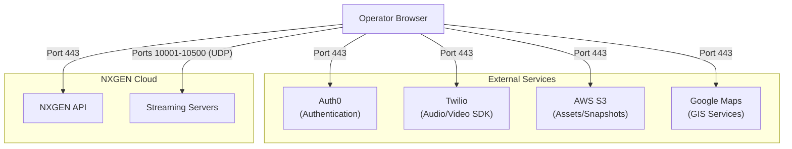

# Required Ports & Endpoints

To ensure the Genesis Web interface and operator services function correctly, specific ports and domains must be whitelisted on your organization's firewall. 

## Connectivity Overview

Modern web applications rely on a variety of services for authentication, video streaming, and real-time messaging. The diagram below illustrates the typical flow between an operator's browser and required endpoints.

---

## Required Ports & Protocols

Please ensure the following ports are open for both **TCP** and **UDP** traffic where applicable.

| Port              | Protocol    | Usage                                             |
| :---------------- | :---------- | :------------------------------------------------ |
| **80**            | HTTP        | Standard web traffic during redirect/initial load |
| **443**           | HTTPS / WSS | Secured web traffic, API calls, and WebSockets    |
| **10001 - 10500** | UDP / TCP   | High-performance video streaming communication    |

---

## Domain Whitelisting

The following domains must be allowed to ensure the Genesis platform can load all necessary resources, including fonts, maps, and media assets.

### Core Platform
- `*.nxgen.cloud` (Your specific tenant, e.g., `company.nxgen.cloud`)
- `api.nxgen.cloud`
- `monitor.nxgen.cloud`
- `streaming.nxgen.cloud`
- `streaming03.nxgen.cloud`

### Authentication (Auth0)
- `nxgen.eu.auth0.com`
- `cdn.auth0.com`
- `cdn.eu.auth0.com`
- `sitasys-prod.eu.auth0.com`

### Media & Assets (AWS)
- `events-snapshots.s3-eu-central-1.amazonaws.com`
- `nxgen-multi-language.s3.eu-central-1.amazonaws.com`
- `nxgen-organization-images.s3-eu-central-1.amazonaws.com`
- `nxgen-sensor-icons.s3-eu-central-1.amazonaws.com`

### GIS & Map Services
- `maps.googleapis.com`
- `khms0.googleapis.com`
- `khms1.googleapis.com`
- `assets.what3words.com`

### Communication (Twilio)
- `sdk.twilio.com`
- `chunderw-vpc-gll.twilio.com`
- `eventgw.us1.twilio.com`
- `genesisaudio.sip.twilio.com`

### Utilities & CDN
- `cdnjs.cloudflare.com`
- `use.fontawesome.com`
- `unpkg.com`
- `fonts.googleapis.com`
- `fonts.gstatic.com`
- `registry.npmjs.org`

---

## FAQ

**Q: Do I need to whitelist every Twilio domain?**
**A:** Yes, these are required for the integrated audio and video communication features to work across different network paths.

**Q: Why are so many ports needed for streaming (10001-10500)?**
**A:** These ports are used to establish high-concurrency, low-latency video streams via WebRTC.

:::info Advanced Setup
For specialized integrations like **Talos** or **evalink**, please refer to our [IP Whitelisting Guide](./ip-whitelisting).
:::
