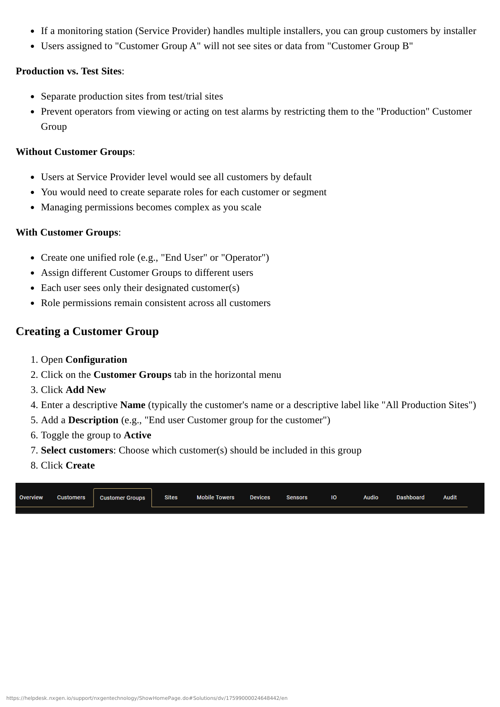
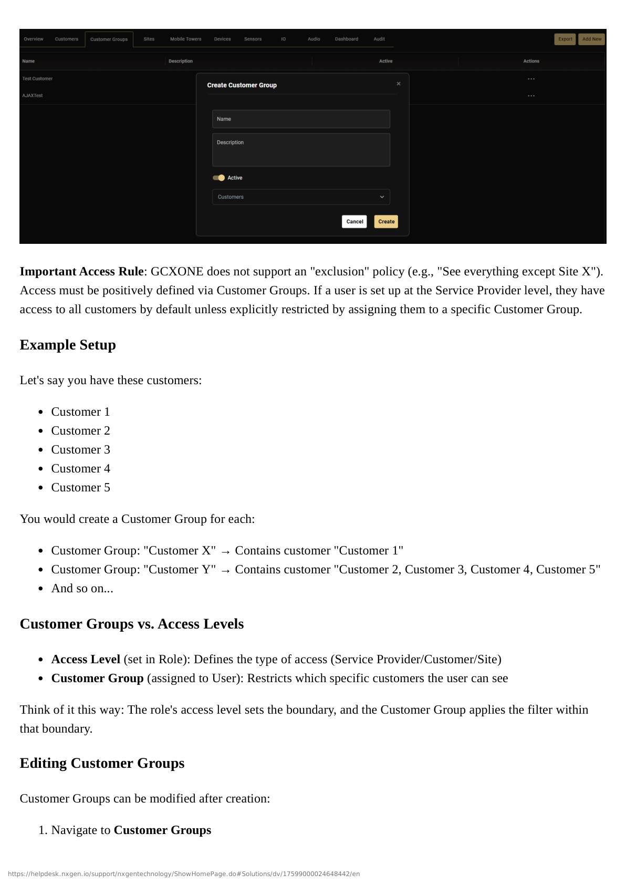
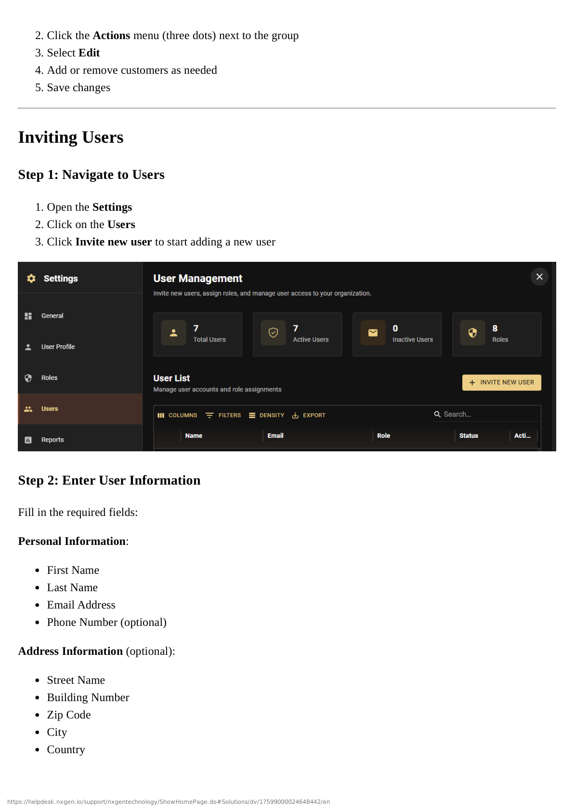
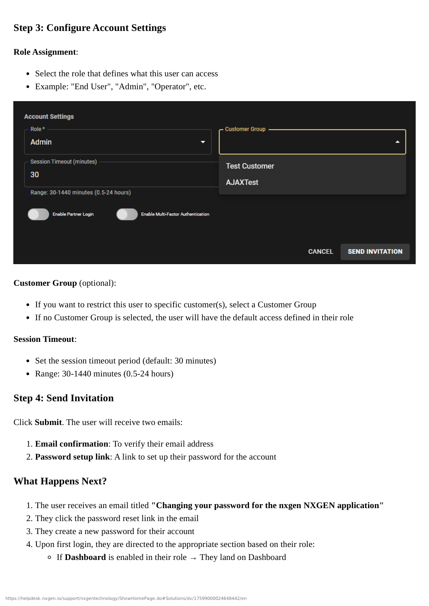
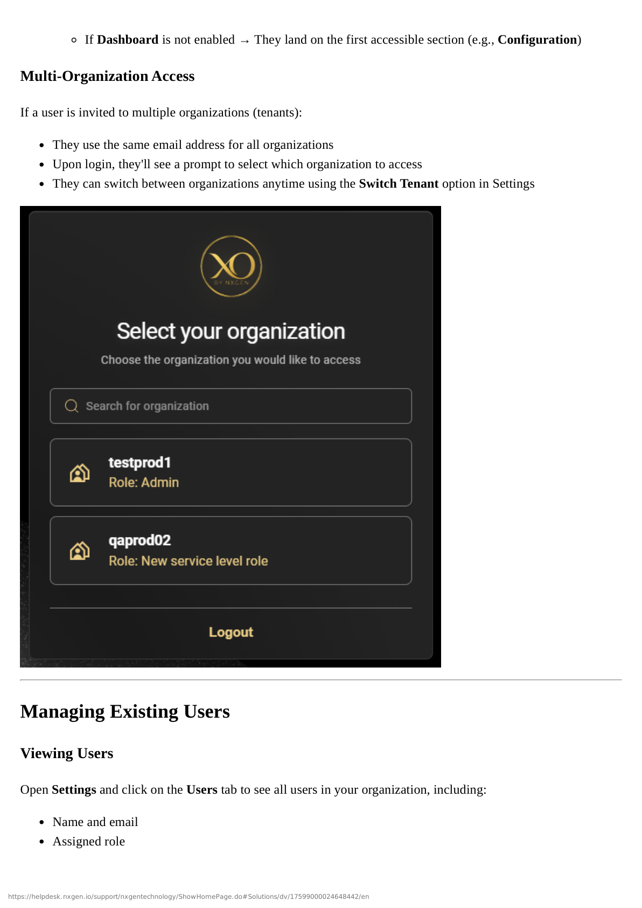
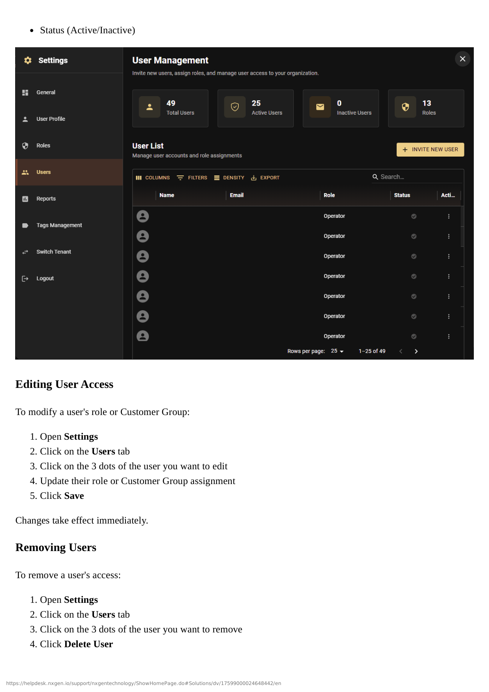
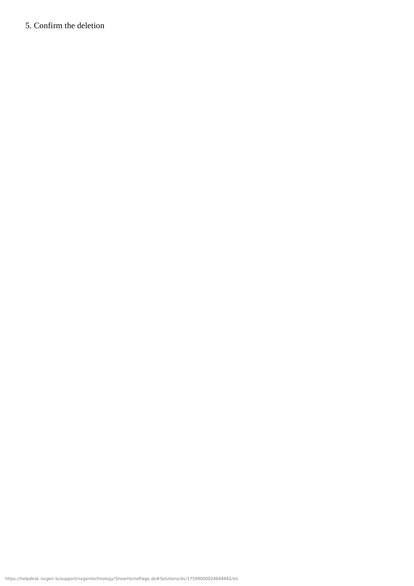

# Creating and Configuring Roles

This guide walks you through creating custom roles in GCXONE, configuring their privileges, setting access levels, and managing existing roles.

## Step 1: Navigate to Roles

1. Open **Settings** from the main navigation
2. Click on the **Roles** tab
3. Click **Configure new role** to create a new role

## Step 2: Define the Role

Enter the basic information for your new role:

1. **Role Name**: Enter a descriptive name (e.g., "End User", "Installer", "Operator")
2. **Description**: Add a brief description explaining the role's purpose

:::tip Naming Best Practice
Use clear, descriptive names that indicate the role's purpose. Examples:
- "End User - Customer Access"
- "Installer - Site Setup"
- "Operator - Alarm Processing"
:::

## Step 3: Configure Privileges

Select the specific privileges you want to assign to this role. Permissions in GCXONE are categorized by:

- **App**: Which applications the user can access
- **Category**: Specific sections within applications
- **Action**: What operations the user can perform (view, create, edit, delete)

### Privilege Categories

You'll configure privileges across these main categories:

#### Dashboard
- View dashboard
- Access analytics and reports

#### Configuration
- Device management
- Site configuration
- Customer Groups
- Mobile towers
- Sensors

#### Monitoring
- Live view access
- Alarm processing
- Event viewing

#### Reporting
- Generate reports
- View historical data
- Export data

#### Settings
- User management
- Role management
- System configuration

### Example Role Configurations

#### Company Admin Role
- ✅ Enable all privileges across all categories
- ✅ Full access to all settings
- ✅ User and role management

#### Operator Role
- ✅ Enable monitoring, alarm processing, and device management
- ✅ View dashboard and reports
- ❌ Disable system configuration
- ❌ Disable user management

#### End User Role
- ✅ Enable only Configuration and Dashboard for site control
- ✅ View their own sites
- ❌ No access to other customers
- ❌ No system settings

#### Installer Role
- ✅ Enable device setup, mobile towers, and sensors
- ✅ Site configuration access
- ❌ Disable reporting
- ❌ Disable user management

## Step 4: Set Access Level

Choose the appropriate access level for this role:

- **Service Provider**: For tenant-wide access
- **Customer**: For customer-specific access (can be further refined with Customer Groups)
- **Site**: For site-specific access

:::info Access Level Impact
The access level determines the scope of what users with this role can see. This is set at the role level and applies to all users assigned to this role.
:::

## Step 5: Configure Session Timeout

Set the session timeout duration (in minutes, default is 30 minutes):

- **Range**: 30-1440 minutes (0.5-24 hours)
- If GCXONE is unattended for the set time, the user is automatically logged out

:::important Session Timeout
Session timeouts are configured at the role level, not per individual user. All users assigned to this role will have the same session timeout setting.
:::

### Recommended Timeout Settings

| Role Type | Recommended Timeout | Reason |
|-----------|-------------------|--------|
| Admin | 60-120 minutes | Administrative tasks may take longer |
| Operator | 30-60 minutes | Security for monitoring stations |
| End User | 60-240 minutes | Customer convenience |
| Installer | 30-60 minutes | Field work may require brief interruptions |

## Step 6: Save the Role

Click **Save** to finalize the role setup. The role will immediately be available for user assignment.

:::success Role Created
Your new role is now available and can be assigned to users immediately.
:::

## Editing Existing Roles

Roles can be modified at any time:

1. Open **Settings**
2. Click on the **Roles** tab
3. Select the role you want to modify
4. Click **Edit**
5. Update privileges, access level, or session timeout as needed
6. Click **Save**

:::warning Important
Changes to roles take effect immediately and will apply to all users assigned to that role. Test role changes in a non-production environment first.
:::

### What Can Be Changed

- ✅ Privileges (permissions)
- ✅ Access level
- ✅ Session timeout
- ✅ Role name and description

### What Cannot Be Changed

- ❌ Role ID (internal identifier)
- ⚠️ Users must be reassigned if you delete a role

## Deleting Roles

Roles that are no longer needed can be deleted:

1. Open **Settings**
2. Click on the **Roles** tab
3. Select the role you want to delete
4. Click **Delete**
5. Confirm the deletion

:::danger Before Deleting
Ensure no active users are assigned to a role before deleting it, or reassign those users to a different role first.
:::

## Role Management Best Practices

:::tip Best Practice
**Document Your Roles**: Keep a record of what each custom role is designed for and which users have it assigned.
:::

:::tip Best Practice
**Start Simple**: Begin with default roles and only create custom roles when you have specific needs that defaults don't meet.
:::

:::tip Best Practice
**Test Before Deploying**: Create test users with new roles to verify permissions work as expected before assigning to production users.
:::

:::warning Security Best Practice
**Principle of Least Privilege**: Only grant the minimum permissions necessary for users to perform their job functions.
:::

## Troubleshooting

### Users Can't Access Expected Features

**Problem**: Users assigned to a role can't access features they should have.

**Solutions**:
1. Verify the role has the correct privileges enabled
2. Check the access level matches the user's needs
3. Ensure Customer Groups aren't restricting access too much
4. Verify the user is assigned to the correct role

### Role Changes Not Taking Effect

**Problem**: Changes to a role don't seem to apply to users.

**Solutions**:
1. Ensure you clicked **Save** after making changes
2. Have users log out and log back in
3. Check if users are assigned to multiple roles (they may need to be reassigned)

## Next Steps

Now that you've created roles, you can:

1. **[Set Up Customer Groups](./customer-groups)** - Learn how to use Customer Groups with your roles
2. **[Invite Users](./inviting-users)** - Start assigning users to your new roles
3. **[Manage Users](./managing-users)** - Learn how to view and modify user assignments

## Related Documentation

- [Understanding Roles and Access Levels](./roles-and-access-levels)
- [Customer Groups](./customer-groups)
- [Inviting Users](./inviting-users)
- [Permissions Matrix](/docs/admin-guide/permissions-matrix)

