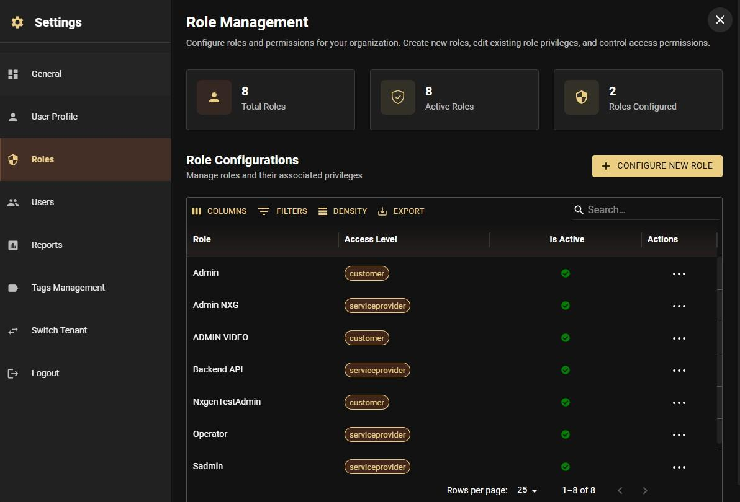
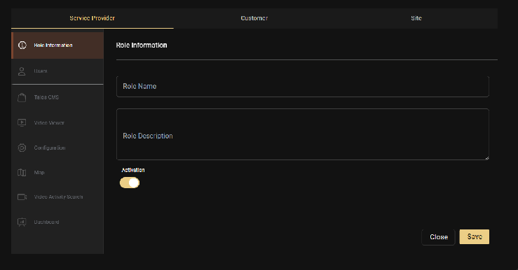
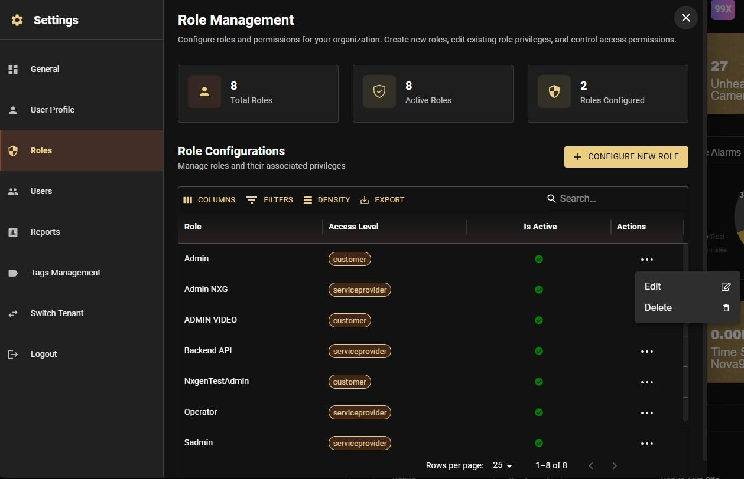

import Callout from '@site/src/components/Callout';
import RelatedArticles from '@site/src/components/RelatedArticles';

# Creating and Configuring Roles

Custom roles allow you to tailor GCXONE access to your specific operational needs. This guide covers everything you need to know about creating roles, configuring permissions, and setting access levels.

---

## Step 1: Navigate to Roles

1. Open **Settings**
2. Click on the **Roles** tab
3. Click **Configure new role** to create a new role

---

## Step 2: Define the Role

1. Enter a **Role Name** (e.g., "End User", "Installer", "Operator")
2. Add a brief **Description** explaining the role's purpose

---

## Step 3: Configure Privileges

Select the specific privileges you want to assign to this role. Permissions in GCXONE are categorized by:

- **App**: Which applications the user can access
- **Category**: Specific sections within applications
- **Action**: What operations the user can perform (view, create, edit, delete)

### Example Configurations

- **Company Admin Role**: Enable all privileges across all categories
- **Operator Role**: Enable monitoring, alarm processing, and device management; disable system configuration
- **End User Role**: Enable only Configuration and Dashboard for site control
- **Installer Role**: Enable device setup, mobile towers, and sensors; disable reporting and user management

---

## Step 4: Set Access Level

Choose the appropriate access level for this role:

- **Service Provider**: For tenant-wide access
- **Customer**: For customer-specific access (can be further refined with Customer Groups)
- **Site**: For site-specific access

---

## Step 5: Configure Session Timeout

Set the session timeout duration (in minutes, default is 30 minutes):

- **Range**: 30-1440 minutes (0.5-24 hours)
- If GCXONE is unattended for the set time, the user is automatically logged out

<Callout type="info" title="Important">
Session timeouts are configured at the role level, not per individual user. All users assigned to this role will have the same session timeout setting.
</Callout>

---

## Step 6: Save the Role

Click **Save** to finalize the role setup. It will immediately be available for user assignment.

---

## Editing Existing Roles

Roles can be modified at any time:

1. Open **Settings**
2. Click on the **Roles** tab
3. Select the role you want to modify
4. Click **Edit**
5. Update privileges, access level, or session timeout as needed
6. Click **Save**

<Callout type="warning" title="Immediate Effect">
Changes to roles take effect immediately and will apply to all users assigned to that role.
</Callout>

---

## Deleting Roles

Roles that are no longer needed can be deleted. Ensure no active users are assigned to a role before deleting it, or reassign those users to a different role first.

---

## Best Practices

- **Document Custom Roles**: Keep a list of why a custom role was created to avoid "Role Bloat."
- **Least Privilege**: Start with zero permissions and add only what the user needs to do their job.
- **Test Before Deployment**: Create a "dummy" user with the new role to verify the sidebar only shows the intended apps.
- **Use Default Roles First**: Always start with Default Roles (Company Admin, Manager, Operator). Only create custom roles if your business requires a highly niche set of permissions.

---

## Related Articles

<RelatedArticles articles={[
  {
    title: "Roles and Access Levels",
    ,
    description: "Understanding default roles and access level hierarchy."
  },
  {
    title: "Customer Groups",
    ,
    description: "Using customer groups to refine access within access levels."
  },
  {
    title: "User Management Overview",
    description: "High-level summary of RBAC and user management."
  }
]} />

---

**Next:** 
