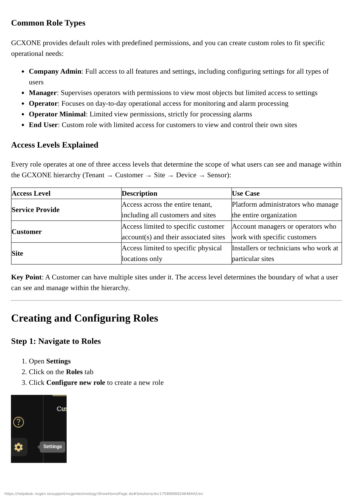

# Customer Groups

Customer Groups provide a flexible way to control which customers a user can access without creating separate roles for each customer. This is particularly useful when you have multiple customers and want to use standardized roles.

## What Are Customer Groups?

Customer Groups provide a mechanism to restrict the visibility and access of specific users to a subset of data within a tenant. This is particularly useful for:

- **Segregating Customer Data**: Separate different customers' data from each other
- **Production vs. Test Sites**: Keep production and test environments separate
- **Scalable Access Control**: Use one role with different Customer Groups for different users

## Purpose and Benefits

### Segregating Customer Data

If a monitoring station (Service Provider) handles multiple installers, you can group customers by installer. Users assigned to "Customer Group A" will not see sites or data from "Customer Group B".

**Example Scenario:**
- Installer A manages Customer 1, 2, 3
- Installer B manages Customer 4, 5, 6
- Create two Customer Groups to separate access

### Production vs. Test Sites

Separate production sites from test/trial sites. Prevent operators from viewing or acting on test alarms by restricting them to the "Production" Customer Group.

**Example Scenario:**
- Production Customer Group: Contains all live customer sites
- Test Customer Group: Contains test/trial sites
- Operators assigned to Production Group won't see test alarms

### Without Customer Groups

- Users at Service Provider level would see all customers by default
- You would need to create separate roles for each customer or segment
- Managing permissions becomes complex as you scale

### With Customer Groups

- Create one unified role (e.g., "End User" or "Operator")
- Assign different Customer Groups to different users
- Each user sees only their designated customer(s)
- Role permissions remain consistent across all customers

## Creating a Customer Group

Follow these steps to create a new Customer Group:

1. Open **Configuration** from the main navigation
2. Click on the **Customer Groups** tab in the horizontal menu
3. Click **Add New**
4. Enter a descriptive **Name** (typically the customer's name or a descriptive label like "All Production Sites")
5. Add a **Description** (e.g., "End user Customer group for the customer")
6. Toggle the group to **Active**
7. **Select customers**: Choose which customer(s) should be included in this group
8. Click **Create**

### Naming Conventions

Use clear, descriptive names for Customer Groups:

**Good Examples:**
- "Customer A - Production"
- "All Production Sites"
- "Installer B Customers"
- "Test Environment"

**Avoid:**
- "Group 1"
- "Customer Group"
- "New Group"

## Example Setup

Let's say you have these customers:
- Customer 1
- Customer 2
- Customer 3
- Customer 4
- Customer 5

You would create Customer Groups like:

**Customer Group: "Customer X"**
- Contains: Customer 1
- Purpose: Dedicated group for Customer 1

**Customer Group: "Customer Y"**
- Contains: Customer 2, Customer 3, Customer 4, Customer 5
- Purpose: Group multiple related customers together

**Customer Group: "All Production"**
- Contains: Customer 1, Customer 2, Customer 3
- Purpose: Production sites only

**Customer Group: "Test Environment"**
- Contains: Customer 4, Customer 5
- Purpose: Test/trial sites

## Customer Groups vs. Access Levels

It's important to understand how Customer Groups work with Access Levels:

| Concept | Purpose | Set At |
|---------|---------|--------|
| **Access Level** (set in Role) | Defines the type of access (Service Provider/Customer/Site) | Role configuration |
| **Customer Group** (assigned to User) | Restricts which specific customers the user can see | User assignment |

:::info How They Work Together
Think of it this way: The role's access level sets the boundary, and the Customer Group applies the filter within that boundary.

- **Access Level = Boundary** (Service Provider sees all, Customer sees assigned customers, Site sees assigned sites)
- **Customer Group = Filter** (Which specific customers within that boundary)
:::

### Example Combinations

**Scenario 1: Service Provider with Customer Group**
- Role Access Level: Service Provider
- Customer Group: "Customer A Group"
- Result: User sees only Customer A (even though Service Provider level normally shows all)

**Scenario 2: Customer Level with Customer Group**
- Role Access Level: Customer
- Customer Group: "Customer B Group"
- Result: User sees only customers in Customer B Group

**Scenario 3: Site Level**
- Role Access Level: Site
- Customer Group: N/A (not used at Site level)
- Result: User sees only the specific site assigned

## Access Rules

:::important Access Rule
GCXONE does not support an "exclusion" policy (e.g., "See everything except Site X"). Access must be positively defined via Customer Groups. If a user is set up at the Service Provider level, they have access to all customers by default unless explicitly restricted by assigning them to a specific Customer Group.
:::

### Key Rules

1. **Positive Definition Only**: You can only specify what users CAN see, not what they CAN'T see
2. **Service Provider Default**: Service Provider level users see all customers unless assigned to a Customer Group
3. **Customer Group Override**: Assigning a Customer Group restricts access to only those customers
4. **Site Level Exception**: Customer Groups don't apply to Site-level access

## Editing Customer Groups

Customer Groups can be modified after creation:

1. Navigate to **Configuration** → **Customer Groups**
2. Click the **Actions** menu (three dots) next to the group
3. Select **Edit**
4. Add or remove customers as needed
5. Update name or description if needed
6. Save changes

:::warning Impact of Changes
Changes to Customer Groups take effect immediately. Users will see updated customer access on their next page refresh or login.
:::

## Assigning Customer Groups to Users

When inviting or editing a user:

1. In the user configuration, find the **Customer Group** field
2. Select the appropriate Customer Group from the dropdown
3. If no Customer Group is selected, the user will have the default access defined in their role
4. Save the user configuration

:::tip Best Practice
Document which Customer Groups are assigned to which users for easier management and troubleshooting.
:::

## Use Cases

### Use Case 1: Multiple Installers

**Situation**: A monitoring station works with multiple installers, each managing different customers.

**Solution**:
- Create a Customer Group for each installer
- Assign users to the appropriate Customer Group
- Each installer's users only see their own customers

### Use Case 2: Production vs. Test

**Situation**: You have production sites and test sites that should be kept separate.

**Solution**:
- Create "Production" Customer Group with production customers
- Create "Test" Customer Group with test customers
- Assign operators to Production Group only
- Test users can be assigned to Test Group

### Use Case 3: Regional Separation

**Situation**: You have customers in different regions that should be managed by different teams.

**Solution**:
- Create "Region A" Customer Group
- Create "Region B" Customer Group
- Assign regional teams to their respective groups

## Best Practices

:::tip Best Practice
**One Role, Multiple Groups**: Use one standardized role (e.g., "Operator") with different Customer Groups rather than creating separate roles for each customer.
:::

:::tip Best Practice
**Clear Naming**: Use descriptive names that indicate the purpose of the Customer Group.
:::

:::tip Best Practice
**Document Groups**: Keep a record of which customers are in which groups and why.
:::

:::warning Security Best Practice
**Regular Audits**: Periodically review Customer Group assignments to ensure users only have access to appropriate customers.
:::

## Troubleshooting

### User Can't See Expected Customers

**Problem**: A user should see certain customers but they don't appear.

**Solutions**:
1. Verify the Customer Group contains the correct customers
2. Check the user is assigned to the correct Customer Group
3. Verify the role's Access Level allows customer-level access
4. Ensure the Customer Group is set to Active

### User Sees Too Many Customers

**Problem**: A user sees customers they shouldn't have access to.

**Solutions**:
1. Verify the user is assigned to a Customer Group
2. Check the Customer Group only contains appropriate customers
3. Verify the role's Access Level (Service Provider sees all by default)

## Next Steps

Now that you understand Customer Groups, you can:

1. **[Invite Users](./inviting-users)** - Learn how to assign Customer Groups when inviting users
2. **[Manage Users](./managing-users)** - See how to modify Customer Group assignments for existing users
3. **[Creating Roles](./creating-roles)** - Understand how Access Levels work with Customer Groups

## Related Documentation

- [Understanding Roles and Access Levels](./roles-and-access-levels)
- [Creating and Configuring Roles](./creating-roles)
- [Inviting Users](./inviting-users)
- [Managing Users](./managing-users)

