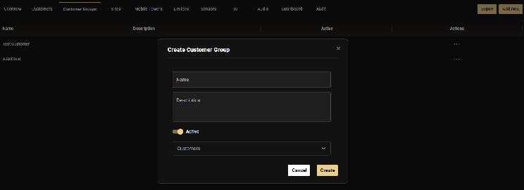

import Callout from '@site/src/components/Callout';
import RelatedArticles from '@site/src/components/RelatedArticles';

# Customer Groups

Customer Groups are the primary tool for segregating data within a single Tenant. They allow you to define which specific customers a user can see without needing to create hundreds of individual roles.

---

## What Are Customer Groups?

Customer Groups provide a flexible way to control which customers a user can access without creating separate roles for each customer. This is particularly useful when you have multiple customers and want to use standardized roles.

---

## Purpose and Benefits

Customer Groups provide a mechanism to restrict the visibility and access of specific users to a subset of data within a tenant. This is particularly useful for:

### Segregating Customer Data

- If a monitoring station (Service Provider) handles multiple installers, you can group customers by installer
- Users assigned to "Customer Group A" will not see sites or data from "Customer Group B"

### Production vs. Test Sites

- Separate production sites from test/trial sites
- Prevent operators from viewing or acting on test alarms by restricting them to the "Production" Customer Group

### Without Customer Groups

- Users at Service Provider level would see all customers by default
- You would need to create separate roles for each customer or segment
- Managing permissions becomes complex as you scale

### With Customer Groups

- Create one unified role (e.g., "End User" or "Operator")
- Assign different Customer Groups to different users
- Each user sees only their designated customer(s)
- Role permissions remain consistent across all customers

---

## Creating a Customer Group

1. Open **Configuration**
2. Click on the **Customer Groups** tab in the horizontal menu
3. Click **Add New**
4. Enter a descriptive **Name** (typically the customer's name or a descriptive label like "All Production Sites")
5. Add a **Description** (e.g., "End user Customer group for the customer")
6. Toggle the group to **Active**
7. **Select customers**: Choose which customer(s) should be included in this group
8. Click **Create**

<Callout type="important" title="Important Access Rule">
GCXONE does not support an "exclusion" policy (e.g., "See everything except Site X"). Access must be positively defined via Customer Groups. If a user is set up at the Service Provider level, they have access to all customers by default unless explicitly restricted by assigning them to a specific Customer Group.
</Callout>

---

## Customer Groups vs. Access Levels

- **Access Level** (set in Role): Defines the type of access (Service Provider/Customer/Site)
- **Customer Group** (assigned to User): Restricts which specific customers the user can see

Think of it this way: The role's access level sets the boundary, and the Customer Group applies the filter within that boundary.

---

## Editing Customer Groups

Customer Groups can be modified after creation:

1. Navigate to **Customer Groups**
2. Click the **Actions** menu (three dots) next to the group
3. Select **Edit**
4. Add or remove customers as needed
5. Save changes

---

## Use Case Example: Test vs. Production Setup

To protect your operators from false alerts during system maintenance:

1. Create a group called **"Production Only"** and add all live billing clients.
2. Create a group called **"Staging/Test"** and add your internal test sites.
3. Assign your daily monitoring staff to the **Production Only** group.
4. Assign your technicians to the **Staging/Test** group.

---

## Related Articles

<RelatedArticles articles={[
  {
    title: "Roles and Access Levels",
    url: "/docs/getting-started/user-management/roles-and-access-levels",
    description: "Understanding the hierarchy boundary."
  },
  {
    title: "Inviting Users",
    url: "/docs/getting-started/user-management/inviting-users",
    description: "Assigning groups during onboarding."
  }
]} />

---

**Next:** [Inviting Users to the Platform](/docs/getting-started/user-management/inviting-users)
