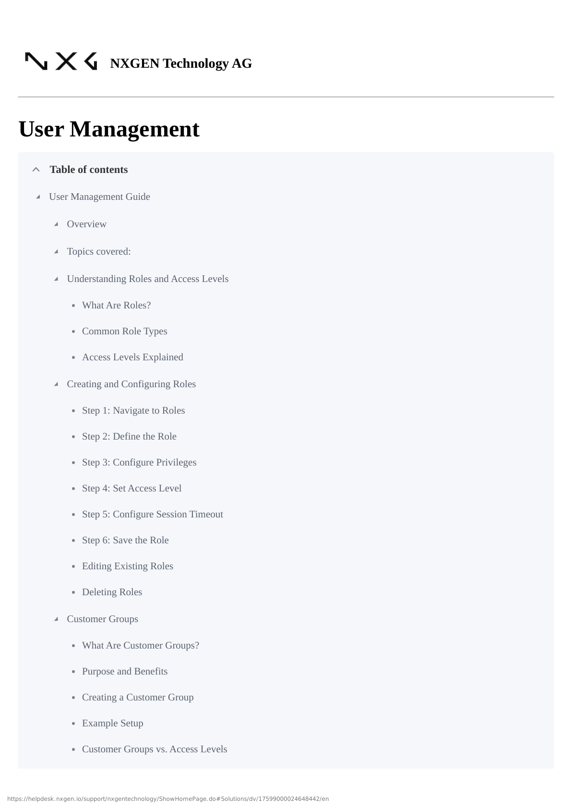
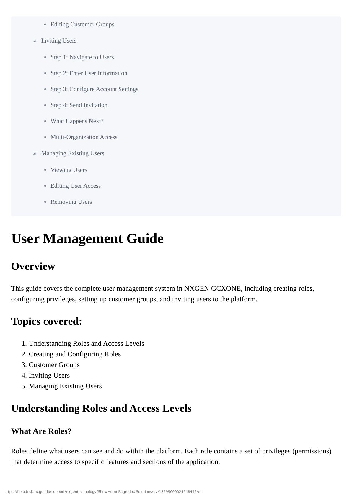
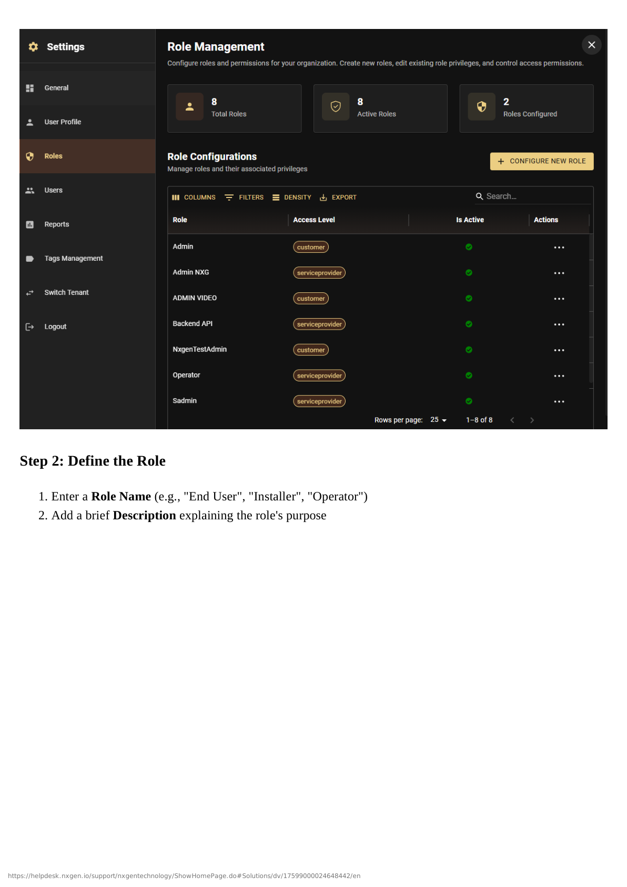
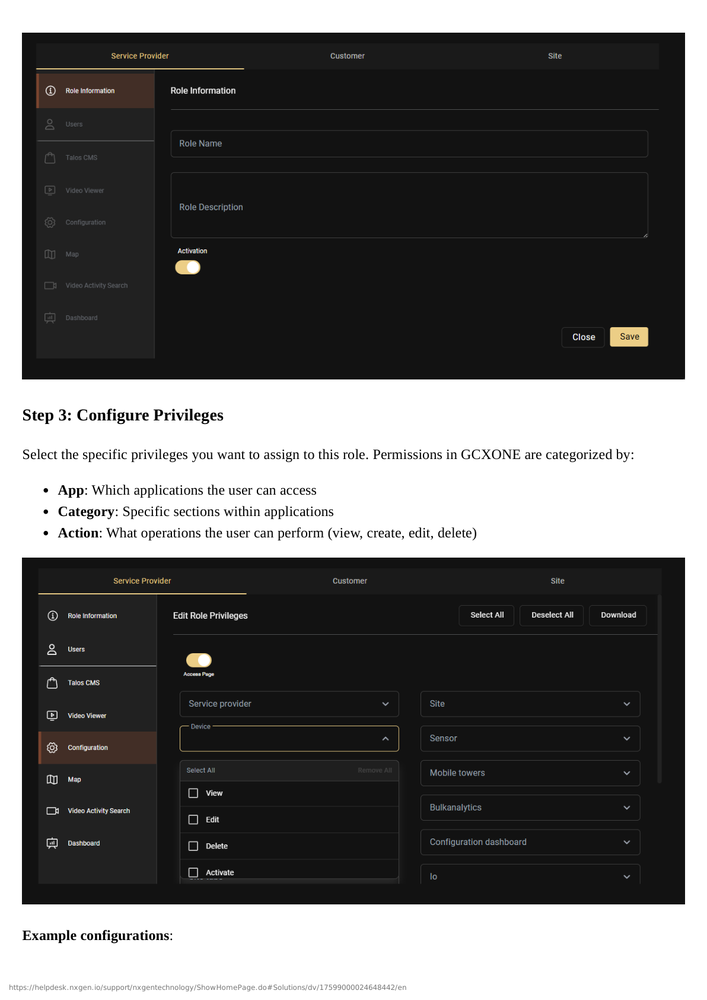
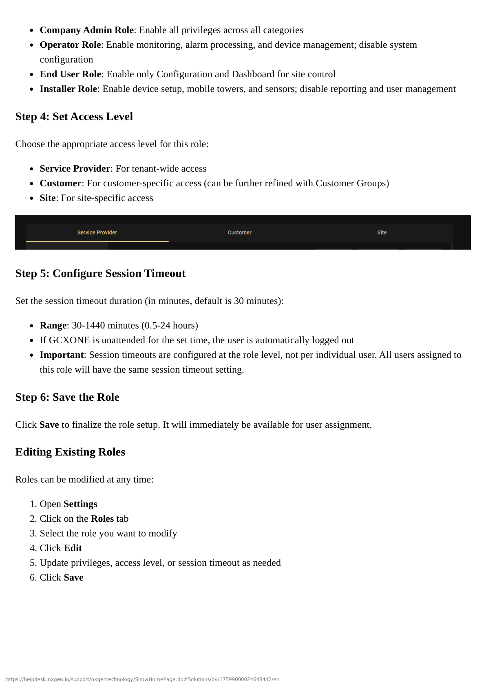
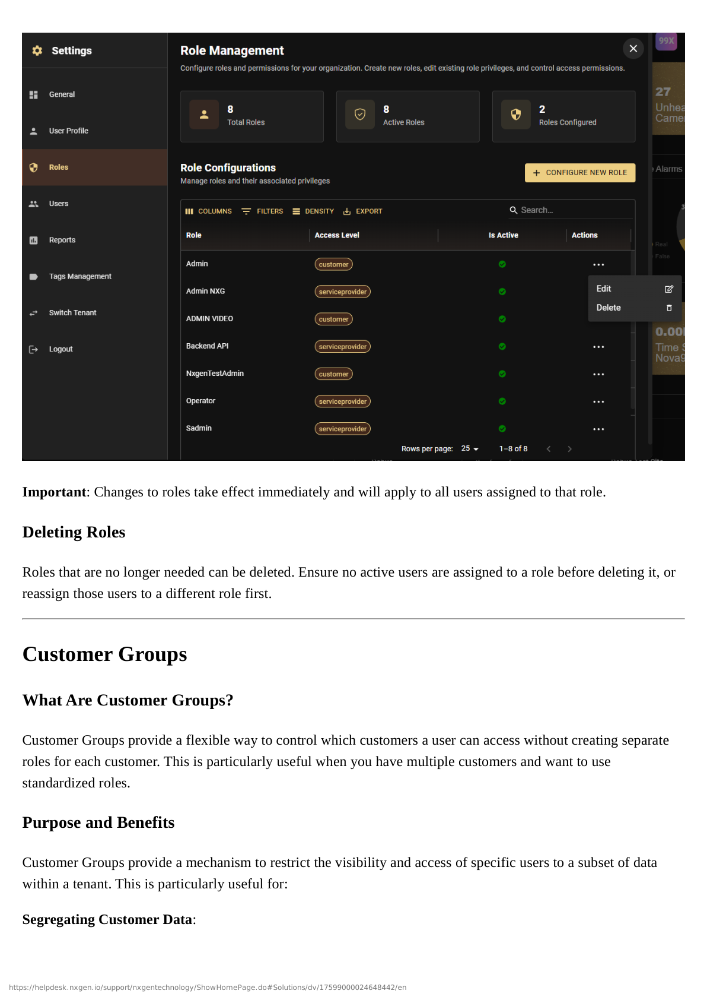

# Inviting Users

This guide walks you through the complete process of inviting new users to GCXONE, from initial invitation through account setup and first login.

## Step 1: Navigate to Users

1. Open the **Settings** from the main navigation
2. Click on the **Users** tab
3. Click **Invite new user** to start adding a new user

## Step 2: Enter User Information

Fill in the required and optional fields for the new user:

### Personal Information

**Required Fields:**
- **First Name**: User's first name
- **Last Name**: User's last name
- **Email Address**: User's email (must be unique and valid)

**Optional Fields:**
- **Phone Number**: Contact phone number

### Address Information (Optional)

You can optionally add address information:
- **Street Name**
- **Building Number**
- **Zip Code**
- **City**
- **Country**

:::tip Email Address
The email address is used for:
- User identification and login
- Receiving invitation emails
- Password reset notifications
- Multi-organization access (same email can access multiple tenants)
:::

## Step 3: Configure Account Settings

Configure the user's access and permissions:

### Role Assignment

Select the role that defines what this user can access:
- Choose from existing roles (Company Admin, Manager, Operator, etc.)
- Or select a custom role you've created
- Example: "End User", "Admin", "Operator", etc.

:::info Role Impact
The selected role determines:
- Which applications the user can access
- What permissions they have
- Their access level (Service Provider/Customer/Site)
- Session timeout duration
:::

### Customer Group (Optional)

If you want to restrict this user to specific customer(s), select a Customer Group:
- **With Customer Group**: User will only see customers in the selected group
- **Without Customer Group**: User will have the default access defined in their role

:::tip When to Use Customer Groups
Use Customer Groups when:
- You want to restrict a user to specific customers
- You have multiple customers and want to separate access
- You want to use one role with different customer access for different users
:::

### Session Timeout

Set the session timeout period:
- **Default**: 30 minutes
- **Range**: 30-1440 minutes (0.5-24 hours)
- If GCXONE is unattended for the set time, the user is automatically logged out

:::note Session Timeout
Session timeout can also be set at the role level. If set at the role level, it applies to all users with that role. User-level timeout overrides role-level timeout.
:::

## Step 4: Send Invitation

Click **Submit** to send the invitation. The user will receive two emails:

1. **Email confirmation**: To verify their email address
2. **Password setup link**: A link to set up their password for the account

:::success Invitation Sent
The invitation has been sent. The user will receive emails to complete their account setup.
:::

## What Happens Next?

### Email Workflow

The invited user will receive two emails:

#### Email 1: Email Confirmation

**Subject**: Email confirmation for NXGEN application

**Purpose**: Verify the email address is valid and belongs to the user

**Action Required**: User clicks the confirmation link in the email

#### Email 2: Password Setup

**Subject**: Changing your password for the nxgen NXGEN application

**Purpose**: Allow the user to set their initial password

**Action Required**: User clicks the password reset link and creates a password

### User Setup Process

1. **Email Verification**: User clicks the email confirmation link
2. **Password Creation**: User clicks the password setup link and creates a new password
3. **First Login**: User logs in with their email and new password
4. **Initial Landing**: User is directed to the appropriate section based on their role:
   - If Dashboard is enabled in their role → They land on Dashboard
   - If Dashboard is not enabled → They land on the first accessible section (e.g., Configuration)

## Multi-Organization Access

If a user is invited to multiple organizations (tenants):

### How It Works

- **Same Email**: Users use the same email address for all organizations
- **Organization Selection**: Upon login, they'll see a prompt to select which organization to access
- **Switching**: They can switch between organizations anytime using the **Switch Tenant** option in Settings

### Use Cases

**Scenario 1: Service Provider with Multiple Tenants**
- A service provider manages multiple customer organizations
- The same administrator account can access all organizations
- Switch between organizations as needed

**Scenario 2: Consultant Access**
- A consultant works with multiple clients
- One email address provides access to all client organizations
- Easy switching between client environments

## Invitation Status

You can track invitation status in the Users list:

### Status Indicators

- **Pending**: Invitation sent, user hasn't completed setup
- **Active**: User has completed setup and can log in
- **Inactive**: User account has been deactivated

### Resending Invitations

If a user hasn't received or has lost their invitation emails:

1. Navigate to **Settings** → **Users**
2. Find the user in the list
3. Click the **3 dots** menu
4. Select **Resend Invitation** (if available)
5. Or edit the user and resubmit to trigger new emails

## Best Practices

:::tip Best Practice
**Verify Email Addresses**: Double-check email addresses before sending invitations to avoid typos.
:::

:::tip Best Practice
**Set Appropriate Roles**: Assign roles that match the user's responsibilities. Start with more restrictive roles and expand as needed.
:::

:::tip Best Practice
**Use Customer Groups**: When appropriate, use Customer Groups to restrict access rather than creating separate roles.
:::

:::tip Best Practice
**Document User Assignments**: Keep a record of which users have which roles and Customer Groups for easier management.
:::

:::warning Security Best Practice
**Verify User Identity**: Ensure you're inviting the correct person, especially for administrative roles.
:::

## Troubleshooting

### User Didn't Receive Invitation Emails

**Problem**: User reports not receiving invitation emails.

**Solutions**:
1. Check spam/junk folder
2. Verify email address is correct
3. Check email server settings (if using custom email)
4. Resend invitation if needed
5. Verify email domain isn't blocked

### User Can't Complete Password Setup

**Problem**: User clicks password setup link but can't create password.

**Solutions**:
1. Verify link hasn't expired (links typically expire after 24-48 hours)
2. Check if user already completed setup
3. Resend password setup email
4. Verify email address matches invitation

### User Lands on Wrong Page After Login

**Problem**: User doesn't see expected content after first login.

**Solutions**:
1. Verify role has correct permissions enabled
2. Check Dashboard is enabled in role (if expecting Dashboard)
3. Verify Customer Group assignment (if applicable)
4. Check access level matches user's needs

## Next Steps

After inviting users, you can:

1. **[Manage Users](./managing-users)** - Learn how to view, edit, and manage existing users
2. **[Creating Roles](./creating-roles)** - Create custom roles for specific needs
3. **[Customer Groups](./customer-groups)** - Set up Customer Groups for access control

## Related Documentation

- [Managing Users](./managing-users)
- [Creating and Configuring Roles](./creating-roles)
- [Customer Groups](./customer-groups)
- [Understanding Roles and Access Levels](./roles-and-access-levels)

