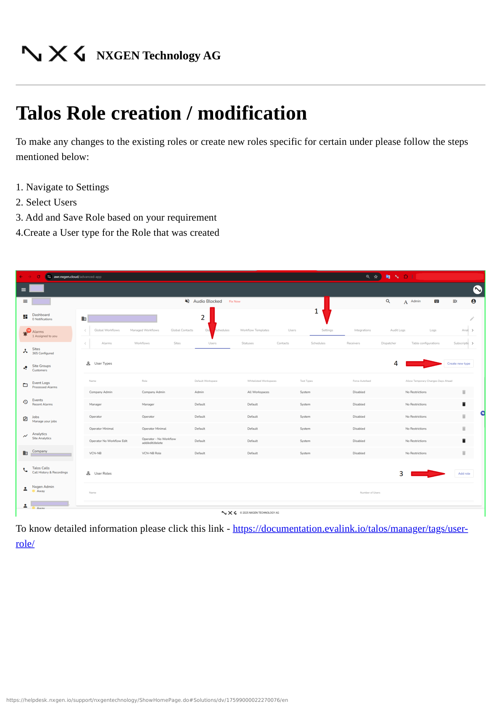
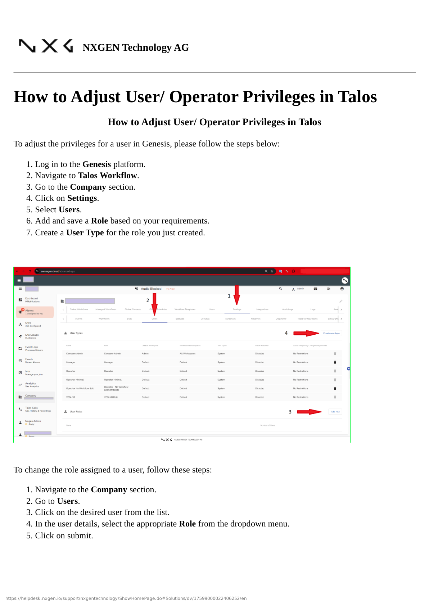
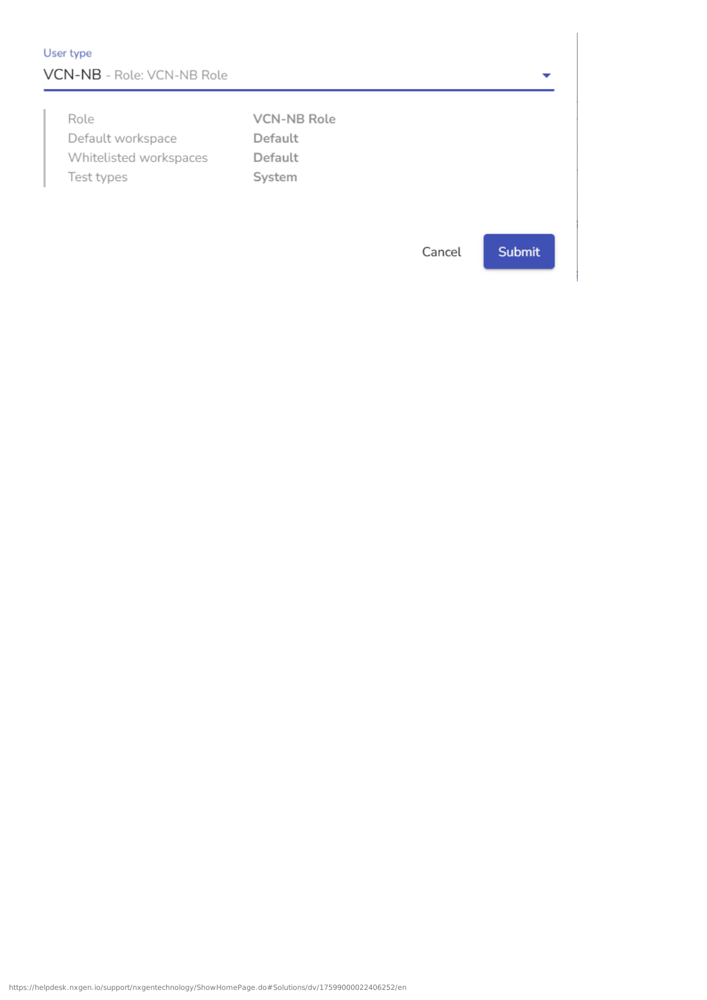
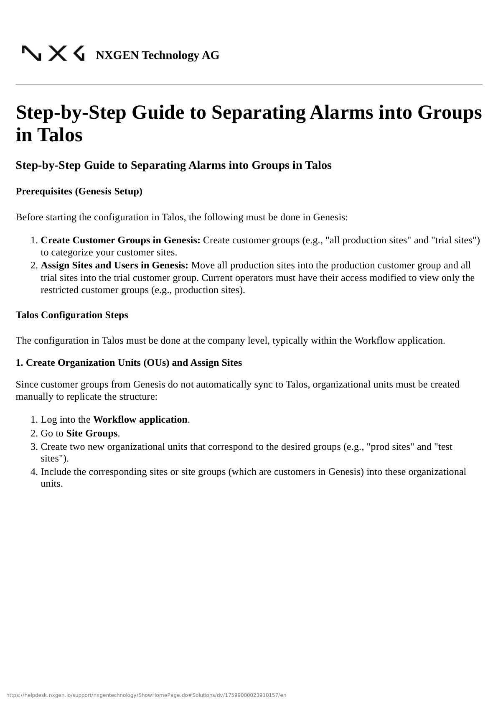
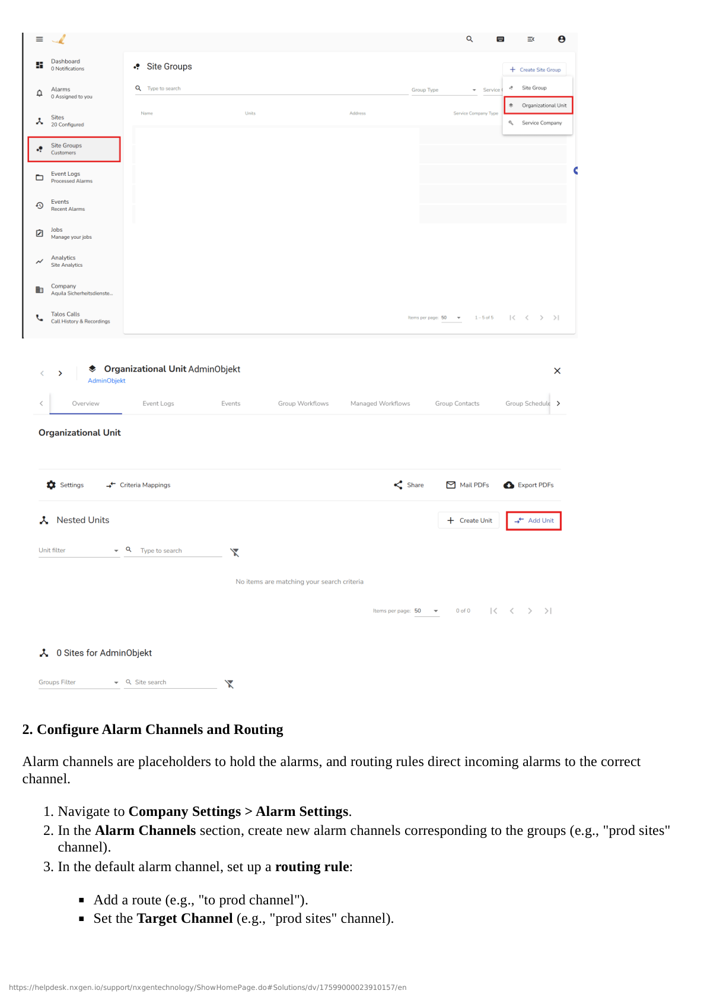
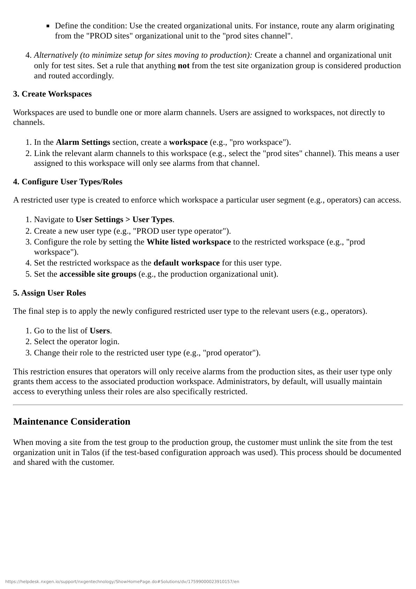

# Talos User Management

This guide covers user management specific to Talos Workflow, including role creation, user type configuration, and privilege management.

## Overview

Talos Workflow has its own user management system that works alongside GCXONE user management. Users in Talos can have different roles and permissions that control their access to workflows, alarms, and company settings.

## Creating Roles in Talos

To create or modify roles in Talos:

1. Log in to the **Genesis platform**
2. Navigate to **Talos Workflow**
3. Go to the **Company** section
4. Click on **Settings**
5. Select **Users**
6. Click **Add** to create a new role
7. Configure the role based on your requirements
8. **Save** the role

### Creating User Types

After creating a role, you need to create a **User Type** for that role:

1. In the same **Settings** → **Users** section
2. Create a **User Type** for the role you just created
3. Configure the User Type settings
4. **Save** the User Type

:::info User Types
User Types in Talos define how users with a specific role interact with the system. Each role should have a corresponding User Type.
:::

## Adjusting User/Operator Privileges

To adjust privileges for a user in Talos:

1. Log in to the **Genesis platform**
2. Navigate to **Talos Workflow**
3. Go to the **Company** section
4. Click on **Settings**
5. Select **Users**
6. Add and save a **Role** based on your requirements
7. Create a **User Type** for the role you just created

### Changing a User's Role

To change the role assigned to an existing user:

1. Navigate to the **Company** section
2. Go to **Users**
3. Click on the desired user from the list
4. In the user details, select the appropriate **Role** from the dropdown menu
5. Click **Submit**

## Separating Alarms into Groups

Talos allows you to organize alarms into groups, which can be assigned to specific operators or operator groups. This helps manage alarm distribution and operator workload.

### Creating Alarm Groups

1. Navigate to **Talos Workflow**
2. Go to **Settings** or **Configuration**
3. Find **Alarm Groups** or **Site Groups**
4. Click **Add New** to create a group
5. Configure the group settings
6. Assign sites or alarms to the group
7. **Save** the group

### Assigning Operators to Groups

1. Navigate to **Users** in Talos settings
2. Select the operator/user
3. Assign them to the appropriate alarm group
4. **Save** changes

Operators assigned to a group will receive alarms from sites in that group.

## Talos vs. GCXONE User Management

It's important to understand the relationship between Talos and GCXONE user management:

| Aspect | GCXONE | Talos |
|--------|--------|-------|
| **User Accounts** | Managed in GCXONE Settings | Uses GCXONE user accounts |
| **Roles** | GCXONE roles control platform access | Talos roles control workflow access |
| **Permissions** | Platform-wide permissions | Workflow and alarm-specific permissions |
| **User Types** | Not used | Used to define operator behavior |

:::info Integration
Talos uses GCXONE user accounts but has its own role and permission system for workflow-specific access. Users need appropriate roles in both systems.
:::

## Best Practices

:::tip Best Practice
**Consistent Naming**: Use consistent naming conventions for Talos roles that align with GCXONE roles when possible.
:::

:::tip Best Practice
**Test Workflows**: Test alarm routing and operator assignments after creating new roles or groups.
:::

:::tip Best Practice
**Document Assignments**: Keep track of which operators are assigned to which alarm groups for easier management.
:::

## Troubleshooting

### User Can't Access Talos

**Problem**: User can log into GCXONE but can't access Talos.

**Solutions**:
1. Verify user has Talos access enabled in their GCXONE role
2. Check if user has a Talos role assigned
3. Verify user type is configured correctly
4. Check company/tenant settings

### Alarms Not Routing to Operators

**Problem**: Alarms aren't being assigned to the correct operators.

**Solutions**:
1. Verify alarm groups are configured correctly
2. Check operator assignments to groups
3. Verify site assignments to groups
4. Check alarm routing rules

### Role Changes Not Taking Effect

**Problem**: Changes to Talos roles don't seem to apply.

**Solutions**:
1. Ensure you saved the role changes
2. Verify user type is updated
3. Have user log out and log back in
4. Check if user has multiple roles that might conflict

## Related Documentation

- [Understanding Roles and Access Levels](./roles-and-access-levels)
- [Creating and Configuring Roles](./creating-roles)
- [Talos Workflows and Alarms](/docs/getting-started/Talos/talos-workflows-and-alarms)

## External Resources

For detailed Talos documentation, visit:
- [Talos User Role Documentation](https://documentation.evalink.io/talos/manager/tags/user-role/)

