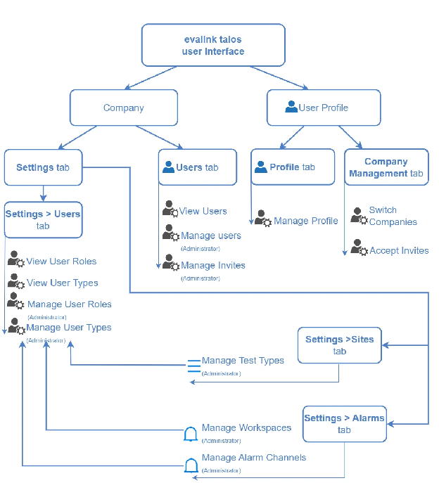
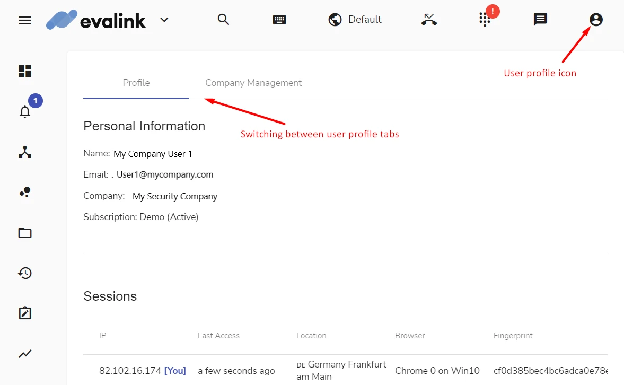
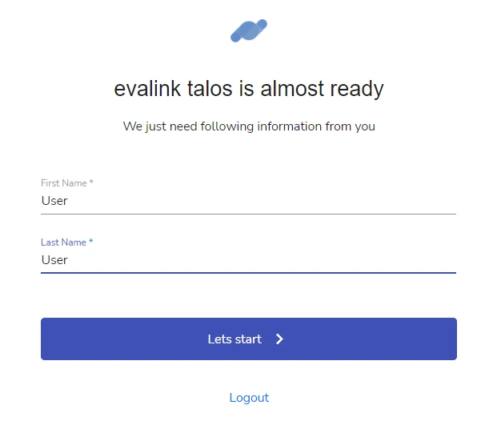
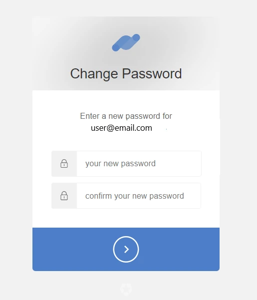
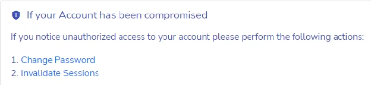
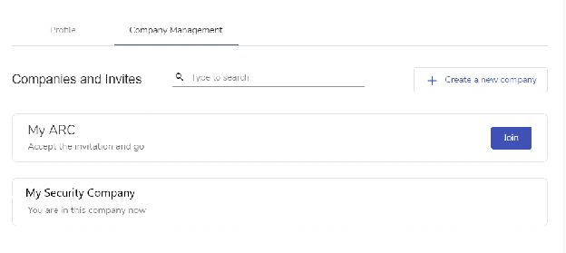
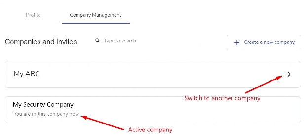
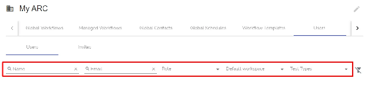
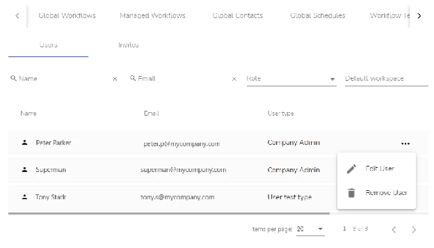

import Callout from '@site/src/components/Callout';
import RelatedArticles from '@site/src/components/RelatedArticles';

# Talos User Management

While GCXONE manages the account identity, **Talos** handles the behavioral settings of how an operator interacts with alarms.

<Callout type="info" title="Evalink Documentation">
For more detailed information about Talos user management, visit the [Evalink Documentation](https://documentation.evalink.io/).
</Callout>

---

## Users Overview

Users are company members and other individuals who can work in evalink talos under the Company account.

evalink talos operates the following user-related terms:

- User Roles
- User Types
- User Profiles

Only Administrator can invite and manage users, create new User Roles and User Types.

---

## User Roles

Each user has a role that defines their level of permissions. There are four preset User Roles in evalink talos. They cannot be changed or deleted.

Administrators can also create custom User Roles based on the preset User Roles. A custom User Role allows you to configure a custom set of permissions.

You can view all the User Roles for your company under **Company** then **Settings** then **Users**.

The following preset User Roles exist in evalink talos:

- **Administrator** - has a full set of permissions. There can be several Administrators under one Company.
- **Manager** - this User Role is intended for managing the work of users with Operator and Operator Minimal User Roles. Like Administrator, Manager can create and manage major evalink talos objects: workflows, sites and site groups, schedules, etc., but access to some features is restricted. For example, Manager cannot invite users and edit global alarm settings.
- **Operator** - this User Role is intended for alarm processing. Operator has access to all evalink talos interface pages, but, for the most part, cannot create or manage objects, only has permissions for viewing.
- **Operator Minimal** - this User Role is also intended for alarm processing. As compared to Operator, Operator Minimal has access to a limited number of interface pages.

<Callout type="info" title="Note">
Both Operator and Operator Minimal can create and edit certain evalink talos objects, if required to do so by a workflow - for example, if the "Add Schedule Entry" step is included in a manual workflow.
</Callout>

---

## User Types

User Types allow to fine-tune user experience by combining User Roles with certain pre-configured work environments such as Test Types and Workspaces, and access permissions such as selected access to Site Groups in your company.

You can view the list of available Test Types on the **Company** then **Settings** then **Sites** page. You can view the list of available Workspaces on the **Company** then **Settings** then **Alarms** page. Only Administrators can add and modify Test Types and Workspaces.

User Types narrow down the flow of incoming alarms for each user in order to more effectively distribute alarms between available operators.

There are four preset User Types in evalink talos. They cannot be deleted, but Administrators can change their settings. Administrators can also add and delete custom User Types.

The following preset User Types exist in evalink talos:

- **Administrator** - The default User Role for this User Type is Administrator. The default Workspace is Default. The default Test Type is System.
- **Manager** - The default User Role for this User Type is Manager. The default Workspace is Default. The default Test Type is System.
- **Operator** - The default User Role for this User Type is Operator. The default Workspace is Default. The default Test Type is System.
- **Operator Minimal** - The default User Role for this User Type is Operator Minimal. The default Workspace is Default. The default Test Type is System.

By default, the name of preset User Types correspond with the names of preset User Roles. However, there is a difference between User Roles and User Types.

User Role is a kernel setting that defines available user permissions. User Type is the main user-defining quality. It combines a User Role and available working environments (Workspaces and Test Types). When Administrators invite new users, they select a User Type for them when issuing an invite. User Type is also the setting that can be changed for individual users by Administrators later on.

---

## User Profiles

A user profile is the evalink talos user interface page where you can view all your user information and manage your user activity.

To access your user profile, click the user profile icon in the upper right corner and select **Profile** from the dropdown menu.

---

## How Users Are Created

To create a new user, Administrator sends an invite to the user. The only prerequisite that is required is a valid email address. A user then logs in to evalink talos following the instructions in the invitation and verification emails.

After the first user login, the record of the user appears in the list on the **Company** then **Users** page.

When inviting a user, Administrator selects a User Type from the list of available types which includes preset and custom User Types.

<Callout type="tip" title="Tip">
After a user accepts the invite and logs into the company and their record appears in the list of company users, administrators can change their User Type.
</Callout>

---

## Manage User Profile

### Viewing User Profile

User Profile is a page on the evalink talos user interface where all user information is stored in one place. Any evalink talos user can access their user profile, regardless of the user type or user role.

You can access your user profile by clicking on the user profile icon in the upper right corner and selecting Profile from the dropdown menu.

The following tabs are available on the User Profile page:

- **Profile** - In this tab, you can view all your user details, monitor and manage your user activity and sessions, perform basic user actions.
- **Company Management** - In this tab, you can view which companies you are a member of, accept invites and switch between companies without logging out and back in.

### Change User Name

In the User Profile page, you can change your user name. Your user name is not used to log into evalink talos. It is the name that is associated with your user account.

To change your user name:

1. In the Profile tab of the User Profile page, scroll to the Profile Actions and select Change Name
2. Type your First Name and your Last Name in the corresponding fields. Both fields are obligatory. You have to enter at least 3 characters for a valid First Name and Last Name.
3. Click Let's Start. In order for the username changes to take place, evalink talos logs you out. You have to log back in to continue work.

### Change User Password

To change your password:

1. In the Profile tab of the User Profile page, scroll to the Profile Actions and select Change Password. evalink talos sends an email to the email you use to log in.
2. Follow the link in the email you receive from evalink talos.
3. Enter your new password into the two fields so that both passwords match. Your password needs to be at least 8 characters long. You have to use lower and upper case letters, numbers, and special symbols for a valid password.
4. Click the arrow to confirm your changes. evalink talos will log you out for the password change to take place. You have to log back in using your new password to continue work.

### Viewing Your Sessions

You can log into evalink talos using the same username simultaneously from several devices, locations and/or web browsers on the same device.

Each of the login instances is considered a session. All current sessions are displayed in your user profile with unique properties.

Each current session record has the following properties:

- **IP address** - The IP address from which you log in. Your current session is marked [You] next to the address.
- **Last Access** - The time when this session has last been active.
- **Location** - The approximate location of the login session. It is narrowed down to a country and a city or town.
- **Browser** - The operation system and name and version of the web browser used to log in to evalink talos.
- **Fingerprint** - A unique stamp marking each individual session.

<Callout type="info" title="Note">
When you log into evalink talos and there is an active session, evalink talos always notifies you about it upon login.
</Callout>

### Invalidate Sessions

You can simultaneously log out of talos from all current sessions on all devices using the Invalidate Sessions option without having to manually log out from each session.

In most cases, this action is performed for security purposes.

To invalidate all sessions, do one of the following:

- Click the Invalidate Sessions icon in the bottom-right of the page
- Use the Invalidate Sessions option in the "If your Account Has Been Compromised" area

evalink talos terminates all existing sessions on all devices and browsers. You will need to log back in to continue work.

---

## Company Management

### Viewing Company Management

If you belong to more than one company, the Company Management tab on the User Profile page contains all information on the companies you are a member of, including pending invitations.

When you log into evalink talos, you use your email address. If your email belongs to one company only, you will be logged into this company automatically. If your email belongs to more than one company, evalink talos will prompt you to select the company you want to work in.

### Join Another Company

In order to become a member of a company, you must receive an invitation from that company's Administrator. Until you accept the invite, it is displayed as pending on the User Profile page.

Note that you must accept the invite within 7 days of receiving it, otherwise the invite will expire.

To accept an invite:

1. In the Company Management tab, view the list of pending invitations.
2. Click the checkmark icon next to the company name you want to join.
3. evalink talos adds the company to the list of your companies. Use the Switch Company button to switch to the new company.

To decline an invitation, click the X icon next to the invite. Note that for security reasons, if you decline an invite and then decide to join the company, you will not be able to change your decision and will have to receive an invite once again.

### Switching between Different Companies

There are several ways to switch between companies. The most reliable one is to switch between companies in the User Profile page.

In the Company Management tab of the User Profile page, click the Switch button next to the company you want to switch to.

### Leave Company

To leave a company you are a member of:

1. Click the Leave the Company icon in the bottom-right of the page
2. Confirm that you want to leave the company by clicking yes

evalink talos displays a message that you are no longer a member of the current company.

<Callout type="info" title="Note">
When you belong to several companies, leaving one of them will delete your user record from this particular company only. You will remain a user of your other companies.
</Callout>

After you have successfully left a company, an Administrator can invite you back in.

---

## Managing Users

### Invite a User

To invite a user, navigate to **Company** then **Users** and click the Invite User button.

### Search for a User

You can search for a user by using the search function on the Company then Users page.

### Edit a User

To edit a user:

1. Navigate to **Company** then **Users**
2. Click on the user you want to edit
3. Update their User Type or other settings
4. Save changes

### Delete a User

To delete a user:

1. Navigate to **Company** then **Users**
2. Click on the user you want to delete
3. Confirm the deletion

---

## Work with User Role Permissions

You can view and manage user role permissions under **Company** then **Settings** then **Users**.

---

## How the Systems Sync

Talos uses your GCXONE user account as the base for its sessions. However, once a user enters the Talos interface, their permissions are governed by **Talos Roles** and **User Types**.

| Aspect | GCXONE Responsibility | Talos Responsibility |
| :--- | :--- | :--- |
| **Identity** | Email and MFA. | Leverages the GCXONE session. |
| **Platform Access** | Permissions to see Configuration. | Not applicable. |
| **Workflow** | Not applicable. | Permissions to view, process, or close alarms. |
| **Behavior** | Not applicable. | Automatic redirection and auto-assign rules. |

---

## Troubleshooting Access

- **Login Loops**: If an operator can see GCXONE but gets a "Permission Denied" in Talos, ensure they have been assigned a **Talos Role** in the Company then Users settings.
- **Missing Alarms**: Verify the operator is part of the correct **Alarm Group** for the site in question.

---

## Related Articles

<RelatedArticles articles={[
  {
    title: "Roles and Access Levels",
    ,
    description: "GCXONE platform-wide permissions."
  },
  {
    title: "Talos Interaction",
    ,
    description: "Deep dive into the sync logic."
  }
]} />

---

**Next:** [Developer Tools and API Integration](/docs/api/overview)
