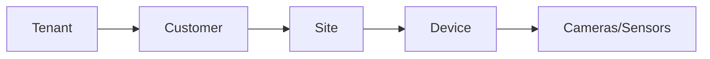

# What is NXGEN GCXONE?

## Platform Definition
**GCXONE** is a cloud-based **Software as a Service (SaaS)** platform providing video surveillance and Internet of Things (IoT) services. It functions as a video-centric **Unified Security Management Service (USMS)** and a cloud-based video alarm handling platform. 

The platform enables users to manage and monitor security devices remotely via a web browser or mobile application, thereby eliminating the need for on-premise hardware and software management.

## Core Benefits and Value Propositions

### High Performance and Efficiency
GCXONE is designed for enhanced efficiency and a user-friendly experience, streamlining security operations for monitoring stations and end-users alike.

### False Alarm Reduction
The platform integrates with existing infrastructure and leverages **AI analytics** to significantly reduce false alarms, potentially by up to **80%**. 
- It uses advanced algorithms to detect human or vehicle activity, distinguishing real threats from false triggers like wind or animals.
- Critical alerts are prioritized and may be handled within **60 to 90 seconds**.

### Robust Cloud Architecture
GCXONE utilizes a secure, scalable, and accessible cloud infrastructure, ensuring high availability and redundancy.

## Multi-Tenant Architecture
The platform supports a multi-tenant architecture, serving multiple customers through subdomains under `inexchange.cloud` (e.g., `ccontact.inexchange.cloud`) or `nxgen.cloud`. This ensures data isolation and secure access for different organizations.

## Platform Hierarchy
GCXONE uses a tenant-based model for organizing customer data. Devices are managed within a strict hierarchical structure:

1. **Tenant**: The top-level organization (e.g., the Monitoring Station).
2. **Customer**: The end-user or client organization.
3. **Site**: The physical location being monitored.
4. **Device**: The gateway, NVR, or main hardware unit (e.g., Hikvision NVR, ADPRO).
5. **Sensor**: Individual channels or cameras attached to the device.

## GCXONE vs. Talos: How They Work Together
While GCXONE focuses on video and analytics, **Evalink Talos** is the specialized alarm management platform.

- **GCXONE**: Video processing, AI analytics, device management, health monitoring.
- **Talos**: Alarm workflows, operator interface, dispatching.

**Data Flow**: Alarms generated by devices often flow to GCXONE first, where they are processed with analytics. The outcome ("real alarm" or "false alarm") is then sent back to Talos as a follow-up alarm for enriched and verified event data.

## Need Help?

If you're experiencing issues, check our [Troubleshooting Guide](/docs/troubleshooting) or [contact support](/docs/support).
