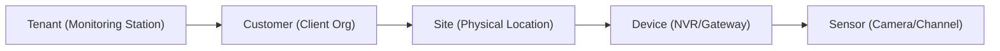

# What is GCXONE?

import Callout from '@site/src/components/Callout';
import Tabs from '@site/src/components/Tabs';
import TabItem from '@site/src/components/Tabs/TabItem';
import Collapsible from '@site/src/components/Collapsible';
import RelatedArticles from '@site/src/components/RelatedArticles';

## Overview

**GCXONE** is a cloud-based **Software as a Service (SaaS)** platform providing video surveillance and Internet of Things (IoT) services. It functions as a video-centric **Unified Security Management Service (USMS)** and a cloud-based video alarm handling platform.

The platform enables users to manage and monitor security devices remotely via a web browser or mobile application, thereby eliminating the need for on-premise hardware and software management.

<Callout type="info">
GCXONE is designed to bridge the gap between traditional video surveillance and modern AI-driven alarm handling, offering a "Defense by Exception" workflow.
</Callout>

---

## Core Value Propositions

### 🚀 High Performance and Efficiency
GCXONE is designed for enhanced efficiency and a user-friendly experience, streamlining security operations for monitoring stations and end-users alike.

### 🛡️ False Alarm Reduction
The platform integrates with existing infrastructure and leverages **AI analytics** to significantly reduce false alarms, potentially by up to **99%** with breakthroughs like [NOVA99x](/docs/breakthroughs/nova99x).
- Uses advanced algorithms to detect human or vehicle activity.
- Distinguishes real threats from false triggers like wind, animals, or shifting shadows.
- Prioritizes critical alerts for rapid operator intervention (60–90 seconds).

### ☁️ Robust Cloud Architecture
GCXONE utilizes a secure, scalable, and accessible cloud infrastructure, ensuring high availability and redundancy without the burden of maintaining local servers.

---

## Multi-Tenant Architecture

The platform supports a multi-tenant architecture, serving multiple customers through secure subdomains. This ensures data isolation and secure access for different organizations.

- **Data Privacy:** Each tenant's data is logically separated.
- **Scalability:** Scale from a single site to thousands across multiple regions.
- **Accessibility:** Access your secure dashboard from anywhere in the world.

---

## Platform Hierarchy

GCXONE uses a tenant-based model for organizing data. Devices are managed within a strict hierarchical structure to ensure clear ownership and granular access control.

1. **Tenant**: The top-level organization managing the service.
2. **Customer**: The client organization.
3. **Site**: The physical location being monitored.
4. **Device**: The NVR, gateway, or hardware unit.
5. **Sensor**: Individual data sources (Cameras, PIRs, etc.).

---

## GCXONE & Evalink Talos

While GCXONE focuses on video and analytics, **Evalink Talos** is the specialized alarm management platform. Together, they form a complete security ecosystem.

<Tabs defaultValue="gcxone">
  <TabItem value="gcxone" label="GCXONE">
    Focuses on video processing, AI analytics, device management, and health monitoring.
  </TabItem>
  <TabItem value="talos" label="Evalink Talos">
    Focuses on alarm workflows, operator interface, dispatching, and protocol management.
  </TabItem>
</Tabs>

**The Data Flow:**
Alarms flow to **GCXONE** first, where they are analyzed by AI. Only verified "Real Alarms" (or enriched data) are sent to **Talos** for operator action, saving hours of manual review.

---

## Best Practices

- **Hierarchical Naming:** Use clear, consistent naming for customers and sites to simplify navigation.
- **AI-First Workflow:** Leverage [Zen Mode](/docs/breakthroughs/zen-mode) to focus operators on actual threats.
- **Health Monitoring:** Regularly check the [HealthCheck](/docs/breakthroughs/healthcheck) status for all devices.

---

## Related Concepts

<RelatedArticles articles={[
  {
    title: "First-Time Login",
    url: "/docs/getting-started/first-time-login",
    description: "Learn how to access your GCXONE instance for the first time."
  },
  {
    title: "Platform Fundamentals",
    url: "/docs/platform-fundamentals/hierarchy-model",
    description: "Deep dive into the GCXONE data model and hierarchy."
  },
  {
    title: "Breakthrough Features",
    url: "/docs/breakthroughs/bulkimport",
    description: "Explore the game-changing features of the GCXONE platform."
  }
]} />

---

**Still have questions?** Check our [FAQ](/docs/knowledge-base/faq) or [contact support](/docs/support).
