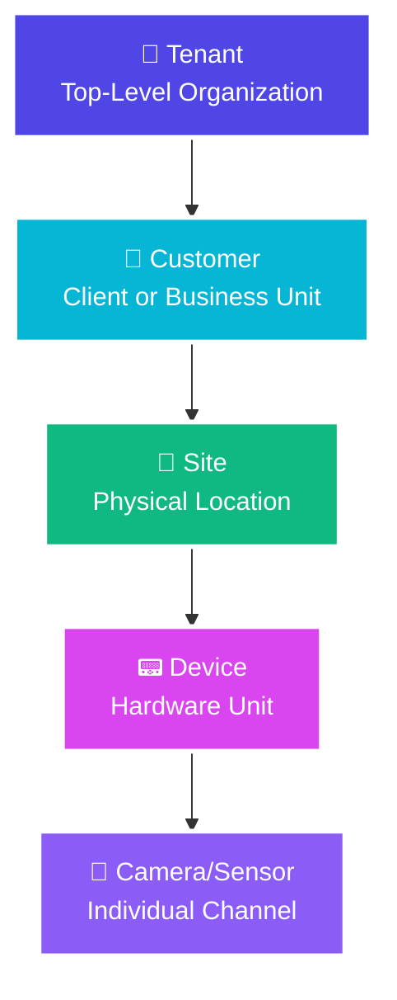

import Tabs from '@theme/Tabs';
import TabItem from '@theme/TabItem';

# Understanding the GCXONE Hierarchy Model

  

    

      The GCXONE platform uses a <strong>5-level hierarchical structure</strong> to organize security assets, manage access control, and ensure data isolation. Understanding this hierarchy is essential for effective platform administration and configuration.
    

  

  

    

      
🏗️

      <h3 style={{color: 'white', margin: 0}}>5 Levels</h3>
      
Complete Organization

    

  

## Core Benefits

  

    

      
🔒

      <h4>Data Isolation</h4>
      
Complete separation between tenants and customers

    

  

  

    

      
🎯

      <h4>Access Control</h4>
      
Granular permission management at every level

    

  

  

    

      
📈

      <h4>Scalability</h4>
      
Easy organization for organizations of any size

    

  

  

    

      
📍

      <h4>Asset Tracking</h4>
      
Accurate tracking of devices and alarms

    

  

---

## The 5-Level Hierarchy Structure

<Tabs>
  <TabItem value="tenant" label="🏢 Tenant" default>
    

      

        <h3 style={{color: '#4F46E5', margin: 0}}>Level 1: Tenant</h3>
        
Top-level organization with completely isolated data and configuration

      

      

        

          

            <h4>Key Characteristics</h4>
            <ul>
              <li><strong>Complete Data Isolation</strong>: Each tenant operates in its own dedicated space</li>
              <li><strong>Independent Configuration</strong>: Custom settings, branding, and integrations</li>
              <li><strong>Subdomain Access</strong>: Unique subdomain (e.g., <code>company.nxgen.cloud</code>)</li>
              <li><strong>Multi-Customer Support</strong>: Can serve multiple customers (MSSP model)</li>
            </ul>
          

          

            <h4>Common Use Cases</h4>
            

              <ul style={{margin: 0}}>
                <li>Managed Security Service Providers (MSSPs)</li>
                <li>Large enterprises with multiple divisions</li>
                <li>Service providers offering white-label solutions</li>
              </ul>
            

            <h4 style={{marginTop: '1rem'}}>Example Structure</h4>
            <pre style={{background: 'var(--ifm-color-emphasis-100)', padding: '1rem', borderRadius: '0.5rem'}}>
{`Tenant: "Security Solutions Inc."
├─ Customer: "Retail Chain A"
├─ Customer: "Manufacturing Corp B"
└─ Customer: "Healthcare Group C"`}
            </pre>
          

        

      

    

  </TabItem>

  <TabItem value="customer" label="👤 Customer">
    

      

        <h3 style={{color: '#06B6D4', margin: 0}}>Level 2: Customer</h3>
        
Individual clients or sub-organizations within a tenant

      

      

        

          

            <h4>Key Characteristics</h4>
            <ul>
              <li><strong>Client Organization</strong>: Distinct organization or business unit</li>
              <li><strong>Isolated Data</strong>: Customer data completely separate from others</li>
              <li><strong>Custom Configuration</strong>: Site-specific settings and device configs</li>
              <li><strong>User Management</strong>: Customer-level user accounts and permissions</li>
            </ul>
          

          

            <h4>Common Use Cases</h4>
            

              <ul style={{margin: 0}}>
                <li>Individual businesses served by an MSSP</li>
                <li>Different divisions within a large enterprise</li>
                <li>Separate legal entities under a parent organization</li>
              </ul>
            

            <h4 style={{marginTop: '1rem'}}>Example Structure</h4>
            <pre style={{background: 'var(--ifm-color-emphasis-100)', padding: '1rem', borderRadius: '0.5rem'}}>
{`Customer: "Retail Chain A"
├─ Site: "Downtown Store"
├─ Site: "Mall Location"
└─ Site: "Warehouse Facility"`}
            </pre>
          

        

      

    

  </TabItem>

  <TabItem value="site" label="📍 Site">
    

      

        <h3 style={{color: '#10B981', margin: 0}}>Level 3: Site</h3>
        
Physical location (building, facility, or geographic area)

      

      

        

          

            <h4>Key Characteristics</h4>
            <ul>
              <li><strong>Physical Location</strong>: Real-world address and geographic coordinates</li>
              <li><strong>Talos Synchronization</strong>: Automatically syncs with Talos CMS</li>
              <li><strong>Device Grouping</strong>: All devices at location grouped under site</li>
              <li><strong>Address Mapping</strong>: Used for mapping, routing, and location services</li>
            </ul>
            

              <strong>Synchronized Data:</strong> Site names, addresses, contact info, coordinates, and configuration parameters are automatically synchronized with Talos CMS via MQTT messaging.
            

          

          

            <h4>Example Structure</h4>
            <pre style={{background: 'var(--ifm-color-emphasis-100)', padding: '1rem', borderRadius: '0.5rem'}}>
{`Site: "Downtown Store"
├─ Device: "Main Entrance NVR"
├─ Device: "Parking Lot Camera System"
└─ Device: "Back Office DVR"`}
            </pre>
            <h4 style={{marginTop: '1rem'}}>Technical Implementation</h4>
            

              <ul style={{margin: 0, fontSize: '0.9rem'}}>
                <li>Synchronization via <strong>MQTT messaging</strong></li>
                <li>Real-time updates ensure consistency</li>
                <li>Error handling and retry logic</li>
                <li>Bidirectional synchronization</li>
              </ul>
            

          

        

      

    

  </TabItem>

  <TabItem value="device" label="📟 Device">
    

      

        <h3 style={{color: '#D946EF', margin: 0}}>Level 4: Device</h3>
        
Security hardware (NVR, DVR, alarm panel, or IoT gateway)

      

      

        

          

            <h4>Device Types</h4>
            

              

                <ul>
                  <li><strong>NVR</strong> - IP camera recording</li>
                  <li><strong>DVR</strong> - Analog camera recording</li>
                </ul>
              

              

                <ul>
                  <li><strong>Alarm Panels</strong> - Intrusion detection</li>
                  <li><strong>IoT Gateways</strong> - Smart sensors</li>
                </ul>
              

            

            

              <strong>Critical:</strong> Each device must have a <strong>unique Server Unit ID</strong>. Duplicate IDs cause alarm attribution conflicts.
            

          

          

            <h4>Required Configuration</h4>
            

              <ul style={{margin: 0}}>
                <li>✅ Unique Server Unit ID</li>
                <li>✅ IP Address & Port</li>
                <li>✅ Authentication Credentials</li>
                <li>✅ NTP Configuration</li>
              </ul>
            

            <h4 style={{marginTop: '1rem'}}>Example Structure</h4>
            <pre style={{background: 'var(--ifm-color-emphasis-100)', padding: '1rem', borderRadius: '0.5rem'}}>
{`Device: "Main Entrance NVR"
├─ Camera: "Front Door Camera"
├─ Camera: "Lobby Camera"
└─ Camera: "Reception Desk Camera"`}
            </pre>
          

        

      

    

  </TabItem>

  <TabItem value="sensor" label="🎥 Camera/Sensor">
    

      

        <h3 style={{color: '#8B5CF6', margin: 0}}>Level 5: Camera/Sensor</h3>
        
Individual cameras, sensors, or IoT devices connected to a device

      

      

        

          

            <h4>Sensor Types</h4>
            

              

                <ul>
                  <li>📹 Video Cameras</li>
                  <li>🚶 Motion Sensors</li>
                </ul>
              

              

                <ul>
                  <li>🚪 Door Sensors</li>
                  <li>🌡️ IoT Sensors</li>
                </ul>
              

            

            <h4>Key Characteristics</h4>
            <ul>
              <li><strong>Individual Channel</strong>: Separate channel on device</li>
              <li><strong>Automatic Discovery</strong>: Discovered when devices added</li>
              <li><strong>Sensor Information</strong>: I/O info pulled from devices</li>
              <li><strong>Alarm Attribution</strong>: Can trigger alarms and events</li>
            </ul>
          

          

            <h4>Example Configuration</h4>
            <pre style={{background: 'var(--ifm-color-emphasis-100)', padding: '1rem', borderRadius: '0.5rem'}}>
{`Camera: "Front Door Camera"
├─ Capabilities: 
│  • Live Stream
│  • Playback
│  • PTZ Control
├─ Analytics:
│  • Motion Detection
│  • Line Crossing
└─ Status: Online, Recording`}
            </pre>
          

        

      

    

  </TabItem>
</Tabs>

---

## Hierarchy Benefits

  

    

      
🔒

      <h3 style={{color: 'white'}}>Data Isolation</h3>
      
Complete separation at every level ensures customer data never spills over between tenants, customers, or sites.

    

  

  

    

      
🎯

      <h3 style={{color: 'white'}}>Access Control</h3>
      
Granular permissions enable precise access management. Users can be granted access to specific customers, sites, or devices.

    

  

  

    

      
📈

      <h3 style={{color: 'white'}}>Scalability</h3>
      
Supports organizations of any size, from small businesses with few sites to enterprises with hundreds of locations.

    

  

## Common Hierarchy Patterns

  

    

      

        <h3>Single Organization</h3>
      

      

        <pre style={{background: 'var(--ifm-color-emphasis-50)', padding: '1rem', borderRadius: '0.5rem', fontSize: '0.85rem'}}>
{`Tenant: "My Company"
└─ Customer: "My Company"
    └─ Site: "Headquarters"
        └─ Device: "Main NVR"`}
        </pre>
      

    

  

  

    

      

        <h3>Multi-Location Business</h3>
      

      

        <pre style={{background: 'var(--ifm-color-emphasis-50)', padding: '1rem', borderRadius: '0.5rem', fontSize: '0.85rem'}}>
{`Tenant: "Retail Corp"
└─ Customer: "Retail Corp"
    ├─ Site: "Store 1"
    ├─ Site: "Store 2"
    └─ Site: "Store 3"`}
        </pre>
      

    

  

  

    

      

        <h3>MSSP Model</h3>
      

      

        <pre style={{background: 'var(--ifm-color-emphasis-50)', padding: '1rem', borderRadius: '0.5rem', fontSize: '0.85rem'}}>
{`Tenant: "Security Provider"
├─ Customer: "Client A"
│   ├─ Site: "Office"
│   └─ Site: "Warehouse"
└─ Customer: "Client B"
    ├─ Site: "Retail Store"
    └─ Site: "Distribution"`}
        </pre>
      

    

  

## Integration with Talos CMS

  

    <h3 style={{margin: 0}}>🔗 Seamless Integration</h3>
  

  

    

      

        <h4>Automatic Synchronization</h4>
        <ul>
          <li>✅ Sites created in GCXONE automatically appear in Talos</li>
          <li>✅ Alarms attributed to correct site and device</li>
          <li>✅ Bidirectional updates maintain consistency</li>
          <li>✅ Events correlated based on hierarchy relationships</li>
        </ul>
      

      

        <h4>Technical Implementation</h4>
        

          <ul style={{margin: 0, fontSize: '0.9rem'}}>
            <li><strong>MQTT Messaging</strong>: Real-time synchronization</li>
            <li><strong>Dedicated Proxies</strong>: Handle message routing</li>
            <li><strong>Error Handling</strong>: Retry logic maintains reliability</li>
            <li><strong>Event Correlation</strong>: Hierarchy-based event matching</li>
          </ul>
        

      

    

  

For more information, see [GCXONE & Talos Integration](/docs/getting-started/gcxone-talos-interaction).

---

## Best Practices

  

    

      

        <h3>✅ Do's</h3>
      

      

        <ul>
          <li>Use clear, consistent naming conventions</li>
          <li>Ensure site addresses are accurate for Talos sync</li>
          <li>Always assign unique Server Unit IDs</li>
          <li>Organize sites and devices logically</li>
          <li>Document tenant-specific configurations</li>
        </ul>
      

    

  

  

    

      

        <h3>❌ Don'ts</h3>
      

      

        <ul>
          <li>Don't reuse Server Unit IDs across devices</li>
          <li>Don't use vague or ambiguous names</li>
          <li>Don't skip address validation for sites</li>
          <li>Don't mix different customer data</li>
          <li>Don't ignore hierarchy when setting permissions</li>
        </ul>
      

    

  

## Related Articles

- [Multi-Tenant Architecture](/docs/platform-fundamentals/multi-tenant)
- [GCXONE & Talos Integration](/docs/getting-started/gcxone-talos-interaction)
- [Cloud Architecture Overview](/docs/getting-started/cloud-architecture)
- [Quick Start Checklist](/docs/getting-started/quick-start-checklist)

---

## Need Help?

If you need assistance understanding or configuring the hierarchy model, check our [Troubleshooting Guide](/docs/troubleshooting) or [contact support](/docs/support).

