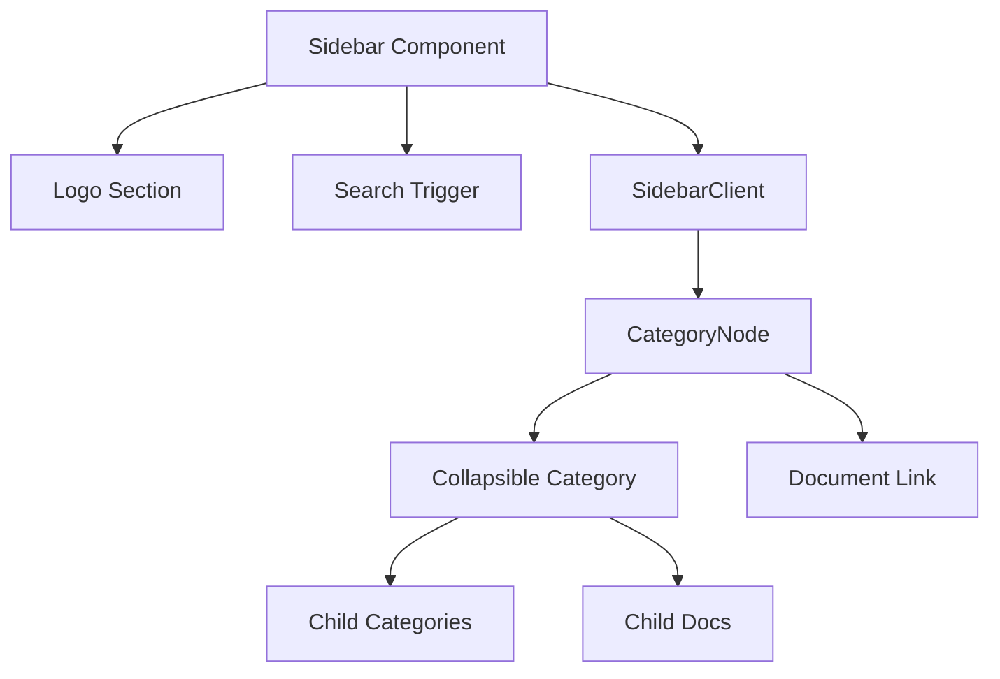

# UI Fixes Plan for NXG-Docs-Next Migration

## Overview
The migration from Docusaurus to Next.js has introduced several UI discrepancies. This plan outlines the fixes needed to address the 10 issues reported by the user, based on analysis of the current codebase, screenshot images, and the original Docusaurus theme.

## Issues & Proposed Solutions

### 1. Document Errors (Sanity Integration)
**Status:** ✅ Resolved  
**Analysis:** Sanity connection is working (226 published docs). No query errors detected. The error reported may be front‑end rendering errors (e.g., missing portable‑text components).  
**Verification:** The portable‑text components file exists (`lib/sanity/portable‑text.tsx`) and is correctly imported.  
**Action:** None required.

### 2. Header Visibility
**Status:** 🔍 Needs clarification  
**Analysis:** The user states “navbar is not visible in the original project.” The original Docusaurus project had a navbar, but it may have been hidden on documentation pages. In the current Next.js app:
- Marketing pages (`(marketing)/layout.tsx`) include a `<Navbar />`.
- Documentation pages (`(docs)/layout.tsx`) do **not** include a navbar.
- The fetched HTML for a document page shows no `<header>` element.

**Possible interpretations:**
- The navbar should be hidden on **all** pages (unlikely).
- The navbar should be hidden **only on documentation pages** (already the case).
- The “header” refers to the sidebar header (logo + search) or the share bar inside documents.

**Decision:** Await user confirmation. If no further input, assume current behavior is correct.

### 3. Document UI Mismatch
**Status:** 🛠️ Requires CSS adjustments  
**Analysis:** Comparing the screenshot `Screenshot 2026‑04‑13 162305.png` with the current rendered page reveals differences in:
- Typography (font sizes, weights, line‑heights)
- Spacing (margins, paddings)
- Link colors (gold shade)
- Code block styling
- Admonition (callout) appearance

**Proposed Changes:**
- Update `styles/globals.css` prose‑doc styles to match Docusaurus’s `custom‑dark.css`:
  - Adjust `--tw‑prose‑links` to `#D4A574` (original `--ifm‑link‑color`)
  - Tweak heading font sizes, margins, and border‑bottom thickness
  - Align code block background, border, and font family
  - Ensure admonition colors match the original `--nxgen‑success`, `--nxgen‑warning`, etc.
- Review portable‑text component styles for images, tables, and blockquotes.

**Files to modify:**
- `styles/globals.css` (prose‑doc section)
- `lib/sanity/portable‑text.tsx` (if component‑level overrides needed)

### 4. Highlights Color Mismatch
**Status:** 🛠️ Requires CSS variable update  
**Analysis:** The previous build used `--ifm‑link‑color: #D4A574` for links and interactive highlights. The current build uses `--nxgen‑gold‑accessible: #996B1F` for prose links, which is a darker, more accessible gold.

**Proposed Changes:**
- Change `--nxgen‑gold‑accessible` to `#D4A574` (or keep the original gold palette).
- Update any component that uses `--nxgen‑gold‑accessible` for highlights (buttons, borders, hover states) to match the previous visual weight.

**Files to modify:**
- `styles/globals.css` (`:root` and `.light` overrides)
- Check components that reference `var(--nxgen‑gold‑accessible)`

### 5. Sidebar Design (Old Design + Logo)
**Status:** 🛠️ Requires styling overhaul  
**Analysis:** The screenshot `Screenshot 2026‑04‑12 163421.png` shows the Docusaurus sidebar:
- Dark background (`#121212`)
- Gold accent for active/hover items
- Category labels are uppercase with smaller font
- Chevron icons indicate collapse state
- Logo positioned at the top with “GCXONE Documentation” subtitle.

Current sidebar (`components/docs/Sidebar.tsx`) already includes logo, search, and a category tree. Differences are in:
- Font sizes, weights, and letter‑spacing
- Hover/active background colors
- Indentation and border‑left styles
- Chevron rotation behavior

**Proposed Changes:**
1. Update `Sidebar.tsx` and `SidebarClient.tsx` to use CSS classes that mirror the original Docusaurus sidebar.
2. Adjust CSS variables for sidebar background, text colors, and active states.
3. Ensure the logo section matches the original (same image, text sizes, and spacing).

**Files to modify:**
- `components/docs/Sidebar.tsx`
- `components/docs/SidebarClient.tsx`
- `styles/globals.css` (sidebar‑specific variables)

### 6. Content Purely from Sanity
**Status:** ✅ Verified  
**Analysis:** All document content is fetched from Sanity via `getDoc` and `getSidebarData`. The test script confirms data is present.  
**Action:** No changes needed.

### 7. Migrate Missing Landing Pages
**Status:** 📋 Pending inventory  
**Analysis:** The user mentions “other landing pages (like integrations hub) were not migrated.” The current project already has `/integration‑hub` and `/releases` pages (created by the previous agent). Need to verify that all landing pages from the Docusaurus site exist in the new app.

**Proposed Actions:**
- Inventory all top‑level routes from the original Docusaurus (`/docs`, `/blog`, `/support`, `/integrations`, `/roadmap`, etc.).
- Compare with existing routes in `nxg‑docs‑next/app`.
- Create missing pages (e.g., `/integrations`, `/roadmap`) using the same layout pattern.

**Files to create:**
- `app/(marketing)/integrations/page.tsx`
- `app/(marketing)/roadmap/page.tsx`
- Any other missing marketing pages.

### 8. Search Bar Duplication
**Status:** 🛠️ Requires layout adjustment  
**Analysis:** There are two search triggers:
  1. In the sidebar (`Sidebar.tsx`), always visible on documentation pages.
  2. On the marketing homepage (`HeroSearchOpener`), which appears only on the landing page.

The user wants “one search bar only in the sidebar, the other only on the landing page.” This appears to already be the case. However, the “duplication” might refer to a visual duplicate (two search bars appearing simultaneously) on some pages.

**Proposed Changes:**
- Verify that the sidebar search is hidden on marketing pages (it is, because the sidebar is only rendered inside `(docs)` layout).
- Ensure the `HeroSearchOpener` is only rendered on the homepage (`app/(marketing)/page.tsx`).

**Files to check:**
- `app/(marketing)/layout.tsx` (should not include sidebar)
- `app/(docs)/layout.tsx` (includes sidebar search)
- `components/home/HeroSearchOpener.tsx` (used only on homepage)

### 9. Restore Footer Visibility
**Status:** 🛠️ Requires layout fix  
**Analysis:** The footer (`components/layout/Footer.tsx`) is included in both marketing and docs layouts, but may be hidden due to CSS (e.g., `display: none` or `position: absolute` outside viewport). The fetched HTML shows a `<footer>` element present.

**Proposed Changes:**
- Inspect the footer’s CSS and ensure it is not being hidden by `hidden` or `opacity: 0`.
- Adjust layout if footer is pushed below the viewport (check `min‑h‑dvh` and flex‑column spacing).

**Files to modify:**
- `components/layout/Footer.tsx` (styling)
- `app/(marketing)/layout.tsx` and `app/(docs)/layout.tsx` (layout structure)

### 10. Add Favicon
**Status:** 🛠️ Requires file placement  
**Analysis:** The root layout (`app/layout.tsx`) already references `/img/XoLogo.png` as the favicon. However the file may be missing from `public/img/` or the path may be incorrect.

**Proposed Changes:**
- Verify that `public/img/XoLogo.png` exists.
- If missing, copy the logo from the original project (`static/img/` or `classic/static/img/`).
- Update `app/layout.tsx` if a different favicon format is needed (ICO, SVG).

**Files to modify:**
- `public/img/XoLogo.png` (ensure file exists)
- `app/layout.tsx` (optional)

## Implementation Order
1. **Quick wins** (favicon, footer visibility) – low risk.
2. **CSS color adjustments** (highlights, prose links) – straightforward.
3. **Sidebar redesign** – requires careful styling but is self‑contained.
4. **Document UI polish** – adjust prose‑doc styles after sidebar changes.
5. **Missing landing pages** – create new pages based on existing templates.
6. **Header visibility** – await clarification, then implement if needed.
7. **Search duplication** – verify and tweak as necessary.

## Mermaid: Sidebar Component Structure

## Next Steps
1. Present this plan to the user for review.
2. Upon approval, switch to **Code** mode and execute the changes in the recommended order.
3. After each fix, verify the UI matches the screenshot references.